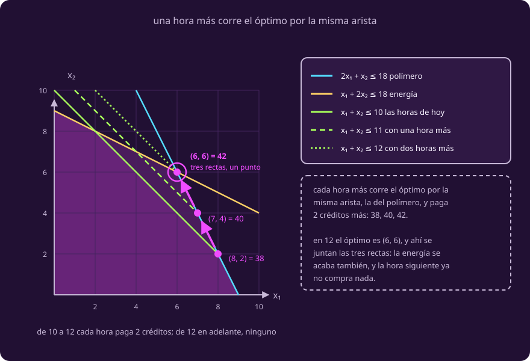

# Cuánto vale una hora más

**¿Qué me dice el óptimo sobre los recursos?**

Volvemos al modelo de dos piezas: ahí puedes poner el dedo en el dibujo. El
sello regresa al final.

Y un aviso: **esta página no revela tres números nuevos**. El notebook 1 ya los
imprimió, con lo que sobra al lado; falta decir **qué eran** y **por qué**.

## 1 · Qué aprieta y qué sobra

::: definition {#opt-restriccion-activa title="Restricción activa, inactiva, y holgura"}
En un punto factible, la **holgura** de una restricción es lo que le sobra: lo
disponible menos lo usado.

Una restricción es **activa** si su holgura es cero —el recurso se acabó
exacto— e **inactiva** si sobra margen.

En el mejor plan del viaje, $(8,2)$, las horas y el polímero están activos. La
energía no: de sus 18 kWh se gastan 12.
:::

::: table {#opt-estado-recursos title="Los tres recursos en el óptimo del modelo de dos piezas"}
| Recurso | Hay | Se usa | Holgura |
|---|---:|---:|---:|
| Horas | 10 | 10 | 0 |
| Polímero | 18 | 18 | 0 |
| Energía | 18 | 12 | **6** |
:::

Es la misma columna `sobra` del notebook: dos aprietan, uno no.

## 2 · Cuánto vale conseguir más

Y un apunte de vocabulario. Hasta aquí «precio» era lo que paga el depósito por
una pieza, los números de $c$; lo que sigue es de un **recurso** y lleva dos
palabras.

::: definition {#opt-precio-sombra title="Precio sombra"}
El **precio sombra** de un recurso es cuánto sube el valor óptimo si te dan **una
unidad más** de ese recurso, sin cambiar nada más.

Es lo máximo que conviene pagar por esa unidad, y no lo fija nadie: no sale del
depósito, sale del problema. El depósito cobra lo que quiera; el precio sombra
dice hasta dónde te conviene.

El de la hora se despeja resolviendo otra vez con 11 horas: sale 40 donde antes
salía 38, así que la hora vale 2.
:::

::: table {#opt-valor-por-hora title="El valor óptimo, hora por hora"}
| Horas disponibles | Óptimo | Lo que ganó esa hora |
|---:|---:|---:|
| 8 | 32 | +4 |
| 9 | 36 | +4 |
| 10 | **38** | +2 |
| 11 | 40 | +2 |
| 12 | 42 | +2 |
| 13 | 42 | **0** |
| 14 | 42 | 0 |
:::

Para quien ya llevó cálculo: el precio sombra es la derivada del valor óptimo
respecto de lo disponible, **donde existe**.

::: figure {#opt-fig-precio-sombra title="Qué compra una hora más"}

:::

::: definition {#opt-rango-de-validez title="Rango de validez"}
Un precio sombra vale **dentro de un rango** de disponibilidad, no siempre. Fuera
del rango cambia qué restricciones están activas, y con eso cambia el precio
sombra.

Aquí la hora vale 2 créditos **mientras haya entre 9 y 12 horas**. Por debajo de
9 sobra polímero y el mejor plan es puro filtro, que rinde 4 por hora; con 12 el
óptimo es $(6,6)$, se acaba también la energía, y de ahí en adelante la hora ya
no vale nada.
:::

Los dos extremos son **codos**, donde cambia la pendiente, y en un codo **no hay
derivada**: en 12 el valor sube 2 por la izquierda y 0 por la derecha.

Y $(6,6)$ merece su renglón, con el papel cambiado: era la trampa del dibujo
**porque pedía 12 horas y solo había 10**. Ahí concurren tres rectas y sigue
siendo un vértice: dos cualesquiera ya lo determinan.

## 3 · Qué eran esos tres números

Los precios sombra son **2, 1 y 0**: los del notebook, y los tres números del
certificado de [[que-es-una-respuesta|Qué es una respuesta]], $y=(2,1,0)$.

No era un truco de verificación: cada número era el precio sombra de un recurso.
Las tres condiciones de allá, leídas hoy, dicen:

- ningún precio sombra es negativo;
- a esos precios sombra cada pieza queda cubierta;
- y lo disponible, valuado así, da el valor óptimo.

El cero cae donde tiene que caer: al recurso que sobra le toca cero. El séptimo
kWh no compra nada.

## 4 · Y el sello lo cambia todo

Con el sello, el óptimo $(5,2,3)$ consume los tres recursos exactos. Ya no sobra
energía, y su precio sombra deja de ser cero: los tres pasan a $\tfrac12$,
$\tfrac32$ y $\tfrac12$.

> **El precio sombra de un recurso no es del recurso. Es del problema.**

## 5 · Tu turno

::: exercise {#opt-ej-precio-sombra title="Revisa los precios sombra del sello"}
Para el problema con sello, los precios sombra son
$y=(\tfrac12,\ \tfrac32,\ \tfrac12)$.

1. Revísalos con las **tres condiciones del certificado** de la clase 1. Lo
   disponible es $(10,18,18)$; el filtro gasta $(1,2,1)$ y vale 4, la celda
   $(1,1,2)$ y vale 3, el sello $(1,2,3)$ y vale 5.
2. ¿Qué acabas de demostrar, y sin dibujar nada?
3. La capitana puede retrasar el atraque: cada hora de retraso cuesta **1.5
   créditos** de combustible y da una hora más de impresora. ¿Cuántas compras,
   sobre el modelo de dos piezas?
:::

::: hint {#opt-pista-precio-sombra of="opt-ej-precio-sombra" title="Por dónde empezar"}
Las tres condiciones, en este orden: los signos, que se ven de un vistazo; luego
que cada pieza quede cubierta; y al final la cuenta con lo disponible.

Para la tercera pregunta no calcules nada todavía. Baja por la columna «lo que
ganó esa hora» y compara cada renglón con 1.5.
:::

::: answer {#opt-resp-precio-sombra of="opt-ej-precio-sombra"}
1. Los tres son $\ge 0$. Filtro: $\tfrac12+3+\tfrac12=4\ge4$. Celda:
   $\tfrac12+\tfrac32+1=3\ge3$. Sello: $\tfrac12+3+\tfrac32=5\ge5$. Y la cuenta
   con lo disponible da
   $\tfrac12\cdot10+\tfrac32\cdot18+\tfrac12\cdot18 = 5+27+9 = 41$.
2. Que **ningún plan del problema con sello pasa de 41**. Y $(5,2,3)$ vale 41,
   así que es el mejor. Lo demostraste con aritmética de medios, sin polígono y
   sin correr simplex: un certificado funciona en cualquier número de
   dimensiones.
3. **Dos horas**, las que van de 10 a 12: cada una rinde 2 y cuesta 1.5. La
   tercera rinde 0 y sería tirar 1.5. Ganas **1 crédito** en total.
:::

> [!WARNING]
> Un precio sombra no es una tarifa. «La hora vale 2, compro veinte» es el
> error: vale 2 **mientras haya entre 9 y 12 horas**.

## Lo que hay que llevarse

- A un óptimo se le pregunta primero qué se acabó y qué sobró.
- Un precio sombra solo vale cerca: fuera de su rango cambia qué recurso
  aprieta, y el precio sombra con él.
- Aquellos tres números del certificado eran los precios sombra, y con una pieza
  más ninguno sigue igual.

## Y ahora, el notebook

Las tablas de esta clase están calculadas, y conviene verlas calcular. El
notebook rehace desde la terna los ocho vértices, la vecindad y las trazas, y
dibuja lo que aquí solo está tabulado: el valor del mejor plan contra las horas,
con sus dos codos.

*Se abre en Google Colab, en otra pestaña.*

Cierra con una bitácora nueva, la del taller, que **no está resuelta en ninguna
página**. Ahí lo único que se pide es escribir la terna, y el notebook la revisa
dato por dato. El archivo vive en este repositorio, en
`course/6_optimizacion/_assets/02_simplex.ipynb`.

Que los precios sombra existan siempre no es casualidad: es un teorema, y llega
en la clase 3.
