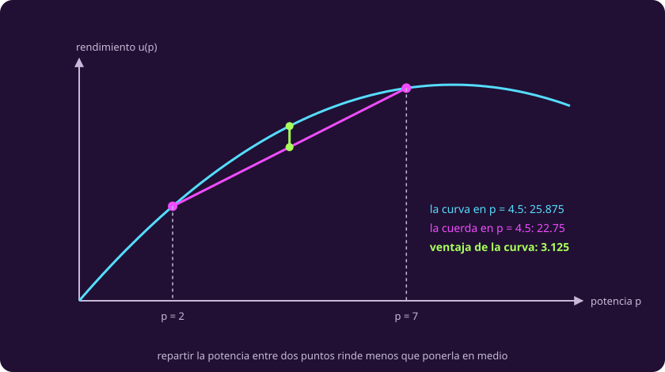
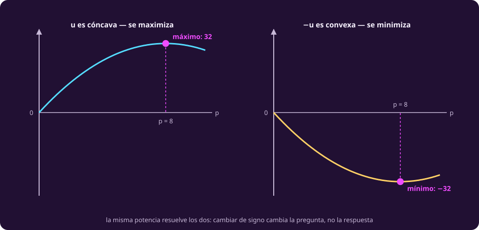

# El rendimiento que decrece

**¿Qué se rompe si el objetivo deja de ser una recta?**

La impresora quedó resuelta. Empieza el segundo episodio, y esta vez lo que falla
no es el dibujo: es la línea recta.

> **Bitácora del reactor.** Apunto esto antes de dormirme porque mañana hay que
> decidirlo en la junta y no me lo quiero volver a explicar.
>
> El reactor da lo de siempre y hay que repartirlo entre los tres sistemas:
> escudos, motores y soporte vital. Lo que le presta a la bodega para la
> impresora está apartado desde antes y no entra en esta cuenta.
>
> Lo que no se vale es partirlo en tres y ya. La ingeniera lleva semanas midiendo
> y dice que, dentro de un mismo sistema, la potencia **rinde cada vez menos**:
> la primera unidad que le metes a escudos da 5.5; la segunda, 4.5; la tercera,
> 3.5. Siempre uno menos que la anterior, hasta que deja de pagar.
>
> Motores lleva el mismo escalón de uno, pero arranca más arriba: 7.5 la primera.
> Se me olvidaba el soporte vital, que es el que más aguanta: 9.5 la primera, y
> por eso es el que se lleva la mayor tajada si uno lo deja.
>
> Los tres números son comparables, que eso sí lo pregunté: la ingeniera lo pasó
> todo a la misma escala, margen de seguridad de la nave, para poder ponerlos
> juntos.
>
> Repártela toda. Y ojo, que el soporte vital no aguanta mucho más de cinco.
>
> Los turnos siguen igual: Vega entra a las cuatro.

## 1 · La bitácora, otra vez con sus tres trampas

Lo mismo que en el primer episodio, y conviene notarlo: **la forma de las trampas
no cambia porque cambie la matemática**.

::: table {#opt-trampas-reactor title="Las tres trampas de la bitácora del reactor"}
| Trampa | Dónde está | Qué se hace |
|---|---|---|
| Sobra un dato | «Vega entra a las cuatro» | Fuera: no entra en ninguna restricción |
| Falta un dato | «El reactor da lo de siempre» — nunca dice cuánto | Suponer **y anotarlo**: 15 unidades por turno |
| Una frase ambigua | «Repártela toda» · «no aguanta mucho más de cinco» | Decidir: la primera es una igualdad; la segunda se deja para después |
:::

**La primera ambigüedad es la que cambia el modelo.** «Repártela toda» se puede
leer como que la potencia sobrante se pierde —y entonces es una **igualdad**— o
como que se puede guardar —y entonces sería $\le$—. Un reactor que no acumula no
deja guardar nada, así que se escribe con igualdad, y de ahí sale todo lo demás
de esta clase.

La segunda —el tope del soporte vital— se anota y se deja pendiente:
[[los-signos-del-lagrangeano|entra en la página 4]], que es donde hay con qué
tratarla.

## 2 · El modelo, pieza por pieza

Las piezas son [[escribir-el-modelo|las mismas cinco de la clase 1]]: variables,
parámetros, objetivo, restricciones y dominio. Ninguna se redefine aquí. Lo único
que cambia es **qué cabe en el objetivo**, y conviene ver cómo llega cada número
desde la bitácora hasta la fórmula.

### Qué se decide

Las variables son tres: $p_1$, $p_2$ y $p_3$, **cuánta potencia recibe cada
sistema** —escudos, motores y soporte vital, en ese orden— medida en unidades de
reactor. Es lo único que la junta de mañana tiene que anunciar, y es la prueba de
la clase 1: si hay que decirlo al final, es variable.

Su dominio son los **reales no negativos**. No negativos porque no existe darle
potencia en contra a un sistema; reales porque la potencia se parte.

> [!NOTE]
> **Aquí lo continuo no pide disculpas.** En la impresora, permitir media celda
> era una licencia que la historia no daba y que hubo que justificar aparte: el
> depósito paga por pieza entregada. La potencia no tiene ese problema —media
> unidad de potencia existe y se entrega—, así que éste es el único episodio de
> la unidad donde el dominio sale de la historia y no de nuestra conveniencia. El
> tercero vuelve a quitar la licencia, y en serio.

### Qué se sabe

::: table {#opt-parametros-reactor title="Los seis parámetros del episodio, y de dónde sale cada uno"}
| Qué mide | Valor | De dónde sale |
|---|---:|---|
| Lo que paga la **primera** unidad en escudos | 5.5 de margen | «la primera unidad… da 5.5» |
| Lo que paga la primera unidad en motores | 7.5 de margen | «arranca más arriba: 7.5» |
| Lo que paga la primera unidad en soporte vital | 9.5 de margen | «9.5 la primera» |
| Cuánto **baja** el pago de una unidad a la siguiente | 1 de margen | «siempre uno menos que la anterior» |
| Potencia total que reparte el reactor | 15 unidades | **supuesto**: la bitácora no lo dice |
| Tope del soporte vital | 5 unidades | ambigüedad, pendiente hasta la página 4 |
:::

**Qué no es parámetro**, para que la definición muerda: la hora de entrada de
Vega. Está en la bitácora, es un número, y no entra en ninguna cuenta.

> [!WARNING]
> **Este supuesto no sale gratis, y el de la clase 1 sí salía.** Allá el supuesto
> de los 18 kWh venía con su condición —«con 12 o más, la misma respuesta»— y por
> eso podía dejarse anotado sin más. Aquí la potencia total está en una
> **igualdad**: cambiarla cambia el reparto, siempre. Si mañana el reactor entrega
> 16 en vez de 15, la respuesta es otra. Cuánto de otra es exactamente lo que
> calcula [[el-multiplicador|la página 3]].

### De «uno menos que la anterior» a una fórmula

La bitácora no da una función: da una **lista de escalones**. Para escudos, 5.5
la primera unidad, 4.5 la segunda, 3.5 la tercera. Lo que rinde tener $n$
unidades es la suma de sus escalones:

$$u(1) = 5.5,\qquad u(2) = 5.5 + 4.5 = 10,\qquad u(3) = 10 + 3.5 = 13.5.$$

Sumar escalones cada vez es insostenible: no se puede derivar, no se puede
escribir para $n$ cualquiera y no admite medias unidades. Hace falta la fórmula
que produce esa lista.

::: definition {#opt-rendimiento title="La curva de rendimiento de un sistema"}
Si la primera unidad paga $b - \tfrac12$ y cada siguiente paga exactamente 1
menos que la anterior, entonces la $k$-ésima unidad paga $b - k + \tfrac12$, y
acumular las primeras $n$ da

$$\sum_{k=1}^{n}\left(b - k + \tfrac12\right) = b\,n - \frac{n^2}{2}.$$

Así que el rendimiento de un sistema se escribe

$$u(p) = b\,p - \tfrac12 p^2 .$$

**No es una aproximación**: en cada número entero de unidades vale exactamente lo
mismo que sumar los escalones. Lo que agrega es que ahora también dice qué pasa
en $p = 3.5$, y que se puede derivar.
:::

Con $b - \tfrac12 = 5.5$ para escudos sale $b_1 = 6$, y con los otros dos,
$b = (6, 8, 10)$.

> [!NOTE]
> **Qué es $b_i$ exactamente, porque no es lo que paga la primera unidad.** La
> primera unidad de escudos paga 5.5, no 6. El 6 es la **pendiente en cero**:
> $u'(p) = b - p$, así que $u'(0) = 6$. Es el ritmo al que paga la primera
> fracción de unidad, antes de que el propio consumo lo empiece a bajar.
>
> Ese medio de diferencia entre 6 y 5.5 es la misma distinción —lo que paga el
> siguiente **instante** contra lo que paga la siguiente **unidad entera**— que
> la página 3 pone en el centro de toda la clase. Vale la pena verla nacer aquí,
> donde todavía es aritmética.

### Qué se quiere

El objetivo es el margen de seguridad total de la nave, sumando los tres
sistemas, y se maximiza:

$$f(p) = \sum_{i=1}^{3} u_i(p_i)
= \sum_{i=1}^{3}\left(b_i p_i - \tfrac12 p_i^2\right).$$

**Y esa suma hay que ganársela.** Sumar lo que rinden tres sistemas distintos
solo tiene sentido si los tres están medidos en la misma unidad y una unidad de
uno vale lo mismo que una unidad de otro. Aquí se puede porque la bitácora lo
dice explícitamente —la ingeniera pasó los tres a margen de seguridad— y por eso
esa frase está en la bitácora y no es relleno. Si cada sistema reportara en lo
suyo —horas de escudo, nudos, litros de aire—, sumar sería inventar, y el
problema tendría **tres** objetivos en vez de uno.

### Qué no se puede

Dos restricciones, y la segunda es la de siempre:

- **La potencia se reparte entera**: $p_1 + p_2 + p_3 = 15$. Es la lectura que se
  decidió en la sección 1.
- **Nada es negativo**: $p \ge 0$. Parece decorativa y no lo es — cuando la
  potencia total es chica, el óptimo deja a un sistema en cero y esta restricción
  es la que lo sostiene.

El tope $p_3 \le 5$ existiría aquí si ya supiéramos tratarlo. No lo metemos
todavía, y eso también es una decisión de modelado: se anota y se dice dónde
entra.

### El modelo, entero

$$\begin{aligned}
\max\; &\sum_{i=1}^{3}\left(b_i p_i - \tfrac12 p_i^2\right) \\
\text{s.a.}\;\; &p_1+p_2+p_3 = 15,\qquad p \ge 0.
\end{aligned}$$

::: table {#opt-el-modelo-del-reactor title="Cada símbolo, qué es y de dónde salió"}
| Símbolo | Qué es | Sale de |
|---|---|---|
| $p_i$ | Variable de decisión: potencia al sistema $i$ | «hay que repartirlo entre los tres sistemas» |
| $b_i$ | Parámetro: pendiente en cero del sistema $i$, $(6,8,10)$ | Los tres pagos de la primera unidad, más $\tfrac12$ |
| $\tfrac12 p_i^2$ | El castigo por acumular en un solo sistema | «siempre uno menos que la anterior» |
| $15$ | Parámetro supuesto: potencia total | No está en la bitácora; se anota |
| $=$ | Que no se puede guardar potencia | «repártela toda», leído como igualdad |
:::

> [!NOTE]
> **Qué sigue igual y qué no.** Las variables siguen siendo continuas y la
> restricción sigue siendo una recta —un plano, con tres variables—. Lo único que
> cambió es el **objetivo**, que dejó de ser $c\cdot x$. Y con eso se cae el
> teorema del vértice: [[cuando-se-acaba-el-dibujo|su demostración]] usaba que el
> valor de una mezcla es la mezcla de los valores, y eso solo vale para una
> función lineal.

## 3 · Cóncava: la prueba de la cuerda

El objetivo se dobla. Falta decir **hacia dónde**, porque de eso depende todo lo
que se puede garantizar después.

::: definition {#opt-conjunto-convexo title="Conjunto convexo"}
Un conjunto es **convexo** si, tomando dos puntos cualesquiera de él, todo el
segmento que los une también está en el conjunto. Sin huecos, sin entrantes y sin
puntos sueltos.

Todo poliedro lo es —por eso el término venía usándose desde la clase 1—, y el
conjunto de repartos que suman exactamente 15 también.
:::

::: definition {#opt-funcion-concava title="Función cóncava, y la prueba de la cuerda"}
Una función es **cóncava** si entre dos puntos cualesquiera la **curva nunca
queda por debajo de la cuerda** que los une:

$$f\bigl(t\,a + (1-t)\,c\bigr)\;\ge\; t\,f(a) + (1-t)\,f(c) \qquad
\text{para todo } t\in[0,1].$$

Es **convexa** si pasa lo contrario: la curva nunca queda por encima de la
cuerda. Una función lineal cumple las dos con igualdad, y por eso todo lo de las
clases 1 y 2 era los dos casos a la vez.
:::

::: figure {#opt-cuerda title="La cuerda del rendimiento, entre p = 2 y p = 7"}

:::

En el reactor eso se lee directo. Los dos extremos de la cuerda son dos maneras
de gastar la misma potencia media: 2 unidades unas veces y 7 otras. La curva por
encima dice que **ponerlas todas en el punto medio rinde más**. Rendimiento
decreciente y concavidad son la misma frase, dicha en dos idiomas.

::: remark {#opt-concava-y-convexa title="Maximizar una cóncava es minimizar una convexa"}
$f$ es cóncava exactamente cuando $-f$ es convexa, y las dos tienen sus óptimos
en el mismo punto. Así que **maximizar una función cóncava y minimizar una
convexa son el mismo problema**, y todo teorema sobre uno vale para el otro sin
demostrarlo dos veces.

Esta unidad maximiza, porque los tres episodios maximizan. Los libros suelen
minimizar. No hay nada que traducir más que el signo.
:::

::: figure {#opt-concava-convexa title="La misma curva, y su reflejo"}

:::

## 4 · Lo que se salva: local sigue siendo global

::: definition {#opt-problema-convexo title="Problema convexo"}
Un problema es **convexo** cuando se cumplen **las dos** cosas:

1. el conjunto factible es convexo, **y**
2. se minimiza una función convexa, o se maximiza una cóncava.

Definirlo solo por la función deja fuera la mitad, y la mitad que falta es la que
hace falta en el teorema de abajo.
:::

::: theorem {#opt-teo-local-global title="En un problema convexo, todo óptimo local es global"}
Sea el conjunto factible **convexo**. Si $f$ es cóncava y se maximiza —o convexa
y se minimiza—, entonces todo óptimo local es óptimo global.
:::

::: proof {#opt-dem-local-global of="opt-teo-local-global"}
Para el caso de máximo; el de mínimo es el mismo con $-f$.

Sea $x^\ast$ un óptimo local y supón que existe un punto factible $y$ con
$f(y) > f(x^\ast)$. Para cada $t\in(0,1]$ mira el punto

$$z_t = (1-t)\,x^\ast + t\,y.$$

**Es factible**, porque el conjunto es convexo y $z_t$ está en el segmento entre
dos puntos factibles. Y por concavidad,

$$f(z_t)\;\ge\;(1-t)f(x^\ast) + t\,f(y)\;>\;f(x^\ast)\quad\text{para todo } t>0,$$

donde la desigualdad estricta es porque $f(y)$ es estrictamente mayor. Ahora haz
$t$ tan chico como quieras: $z_t$ se acerca a $x^\ast$ tanto como se quiera y
**siempre vale más**. Eso contradice que $x^\ast$ gane en su vecindario.

Las dos hipótesis se gastaron en un renglón cada una: la convexidad del conjunto
para que $z_t$ sea factible, la concavidad para la desigualdad.
:::

Esto es lo que [[de-esquina-en-esquina|simplex]] usaba sin demostrar. Una función
lineal es cóncava, un poliedro es convexo, y por eso parar cuando ningún vecino
mejora era correcto. **El teorema no es de programación lineal: es de convexidad,
y la lineal era un caso.**

> [!WARNING]
> **Hacen falta las dos hipótesis, y cada una falla sola.** Maximiza $x^2$ sobre
> $[-2,1]$: el conjunto es convexo, pero la función es convexa y se está
> maximizando, y $x=1$ es un máximo local que no es global. Ahora minimiza
> $(x-2)^2$ sobre $\{0\}\cup[1,3]$: la función es convexa y se minimiza, pero el
> conjunto **no** es convexo, y $x=0$ es un mínimo local aislado que vale 4
> cuando el global vale 0.

## Lo que hay que llevarse

- El modelo no se adivina: cada número de la fórmula se puede rastrear hasta una
  frase de la bitácora, incluido el que no está y hubo que suponer.
- El rendimiento decreciente rompe la linealidad, y con ella el vértice: el mejor
  reparto ya no está en una esquina.
- Lo que sobrevive es la convexidad, y con ella la garantía que de verdad
  importaba: **mirar alrededor basta**.

Falta encontrar ese punto: [[sustituir-y-derivar|la página siguiente]].
