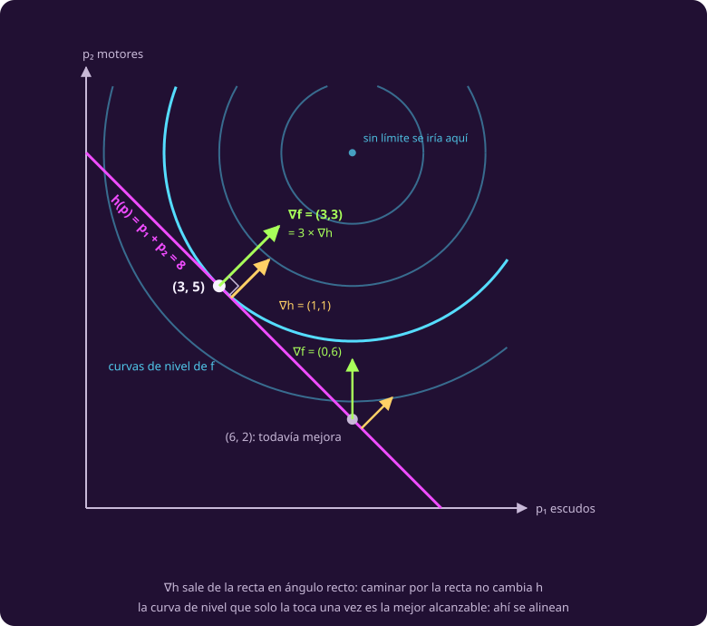

# El multiplicador

**¿Cómo se encuentra el óptimo sin despejar nada?**

La página anterior resolvió el reparto sustituyendo, y dejó a la vista un número
—el 3— que aparecía en los tres sistemas a la vez.

## 1 · La pista está en el dibujo

Con tres sistemas no hay dibujo. Con dos sí, y basta: **escudos y motores**,
$b=(6,8)$, repartiendo 8 unidades. Es el mismo problema con una variable menos, y
su óptimo es $(3,5)$ con el mismo multiplicador que el de tres.

::: figure {#opt-tangencia title="Donde la recta toca la curva de nivel más alta"}

:::

Mira qué pasa en $(6,2)$, que es factible: la curva de nivel lo **cruza**, así
que caminando por la recta hacia un lado se sube. Solo donde la recta **toca sin
cruzar** se acaba la mejora, y ahí las dos flechas —la del objetivo y la de la
restricción— apuntan en la misma dirección.

Eso es toda la idea: **en el óptimo, el gradiente del objetivo no tiene ninguna
componente a lo largo de la restricción**. Si la tuviera, moverse en esa
dirección seguiría subiendo sin salirse.

## 2 · El teorema, con la hipótesis que suele callarse

::: theorem {#opt-teo-lagrange title="Multiplicadores de Lagrange"}
Sea $x^\ast$ un óptimo local de $f$ sobre $h(x)=c$, con $f$ y $h$ diferenciables
y **$\nabla h(x^\ast) \neq 0$**. Entonces existe un número $\lambda$ tal que

$$\nabla f(x^\ast) = \lambda\,\nabla h(x^\ast).$$

Es decir: el gradiente del objetivo es un **múltiplo** del de la restricción.
:::

> [!WARNING]
> **La hipótesis $\nabla h \neq 0$ no es adorno.** Minimiza $x$ sujeto a
> $x^2 = 0$: el óptimo es $x=0$, ahí $\nabla h = 2x = 0$, y no existe ningún
> $\lambda$ con $1 = \lambda\cdot 0$. La restricción no es una curva con
> tangente: es un punto. En el reactor no puede pasar, porque
> $\nabla h = (1,1,1)$ en todas partes.
>
> Y se dice **múltiplo**, no «paralelos»: $\lambda = 0$ también cuenta, y ahí no
> hay dos flechas que enseñar.

::: definition {#opt-lagrangeano title="El lagrangeano"}
El **lagrangeano** empaqueta objetivo y restricción en una sola función, con una
variable nueva por restricción:

$$\mathcal{L}(x,\lambda) = f(x) - \lambda\,\bigl(h(x) - c\bigr).$$

Pedir $\nabla_x \mathcal{L} = 0$ es exactamente $\nabla f = \lambda \nabla h$, y
pedir $\partial \mathcal{L}/\partial \lambda = 0$ devuelve la restricción
$h(x) = c$. Las incógnitas dejan de ser $n$ y pasan a ser $n+1$, pero ya no hay
nada que despejar.
:::

## 3 · El reactor, otra vez, sin sustituir

Con $h(p) = p_1+p_2+p_3$ y $c = 15$:

$$\mathcal{L}(p,\lambda) = \sum_i\left(b_i p_i - \tfrac12 p_i^2\right)
- \lambda\left(p_1+p_2+p_3-15\right).$$

Derivando respecto de cada $p_i$ e igualando a cero sale, de un renglón,

$$b_i - p_i = \lambda \quad\text{para } i=1,2,3.$$

Que es **la observación de la página anterior, ahora demostrada**: lo que paga la
siguiente unidad tiene que valer lo mismo en los tres sistemas, y ese valor común
es $\lambda$. Sumando las tres, $24 - 15 = 3\lambda$, o sea $\lambda = 3$, y de
ahí $p = (6-3,\,8-3,\,10-3) = (3,5,7)$. El mismo reparto, sin haber despejado
nada.

> [!NOTE]
> **Lagrange no adivina: acota.** El teorema dice que el óptimo **cumple** esas
> ecuaciones, no que quien las cumpla sea óptimo. Aquí sí lo es, y por una razón
> que se puede escribir: el objetivo es estrictamente cóncavo —su matriz de
> segundas derivadas es $-I$—, el conjunto factible es convexo, y con eso
> [[el-rendimiento-que-decrece|el teorema de local a global]] convierte el único
> punto que cumple las condiciones en el máximo global.

## 4 · Qué mide ese 3

::: theorem {#opt-lambda-derivada title="El multiplicador es la derivada del valor óptimo"}
Llama $f^\ast(c)$ al valor óptimo del problema cuando el lado derecho de la
restricción es $c$. Entonces

$$\lambda = \frac{d f^\ast}{d c}.$$

Es el **precio sombra** de [[cuanto-vale-una-hora-mas|la clase 2]], ahora como
derivada de verdad y no como diferencia.
:::

En el reactor se puede comprobar, porque el valor óptimo tiene forma cerrada.
Resolviendo con potencia $P$ en vez de 15, el óptimo es
$p = (P/3 - 2,\; P/3,\; P/3 + 2)$ y

$$U^\ast(P) = -\tfrac16 P^2 + 8P + 4,
\qquad \frac{dU^\ast}{dP} = 8 - \frac{P}{3},$$

$$\left.\frac{dU^\ast}{dP}\right|_{P=15} = 3 = \lambda.$$

**Válida para $P \ge 6$**, y el rango no es un detalle: en $P=6$ la primera
coordenada se anula, y por debajo el óptimo deja de repartir a los escudos y la
fórmula miente. En $P=3$ da 26.5 y el verdadero es 25.75.

::: table {#opt-tabla-lambda title="Una unidad más de potencia: la derivada y la diferencia no coinciden"}
| | Valor |
|---|---:|
| $U^\ast(15)$ | 86.5 |
| $U^\ast(16)$ | 89.33… |
| Diferencia $U^\ast(16) - U^\ast(15)$ | $17/6 = 2.83…$ |
| Derivada $\lambda$ en $P=15$ | **3** |
:::

> [!WARNING]
> **Aquí se rompe la analogía fácil con la clase 2.** «Una unidad más de potencia
> da 3» es **falso**: da $17/6$. El multiplicador es una **derivada** —lo que
> paga la unidad siguiente en el instante—, no lo que rinde una unidad entera. En
> el problema lineal las dos cosas coincidían dentro del rango de validez, y por
> eso la confusión pasaba desapercibida. En cuanto la curva se dobla, la unidad
> completa rinde menos que su primera fracción.

## Lo que hay que llevarse

- En el óptimo con una igualdad, el gradiente del objetivo es un múltiplo del de
  la restricción: es lo que se ve como tangencia.
- El lagrangeano convierte «optimizar con restricción» en «resolver un sistema»,
  sin despejar nada.
- El multiplicador no es un residuo del método: es el precio sombra, y es una
  derivada, no una diferencia.

Falta el tope del soporte vital, y con él la pregunta del signo:
[[los-signos-del-lagrangeano|la página siguiente]].
