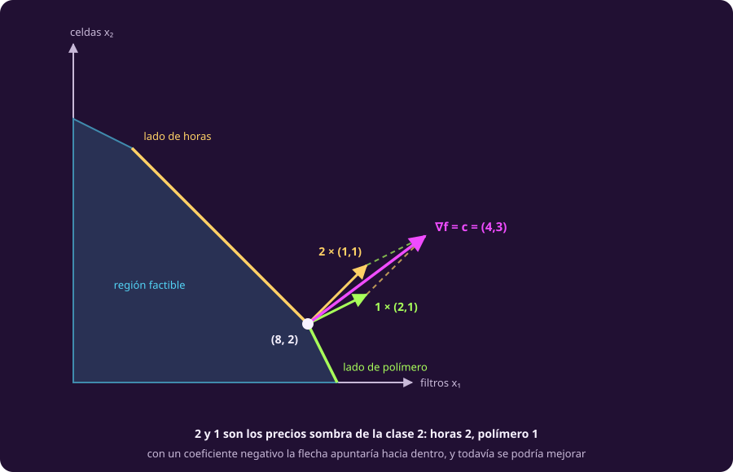

# Los signos del lagrangeano

**¿Con qué signo entra cada restricción, y qué signo tiene su multiplicador?**

Falta la cota que la bitácora dejó pendiente: el soporte vital no aguanta más de
cinco. Es una **desigualdad**, y con ella llega la pregunta que más confusión
causa de toda la unidad.

Abre dos libros y verás $\mathcal{L} = f + \lambda g$ en uno y
$\mathcal{L} = f - \lambda g$ en el otro, sin que ninguno esté mal. Esta página
da la regla que decide, y de paso explica por qué los dos libros tienen razón.

## 1 · El problema canónico

Antes de elegir ningún signo, el problema entero se escribe en una sola forma. Es
[[escribir-el-modelo|la forma canónica de la clase 1]] —objetivo arriba, una
restricción por renglón, el dominio al final— con **un paso más: cada restricción
también contra cero**.

$$\begin{aligned}
\max_{x} \;\text{ o }\; \min_{x} \quad & f(x) && \text{el objetivo} \\
\text{sujeto a} \quad & h_j(x) - c_j = 0 && j = 1,\dots,p \\
& g_i(x) - b_i \le 0 \;\text{ o }\; g_i(x) - b_i \ge 0 && i = 1,\dots,m \\
& x \in X && \text{el dominio}
\end{aligned}$$

**Por qué esta forma y no otra.** Porque la regla de los signos lee exactamente
dos cosas, y las dos solo son visibles cuando el problema está así escrito:

- **El sentido de la optimización**, que vive en el primer renglón y vale para
  **todo** el problema. Es una sola decisión: o maximizas o minimizas.
- **El sentido de cada restricción contra cero**, que vive en su propio renglón y
  puede ser **distinto en cada una**. Un mismo problema puede tener unas $\le 0$
  y otras $\ge 0$, y cada una se decide por separado.

Esa asimetría es la razón de que la regla sea un cuadro de dos por dos y no una
sola respuesta: el máximo o mínimo lo fijas una vez y te acompaña hasta el final;
el sentido de la restricción lo vuelves a mirar en cada renglón.

El dominio $x \in X$ (la no negatividad, casi siempre) se queda donde está y **no
entra al lagrangeano** en esta unidad: es una restricción como las demás y podría
llevar su propio multiplicador, pero aquí se trata aparte, igual que en
[[cuando-se-acaba-el-dibujo|la clase 2]].

### La restricción contra cero

De ese paso extra sale todo lo demás, así que vale la pena aislarlo.

::: definition {#opt-contra-cero title="Dejar una restricción contra cero"}
**Pasa toda la restricción a un lado y compárala con cero.** Es el mismo
movimiento que ya hiciste en [[tres-bitacoras|las bitácoras de práctica]], donde
«la telemetría al menos el doble que los datos» se escribió $2d - t \le 0$.

Contra cero solo quedan tres formas, y solo tres:

$$h(x) - c = 0, \qquad g(x) - b \le 0, \qquad g(x) - b \ge 0.$$
:::

> [!WARNING]
> **Mira hacia dónde quedó la restricción, no el signo de $b$.** El error típico
> es decidir el signo del lagrangeano por cómo venía escrita la frase, o por si
> la constante es positiva o negativa. Ninguna de las dos cosas importa: lo
> único que cuenta es si, ya contra cero, la restricción quedó $\le 0$ o
> $\ge 0$.

**Y no importa hacia qué lado la pases.** Una misma restricción se puede dejar
contra cero de dos maneras ($p_3 - 5 \le 0$ o $5 - p_3 \ge 0$), y la regla de
abajo les asigna signos de delante distintos. Da igual: el término que resulta es
**el mismo**, porque también se volteó el paréntesis. En el reactor las dos
escrituras dan $\mu_3 = 3$.

## 2 · La regla, en dos miradas

::: definition {#opt-lagrangeano-general title="El lagrangeano, con el multiplicador siempre no negativo"}
En estas notas **se fija $\lambda \ge 0$** y se deja que el signo de delante se
acomode. Para cada restricción:

1. déjala contra cero;
2. mira si el problema es de **mínimo o de máximo**;
3. mira si quedó **$\le 0$ o $\ge 0$**.

Con esas dos miradas, el signo de delante está decidido, y el multiplicador sale
no negativo siempre.
:::

::: table {#opt-regla-signos title="El signo de delante, caso por caso"}
| Problema | Restricción original | Contra cero | Lagrangeano |
|---|---|---|---|
| **Mín** $f$ | $g(x) \le b$ | $g(x) - b \le 0$ | $\mathcal{L} = f + \lambda\,(g-b)$ |
| **Mín** $f$ | $g(x) \ge b$ | $g(x) - b \ge 0$ | $\mathcal{L} = f - \lambda\,(g-b)$ |
| **Máx** $f$ | $g(x) \le b$ | $g(x) - b \le 0$ | $\mathcal{L} = f - \lambda\,(g-b)$ |
| **Máx** $f$ | $g(x) \ge b$ | $g(x) - b \ge 0$ | $\mathcal{L} = f + \lambda\,(g-b)$ |
:::

Los cuatro renglones caben en un cuadro de dos por dos. El signo de la casilla es
el que va **antes de $\lambda$**:

::: table {#opt-atajo-signos title="El atajo mental"}
| | Restricción $\le 0$ | Restricción $\ge 0$ |
|---|---:|---:|
| **Minimizar** | $+\lambda$ | $-\lambda$ |
| **Maximizar** | $-\lambda$ | $+\lambda$ |
:::

**Fíjate en que no son dos reglas sino una:** el signo es el **producto** de las
dos miradas. Cambiar una sola lo voltea; cambiar las dos lo deja igual — que es
exactamente lo que pasa al pasar la misma restricción contra cero por el otro
lado.

**Y no hace falta memorizar el cuadro, porque las cuatro casillas salen de una
sola idea:** el término se escribe de modo que **violar la restricción empeore el
objetivo**. Para ver cuál toca, mira dos cosas: qué signo toma $(g-b)$ cuando la
restricción se viola, y qué significa empeorar en tu problema.

- **Máx con $g-b \le 0$.** Violarla es que $g$ se pase de $b$, así que $(g-b)$ se
  vuelve **positivo**. En un máximo, empeorar es **bajar**. Ese positivo hay que
  **restarlo**.
- **Máx con $g-b \ge 0$.** Violarla es que $g$ se quede corto, así que $(g-b)$ se
  vuelve **negativo**. Y sumar un negativo **baja**. Hay que **sumarlo**.
- **Mín con $g-b \le 0$.** Violarla hace $(g-b)$ **positivo**, y en un mínimo
  empeorar es **subir**. Sumar un positivo sube: hay que **sumarlo**.
- **Mín con $g-b \ge 0$.** Violarla hace $(g-b)$ **negativo**, y restar un
  negativo **sube**, que es empeorar. Hay que **restarlo**.

En los cuatro el castigo apunta al mismo lado; lo único que cambia es hacia dónde
queda «peor» y con qué signo llega el paréntesis.

> [!NOTE]
> **Por qué dos libros serios parecen contradecirse.** Boyd y Vandenberghe
> minimizan con las restricciones escritas $f_i(x) \le 0$ y escriben
> $\mathcal{L} = f_0 + \sum \lambda_i f_i$, sumando. Nocedal y Wright también
> minimizan, pero escriben sus restricciones $c_i(x) \ge 0$, y su lagrangeano es
> $\mathcal{L} = f - \sum \lambda_i c_i$, restando. Uno suma y el otro resta, los
> dos exigen $\lambda \ge 0$, y **los dos usan exactamente la misma convención**:
> son los dos renglones de «Mín» del cuadro de arriba.
>
> Y el renglón que más raro se ve (máximo con $\ge$, que suma) es el del
> **artículo original de Kuhn y Tucker**, de 1951: maximizan $g(x)$ sujeto a
> $Fx \ge 0$ y forman $\varphi(x,u) = g(x) + u'Fx$ con $u$ no negativo. Los
> cuatro renglones del cuadro están en la literatura; lo que no suele estar es
> los cuatro juntos.

Con el multiplicador anclado en no negativo, el número deja de depender de la
escritura y pasa a medir siempre lo mismo:

::: theorem {#opt-lambda-mejora title="Qué mide el multiplicador"}
Con la regla de arriba, para cada desigualdad, $\lambda$ es **cuánto mejora el
valor óptimo por cada unidad que se afloja esa restricción**.

Y por eso $\lambda \ge 0$: aflojar nunca puede empeorar. Aflojar es **subir** el
lado derecho si la restricción quedó $\le 0$, y **bajarlo** si quedó $\ge 0$.

En un máximo «mejorar» es subir y en un mínimo es bajar, y el enunciado no
cambia: en los cuatro casos $\lambda$ es la mejora, medida en unidades del
objetivo por unidad de holgura.
:::

## 3 · Qué valor toma, y cuándo vale cero

::: definition {#opt-kkt title="Las condiciones KKT"}
Un punto y sus multiplicadores cumplen las condiciones de
**Karush–Kuhn–Tucker** si cumplen las cuatro:

1. **Estacionariedad**: $\nabla_x \mathcal{L} = 0$.
2. **Factibilidad**: el punto cumple todas las restricciones.
3. **Signo**: $\lambda \ge 0$ para cada desigualdad; el de una **igualdad** es
   libre.
4. **Holgura complementaria**: $\lambda\,\bigl(g(x) - b\bigr) = 0$ para cada
   desigualdad. Dicho en corto: **una restricción que no se toca no empuja**.
:::

De la cuarta sale toda la lectura del número:

::: table {#opt-valor-multiplicador title="Qué valor puede tomar el multiplicador"}
| Estado de la restricción | Multiplicador |
|---|---|
| **Inactiva**: se cumple con holgura | $\lambda = 0$, siempre |
| **Activa**: se cumple con igualdad | $\lambda \ge 0$: normalmente positivo, **pero puede ser cero** |
| **Igualdad** $h(x) = c$ | $\lambda$ libre: positivo, negativo o cero |
| Cualquiera | $\lambda < 0$ **nunca**, con esta convención |
:::

> [!WARNING]
> **Activa no implica $\lambda > 0$.** La holgura complementaria prohíbe que una
> restricción inactiva tenga multiplicador, pero no obliga a que una activa lo
> tenga. Maximiza $-(x-1)^2$ sujeto a $x \le 1$: el óptimo es $x = 1$, la cota se
> cumple con igualdad —está activa—, y sin embargo $\lambda = 0$, porque aflojar
> la cota no mejora nada: el máximo libre ya estaba justo ahí.
>
> Es el caso **degenerado**, y tiene consecuencia práctica: un recurso puede
> agotarse exacto y aun así no valer nada conseguir más.

## 4 · El reactor con su cota

Con la cota, el problema queda

$$\begin{aligned}
\max \;&\sum_i \left(b_i p_i - \tfrac12 p_i^2\right) \\
\text{s.a.}\;\; &p_1+p_2+p_3 = 15,\quad p_3 \le 5,\quad p \ge 0.
\end{aligned}$$

Las dos miradas: es un **máximo**, y la cota contra cero queda $p_3 - 5 \le 0$.
Casilla superior derecha del atajo: **restando**. La igualdad lleva su propio
multiplicador, libre de signo, y se escribe restando también para que valga lo
que ya valía en [[el-multiplicador|la página anterior]]:

$$\mathcal{L} = \sum_i u_i(p_i) - \lambda\,(p_1+p_2+p_3-15) - \mu_3\,(p_3 - 5).$$

La estacionariedad da $b_i - p_i = \lambda$ para escudos y motores, y
$b_3 - p_3 = \lambda + \mu_3$ para el soporte vital. Con la cota activa
($p_3 = 5$) sale

$$p = (4,\,6,\,5), \qquad \lambda = 2, \qquad \mu_3 = 3.$$

::: table {#opt-kkt-reactor title="El reparto con cota, y qué dice cada multiplicador"}
| | Sin cota | Con $p_3 \le 5$ |
|---|---:|---:|
| Reparto | $(3,5,7)$ | $(4,6,5)$ |
| Rendimiento | 86.5 | 83.5 |
| $\lambda$: vale una unidad más de potencia | 3 | **2** |
| $\mu_3$: vale una unidad más de cota | no aplica | **3** |
:::

Los dos números se leen solos. **$\mu_3 = 3$**: la cota está activa y empuja, y
subirla una unidad rendiría 3 más — que es exactamente lo que promete
@opt-lambda-mejora. **$\lambda$ baja de 3 a 2**: con el mejor sistema tapado, la
potencia extra vale menos, porque ya no puede irse a donde más rendía. Y la cota
cuesta $86.5 - 83.5 = 3$.

## 5 · Qué garantizan, y cómo se traduce

::: theorem {#opt-teo-kkt title="Qué garantiza KKT, y dónde deja de garantizarlo"}
Si el objetivo es diferenciable y **todas las restricciones son afines** —rectas
y planos, como en toda esta unidad—, las condiciones KKT son **necesarias** en
todo óptimo local, sin pedir nada más.

Si además el objetivo es **cóncavo y se maximiza** sobre restricciones afines,
entonces cualquier punto que las cumpla es un **máximo global**: aquí son
necesarias y suficientes.

Fuera de ese caso, KKT solo produce **candidatos**.
:::

> [!WARNING]
> **Dos cosas que la versión de receta no dice.** Que las condiciones sean
> «necesarias» no es gratis: sin restricciones afines hace falta una hipótesis
> extra, y minimizar $x$ sujeto a $x^2 = 0$ tiene óptimo y **no** tiene
> multiplicador. Y la diferenciabilidad tampoco: $\min(x,\,2-x)$ es cóncava y no
> es derivable en $x=1$, que es justo donde está su máximo. En esta unidad las
> dos hipótesis se cumplen siempre; fuera de ella, hay que mirarlas.

**Y el dibujo de por qué $\lambda$ no puede ser negativo.** A $\nabla g_i$ se le
llama la **normal exterior** de esa restricción: sale de su frontera en ángulo
recto (igual que $\nabla h$ en [[el-multiplicador|la página anterior]]) y apunta
hacia el lado prohibido.

En un máximo con restricciones $\le$, la estacionariedad dice que $\nabla f$ es
una combinación **con coeficientes no negativos** de las normales exteriores de
las restricciones activas. Con un coeficiente negativo, la flecha del objetivo
apuntaría hacia adentro de la región — y hacia adentro siempre se puede caminar,
así que el punto no sería óptimo.

::: figure {#opt-normales title="El gradiente del objetivo, escrito con las normales activas"}

:::

Ese dibujo es el óptimo de la impresora, y los coeficientes **2 y 1** no son
nuevos: son los precios sombra que [[cuanto-vale-una-hora-mas|la clase 2]]
calculó para las horas y el polímero. La energía, que sobraba, tiene
multiplicador cero — holgura complementaria, otra vez. **Los precios sombra de la
programación lineal son los multiplicadores KKT del problema lineal**, y eso
demuestra lo que la clase 2 prometió: que siempre existen no es casualidad, es el
teorema de arriba aplicado al caso afín.

::: table {#opt-convenciones-kkt title="La misma cuenta, en el papel y en el código"}
| Dónde | Cómo se escribe | Qué sale |
|---|---|---|
| Estas notas y los libros | el signo de delante según @opt-atajo-signos | $\lambda \ge 0$ siempre |
| `scipy` | minimiza, y devuelve los duales de ese mínimo | los precios sombra de un máximo son $-\texttt{marginals}$ |
:::

Ese último renglón explica un tropiezo de la clase 2: `linprog` devuelve $-2$
donde la página enseña 2. No es un error del solver ni de la página: **es el
mismo número visto desde el problema minimizado**.

## Lo que hay que llevarse

- Primero la restricción **contra cero**; sin ese paso, ninguna regla de signos
  significa nada.
- Dos miradas deciden el signo de delante: **mín o máx**, y **$\le 0$ o
  $\ge 0$**. Con eso, $\lambda \ge 0$ siempre.
- El multiplicador mide **cuánto mejora el óptimo al aflojar una unidad**. Vale
  cero cuando la restricción no se toca — y también puede valer cero tocándola.

Falta el caso en que estas condiciones no se pueden resolver a mano:
[[bajar-la-pendiente|la página siguiente]].
