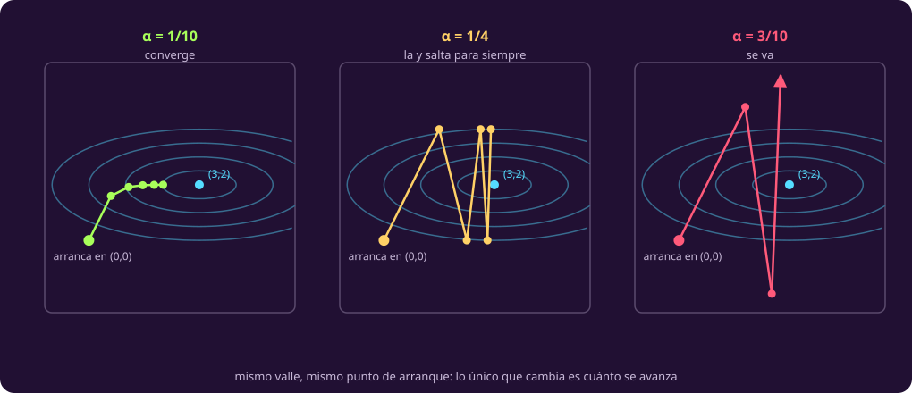

# Bajar la pendiente

**¿Y si no puedo resolver esas condiciones a mano?**

La página anterior resolvió el reactor abriendo dos casos y despejando un sistema
chico. Eso fue suerte del ejemplo: en cuanto el objetivo deja de ser cuadrático,
las ecuaciones de la estacionariedad no se despejan, y hace falta un método que
**no resuelva nada**.

> **Bitácora de la bomba.** La bomba de refrigerante tiene dos perillas mal
> calibradas y el desgaste sube cuando cualquiera de las dos se aleja de su punto
> justo. La de presión pesa poco; la de caudal pesa el cuádruple. Ninguna tiene
> tope: el problema es encontrar el punto, no repartir nada.

**Por qué cambia de problema.** No es capricho de guion: el reactor tiene una
igualdad, y **el descenso de gradiente no sabe respetar restricciones**. Hace
falta un problema libre para enseñarlo, y la bomba lo es.

$$\min\; f(x,y) = (x-3)^2 + 4\,(y-2)^2.$$

Se **minimiza**, que es lo natural para un desgaste, y por eso el método se llama
descenso. Su mínimo está en $(3,2)$ (se ve a ojo) y eso es justo lo que lo hace
buen ejemplo: se puede comprobar a dónde llega.

## 1 · Hacia dónde, y cuánto

::: definition {#opt-direccion-descenso title="Dirección de descenso"}
El gradiente apunta hacia donde $f$ **crece** más rápido. Así que $-\nabla f$
apunta hacia donde más baja, y es la dirección que toma el método.

En un máximo se usa $+\nabla f$ y se llama **ascenso** de gradiente. Es el mismo
algoritmo; el signo lo fija si maximizas o minimizas, igual que en
[[los-signos-del-lagrangeano|la página anterior]].
:::

::: definition {#opt-tamano-de-paso title="Tamaño de paso"}
La dirección no dice **cuánto** avanzar. El **tamaño de paso** $\alpha > 0$ es el
número que lo decide:

$$x \leftarrow x - \alpha\,\nabla f(x).$$

Las barras dobles son el **tamaño** de un vector, su norma:
$\|(a,b)\| = \sqrt{a^2+b^2}$. Así que $\|\nabla f\|$ es qué tan empinada está la
subida, sin importar hacia dónde.

Y como el gradiente se encoge cerca del óptimo, el avance real
$\alpha\|\nabla f\|$ se encoge solo, aunque $\alpha$ no cambie.

En aprendizaje automático a este mismo $\alpha$ se le llama **tasa de
aprendizaje**. Es el mismo número.
:::

## 2 · El procedimiento, en siete líneas

```text
INPUT   f diferenciable, un punto inicial x₀, una tolerancia ε > 0, y un
        tamaño de paso α suficientemente pequeño (ver la sección 4).
OUTPUT  un punto donde la pendiente es casi cero.

 1  x ← x₀                      ▷ dónde estoy
 2  while true
 3      g ← ∇f(x)               ▷ hacia dónde: la pendiente
 4      if ‖g‖ ≤ ε
 5          return x            ▷ ¿paro? la pendiente es casi cero
 6      x ← x − α·g             ▷ cuánto avanzo: un paso de largo α‖g‖
 7  end while
```

::: definition {#opt-tolerancia title="Tolerancia y criterio de paro"}
La **tolerancia** $\varepsilon$ es qué tan chica tiene que ser la pendiente para
darse por satisfecho.

Y hay que leer con cuidado qué promete: el método para cuando **la pendiente**
es casi cero, que **no** es lo mismo que estar cerca del óptimo. En un valle
plano y largo se puede estar lejísimos con pendiente diminuta.
:::

> [!WARNING]
> **Éste es el único de los algoritmos de la unidad que puede no terminar.**
> Simplex termina en los problemas de la clase 2 porque hay finitos vértices y
> cada paso mejora estrictamente; con vértices degenerados eso deja de estar
> garantizado, y la clase 2 dice que no cubre ese caso. Aquí no hay
> nada finito que agotar: sobre $f(x)=x^2$, desde $x_0=1$ y con $\alpha=1$, el
> método salta entre 1 y $-1$ **para siempre**, con la pendiente clavada en 2, y
> la condición de paro nunca se cumple. No es un error numérico: es un bucle
> infinito. Por eso la entrada no puede decir solo «$\alpha>0$».

## 3 · Correrlo: tres pasos, y cuánto avanzar

Desde $(0,0)$, con $\alpha = 1/10$. El gradiente es
$\nabla f = \bigl(2(x-3),\; 8(y-2)\bigr)$.

::: table {#opt-traza-gradiente title="Los tres primeros pasos, y lo que falta después de cada uno"}
| Paso | Estoy en | Pendiente | Me muevo | Llego a | Me falta |
|---:|---|---|---|---|---|
| 0 | $(0,\,0)$ | $(-6,\,-16)$ | $(0.6,\,1.6)$ | $(0.6,\,1.6)$ | $(3,\;2)$ |
| 1 | $(0.6,\,1.6)$ | $(-4.8,\,-3.2)$ | $(0.48,\,0.32)$ | $(1.08,\,1.92)$ | $(2.4,\;0.4)$ |
| 2 | $(1.08,\,1.92)$ | $(-3.84,\,-0.64)$ | $(0.384,\,0.064)$ | $(1.464,\,1.984)$ | $(1.92,\;0.08)$ |
| 3 | $(1.464,\,1.984)$ | — | — | — | $(1.536,\;0.016)$ |
:::

**La última columna es la que enseña.** Lo que falta en $x$ se multiplica por
$4/5$ en cada paso, y lo que falta en $y$ por $1/5$. No es de estos tres pasos:
pasa en todos, y explica por qué $y$ llega casi de inmediato y $x$ se arrastra.
El $4$ del objetivo hace el valle **alargado**, y el método baja rápido por la
pared empinada y lento por el pasillo plano.

### Cuánto avanzar

Los factores de arriba salen del propio paso, en un renglón. Restando 3 a los dos
lados de $x \leftarrow x - \alpha\,2(x-3)$ queda

$$x_{k+1} - 3 = (1-2\alpha)\,(x_k - 3),$$

y lo mismo en $y$ con $1-8\alpha$: **lo que falta se multiplica por ese factor en
cada paso**. Cada coordenada encoge solo si su factor está entre $-1$ y $1$. 

::: table {#opt-tres-tasas title="El mismo valle con tres tamaños de paso"}
| $\alpha$ | Factor en $x$ | Factor en $y$ | Qué pasa |
|---|---:|---:|---|
| $1/10$ | $4/5$ | $1/5$ | converge |
| $1/4$ | $1/2$ | $-1$ | $y$ salta entre 0 y 4 para siempre; $x$ **sí** converge |
| $3/10$ | $2/5$ | $-7/5$ | diverge |
:::

::: figure {#opt-pasos-gradiente title="Tres tamaños de paso sobre el mismo valle"}

:::

El caso $\alpha = 1/4$ es el que casi nunca se enseña y el que más dice: **una
coordenada converge y la otra oscila, en el mismo punto y al mismo tiempo**. El
umbral no es aproximado: el método converge exactamente cuando
$0 < \alpha < 1/4$, que es donde $|1-8\alpha| < 1$; en $\alpha = 1/4$ el factor
vale $-1$ justo, y por eso salta sin acercarse. Y el que manda es el $8$, la
dirección más empinada: **el paso lo fija la coordenada más sensible, y las demás
lo sufren**.

> [!NOTE]
> **Newton, en un renglón.** Hay métodos que eligen el paso mirando también la
> **curvatura** —las segundas derivadas— en vez de solo la pendiente, y con eso
> dejan de depender de un $\alpha$ a mano. Cuestan más por paso y dan muchos
> menos pasos. Esta unidad no los cubre.

## 4 · Qué entrega

Esto llena la última fila de la tabla de
[[que-es-una-respuesta|los ocho tipos de respuesta]]: **solución aproximada**. El
método entrega un punto factible sin demostrar que sea óptimo, y qué tan bueno es
solo se sabe comparándolo contra una cota.

> [!WARNING]
> **Tres cosas que no promete.** No promete **distancia** al óptimo: acota la
> pendiente, no el error. No promete un **óptimo** si el problema no es convexo:
> llega a un punto de pendiente casi cero, que puede ser un mínimo local o un
> **punto silla** —un punto que baja en una dirección y sube en otra, como el
> centro de una silla de montar—. Sobre $x^2 - y^2$, desde $(1,0)$, converge a
> $(0,0)$, que no es ni máximo ni mínimo de nada. Ojo con ese ejemplo: converge
> ahí porque $y_0$ vale **cero exacto**; con cualquier $y_0 \ne 0$ la coordenada
> $y$ se dispara. Los puntos silla atrapan al método solo desde direcciones muy
> particulares, y aun así basta para no poder prometer nada. Y **no respeta restricciones**: aplicado al reactor tal
> cual, el primer paso se sale de $p_1+p_2+p_3=15$ y nada lo regresa.

## Lo que hay que llevarse

- El método no resuelve ecuaciones: da pasos en contra de la pendiente, y por eso
  sirve donde no se puede despejar.
- El tamaño de paso es el parámetro que decide todo: chico converge, grande
  oscila, más grande revienta. Y el umbral lo fija la dirección más empinada.
- Lo que entrega es una solución aproximada. Parar no es lo mismo que llegar.

Y queda una pregunta abierta a propósito: el método no respeta restricciones, y
el reactor es todo restricciones. **Averiguar qué se hace al respecto es la tarea
de esta clase** — hay una versión sencilla que sí las respeta, y está a un paso
de lo que ya sabes. Los detalles, en
[[optimizacion-continua|la portada de la clase]].
