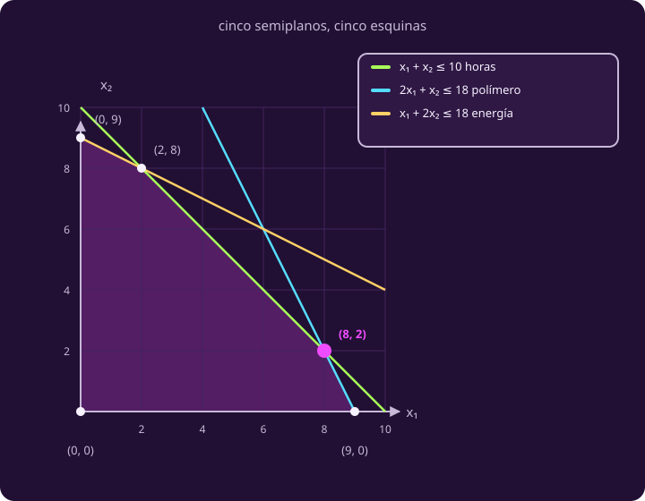
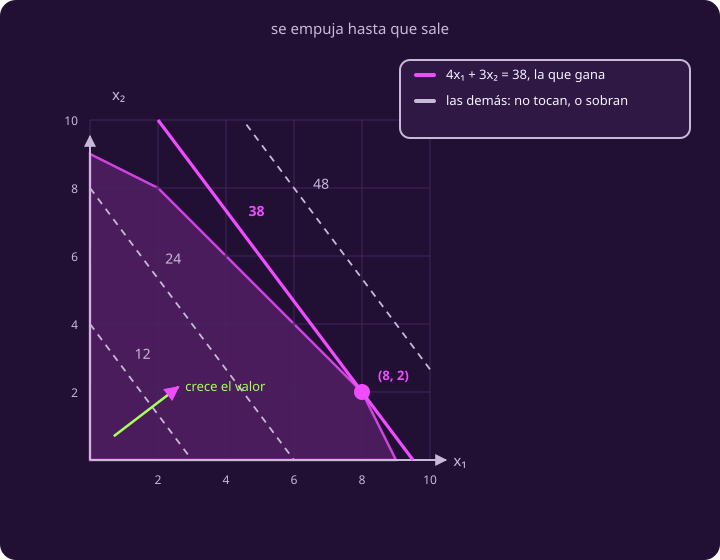
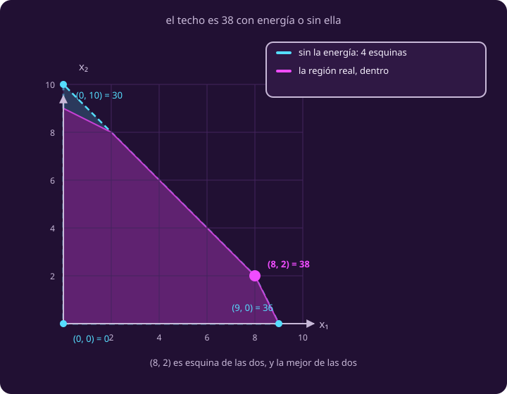

# El dibujo

**¿Qué significa este modelo en el plano, y dónde está la respuesta?**

Tienes el modelo escrito. Tres desigualdades y dos variables, y ninguna pista de
por dónde empezar a buscar.

Aquí está el atajo: **con dos variables, un modelo se puede dibujar**. Cada plan
posible es un punto del plano —tantos filtros a la derecha, tantas celdas hacia
arriba—, y cada restricción recorta una parte de ese plano. Lo que queda es la
figura de todos los planes que sí se pueden hacer.

Y una vez dibujada, la respuesta no hay que buscarla: **se ve**. Esta página
explica por qué, y la razón vale mucho más allá de dos variables.

## 1 · El polígono

Una desigualdad como $x_1+x_2\le10$ parte el plano en dos con la recta
$x_1+x_2=10$, y se queda con un lado: eso es un **semiplano**. El conjunto
factible es lo que sobra al superponer los cinco.

**De qué lado queda la zona buena** se sabe probando un punto que no esté sobre
la recta. Con el origen: $0+0 = 0 \le 10$, cierto, así que el lado bueno es el
suyo. Las tres de recurso pasan esa prueba; las dos de no negatividad tienen el
origen encima de la recta, así que ahí se prueba con $(1,1)$.

**Se dibujan cinco, no tres**, y la razón es la de la página anterior:
$(-2,10)$ cumple las tres desigualdades de recurso y no es un plan.

::: definition {#opt-vertice title="Vértice, o esquina"}
El conjunto factible de este problema es un **polígono**: una región del plano
encerrada por segmentos de recta.

Un **vértice** es un punto del polígono donde se cruzan **dos** de las rectas que
lo encierran. Los lados del polígono son segmentos de esas rectas, y cada recta
es una **frontera**: donde una restricción se cumple con igualdad, o sea donde
ese recurso se acabó exacto.

**Cómo se encuentran.** Cruza las rectas de dos en dos —con cinco rectas salen
diez cruces— y **quédate solo con los cruces que cumplen las otras
desigualdades**. Ese segundo paso no es opcional: $(6,6)$ es el cruce de las
rectas del polímero y de la energía, y no es vértice, porque pide 12 horas y solo
hay 10. De los diez cruces sobreviven cinco.
:::

> [!WARNING]
> Cruzar dos rectas no basta para tener una esquina. Con cinco rectas hay diez
> cruces y solo cinco sobreviven; el resto cae fuera de la región. El error
> clásico es dibujar $(6,6)$ —donde se cruzan polímero y energía— y no notar que
> pide 12 horas cuando solo hay 10.

::: figure {#opt-poligono title="Los cinco semiplanos y las cinco esquinas"}

:::

## 2 · La curva de nivel, y por qué la respuesta está en una esquina

Ya tienes el terreno: todos los planes posibles. Falta el criterio, porque el
dibujo de arriba **no sabe nada de créditos**. Se dibuja aparte, y encima.

::: definition {#opt-curva-nivel title="Curva de nivel"}
Fijado un número $v$, la **curva de nivel de valor $v$** es el conjunto de
**todos los puntos del plano** —dentro o fuera del polígono— donde el objetivo
vale exactamente $v$: la recta $4x_1+3x_2=v$.

Al variar $v$ se obtiene una **familia de rectas paralelas entre sí**, todas con
la misma inclinación, que solo depende de los precios. Subir $v$ las desplaza sin
girarlas; **cambiar los precios las gira**.
:::

Que la curva viva en todo el plano es lo que hace funcionar el método:
deslizarla consiste en pasarla por terreno no factible hasta que sale.

::: figure {#opt-curvas-de-nivel title="La familia de rectas, y la última que toca"}

:::

### Hacia qué lado se empuja, y por qué

La flecha verde del dibujo apunta hacia donde el valor **crece**, y la razón no
tiene misterio: **moverse a la derecha es imprimir más filtros, y cada filtro
suma 4 créditos; moverse hacia arriba es imprimir más celdas, y cada celda suma
3.** Así que cualquier movimiento hacia arriba y a la derecha sube el total, y
cualquier movimiento hacia abajo y a la izquierda lo baja.

Ponle números. Desde donde estés, da un paso de un filtro a la derecha: el total
sube 4. Da uno de una celda hacia arriba: sube 3. Combínalos como quieras y el
total sigue subiendo. Por eso las rectas de la familia valen más conforme se
alejan del origen: la de 12 está cerca, la de 48 está lejos, y ninguna de las dos
se cruza con las otras.

**La flecha es exactamente la pareja de precios**, $(4,\, 3)$: cuatro de avance
por cada tres de subida. Cambia los precios y la flecha gira, que es otra forma
de decir lo que dice la caja de arriba.

Se empuja la familia en ese sentido hasta la última recta que todavía toca el
polígono. Esa es $4x_1+3x_2=38$, y toca el polígono **solo en $(8,2)$**.

::: table {#opt-tabla-vertices title="Lo que vale cada esquina"}
| Esquina | Créditos |
|---|---:|
| $(0,0)$ | 0 |
| $(0,9)$ | 27 |
| $(2,8)$ | 32 |
| $(8,2)$ | **38** |
| $(9,0)$ | 36 |
:::

### Por qué eso siempre cae en una esquina

Podría parecer una casualidad de este dibujo: la recta salió con esa inclinación
y tocó justo ahí. **No lo es.** Pasa siempre, y la razón cabe en cuatro pasos que
solo usan lo que ya está en la página.

1. El polígono es una figura cerrada y de tamaño finito, así que empujando la
   recta llega un momento en que ya no se puede más: hay una **última** que lo
   toca.
2. Ningún plan vale más que esa última recta: valer más sería estar en una recta
   que ya quedó fuera.
3. Esa última recta toca el polígono en un punto suelto o a lo largo de un lado
   entero. No hay tercera posibilidad: si tocara en dos puntos sueltos, entraría
   en el polígono y podría empujarse más.
4. Un punto suelto es el cruce de dos lados, o sea **una esquina**. Y si toca un
   lado entero, sus dos extremos valen lo mismo, y **también son esquinas**.

El caso del lado entero no es una rareza: es la segunda parte del ejercicio de
abajo.

### Cuatro preguntas que ya se pueden contestar

Las páginas anteriores dejaron cuatro cosas pendientes, y no por descuido: para
contestarlas hacía falta conocer la respuesta, y hasta ahora no la había.

::: table {#opt-deudas title="Lo que las páginas anteriores dejaron abierto"}
| Lo que quedó pendiente | Lo que el dibujo contesta |
|---|---|
| La bitácora decía que del polímero «no nos vamos a quedar cortos» | En $(8,2)$ se gastan los 18 kilos **exactos**. Se acaba junto con las horas. Una opinión de la tripulación no es un dato |
| El supuesto de la energía necesitaba su condición | Aguanta con **12 kWh o más**, y el argumento va abajo |
| «No conviene hacer más celdas que filtros» se resolvió como preferencia | El óptimo hace 8 filtros y 2 celdas: la cumple de sobra. La elección no importó, y ahora se puede decir en vez de suponerlo |
| Con 14 kg de polímero, ¿cambia la respuesta? | Sí: el óptimo se va a $(4,6)$ y vale 34. Y ese plan consume **16 kWh**, así que la condición del supuesto se endurece: ya no basta con 12 |
:::

#### El argumento del 12, en tres pasos

Es el más útil de la página y se puede dar en el pizarrón sin cuentas.

**Paso 1. Tacha la energía y mira qué región queda.** Sin esa restricción el
polígono crece: se le añade el triángulo de arriba a la izquierda, y pasa de 5
esquinas a 4.

::: figure {#opt-sin-energia title="El techo no depende de la energía"}

:::

**Paso 2. En esa región más grande, el mejor plan sigue siendo $(8,2)$**, con 38.
Sus cuatro esquinas valen 0, 30, **38** y 36. Y esto es lo que hay que ver: por
mucha energía que tengas, **nunca vas a pasar de 38**, porque ni siquiera
regalándotela toda se puede. El triángulo que se añadió está lleno de planes
peores.

**Paso 3. $(8,2)$ gasta $8 + 2\cdot 2 = 12$ kWh.** Así que en cuanto tengas 12 o
más, ese plan **cabe**. Y un plan que cabe y que alcanza un techo que nadie puede
pasar es, sin más, el mejor.

De ahí sale el 12: **con 12 o más, la respuesta es la misma.** Con menos deja de
caber y todo se mueve; con 11 el óptimo se va a $(25/3,\, 4/3)$, que ni siquiera
es un número entero de piezas.

## 3 · Tu turno

::: exercise {#opt-ej-precios title="Si el depósito pagara otra cosa"}
El polígono no cambia; solo cambia lo que paga el depósito por una celda.

1. Si la celda pagara **5** créditos en vez de 3, ¿dónde queda el óptimo?
2. ¿Y si pagara **4**?
:::

::: hint {#opt-pista-precios of="opt-ej-precios" title="Por dónde empezar"}
La inclinación de la curva de nivel depende solo de los precios, y el polígono es
el mismo. Así que basta recalcular la columna de créditos de la tabla de esquinas
y quedarse con el mayor.

En la segunda parte, mira con cuidado **cuántas** esquinas alcanzan ese mayor.
:::

::: answer {#opt-resp-precios of="opt-ej-precios"}
**Con 5**, el óptimo es $(2,8)$ y vale 48. Los cinco valores pasan a ser 0, 45,
**48**, 42 y 36. El mismo polígono, otra esquina: la curva de nivel giró lo
suficiente para que gane la otra punta.

**Con 4 empatan dos esquinas.** $(2,8)$ y $(8,2)$ valen las dos 40, y con ellas
**todo el segmento que las une**, porque la curva de nivel quedó exactamente
paralela al lado de las horas. Hay infinitos óptimos y un solo valor óptimo, 40.
Compruébalo con el punto de en medio: $(5,5)$ es factible y vale $20+20=40$.

Por eso la frase correcta es **«siempre hay un óptimo en una esquina»** y no «el
óptimo está en una esquina».
:::

## Lo que hay que llevarse

- Cada restricción es un semiplano, y las de no negatividad también.
- **Si el problema tiene óptimo, hay uno en una esquina**, aunque a veces haya
  además otros que no lo son.
- Los precios no mueven el polígono: **giran la curva de nivel**, y con ella
  cambia cuál esquina gana.

Ya sabes encontrar la respuesta. Falta decir **qué clase de cosa** es esa
respuesta, y cómo se demuestra que es la mejor, que es lo que hace
[[que-es-una-respuesta|la página siguiente]].
