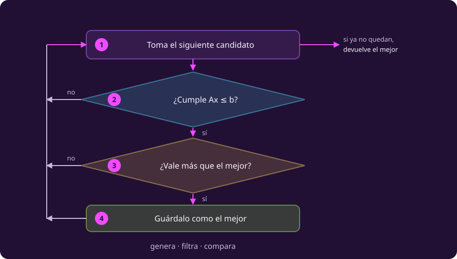

# Enumerar

**Problema activo: problema 1 · Taller original.** Retomamos el
[problema 1 de la bitácora](raya:la-bitacora-del-taller#raya-object-opt-ent-ej-modelo-base), sin los cambios de los problemas 2, 3 y 4.
$x_1$ cuenta rovers y $x_2$, sondas.
El problema que vamos a resolver es:

$$\begin{aligned}
\max\quad &5x_1+4x_2\\
\text{sujeto a}\quad &6x_1+4x_2\le24,\\
&x_1+2x_2\le6,\\
&x_1\le4,\\
&x_1,x_2\ge0,\\
&x_1,x_2\in\mathbb Z.
\end{aligned}$$

La idea del primer algoritmo es comprobar todas las posibilidades de una lista
finita. Para convertir esa idea en un procedimiento necesitamos contestar:
**qué lista recorrer, qué descartar y qué guardar**.

## 1 · Construir la caja de candidatos

Para comenzar el algoritmo necesitamos límites individuales. Usamos los que
ya da el enunciado y, donde falten, justificamos uno a partir de los recursos:

| Variable | Límite inferior | Cómo obtenemos el límite superior | Valores que vamos a probar |
|---|---:|---|---|
| Rovers, $x_1$ | 0 | La orden del comandante exige $x_1\le4$ | 0, 1, 2, 3, 4 |
| Sondas, $x_2$ | 0 | $2x_2\le6$, por tanto $x_2\le3$ | 0, 1, 2, 3 |

Hay cinco elecciones para la primera variable y cuatro para la segunda. Al
combinarlas obtenemos $5\cdot4=20$ parejas.

**Ojo:** que un valor sea posible por separado no significa que cualquier
pareja sea factible. Por ejemplo, $(4,3)$ está en esa lista, pero consume más
recursos de los disponibles.

### Representar todas las condiciones para ejecutarlas

La orden $x_1\le4$ se cumple al generar los candidatos: la primera lista
termina en cuatro. La no negatividad y la integralidad también se cumplen al
generar las dos listas. Después comprobamos las restricciones de recursos.

Para esta implementación guardamos los límites en la caja y las dos filas de
recursos en

$$A=\begin{pmatrix}6&4\\1&2\end{pmatrix},\qquad
b=\begin{pmatrix}24\\6\end{pmatrix}.$$

En la página de modelado escribimos la orden como una tercera fila explícita.
Aquí está representada en el límite de la primera lista: **la condición sigue
vigente**. Esta separación entre límites de variables y otras restricciones
permite ejecutar el modelo sin comprobar dos veces lo que ya cumple cada
candidato generado.

### Dar nombre a la lista

Para $n$ variables, llamaremos $l_i$ y $u_i$ a los límites inferior y superior
de la variable $x_i$. Aquí la letra $i$ indica qué variable estamos mirando.
Los límites que usaremos son enteros, finitos y cumplen $l_i\le u_i$.

::: definition {#opt-caja title="Caja entera y conjunto factible"}
La **caja de candidatos**, llamada $X$, combina todos los enteros de cada
intervalo:

$$X=\{l_1,l_1+1,\ldots,u_1\}\times\cdots\times
\{l_n,l_n+1,\ldots,u_n\}.$$

El signo $\times$ indica un **producto cartesiano**: tomar un valor de cada
lista forma un candidato completo. El conjunto factible es

$$F=\{x\in X:Ax\le b\}.$$

Por tanto, $F\subseteq X$: los factibles son los candidatos que además
cumplen todas las restricciones.
:::

Los límites deben conservar **todas** las soluciones factibles del modelo.
Pueden venir del enunciado o deducirse de sus restricciones. Si elegimos un
límite arbitrario demasiado pequeño, podríamos excluir el óptimo antes de
buscarlo. Si no contamos con límites finitos válidos, este procedimiento de
enumeración finita no se puede aplicar tal como está escrito.

## 2 · Revisar uno y recordar lo que llevamos

Para cada candidato haremos tres preguntas:

```text
¿Está en la caja? → lo generamos
¿Cumple las restricciones? → si no, lo descartamos
¿Mejora lo que ya tenemos? → si sí, lo guardamos
```

Antes de arrancar no hay ningún plan guardado. Necesitamos recordar tanto el
plan como su valor.

::: definition {#opt-mejor-hasta-ahora title="La mejor solución encontrada hasta ahora"}
$x^*$ guardará la mejor solución factible encontrada y `mejor`, su valor.
Durante el recorrido la estrella **no significa que ya probamos optimalidad**.

Al inicio, $x^*=$ «ninguno» y `mejor` $=-\infty$. Menos infinito es una marca
inferior a cualquier valor real: permite que el primer candidato factible se
guarde, incluso si su objetivo es negativo.
:::

**Orden de esta enumeración:** fijamos primero la cantidad de rovers y
recorremos las sondas de 0 a 3. Después aumentamos los rovers. Comienza así:
$(0,0),(0,1),(0,2),(0,3),(1,0),\ldots$.

Los primeros cuatro candidatos son factibles y dan valores 0, 4, 8 y 12.
Después de ellos tenemos $x^*=(0,3)$ y `mejor` $=12$.

::: exercise {#opt-ent-ej-traza-enum title="Decide qué se guarda"}
Partiendo de ese estado, procesa $(1,0),(1,1),(1,2),(1,3)$ en ese orden.
Para cada uno anota: si es factible, su valor cuando corresponda y el plan que
queda guardado. No actualices el registro solo porque apareció otro candidato.
:::

::: answer {#opt-ent-resp-traza-enum of="opt-ent-ej-traza-enum"}
| Candidato | ¿Cumple los recursos? | Valor | Decisión | Registro al terminar |
|---|---|---:|---|---|
| $(1,0)$ | Sí | 5 | Conservar el anterior | $(0,3)$, valor 12 |
| $(1,1)$ | Sí | 9 | Conservar el anterior | $(0,3)$, valor 12 |
| $(1,2)$ | Sí | 13 | Guardar el nuevo | $(1,2)$, valor 13 |
| $(1,3)$ | No: necesita 7 horas | No se evalúa | Descartar | $(1,2)$, valor 13 |
:::

Hay tres resultados posibles de un paso: descartar un infactible, conservar
el registro ante un factible que no mejora, o actualizarlo. **Revisar y guardar
no son la misma operación.**

## 3 · Completar los veinte candidatos

Seguimos con el mismo modelo y el mismo orden. En la figura, localiza primero
un candidato tachado y uno factible; después encuentra el de mayor valor.

::: figure {#opt-rejilla title="Los veinte candidatos del taller"}

:::

La rejilla distingue la **caja completa** de lo que los recursos permiten. Esta
es la misma información en una tabla; una cruz significa infactible:

| Sondas / rovers | 0 | 1 | 2 | 3 | 4 |
|---|---:|---:|---:|---:|---:|
| 3 | 12 | ✗ | ✗ | ✗ | ✗ |
| 2 | 8 | 13 | 18 | ✗ | ✗ |
| 1 | 4 | 9 | 14 | 19 | ✗ |
| 0 | 0 | 5 | 10 | 15 | **20** |

Desde el registro de valor 13, las siguientes mejoras son:

| Candidato | Valor nuevo de `mejor` |
|---|---:|
| $(2,1)$ | 14 |
| $(2,2)$ | 18 |
| $(3,1)$ | 19 |
| $(4,0)$ | 20 |

Al terminar contamos **13 factibles y 7 infactibles**. La respuesta es
**cuatro rovers y ninguna sonda**, con **20 MB/día**. Es el único plan con ese
valor; el siguiente mejor transmite 19.

El ganador apareció en la posición 17. El procedimiento revisó también los
últimos tres candidatos, porque no mantiene una cota que le permita descartarlos
juntos. Solo al agotar la caja ha comprobado que ninguno mejora el registro.

## 4 · Escribir el procedimiento general

**Ya hicimos una ejecución.** Ahora reemplazamos sus números por los datos de
cualquier modelo lineal entero con una caja finita válida. $c$ contiene los
rendimientos; $A$ y $b$, las restricciones; $l$ y $u$, las cotas de variables.

```text
INPUT   max cᵀx  s.a.  Ax ≤ b,  l ≤ x ≤ u,  x entera.
        l y u son vectores de enteros finitos; l ≤ u.
OUTPUT  una solución óptima x* y su valor, o «no hay factibles».

 1  mejor ← −∞ ;  x* ← «ninguno»
 2  X ← { l₁..u₁ } × … × { lₙ..uₙ }
 3  for each x in X
 4      if Ax ≤ b no se cumple: continue
 5      z ← cᵀx
 6      if z > mejor
 7          mejor ← z ;  x* ← x
 8  end for
 9  if x* = «ninguno»: return «no hay solución factible»
10  return x*, mejor
```

`continue` significa pasar al candidato siguiente. Si aparece un empate,
conservamos el plan que ya teníamos: buscamos **un** óptimo, no todos.

Sigue ahora en el diagrama el camino de un candidato infactible y después el de
uno que mejora. Las etiquetas `[Ln]` corresponden a las líneas anteriores.

::: figure {#opt-flujo-enumerar title="Del candidato al registro"}

:::

Ambos caminos regresan al recorrido. La figura resume por qué descartar un
candidato no termina la búsqueda.

### Por qué termina y por qué la respuesta es correcta

La caja es finita y cada candidato se revisa una sola vez, así que el ciclo
termina. La propiedad que se mantiene después de cada paso es:

> Si ya apareció un factible, el registro contiene el mejor de los factibles
> **revisados hasta ahora**. Si no apareció ninguno, sigue vacío.

Al revisar otro candidato, o no puede mejorar el registro y lo conservamos,
o sí lo mejora y lo sustituimos. Así la propiedad se mantiene. Cuando ya
revisamos toda $X$, también revisamos todo $F$: el registro es un óptimo global.
Si sigue vacío, no existe solución factible en el modelo.

**Comprueba:** tras revisar 12 candidatos, ¿ya puedes asegurar optimalidad entre
los 20? Solo puedes asegurarla entre los 12 revisados, salvo que dispongas de
algún argumento adicional sobre los restantes.

## 5 · Contar el trabajo

**Pregunta nueva:** ¿por qué un procedimiento tan sencillo puede tardar tanto?
Separaremos el tamaño de la caja del trabajo necesario para revisar un candidato.

### Cuántos candidatos hay

La notación $|X|$ significa la **cantidad de elementos** de $X$. Una variable
que va de $l_i$ a $u_i$, contando ambos extremos, tiene $u_i-l_i+1$ valores.
Cada elección se combina con las de las otras variables, por eso multiplicamos:

$$|X|=\prod_{i=1}^{n}(u_i-l_i+1).$$

El signo $\prod$ abrevia un producto. En el taller, $n=2$ y las cotas son
$(l_1,u_1)=(0,4)$ y $(l_2,u_2)=(0,3)$: $|X|=5\cdot4=20$.

Con $n$ variables binarias hay $2^n$ candidatos. Si todas tienen exactamente
$k$ valores, hay $k^n$. Ese crecimiento es exponencial en $n$ cuando $k\ge2$
se mantiene fijo. Si todas las variables están fijadas a un valor, la caja
contiene solo un candidato.

### Qué cuesta revisar uno

$m$ es el número de filas de $A$, y $n$, su número de columnas. En esta
representación del taller, $m=n=2$: las dos filas de recursos se comprueban
después de generar cada candidato dentro de la caja. Supongamos que calculamos completas las expresiones
lineales, como hace la evaluación matricial del fragmento de Python al final.

| Operación | Trabajo aritmético |
|---|---|
| Comprobar las $m$ restricciones | $mn$ productos, $m(n-1)$ sumas y $m$ comparaciones |
| Evaluar el objetivo, si es factible | $n$ productos y $n-1$ sumas |
| Comparar y conservar o copiar el plan | Una comparación; hasta $n$ componentes si se copia |

La notación $O(mn)$ expresa una **cota del crecimiento** de ese trabajo, dejando
fuera factores constantes. Para una matriz densa y $m\ge1$, domina el costo de
las restricciones. No significa que todos los candidatos cuesten exactamente
lo mismo ni proporciona un tiempo en segundos.

::: remark {#opt-costo-enumerar title="Costo de la enumeración presentada"}
Con evaluación densa y operaciones aritméticas contadas como unidades,

$$T_{\mathrm{enum}}=O\!\left(|X|\,mn\right)
=O\!\left(\prod_{i=1}^{n}(u_i-l_i+1)\,mn\right).$$

Se multiplican los factores porque revisamos un candidato por cada elemento
de la caja. La expresión incluye un costo por candidato; no solo cuenta puntos.
:::

En el taller calculamos cuatro productos de recursos por cada uno de los
20 candidatos, y dos productos del objetivo para cada uno de los 13 factibles:
**$20(4)+13(2)=106$ productos**. Usar seis por candidato daría 120, una cota
superior, no el conteo exacto de este recorrido.

### Qué cambia cuando cambia el modelo

| Cambio | Efecto que podemos justificar |
|---|---|
| Añadir una variable con $k$ valores | Multiplica los candidatos por $k$ y aumenta el trabajo de evaluar cada uno |
| Añadir una restricción manteniendo la misma caja | Añade una comprobación por candidato; puede reducir los factibles |
| Volver a deducir cotas después de añadir restricciones | Puede reducir también la caja |
| Ampliar una cota de variable | Aumenta los candidatos, aunque no cambien $n$ ni $m$ |

::: exercise {#opt-ent-ej-caja-30 title="Más aleación y una orden que sigue vigente"}
Llegan 6 kg adicionales: ahora hay 30 kg de aleación y las mismas 6 horas.
¿Cuántos candidatos tiene una caja con las cotas individuales más ajustadas?
Responde primero manteniendo la orden de máximo cuatro rovers y después
suponiendo que el comandante autoriza hasta cinco.
:::

::: answer {#opt-ent-resp-caja-30 of="opt-ent-ej-caja-30"}
Con la orden original, $0\le x_1\le4$ y $0\le x_2\le3$: siguen siendo
$5\cdot4=20$ candidatos. La orden mantiene el máximo de cuatro rovers,
aunque ahora haya más aleación.

Si también se autoriza fabricar cinco, $0\le x_1\le5$, pues $6x_1\le30$.
Las sondas siguen limitadas a tres: son $6\cdot4=24$ candidatos.

También podríamos usar la caja holgada de 24 sin cambiar la orden, pero habría
que conservar $x_1\le4$ en el filtro. Los candidatos con cinco rovers se
rechazarían. Una caja de búsqueda no es lo mismo que el conjunto factible.
:::

### Ver el crecimiento antes de mirar el reloj

Para aislar el número de candidatos, supón una tasa **hipotética** de mil
millones de candidatos por segundo. No es una medición de Python y omite cómo
cambia el costo por candidato.

| Variables binarias | Candidatos | Tiempo con esa tasa supuesta |
|---:|---:|---:|
| 10 | 1 024 | Aproximadamente un microsegundo |
| 30 | $\approx1.07\times10^9$ | Aproximadamente un segundo |
| 40 | $\approx1.10\times10^{12}$ | Aproximadamente 18 minutos |
| 50 | $\approx1.13\times10^{15}$ | Aproximadamente 13 días |
| 60 | $\approx1.15\times10^{18}$ | Aproximadamente 37 años |

Diez variables binarias adicionales multiplican la caja por $2^{10}=1024$.
En una implementación real también importan el número de restricciones, la
representación de los números y el costo de las operaciones.

**Ampliación sobre los datos:** una sola variable con $0\le x\le2^B$ tiene
$2^B+1$ candidatos, aunque escribir el límite superior en binario requiera
solo $B+1$ bits. El tamaño numérico de una cota también puede hacer inviable
la enumeración. El conteo de operaciones anterior no analiza el costo de
aritmética con números de longitud arbitraria.

## 6 · Resolver un caso por tu cuenta

::: exercise {#opt-ent-ej-comun-enum title="Una caja pequeña para comparar métodos"}
Maximiza $2x$ con $x$ entera y $\tfrac12\le x\le\tfrac52$.

Usa **esta caja de búsqueda deliberadamente holgada**: $X=\{0,1,2,3\}$.
Mantén las dos desigualdades en el filtro. Recorre la caja, escribe el registro
después de cada candidato y justifica tu respuesta. En la página siguiente
resolverás el mismo modelo por otro método.
:::

::: answer {#opt-ent-resp-comun-enum of="opt-ent-ej-comun-enum"}
| Candidato | ¿Factible? | Valor, si corresponde | Registro |
|---:|---|---:|---|
| 0 | No: menor que $1/2$ | — | Ninguno |
| 1 | Sí | 2 | $x^*=1$, `mejor` $=2$ |
| 2 | Sí | 4 | $x^*=2$, `mejor` $=4$ |
| 3 | No: mayor que $5/2$ | — | $x^*=2$, `mejor` $=4$ |

Se revisaron cuatro candidatos y todos los factibles. El óptimo es $x=2$,
valor 4. Podríamos haber deducido una caja más ajustada, pero esta caja prescrita
nos permitirá comparar recorridos concretos.
:::

### Correspondencia opcional con Python

::: exercise {#opt-ent-ej-python-enum title="Lectura guiada del fragmento de Python"}
Abre el fragmento comentado del taller. Relaciona las instrucciones marcadas
como generar, filtrar y evaluar con las líneas 3, 4 y 5 del pseudocódigo.
La salida está incluida para comprobar esa correspondencia.
:::

::: answer {#opt-ent-resp-python-enum of="opt-ent-ej-python-enum"}
```python
import numpy as np
from itertools import product

A = np.array([[6, 4], [1, 2]])
b = np.array([24, 6])
c = np.array([5, 4])
mejor, x_mejor = -np.inf, None
for punto in product(range(5), range(4)):       # generar
    x = np.array(punto)
    if np.any(A @ x > b):                     # filtrar
        continue
    z = c @ x                                # evaluar
    if z > mejor:                            # comparar
        mejor, x_mejor = z, x.copy()
print(x_mejor, mejor)                         # [4 0] 20
```

`product` genera candidatos sucesivos; no hace falta almacenar toda la caja a
la vez. El código usa los pequeños datos enteros del taller. La integralidad
de las variables no obliga al objetivo a ser entero: con $\max 0.5x$ y
$x\in\{0,1\}$, el óptimo sería $x=1$ y su valor, $0.5$.
:::

**Punto de parada:** ya puedes ejecutar enumeración, justificar su respuesta y
separar sus dos factores de costo. Nos queda una pregunta: ¿podemos descartar
grupos de candidatos con una sola justificación? Eso lleva a
[[ramificar-y-acotar|ramificar y acotar]].
