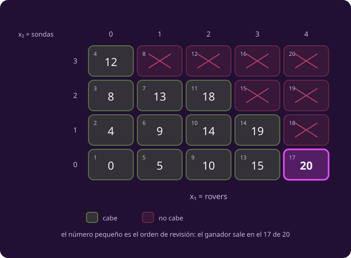

# Enumerar

**Si no puedo caminar por la región, ¿qué me queda?**

Vienes de [[el-modelo-del-taller|el modelo escrito]] · Aquí: el primer algoritmo
· Sigue: hacerlo listo.

Leer la lista entera. Es tosco y siempre funciona.

## 1 · La caja de candidatos

::: definition {#opt-caja title="Caja entera y conjunto factible"}
La **caja** $X$ son todos los valores que las variables pueden tomar por
separado: $X = \{l_1..u_1\}\times\cdots\times\{l_n..u_n\}$.

El **conjunto factible** $F$ son los de la caja que además cumplen $Ax\le b$.

Siempre $F \subseteq X$, y $X$ es el que se puede recorrer.
:::

**La caja no es un dato: se deduce del modelo.**

| Cota | De dónde sale |
|---|---|
| $x_1 \le 4$ | $6x_1 \le 6x_1 + 4x_2 \le 24$ |
| $x_2 \le 3$ | $2x_2 \le x_1 + 2x_2 \le 6$ |

Caja: $5 \times 4 = 20$ candidatos.

## 2 · Cómo usa el modelo

Cada pieza del planteamiento hace un trabajo, y solo uno:

| Pieza | Sirve para |
|---|---|
| Dominio y cotas | **Generar** los candidatos |
| $Ax \le b$ | **Filtrar** los que no se pueden |
| $c^{\mathsf T}x$ | **Comparar** los que quedan |

::: figure {#opt-flujo-enumerar title="Genera, filtra, compara"}

:::

El pseudocódigo es ese dibujo, sin dibujo:

```text
INPUT   max cᵀx  s.a.  Ax ≤ b,  l ≤ x ≤ u,  x entera.
OUTPUT  un óptimo x* y su valor, o «no hay factibles».

 1  mejor ← −∞ ;  x* ← «ninguno»
 2  X ← { l₁..u₁ } × … × { lₙ..uₙ }        ▷ la caja
 3  for each x in X
 4      if Ax ≤ b no se cumple: continue         ▷ filtra
 5      z ← cᵀx                                  ▷ compara
 6      if z > mejor
 7          mejor ← z ;  x* ← x                  ▷ guarda
 8  end for
 9  if x* = «ninguno»: return «no hay solución factible»
10  return x*, mejor
```

Y en Python es el mismo texto:

```python
mejor, x_mejor = -np.inf, None
for x in product(range(0, 5), range(0, 4)):      # la caja
    x = np.array(x)
    if np.any(A_ub @ x > b_ub):                  # filtra
        continue
    z = c @ x                                    # compara
    if z > mejor:
        mejor, x_mejor = z, x                    # guarda
```

::: definition {#opt-mejor-hasta-ahora title="La mejor hasta ahora"}
`mejor` guarda el valor de la mejor solución **factible** encontrada hasta ese
punto del recorrido. Empieza en $-\infty$ para que el primer factible siempre la
supere.

No es el óptimo mientras el recorrido no termine. Es lo mejor que llevas.
:::

## 3 · Los veinte candidatos

::: figure {#opt-rejilla title="La caja entera, con su valor"}

:::

|  | $x_1=0$ | 1 | 2 | 3 | 4 |
|---|---:|---:|---:|---:|---:|
| $x_2=3$ | 12 | ✗ | ✗ | ✗ | ✗ |
| $x_2=2$ | 8 | 13 | 18 | ✗ | ✗ |
| $x_2=1$ | 4 | 9 | 14 | 19 | ✗ |
| $x_2=0$ | 0 | 5 | 10 | 15 | **20** |

**13 factibles, 7 tachadas.** Y el recorrido, solo donde `mejor` se mueve:

| Candidato | $z$ | `mejor` |
|---|---:|---:|
| $(0,0)$ | 0 | 0 |
| $(0,1)$ | 4 | 4 |
| $(0,2)$ | 8 | 8 |
| $(0,3)$ | 12 | 12 |
| $(1,2)$ | 13 | 13 |
| $(2,1)$ | 14 | 14 |
| $(2,2)$ | 18 | 18 |
| $(3,1)$ | 19 | 19 |
| **$(4,0)$** | **20** | **20** |

**Respuesta: 4 rovers, ninguna sonda, 20 MB al día.** Única: la siguiente mejor
transmite 19.

## 4 · Qué cuesta

### La cuenta tiene dos factores

::: remark {#opt-costo-enumerar title="El costo de enumerar"}
$$T \;=\; \underbrace{\textstyle\prod_i (u_i - l_i + 1)}_{\text{cuántos candidatos}} \;\times\; \underbrace{O(mn)}_{\text{revisar uno}}$$

Si todas las variables tienen $k$ valores posibles, el primer factor es $k^n$.
Con variables 0/1, es $2^n$.

$n$ es el número de **variables**; $m$, el de **restricciones**.
:::

En el taller: 20 candidatos por dos restricciones de dos términos. Nada.

Ese $2^n$ ya lo contaste en [[contar-un-algoritmo|complejidad]], en abstracto.
Aquí tiene unidades: son planes de fabricación.

### Qué lo hace crecer, y cuánto

| Si agregas… | Al costo le pasa |
|---|---|
| Una restricción más | Sube **un poco**: un renglón más que revisar por candidato |
| Una variable más | Se **multiplica**. Con variables 0/1, se duplica |
| Datos más grandes | La caja se estira. Con 30 kg en vez de 24, $x_1$ llega a 5 y son **24 candidatos, no 20** |

El tercer renglón es el que sorprende: **la variante del cargamento no cambió el
modelo, pero sí cambió lo que cuesta resolverlo.** Enumerar paga por el tamaño
de los números, no solo por cuántos hay.

### La escalera

Con variables 0/1, a mil millones de candidatos por segundo:

| Variables | Candidatos | Tiempo |
|---:|---:|---|
| 10 | 1 024 | instantáneo |
| 20 | 1 millón | instantáneo |
| 30 | 1 000 millones | 1 segundo |
| 40 | 1.1 billones | 18 minutos |
| 50 | $10^{15}$ | 13 días |
| 60 | $1.2\times10^{18}$ | 36 años |

Lee la columna de la derecha hacia abajo: **cada diez variables, mil veces más.**
Y una sola variable más **duplica** el tiempo — de 40 a 41 variables cuesta más
que todo lo que llevabas hecho.

Compáralo con lo que ya conoces: simplex es exponencial **en el peor caso**, y en
la práctica da pocos pasos. Enumerar es exponencial **siempre**. No tiene casos
buenos.

### Dos cosas que no lo abaratan

| Lo que creerías que ayuda | Por qué no |
|---|---|
| Que casi todo sea infactible | Aquí se tiran 7 de 20 — pero se **generan y se revisan igual**. Filtrar descarta, no ahorra |
| Que el óptimo salga pronto | Salió en el candidato 17 de 20 y revisó los tres restantes. Si hubiera salido en el 1, habría revisado los otros 19 |

Las dos dicen lo mismo con palabras distintas: **el costo lo fija la caja, no el
problema.** Enumerar no aprende nada mientras avanza.

### Cuándo sí, cuándo no

| Úsalo | Evítalo |
|---|---|
| Hasta ~20 variables 0/1 | Pasando de 30 |
| Cuando necesitas certeza y hay tiempo | Cuando alguna variable no tiene cota superior: la caja es infinita y el método ni arranca |
| Cuando el objetivo es raro —no lineal, a trozos—: enumerar ni lo mira | Cuando los datos son grandes, aunque haya pocas variables |
| Como **oráculo**: para comprobar que otro algoritmo no miente | |

## Lo que hay que llevarse

- Genera, filtra, compara. Todo algoritmo de esta clase hace esas tres cosas; lo
  que cambia es cuántos candidatos se salta.
- Enumerar siempre acierta, y su certificado —«los vi todos»— cuesta exactamente
  lo mismo que buscar.
- Su costo lo fija el tamaño de la caja, no la dificultad del problema: no
  aprende nada mientras avanza, y por eso revisó tres planes después de haber
  encontrado el ganador.
