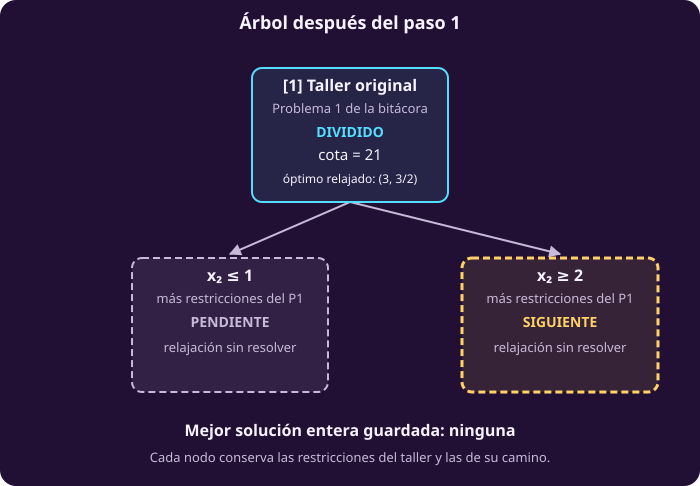
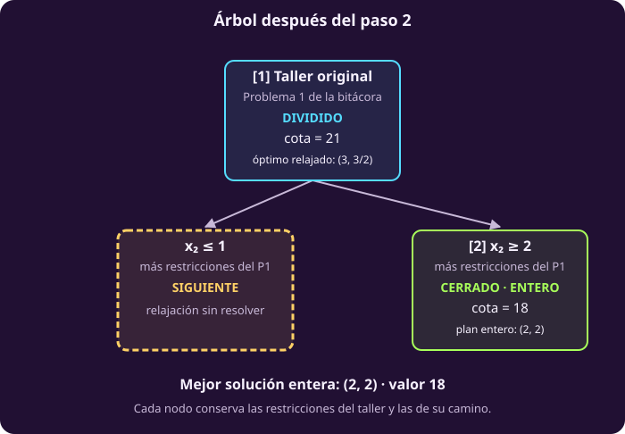

# Ramificar y acotar

**Problema activo: problema 1 · Taller original.** Retomamos el
[problema 1 de la bitácora](raya:la-bitacora-del-taller#raya-object-opt-ent-ej-modelo-base), sin los cambios de los problemas 2, 3 y 4.
$x_1$ cuenta rovers y $x_2$, sondas.
El problema que vamos a resolver es:

$$\begin{aligned}
\max\quad &5x_1+4x_2\\
\text{sujeto a}\quad &6x_1+4x_2\le24,\\
&x_1+2x_2\le6,\\
&0\le x_1\le4,\\
&0\le x_2\le3,\\
&x_1,x_2\in\mathbb Z.
\end{aligned}$$

Enumeración encontró el óptimo de 20 revisando los veinte candidatos.
**Nosotros ya conocemos ese resultado; el nuevo algoritmo comenzará sin él.**
Lo utilizaremos al final para comparar respuestas.

La pregunta es cómo descartar un grupo de candidatos sin revisarlos uno por
uno. Necesitamos un número que limite lo que cualquiera de ellos podría
conseguir.

## 1 · Permitir fracciones para construir un techo

Imagina que por un momento se pudieran fabricar fracciones de equipo. Mantén
los mismos recursos. Has agregado posibilidades: todos los planes enteros
siguen permitidos, junto con otros puntos nuevos.

::: definition {#opt-relajacion title="Relajación lineal"}
La **relajación lineal** conserva objetivo, restricciones y cotas, pero permite
valores reales en las variables que eran enteras.

Con $c$ como coeficientes del objetivo, $A$ y $b$ como restricciones y $l,u$
como límites de las variables, pasa de

$$\begin{aligned}
\max\quad &c^{\mathsf T}x\\
\text{sujeto a}\quad &Ax\le b,\\
&l\le x\le u,\\
&x\in\mathbb Z^n
\end{aligned}$$

a las mismas condiciones con $x\in\mathbb R^n$.

Es un problema lineal continuo: podemos resolverlo con los métodos de la
clase 2, como simplex.
:::

### Obtener un punto y demostrar que es el mejor de la relajación

En el taller, el cruce de los dos límites de recursos satisface

$$6x_1+4x_2=24,\qquad x_1+2x_2=6.$$

Dividir la primera ecuación entre dos y restar la segunda da $2x_1=6$.
Por tanto, $x_1=3$ y $x_2=3/2$. Este punto cumple las cotas y tiene valor
$5(3)+4(3/2)=21$.

**Encontrar un punto de valor 21 todavía no demuestra que nadie supere 21.**
Para comprobarlo, multiplicamos las restricciones por números no negativos y
las sumamos:

| Restricción multiplicada | Desigualdad que obtenemos |
|---|---|
| Aleación por $3/4$ | $(9/2)x_1+3x_2\le18$ |
| Calibración por $1/2$ | $(1/2)x_1+x_2\le3$ |
| Suma | **$5x_1+4x_2\le21$** |

No hace falta adivinar esos multiplicadores para seguir el algoritmo. Aquí
sirven como **certificado que puedes comprobar**: cualquier punto que cumpla
los recursos tiene valor a lo más 21. Como encontramos uno que alcanza 21,
queda demostrado el óptimo de la relajación.

### Por qué el techo también vale para los enteros

Llamemos $F$ al conjunto de planes enteros factibles y $R$ a la región factible
de la relajación. Como solo retiramos la integralidad, $F\subseteq R$.

Si ningún punto de $R$ supera 21, tampoco lo hace ningún punto de $F$.
Cuando ambos problemas tienen solución óptima, esto se escribe

$$\max_{x\in F}c^{\mathsf T}x\;\le\;\max_{x\in R}c^{\mathsf T}x.$$

Si $F$ está vacío, no hay óptimo entero que comparar; ese caso se detectará
por separado.

En la figura, localiza el punto fraccionario y los puntos enteros. ¿Por qué el
primero puede ayudar aunque no sea una decisión fabricable?

::: figure {#opt-relajacion-corte title="El óptimo relajado da una cota"}

:::

El punto fraccionario no es una respuesta al taller, pero su **valor óptimo**
limita lo que cualquier plan entero puede lograr. La figura también muestra
el óptimo entero ya conocido por enumeración; no lo usaremos para inicializar
el algoritmo.

::: definition {#opt-cota-relajacion title="Cota superior"}
Una **cota superior** $U$ cumple $c^{\mathsf T}x\le U$ para todo plan entero
factible del problema considerado.

Si ya tenemos una solución factible de valor `mejor` y un subproblema tiene
cota $U\le\texttt{mejor}$, ese subproblema no puede mejorar nuestra respuesta.
Podemos dejar de explorarlo cuando buscamos un óptimo.
:::

::: exercise {#opt-ent-ej-punto-cota title="Distingue un punto de un techo"}
¿Un punto factible de la relajación de valor 19 sería, por sí solo, una cota
superior? Explica qué información te falta para afirmarlo.
:::

::: answer {#opt-ent-resp-punto-cota of="opt-ent-ej-punto-cota"}
No. Podría existir otro punto relajado mejor. Necesitamos justificar que ningún
punto puede superar ese valor. En el taller sí certificamos un techo de 21 y
encontramos un punto que lo alcanza; por eso sabemos que es el óptimo relajado.
:::

## 2 · Dividir sin perder planes enteros

**Estamos aquí:** la relajación del taller dio $(3,3/2)$, valor 21. La cantidad
de sondas no es entera. Queremos excluir ese punto conservando todos los planes
enteros posibles.

Una cantidad entera de sondas cumple exactamente una de estas condiciones:

| Primera posibilidad | Segunda posibilidad |
|---|---|
| Una sonda o menos: $x_2\le1$ | Dos sondas o más: $x_2\ge2$ |

Creamos **dos problemas separados**. En cada uno mantenemos el objetivo y
**todas** las restricciones del taller, y agregamos una de las dos condiciones.
Es una alternativa «o»: imponer ambas en el mismo problema sería imposible.

**No estamos probando solamente $x_2=1$ y $x_2=2$.** Dentro de la caja del
taller, el primer grupo incluye $x_2=0,1$ y el segundo, $x_2=2,3$, junto con
las posibles cantidades de rovers. Piso y techo sirven para separar grupos
completos, no para recorrer los enteros uno por uno.

Observa en la figura la franja que queda fuera. ¿Contiene algún punto entero?

::: figure {#opt-ramas title="La división conserva todos los planes enteros"}

:::

No hay enteros estrictamente entre 1 y 2. Por eso ningún plan entero se pierde.
El punto $(3,3/2)$ sí queda excluido, así que las nuevas relajaciones tendrán
que buscar su respuesta en otras partes de la región.

### Expresar la división para cualquier coordenada fraccionaria

Llamaremos $\bar x$ al **punto óptimo de la relajación**. La barra distingue su
origen; no significa que todas sus coordenadas sean fraccionarias. En el taller,
$\bar x_1=3$ es entera y $\bar x_2=3/2$ no lo es.

Para un número $a$, el **piso** $\lfloor a\rfloor$ es el mayor entero que no
lo supera; el **techo** $\lceil a\rceil$ es el menor entero que no queda debajo.
Por ejemplo, $\lfloor3/2\rfloor=1$ y $\lceil3/2\rceil=2$.

Elegimos una coordenada fraccionaria $j$ y creamos las alternativas

$$x_j\le\lfloor\bar x_j\rfloor
\qquad\text{o}\qquad
x_j\ge\lceil\bar x_j\rceil.$$

Partimos por **una** variable a la vez. Al resolver cada nuevo problema se
recalculan todas las coordenadas: otras variables pueden volverse enteras o
seguir fraccionarias. En un modelo mixto solo se exigiría esta comprobación a
las variables declaradas enteras; aquí todas lo son.

::: definition {#opt-subproblema title="Subproblema"}
Un **subproblema** conserva el objetivo y las restricciones originales y añade
las decisiones de división que llevaron hasta él.

En nuestra ramificación, esas decisiones se representan ajustando los límites
$l\le x\le u$. Ninguna restricción anterior se elimina al volver a dividir.
:::

### Los subproblemas forman un árbol

Cada división produce dos subproblemas. Si alguno vuelve a dividirse, produce
otros dos. Esa relación forma un árbol binario.

| Nombre | Qué significa aquí |
|---|---|
| Raíz | El problema original |
| Nodo | Un subproblema |
| Hijos | Los dos subproblemas que resultan de dividir un nodo |
| Hoja | Un nodo que no se ha dividido |
| Rama | Un nodo y sus posibles descendientes, en esta exposición |
| Abrir o procesar un nodo | Resolver su relajación y decidir qué hacer |

Localiza en el dibujo un nodo y sus dos hijos; después identifica lo que queda
incluido al referirnos a toda una rama.

::: figure {#opt-arbol-vocabulario title="El vocabulario del árbol"}

:::

Cada nodo representa un **problema completo**, no un candidato individual.
Esa diferencia permitirá resolver o descartar grupos enteros de candidatos.

## 3 · Preparar el estado antes de recorrer el árbol

**Regresamos al problema 1 · Taller original.** El nuevo algoritmo todavía no tiene una
solución entera guardada. Necesita recordar la mejor que encuentre y los
subproblemas que quedan pendientes.

::: definition {#opt-nodos-vivos title="Lista de nodos vivos"}
La lista $L$ contiene los subproblemas creados y todavía sin procesar: los
**nodos vivos**. Cada elemento conserva sus límites de variables y, con ellos,
las decisiones heredadas. Las restricciones originales siempre se mantienen.

Inicialmente solo está el problema original. Para procesar un nodo lo sacamos
de $L$. Si lo dividimos, añadimos sus dos hijos; si lo cerramos, no añadimos nada.
:::

Usaremos una **pila**: sale primero el último elemento que entró. Si anotamos
$[a,b]$, procesamos $b$ antes que $a$. En las tablas, **el último de la derecha
sale primero**.

| Decisión del recorrido | Regla que usaremos |
|---|---|
| Elegir pendiente | Sacar el último de la pila |
| Orden de entrada de los hijos | Primero el de $\le$; después el de $\ge$ |
| Elegir variable si varias son fraccionarias | La primera según el orden de las variables |

Conservamos los nombres de enumeración: $x^*$ es la mejor solución entera
factible encontrada y `mejor`, su valor. Arrancamos con $x^*=$ «ninguno» y
`mejor` $=-\infty$.

Para cada relajación, $\bar x$ será su punto óptimo y
$\bar z=c^{\mathsf T}\bar x$, su valor. **El punto propone cantidades; el
valor da una cota.**

## 4 · Resolver el taller paso a paso

Construiremos el árbol conforme resolvamos sus nodos. Cada recuadro representa
un **subproblema completo**, no un candidato. Los números entre corchetes
indican el **orden de procesamiento**: comenzamos con la raíz [1]; los demás
nodos recibirán su número cuando les toque procesarse.

En cada división, la condición $\le$ queda a la izquierda y la condición
$\ge$, a la derecha. Mantendremos esas posiciones en todos los dibujos.
Las palabras dentro de los recuadros indican qué sabemos hasta ese momento:

| Estado | Cómo leerlo |
|---|---|
| POR RESOLVER | Comenzamos aquí: falta resolver la raíz |
| SIGUIENTE | Es el próximo subproblema que vamos a resolver |
| PENDIENTE | Está creado, pero todavía no lo procesamos |
| DIVIDIDO | Sus dos hijos cubren sus posibilidades enteras |
| CERRADO | Ya no exploraremos este subproblema |

::: figure {#opt-ent-arbol-paso-0 title="Al comenzar solo tenemos la raíz"}

:::

### Primer nodo: procesar el problema original

Ya calculamos su relajación: $\bar x=(3,3/2)$ y $\bar z=21$. No es una
solución entera; dividimos por $x_2$.

```text
Pendientes antes:   [original]
Pendientes después: [x₂ ≤ 1, x₂ ≥ 2]
Solución guardada:  ninguna
```

Todos los elementos de esa pila incluyen también las restricciones originales.
Procesaremos primero $x_2\ge2$ por ser el último que entró.

::: figure {#opt-ent-arbol-paso-1 title="Dividimos la raíz y elegimos el hijo derecho"}

:::

### Segundo nodo: dos sondas o más

Bajamos al hijo derecho de la raíz: ahora recibe el número [2]. Todavía no
tenemos una solución entera guardada. El subproblema agrega
$x_2\ge2$ a las restricciones del taller. Su relajación tiene óptimo
$(2,2)$, valor 18. Puedes comprobar el techo usando la calibración:

$$5x_1+4x_2\le5(6-2x_2)+4x_2=30-6x_2\le18.$$

El punto $(2,2)$ cumple los recursos y alcanza ese valor. **Es entero**, así
que también resuelve el subproblema entero. Lo guardamos y cerramos este nodo.

```text
Pendientes:        [x₂ ≤ 1]
Solución guardada: (2, 2)
mejor:             18
```

Cerrar aquí no demuestra que 18 sea el óptimo del taller completo: todavía hay
otro subproblema pendiente.

::: figure {#opt-ent-arbol-paso-2 title="Cerramos el hijo derecho y volvemos al izquierdo"}

:::

### Tercer nodo: una sonda o menos

Volvemos al hijo izquierdo de la raíz: ahora recibe el número [3].
Conservamos $(2,2)$, valor 18. Sacamos el pendiente $x_2\le1$ del taller
original. Su relajación da
$\bar x=(10/3,1)$, valor $\bar z=62/3\approx20.67$.

Ahora sí podemos utilizar la restricción nueva para certificar su cota:

$$5x_1+4x_2=\frac56(6x_1+4x_2)+\frac23x_2
\le\frac56(24)+\frac23(1)=\frac{62}{3}.$$

**Antes de seguir:** tenemos un plan entero de valor 18 y este subproblema
tiene cota $62/3$. ¿Podemos cerrarlo por cota? ¿Esa cota demuestra que existe
un plan entero mejor que el guardado?

El punto $(10/3,1)$ cumple el subproblema y alcanza el techo. Como
$62/3>18$, la cota **no permite descartarlo**. No asegura que haya un entero
mejor: solo dice que todavía no hemos demostrado lo contrario.

La cantidad de rovers es fraccionaria. Dividimos con $x_1\le3$ o $x_1\ge4$.
Ambos hijos **heredan $x_2\le1$**.

```text
Pendientes: [x₂ ≤ 1 y x₁ ≤ 3, x₂ ≤ 1 y x₁ ≥ 4]
Solución guardada: (2, 2), valor 18
```

::: figure {#opt-ent-arbol-paso-3 title="Dividimos el nodo izquierdo y elegimos su hijo derecho"}

:::

### Cuarto nodo: una sonda o menos y al menos cuatro rovers

Bajamos al hijo derecho del nodo [3]: ahora recibe el número [4].
Seguimos guardando $(2,2)$, valor 18. El último pendiente que entró agrega
$x_1\ge4$ y conserva $x_2\le1$. Con los 24 kg de
aleación y la no negatividad, solo cabe $(4,0)$. Su relajación, por tanto,
también tiene ese óptimo, de valor 20.

Es una solución entera mejor que 18. Actualizamos:

```text
Pendientes:        [x₂ ≤ 1 y x₁ ≤ 3]
Solución guardada: (4, 0)
mejor:             20
```

El nodo [4] queda cerrado porque su óptimo relajado es entero. Solo falta
procesar su hermano izquierdo.

::: figure {#opt-ent-arbol-paso-4 title="Guardamos 20 y queda un subproblema por resolver"}

:::

### Quinto nodo: decidir si lo pendiente puede mejorar

Volvemos al hijo izquierdo del nodo [3]. Es el último pendiente y recibe el
número [5] al procesarlo. Usa la información del ejercicio para decidir qué
estado debe mostrar al terminar.

::: exercise {#opt-ent-ej-cierre-taller title="Toma la última decisión"}
Queda el subproblema con $x_2\le1$ y $x_1\le3$, además de las restricciones
originales. Su relajación tiene óptimo $(3,1)$ y cota 19.

Ya guardamos $(4,0)$, valor 20. ¿Debemos dividir, guardar otro plan o cerrar?
¿Qué queda en la pila? Justifica sin enumerar los candidatos de este nodo.
:::

::: answer {#opt-ent-resp-cierre-taller of="opt-ent-ej-cierre-taller"}
Cerramos **por cota**, pues $19\le20$. Ningún plan entero del subproblema
puede mejorar el registro. Conservamos $(4,0)$ y 20.

El nodo salió de la pila al procesarlo y no añadimos hijos: no quedan
pendientes. El algoritmo termina con cuatro rovers y ninguna sonda.
:::

El argumento es comparar un **techo del subproblema** con el **valor de un plan
factible que ya tenemos**. Son dos cantidades de naturaleza distinta. La
relajación de este nodo también es entera; con nuestro orden de comprobaciones,
la comparación por cota ya basta para cerrarlo.

### Reunir el recorrido completo

Ahora sigue en el dibujo los números de procesamiento, no el orden de
izquierda a derecha.

::: figure {#opt-arbol title="El árbol completo del taller"}

:::

La tabla recupera las restricciones heredadas y el registro después de cada
paso. La cota corresponde al subproblema de esa fila; el registro conserva la
mejor solución entera encontrada en todo el recorrido.

| Orden | Condiciones adicionales al taller | Óptimo relajado | Cota local | Acción y valor guardado |
|---:|---|---|---:|---|
| 1 | Ninguna | $(3,3/2)$ | 21 | Dividir por $x_2$; sin solución guardada |
| 2 | $x_2\ge2$ | $(2,2)$ | 18 | Guardar 18; cerrar |
| 3 | $x_2\le1$ | $(10/3,1)$ | $62/3$ | Dividir por $x_1$; conservar 18 |
| 4 | $x_2\le1,\ x_1\ge4$ | $(4,0)$ | 20 | Guardar 20; cerrar |
| 5 | $x_2\le1,\ x_1\le3$ | $(3,1)$ | 19 | Cerrar por cota; conservar 20 |

Las tres hojas cubren la caja de veinte candidatos sin solaparse:

| Hoja | Candidatos de la caja que contiene |
|---|---:|
| $x_2\ge2$ | $5\cdot2=10$ |
| $x_2\le1,\ x_1\ge4$ | $1\cdot2=2$ |
| $x_2\le1,\ x_1\le3$ | $4\cdot2=8$ |

Son **candidatos de la caja**, no veinte factibles. En la última hoja no
enumeramos individualmente los ocho: una relajación y la comparación
$19\le20$ permiten cerrar el subproblema completo.

## 5 · Reconocer todas las formas de cerrar

**No necesitamos encontrar el óptimo entero de cada nodo para cerrarlo.**
Una cota de su relajación puede bastar, aunque la solución relajada tenga
fracciones. Seguimos maximizando y buscando **una** solución óptima.

El taller mostró una solución relajada entera y una cota que no mejora. Falta
una tercera posibilidad: que la relajación no tenga ningún punto factible.

Considera por un momento $\max x$, con $x$ entera,
$1/2\le x\le3/2$ y una caja inicial holgada $0\le x\le2$. Conservamos las dos
desigualdades fraccionarias como restricciones. La relajación da $x=3/2$.

| Hijo | Qué ocurre |
|---|---|
| $x\ge2$ | Es incompatible con $x\le3/2$: relajación infactible |
| $x\le1$ | La relajación tiene óptimo entero $x=1$ |

Si ni siquiera permitiendo fracciones cabe un punto, tampoco puede caber uno
entero. Así se justifica el cierre por infactibilidad.

::: definition {#opt-poda title="Cerrar un nodo y podar"}
**Cerrar** un nodo significa terminar su exploración sin crear hijos. Hay tres
justificaciones:

| Motivo | Evidencia necesaria | Qué permite concluir |
|---|---|---|
| Infactibilidad | Su relajación es infactible | No contiene ningún plan entero factible |
| Cota | Su cota no supera el valor de una solución **entera factible** guardada | No puede mejorar nuestra respuesta, aunque no conozcamos su óptimo entero |
| Integralidad | Un **óptimo** de su relajación es entero | Ese punto también es óptimo del subproblema entero |

Llamaremos **poda por cota** o **por infactibilidad** a los dos primeros
cierres. El tercero resuelve el subproblema; también se encuentra descrito como
poda por integralidad en otras presentaciones.
:::

### Cerrar por cota sin encontrar el óptimo entero del nodo

**Ejemplo independiente del taller.** En un problema de maximización ya
guardamos una solución entera factible de valor **100**. Otro nodo tiene
óptimo relajado fraccionario de valor **97.5**. Podemos cerrarlo:

$$\underbrace{c^{\mathsf T}x}_{\text{cualquier entero factible de este nodo}}
\;\le\;97.5\;<\;100.$$

**No averiguamos cuál es el mejor entero de ese nodo.** Basta demostrar que
ninguno supera el plan factible guardado, aunque ese plan venga de otro nodo.

Una cota de 105 no permitiría cerrar ni garantizaría que exista una mejora.
Sin un plan entero guardado no podemos usar esta comparación.

La igualdad también permite cerrar si buscamos **un** óptimo. Si buscáramos
todas las soluciones empatadas, no descartaríamos un nodo solo por igualar
el valor guardado. Certificamos el óptimo global cuando ya no queda ningún
nodo que pueda mejorarlo.

Encontrar **cualquier** punto entero no basta para cerrar por integralidad:
debe ser un óptimo de la relajación. Y una relajación fraccionaria no demuestra
infactibilidad entera: en la raíz del taller había trece planes enteros posibles.

### Cambiar el rendimiento del rover

::: exercise {#opt-ent-ej-rover-tres title="El rover transmite menos"}
En el árbol anterior, el último nodo podía cerrarse por cota y además tenía
óptimo relajado entero. Ahora comprobaremos que las fracciones no obligan a
dividir.

Conserva los recursos y dominios del taller, pero cambia el rendimiento del
rover de 5 a **3 MB/día**. El objetivo es ahora $3x_1+4x_2$.

**Comienza una búsqueda nueva:** la pila contiene solo el problema con este
objetivo y no hay solución guardada. No arrastres el registro 20 del taller
anterior. Procesa primero el hijo de $\ge$. Puedes usar estos óptimos de las
relajaciones:

| Subproblema | Punto óptimo relajado | Valor |
|---|---|---:|
| Original | $(3,3/2)$ | 15 |
| $x_2\ge2$ | $(2,2)$ | 14 |
| $x_2\le1$ | $(10/3,1)$ | 14 |

Anota la pila y el registro después de cada nodo. **Antes de abrir la
respuesta:** en el último nodo, la solución relajada tiene fracciones y su
valor iguala el registro. ¿Cerramos o dividimos? Justifica la decisión.
:::

::: answer {#opt-ent-resp-rover-tres of="opt-ent-ej-rover-tres"}
| Después de procesar | Pendientes, último a la derecha | Registro |
|---|---|---|
| Original | $[x_2\le1,\ x_2\ge2]$ | Ninguno |
| $x_2\ge2$ | $[x_2\le1]$ | $(2,2)$, valor 14 |
| $x_2\le1$ | Vacía | $(2,2)$, valor 14 |

El último nodo se cierra porque su cota 14 no supera `mejor` $=14$. Aunque
$(10/3,1)$ tiene fracciones, ningún plan entero de ese subproblema puede
mejorar el plan $(2,2)$ que ya guardamos. No hace falta dividirlo.

La igualdad es entre **la cota y el valor guardado**; no demuestra que haya
otro plan entero de valor 14. Buscamos un óptimo y ya no quedan pendientes:
el resultado es dos rovers y dos sondas, de valor 14.

Aquí la cota de la raíz también puede comprobarse sumando $1/4$ de la
restricción de aleación y $3/2$ de la de calibración: da
$3x_1+4x_2\le15$. Para $x_2\le1$, la aleación da
$3x_1+4x_2\le12+2x_2\le14$. Los puntos dados alcanzan esos techos.
:::

## 6 · Generalizar el algoritmo

**Ahora reunimos lo que ya hicimos.** El algoritmo sirve para ambos objetivos
trabajados; en cada ejecución conservamos el objetivo elegido. La caja inicial
tiene límites enteros finitos, las restricciones se heredan y buscamos una
solución óptima.

| Nombre | Qué guarda |
|---|---|
| $L$ | Pila de subproblemas pendientes |
| $P$ | Subproblema que acabamos de sacar de la pila |
| $\bar x$ | Punto óptimo de la relajación de $P$ |
| $\bar z$ | Valor de ese punto; cota superior de $P$ |
| $x^*$ | Mejor solución entera factible encontrada, o «ninguno» |
| `mejor` | Valor de $x^*$, o $-\infty$ si no existe aún |

Las variables de $x^*$ son enteras; su **valor** puede ser fraccionario si los
coeficientes del objetivo lo son. Hasta terminar, $x^*$ es la mejor solución
encontrada, no un óptimo global ya certificado.

```text
INPUT   max cᵀx  s.a.  Ax ≤ b,  l ≤ x ≤ u,  x entera.
        l y u son enteros finitos; l ≤ u.
OUTPUT  un óptimo x* y su valor, o «no hay factibles».

 1  mejor ← −∞ ;  x* ← «ninguno»
 2  L ← [el problema original]
 3  while L no esté vacía
 4      P ← saca el último nodo de L
 5      if la relajación de P es infactible: continue
 6      x̄, z̄ ← óptimo de la relajación de P
 7      if z̄ ≤ mejor: continue
 8      if x̄ es entera
 9          mejor ← z̄ ; x* ← x̄ ; continue
10      elige la primera coordenada j con x̄ⱼ fraccionaria
11      añade a L primero P con xⱼ ≤ ⌊x̄ⱼ⌋, después P con xⱼ ≥ ⌈x̄ⱼ⌉
12  end while
13  return x*, mejor       ▷ si x* es «ninguno», no hay factibles
```

Las líneas 5 y 6 usan el estado y, cuando existe, el óptimo de **una misma
resolución** de la relajación. La caja finita garantiza que una relajación
factible tenga óptimo finito. Un problema no acotado exigiría otro tratamiento;
no se confunde con uno infactible.

La línea 7 va antes de actualizar el registro: una solución entera peor o
empatada no lo sustituye. Para devolver todos los óptimos habría que cambiar
el manejo de empates y de cierres por igualdad.

En el flujo, localiza las tres decisiones que regresan al ciclo sin dividir.
Las etiquetas `[Ln]` corresponden al pseudocódigo.

::: figure {#opt-flujo-ramificar title="Las decisiones del ciclo"}

:::

El diagrama muestra que **tener fracciones no obliga por sí solo a dividir**.
Antes se comprueba si la cota permite cerrar el nodo.

::: definition {#opt-bnb title="Ramificar y acotar"}
**Ramificar y acotar**, o *branch and bound*, mantiene subproblemas pendientes,
obtiene cotas mediante sus relajaciones y divide los que todavía podrían
mejorar la solución guardada y no quedan resueltos por integralidad.

El algoritmo combina dos trabajos: resolver problemas lineales y decidir qué
partes de la búsqueda necesitan más exploración.
:::

### Por qué sus descartes son seguros

Hay que justificar cada decisión, no solo comprobar que el taller termina en 20.

1. **Dividir conserva los planes enteros.** Una coordenada entera satisface
   una de las dos alternativas del corte; ambas heredan las restricciones.
2. **Cerrar por infactibilidad no pierde factibles.** Los puntos enteros
   factibles son un subconjunto de los relajados.
3. **Cerrar por cota no pierde una mejora.** Todo plan del nodo vale a lo más
   su cota, que ya no supera una solución factible disponible.
4. **Cerrar por integralidad resuelve el nodo.** El óptimo relajado entero es
   factible para el problema entero y ningún punto entero puede superarlo.

El registro siempre contiene una solución factible, cuando ya encontramos
alguna. Los subproblemas pendientes cubren todo plan que todavía podría
mejorarla y no ha sido resuelto. Cuando no queda ninguno, la solución guardada
es globalmente óptima; si no se encontró ninguna, el problema es infactible.

### Por qué termina en una caja finita

Cada división reduce en al menos uno la amplitud $u_j-l_j$ de la variable
seleccionada en cada hijo. Las amplitudes son enteras no negativas y nunca
crecen. Por eso la profundidad de cualquier camino está acotada por
$\sum_j(u_j-l_j)$ de la caja inicial.

El árbol es binario y tiene profundidad finita: contiene un número finito de
nodos. No estamos prometiendo que sean pocos; estamos probando terminación.

## 7 · Practicar las decisiones

### Resolver el mismo caso pequeño que enumeración

::: exercise {#opt-ent-ej-comun-ram title="Resolver el caso pequeño con ramificación"}
Recupera el modelo $\max 2x$, con $x$ entera y $1/2\le x\le5/2$.
Como en enumeración, usa la caja holgada $0\le x\le3$ y conserva las dos
desigualdades como restricciones, sin ajustar antes las cotas a enteros.

Escribe la relajación inicial, la división, el orden de los hijos y cómo
termina cada uno. Arranca sin solución guardada y procesa primero el de $\ge$.
¿Cuántas relajaciones resuelves y qué certifica tu respuesta?
:::

::: answer {#opt-ent-resp-comun-ram of="opt-ent-ej-comun-ram"}
| Nodo | Resultado relajado | Decisión |
|---|---|---|
| Original | $x=5/2$, valor 5 | Dividir en $x\le2$ o $x\ge3$ |
| $x\ge3$ | Infactible por $x\le5/2$ | Cerrar; no hay solución guardada aún |
| $x\le2$ | $x=2$, valor 4 | Guardar la solución entera y cerrar |

Se resuelven tres relajaciones. La pila queda vacía y el óptimo es $x=2$,
valor 4, como en enumeración. Un hijo no contiene factibles y el otro ya quedó
resuelto; no queda un lugar donde encontrar una mejora.
:::

## 8 · Comparar trabajo y costo

**El ahorro posible está en descartar grupos, no en revisar más rápido cada
vector.** Por ejemplo, con 100 decisiones binarias hay $2^{100}$ candidatos.
Un nodo que fija diez decisiones y deja libres las otras noventa representa
una caja de $2^{90}$ candidatos. Si una cota demuestra que ninguno mejora
lo guardado, cerramos todo ese grupo sin enumerarlo. No hay garantía de que
encontremos una cota así de útil.

En enumeración, dejar de revisar un vector cuando viola una restricción
ahorra trabajo sobre **ese vector**. Si además descartamos todas las
continuaciones de una asignación parcial, ya estamos podando grupos por
restricciones. Branch and bound añade la posibilidad de descartar grupos
que sí contienen soluciones factibles, porque **ninguna puede mejorar el
valor guardado**.

**Regresamos al problema 1 · Taller original:** enumeración revisó 20 candidatos y branch
and bound procesó 5 nodos. Cada nodo exigió resolver una relajación completa.
Esas cuentas no miden operaciones del mismo costo.

Si $N$ es el número de nodos procesados y $C_k$ es el costo de resolver la
relajación del nodo $k$, podemos separar

$$T_{\mathrm{ram}}=\sum_{k=1}^{N}C_k+C_{\mathrm{gestión}},$$

donde $C_{\mathrm{gestión}}$ incluye manejar pendientes, límites y registro.
El costo de las relajaciones depende de sus datos y del método de solución.
No asignamos un costo universal a cada pivote de simplex.

| Enumeración presentada | Ramificar y acotar |
|---|---|
| Revisa toda la caja elegida | Puede cerrar subproblemas completos |
| Evalúa restricciones y objetivo en candidatos | Resuelve relajaciones para obtener cotas |
| Encontrar pronto el ganador no detiene su ciclo | Encontrar pronto una buena solución puede permitir más cierres por cota |
| El tamaño de la caja determina cuántos candidatos revisa | El número de nodos depende del modelo y de las decisiones de búsqueda |

**¿Cuándo puede convenir cada uno?**

- **Ramificar y acotar puede ganar** si encuentra pronto buenas soluciones
  enteras y cotas útiles: el trabajo de resolver relajaciones se compensa
  evitando muchos candidatos.
- **Enumerar puede ganar** si la caja es pequeña o comprobar candidatos es
  muy barato. Con cotas poco útiles, branch and bound puede abrir muchos
  nodos y pagar además el costo de sus relajaciones. Su peor caso sigue
  siendo exponencial; no garantiza una mejora de tiempo.

::: exercise {#opt-ent-ej-costo-comun title="Menos pasos, pero pasos más caros"}
Ahora compara el modelo de una variable, $\max 2x$ con
$1/2\le x\le5/2$: enumeración revisó **cuatro candidatos** y ramificar
resolvió **tres relajaciones**. Supón que revisar un candidato cuesta una unidad
de trabajo y resolver una relajación, diez unidades. Son costos hipotéticos.
¿Cuánto cuesta cada método antes de contar la gestión de la pila? ¿Cuál gana?
:::

::: answer {#opt-ent-resp-costo-comun of="opt-ent-ej-costo-comun"}
Enumeración: $4\cdot1=4$ unidades. Las relajaciones de branch and bound:
$3\cdot10=30$ unidades, más gestión. En este supuesto gana enumeración.

Comparar cuatro candidatos contra tres nodos no bastaba para decidirlo. En una
caja mucho mayor, evitar suficientes candidatos puede compensar el costo de
las relajaciones; no hay un umbral de velocidad universal.
:::

### Qué puede ayudar a cerrar antes

Una solución factible de mayor valor permite descartar más cotas. Una
formulación cuya relajación se acerca al óptimo entero puede producir cotas
más útiles. Una vez escrito el modelo completo, estudiar límites más
ajustados puede ayudar a resolverlo. Todo ajuste debe conservar las
soluciones del problema; no basta con elegir un número más pequeño.

Pero **pocos factibles enteros no implican relajaciones infactibles**. Por
ejemplo, dos variables binarias con $x_1+x_2=1/2$ no tienen solución entera,
aunque admiten el punto relajado $(1/2,0)$. La infactibilidad ayuda a cerrar
cuando se puede demostrar para un subproblema completo.

Agregar restricciones o ajustar una formulación puede mejorar las cotas,
pero también cambia el esfuerzo de resolver los problemas lineales. Ninguna
de esas medidas garantiza por sí sola menos tiempo total.

**Punto de parada:** ya puedes ejecutar los dos algoritmos, justificar sus
cierres y comparar cantidad de pasos con costo por paso. Las siguientes dos
ampliaciones explican garantías adicionales; el procedimiento principal ya
está completo.

## 9 · Ampliaciones: tamaño del árbol y margen

Ahora separaremos **dos preguntas distintas**:

| Pregunta | Qué vamos a contar o comparar |
|---|---|
| ¿Cuántos nodos podría exigir el algoritmo? | El tamaño máximo del árbol para una caja finita |
| Si paramos antes, ¿cuánto podría mejorar la solución guardada? | Su valor y las cotas que todavía tienen los pendientes |

Seguimos en el caso ideal presentado: una caja inicial no vacía con límites
enteros finitos, relajaciones resueltas exactamente y búsqueda de **una**
solución óptima.

### Contar hojas antes de contar todos los nodos

Llamamos $X$ al conjunto de candidatos de la caja inicial y $|X|$ a su
cantidad. Primero usa una caja pequeña: una variable entera con candidatos
$X=\{0,1,2,3\}$, de modo que $|X|=4$. Para entender la cuenta, imagina estas dos divisiones de
cajas, sin decidir todavía qué candidatos cumplen las demás restricciones:

```text
                    {0, 1, 2, 3}
                     /        \
                  {0, 1}     {2, 3}
                   /   \
                 {0}   {1}
```

Hay **tres hojas**: las cajas $\{0\}$, $\{1\}$ y $\{2,3\}$. Hay **dos nodos
divididos**: la raíz y su hijo izquierdo. En total contamos **cinco nodos**.
La hoja $\{2,3\}$ contiene dos candidatos: una hoja no tiene que representar
un solo punto.

¿Por qué no puede haber más hojas que candidatos de la caja inicial?

1. Los hijos separan los candidatos del padre sin repetir ninguno.
2. Cada caja hija contiene al menos un candidato entero. El corte entre piso
   y techo se hace dentro de los límites enteros del padre.
3. Por tanto, las hojas contienen grupos distintos y no vacíos de candidatos.
   Con cuatro candidatos podemos tener, como máximo, cuatro hojas.

**Candidato de la caja no significa punto factible del modelo.** Una hoja
puede no contener ningún plan que cumpla los recursos y cerrarse por
infactibilidad. Aun así, su caja contiene candidatos y cuenta como una hoja.

Ahora cuenta las divisiones. Al comenzar hay una hoja: la raíz. Cada división
convierte una hoja en un nodo con dos hijos: desaparece una hoja y aparecen
dos. El total de hojas aumenta en uno. Para terminar con $h$ hojas hicieron
falta $h-1$ divisiones; esos son exactamente los nodos internos.

Así obtenemos la cuenta completa:

$$\underbrace{h}_{\text{hojas}}+
\underbrace{(h-1)}_{\text{nodos internos}}=2h-1
\quad\text{nodos en total}.$$

**Apliquémoslo al taller.** Su caja contiene cinco cantidades posibles de
rovers y cuatro de sondas: $|X|=5\cdot4=20$ candidatos. Usamos esos **20**, no
los 13 planes que además cumplen los recursos. Hay a lo más 20 hojas y, por
tanto, a lo más $2(20)-1=39$ nodos.

El recorrido que hicimos tuvo tres hojas y dos nodos internos: **cinco nodos
reales**. El 39 es un límite superior; no afirma que el taller lo necesite ni
que podamos alcanzarlo cambiando el orden de búsqueda.

En general, si $N$ cuenta todos los nodos procesados al terminar, obtenemos

$$h\le|X|\qquad\Longrightarrow\qquad N=2h-1\le2|X|-1.$$

Con $n$ variables binarias hay $2^n$ candidatos en la caja. El límite anterior
crece exponencialmente con $n$: demostrar terminación no garantiza un árbol
pequeño. Tampoco convierte nodos en segundos. Cada nodo exige una relajación,
y el costo de resolverla puede variar, como vimos en la sección anterior.

### Si paramos antes: cuánto podría mejorar lo que guardamos

Aquí cambiamos de pregunta. **Ya tenemos un plan fabricable y queremos saber
qué tan lejos podría estar del óptimo.** El valor de ese plan es algo que
podemos conseguir. Las cotas de los pendientes limitan lo que falta explorar.

Para llevar esta cuenta debemos guardar una cota con cada pendiente. No hace
falta resolver un hijo para darle una primera cota: **puede heredar la de su
padre**. Sus restricciones conservan las del padre y agregan una condición;
ninguno de sus puntos puede superar una cota que ya valía para el padre.

Una cota heredada no es el resultado de resolver la relajación del hijo.
Puede ser más alta que la que obtengamos cuando lo procesemos.

### Seguir el margen en cuatro momentos del taller

1. **Después del segundo nodo: guardamos 18.** El plan $(2,2)$ es factible y
   vale 18. Queda pendiente $x_2\le1$; todavía no resolvimos su relajación,
   pero hereda la cota 21 de la raíz. El óptimo del taller está entre **18 y
   21**. La solución guardada podría mejorar, como máximo, en $21-18=3$.

2. **Después del tercer nodo: reducimos la cota pendiente.** Resolvimos
   $x_2\le1$ y obtuvimos la cota $62/3$. Lo dividimos en dos hijos, ambos
   todavía sin resolver. Cada uno hereda esa cota. Seguimos guardando 18:
   ahora el óptimo está entre **18 y $62/3$**, y la mejora posible está
   limitada por $62/3-18=8/3$.

3. **Después del cuarto nodo: guardamos 20.** Encontramos $(4,0)$ y cerramos
   ese nodo. Su hermano izquierdo sigue pendiente y conserva la cota
   heredada $62/3$. Aún no conocemos el resultado de su propia relajación.
   El óptimo está entre **20 y $62/3$**. Si paramos aquí, sabemos que nuestro
   plan pierde a lo más $62/3-20=2/3$ MB/día frente al óptimo.

4. **Después del quinto nodo: certificamos 20.** Al resolver el último
   pendiente obtenemos su cota 19. Como no supera el 20 guardado, lo cerramos.
   Ya no quedan pendientes: el óptimo vale **20** y la mejora posible es cero.

El intervalo se reduce cuando encontramos una solución mejor o cuando
reducimos las cotas de lo pendiente. **Un margen positivo no demuestra que
exista un plan entero mejor**: solo indica cuánto podría mejorar según las
cotas que estamos usando. El algoritmo básico sigue hasta cerrar todos los
pendientes; informar un margen no cambia esa regla de terminación.

### Reunir las cotas de todos los pendientes

Si quedaran varios pendientes con cotas diferentes, tendríamos que usar la
**mayor**. Por ejemplo, con un plan guardado de valor 18 y pendientes con
cotas 19 y 21, no podríamos afirmar que el óptimo es a lo más 19: el segundo
pendiente todavía podría contener una mejora mayor.

También incluimos el valor guardado en ese máximo. Si vale 20 y las cotas
pendientes son 19 y 18, ya sabemos que nadie puede mejorar 20. El límite para
el problema completo debe seguir siendo 20. Los nodos cerrados no requieren
otra cota: ya probamos que no contienen una mejora sobre la solución guardada.

Para escribir la regla general, definimos:

| Símbolo | Significado |
|---|---|
| $B$ | Valor de la mejor solución entera factible guardada |
| $P$ | Un subproblema pendiente |
| $U_P$ | Una cota válida para ese pendiente, propia o heredada |
| $U$ | Cota superior para el problema completo |
| $z^*$ | Valor óptimo entero que buscamos |

El pseudocódigo básico no guarda las cotas heredadas: para informar el margen
habría que añadirlas al registro de cada pendiente. **Sin una solución factible
guardada no tenemos $B$ ni podemos informar este margen finito.**

Con esas cantidades disponibles, la regla y su garantía son

$$\begin{aligned}
U&=\max\left(\{B\}\cup\{U_P:P\text{ pendiente}\}\right),\\
B&\le z^*\le U.
\end{aligned}$$

La diferencia se llama **margen absoluto de optimalidad**:

$$\begin{aligned}
\text{margen}&=U-B,\\
0&\le z^*-B\le U-B.
\end{aligned}$$

Es una cantidad en las mismas unidades que el objetivo. Cuando no quedan
pendientes, el máximo solo contiene $B$: entonces $U=B$ y el margen es cero.

En este taller hay un ajuste adicional: para planes enteros, $5x_1+4x_2$
siempre es un número entero. Por eso, después del cuarto nodo, podemos reducir la
cota $62/3$ a 20 y certificar el óptimo en ese momento. El pseudocódigo básico
no usa ese ajuste; la cuenta anterior muestra el margen de las cotas que
conservamos sin redondearlas.

## 10 · Correspondencia opcional con Python

::: exercise {#opt-ent-ej-python-ram title="Lectura guiada de las decisiones en Python"}
Abre el fragmento comentado que reproduce el recorrido del taller con `linprog`.
Relaciona sus instrucciones con el pseudocódigo: heredar los límites, conservar
la mejor solución y procesar primero el hijo de $\ge$. La salida ya está
incluida como comprobación del recorrido.
:::

::: answer {#opt-ent-resp-python-ram of="opt-ent-ej-python-ram"}
```python
import numpy as np
from math import floor, ceil
from scipy.optimize import linprog

A = np.array([[6, 4], [1, 2]])
b = np.array([24, 6])
c = np.array([5, 4])
pila = [([0, 0], [4, 3])]
mejor, x_mejor = -np.inf, None
while pila:
    lo, hi = pila.pop()
    r = linprog(-c, A_ub=A, b_ub=b,
                bounds=list(zip(lo, hi)), method="highs")
    if r.status == 2:                        # infactible según el solver
        continue
    if r.status != 0:
        raise RuntimeError(r.message)        # no autoriza descartar el nodo
    cota = -r.fun                            # linprog minimiza
    if cota <= mejor:
        continue
    fraccionarias = [j for j in range(len(c))
                     if abs(r.x[j] - round(r.x[j])) > 1e-9]
    if not fraccionarias:
        candidato = np.rint(r.x).astype(int)
        if (np.any(A @ candidato > b) or np.any(candidato < lo)
                or np.any(candidato > hi)):
            raise ArithmeticError("El redondeo no produjo un plan factible")
        valor = c @ candidato               # valor del punto que guardamos
        if valor > mejor:
            mejor, x_mejor = valor, candidato
        continue
    j = fraccionarias[0]
    limite_bajo, limite_alto = list(hi), list(lo)
    limite_bajo[j] = floor(r.x[j])
    limite_alto[j] = ceil(r.x[j])
    pila.append((list(lo), limite_bajo))       # hijo de ≤ entra primero
    pila.append((limite_alto, list(hi)))       # hijo de ≥ sale primero
print(x_mejor, mejor)                         # [4 0] 20
```

Pasamos `-c` porque `linprog` minimiza. HiGHS puede elegir entre métodos
lineales; resolver una relajación no exige usar siempre simplex.

Este es un ejemplo numérico para los pequeños datos del taller. El umbral de
integralidad y los estados del solver usan tolerancias: no constituyen un
certificado exacto para datos arbitrarios. Revalidar un candidato redondeado
evita guardarlo sin comprobarlo, pero no convierte en exactas las cotas del
solver ni justifica ignorar errores numéricos. La prueba matemática de esta
página corresponde al algoritmo ideal con soluciones y cotas exactas.
:::

Para comprobar tu comprensión, explica con tus palabras qué diferencia hay
entre **tener una buena solución** y **demostrar que no queda una mejor**.
En estos algoritmos, la primera permite guardar un plan; la segunda permite
terminar la búsqueda.

### Si el problema pide minimizar

Al minimizar, la relajación da una **cota inferior** para su subproblema y
el valor del mejor plan entero factible guardado da una **cota superior**
para el óptimo global. El registro `mejor` empieza en $+\infty$ y se actualiza
cuando encontramos un plan de menor valor.

Si buscamos un óptimo, cerramos por cota cuando la cota inferior del
subproblema es **mayor o igual** que `mejor`: ninguno de sus planes puede
mejorar el que ya tenemos. La división y los cierres por infactibilidad e
integralidad se justifican como antes.
