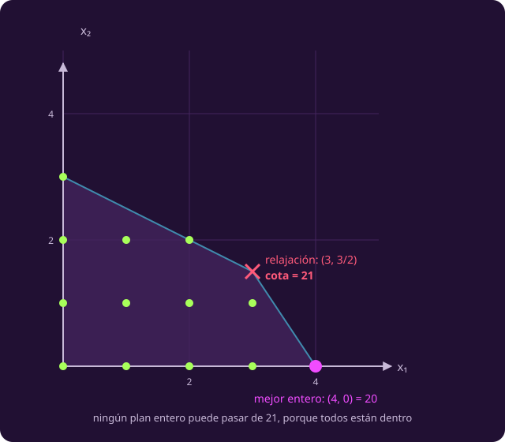
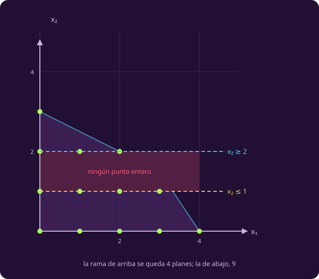
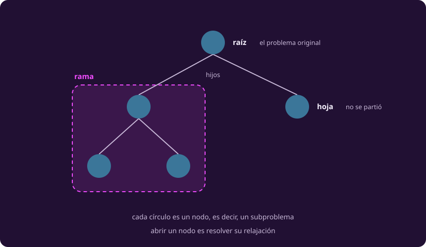
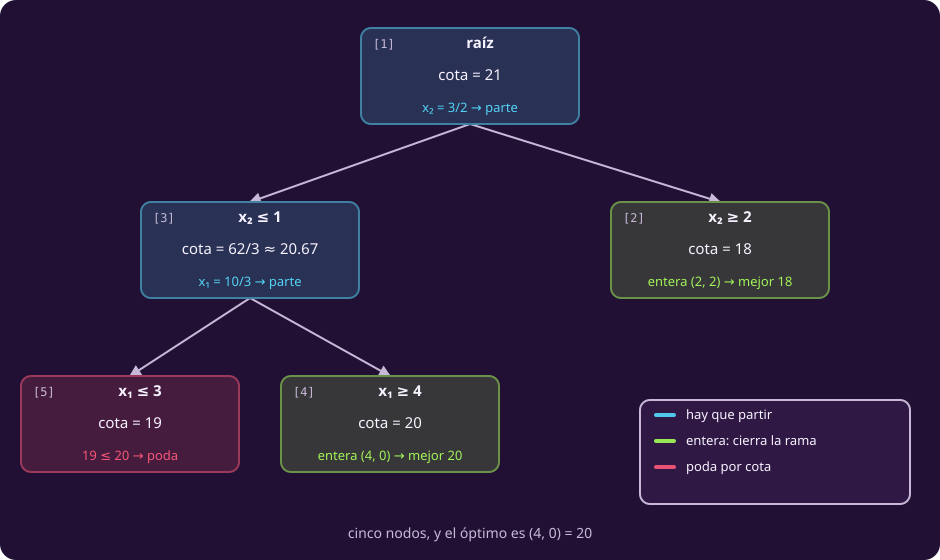

# Ramificar y acotar

**¿Cómo descarto un plan que nunca miré?**

Vienes de [[enumerar|enumerar]] · Aquí: el algoritmo que sí escala.

Enumerar encontró el ganador en el candidato 17 de 20 **y siguió tres más**. No
le faltaba suerte: le faltaba un **argumento** para parar. Este algoritmo lo
tiene, y se arma con tres piezas: una cota, un corte, y una manera de llevar la
cuenta.

## 1 · La cota

::: definition {#opt-relajacion title="Relajación lineal"}
La **relajación** de un problema entero es el mismo problema **sin** la línea
$x\in\mathbb{Z}$:

$$\max\; c^{\mathsf T}x \quad\text{s.a.}\quad Ax \le b,\quad l \le x \le u$$

Ya no es un problema entero: es uno lineal, de los de la clase 2, y lo resuelve
simplex.
:::

En el taller, la relajación vale **21**, en el punto $(3,\ 3/2)$.

### Por qué ese número es un techo

Primero la regla, que no es de optimización sino de conjuntos:

> Si $A \subseteq B$, entonces $\max B \ge \max A$. **Agregar opciones nunca baja
> el máximo.**

Con números sueltos: si $A = \{12,\ 19,\ 20\}$ y le agregas el 21, el máximo sube
a 21. Si le agregas el 7, se queda en 20. Lo que no puede hacer es **bajar**.

Ahora, por qué aquí $A \subseteq B$. Un plan entero factible cumple $Ax \le b$ y
$l \le x \le u$. La relajación pide **exactamente eso y nada más** —solo deja de
exigir $x \in \mathbb{Z}$—, así que **ningún plan entero se cae**: todos siguen
estando.

Los dos conjuntos, con nombre:

- $A$ = **los planes enteros que caben**: los 13 puntos de la retícula que
  cumplen $Ax\le b$ y las cotas.
- $B$ = **los puntos de la relajación**: todos los del polígono, fracciones
  incluidas. «Estar en $B$» significa cumplir $Ax\le b$ y las cotas, y **nada
  más** — nadie pregunta si los números son enteros.

| Plan | ¿Está en $A$? | ¿Está en $B$? | Vale |
|---|---|---|---:|
| $(4,\ 0)$ | sí | sí | 20 |
| $(3,\ 1)$ | sí | sí | 19 |
| $(2,\ 2)$ | sí | sí | 18 |
| $(3,\ 3/2)$ | **no**: media sonda | **sí**: cumple las dos restricciones | **21** |

Los tres primeros están en los dos conjuntos. El cuarto **solo está en $B$**, y
es el que manda. Por eso

$$z_{\text{relajación}} \;\ge\; z_{\text{entero}}, \qquad\text{y aquí}\quad 21 \ge 20.$$

::: figure {#opt-relajacion-corte title="La cota que da la relajación"}

:::

::: definition {#opt-cota-relajacion title="Cota superior"}
Una **cota superior** de un problema es un número que **ninguno** de sus planes
enteros puede superar, calculado **sin** conocer el mejor de ellos.

Y sirve para una cosa: si la cota de un problema no supera a una solución que ya
tienes en la mano, **ese problema no hace falta resolverlo**.
:::

> **Cuidado.** La cota **no es la respuesta**. «Tres rovers y media sonda» no
> existe. Lo único que dice el 21 es que nadie va a pasar de ahí.

## 2 · Partir el problema

La relajación contestó $x_2 = 3/2$, que no es un plan. Hay que **obligar a $x_2$
a decidirse**: o es 1 o menos, o es 2 o más.

Para escribirlo en general hace falta un nombre. **Al punto que devuelve la
relajación lo llamamos $\bar x$**, con barra, y la barra quiere decir siempre lo
mismo: *esto lo dio la relajación, y puede tener fracciones*. Su coordenada $j$
es $\bar x_j$ — aquí $\bar x_2 = 3/2$. La regla es:

$$x_j \le \lfloor \bar x_j \rfloor \qquad\text{y}\qquad x_j \ge \lceil \bar x_j \rceil$$

Aquí, $x_2 \le 1$ y $x_2 \ge 2$.

::: figure {#opt-ramas title="Partir no pierde ninguna solución"}

:::

El dibujo dice dos cosas a la vez:

- **No se pierde ningún plan.** Entre $\lfloor \bar x_j \rfloor$ y
  $\lceil \bar x_j \rceil$ no hay ningún entero, así que la franja que queda
  fuera está vacía. Partir es exhaustivo, no una apuesta.
- **Sí se pierde el punto de la cota.** $(3,\ 3/2)$ no sobrevive a ninguna de las
  dos mitades. Por eso cada corte obliga a la relajación a contestar algo
  distinto, y el método avanza en vez de dar vueltas.

### Siempre dos mitades, y por una sola variable

Tres preguntas que el dibujo no contesta:

| Pregunta | Respuesta |
|---|---|
| ¿Cuántas mitades? | **Siempre dos.** Partir por una variable da exactamente dos, y entre las dos cubren todo |
| ¿Y si hay **varias** variables fraccionarias? | Se parte por **una sola**. No hay que combinarlas: las demás siguen fraccionarias en las dos mitades, y se partirán más abajo si hace falta. Cuál se elige es una decisión libre, y la fijamos en la sección 3 |
| ¿Y si una variable fuera **continua**? | **Nunca se parte por ella.** Solo se mira la integralidad de las variables que la exigen: en una continua, $3/2$ es una respuesta perfectamente buena |

De la última se sigue el caso extremo: si **ninguna** variable tuviera que ser
entera, el problema sería lineal y no habría nada que partir — la relajación
sería la respuesta, y estaríamos en la clase 2.

Cada mitad es un problema completo —mismo objetivo, mismas restricciones, cotas
más apretadas—, y tiene nombre:

::: definition {#opt-subproblema title="Subproblema"}
Un **subproblema** es el mismo modelo con las cotas más apretadas: mismo $c$,
misma $A$, mismo $b$, y un $l \le x \le u$ más chico.

Por eso todo lo que sabes del original sigue valiendo dentro de él — incluida su
relajación, que se calcula igual.
:::

### Los subproblemas forman un árbol

Partir uno da dos, y a esos dos se les puede volver a partir. Lo que se va
formando es un árbol binario, y le damos los nombres de siempre. Esto es un
recordatorio, no vocabulario nuevo:

| Palabra | Aquí significa |
|---|---|
| **raíz** | El problema original |
| **nodo** | Un subproblema |
| **hijos** | Los dos subproblemas que salen de partir uno |
| **hoja** | Un nodo que no se partió |
| **rama** | Un nodo **con todo lo que cuelga de él** |
| **abrir** un nodo | Resolver su relajación |

::: figure {#opt-arbol-vocabulario title="Cómo se llama cada parte"}

:::

**Nodo y subproblema son la misma cosa**, con dos nombres: *subproblema* cuando
hablamos del modelo, *nodo* cuando hablamos del dibujo.

## 3 · El algoritmo

Ya está todo lo que hace falta: una cota para descartar, un corte para avanzar y
un árbol donde poner lo que se va abriendo. Falta la contabilidad.

::: definition {#opt-nodos-vivos title="Lista de nodos vivos"}
La **lista de nodos vivos**, que escribimos $L$, son los subproblemas ya creados
y todavía sin resolver.

Al arrancar, $L$ tiene un solo elemento: el problema original, el que todavía no
se ha partido por ningún lado. Cada vez que un nodo se parte, sale de $L$ y
entran sus dos mitades; cada vez que uno se cierra, sale y no entra nada. El
algoritmo termina cuando $L$ se queda vacía.

Es el estado del algoritmo, y es lo que lo hace distinto de todo lo anterior:
simplex estaba en un vértice, el gradiente en un punto, enumerar en un
candidato. **Éste no está en un lugar: tiene un conjunto.**
:::

::: definition {#opt-poda title="Cerrar y podar"}
Un nodo se **cierra** cuando ya no hay que abrir nada debajo de él. Hay tres
formas, y solo dos son podas:

| Cierre | Cuándo | ¿Poda? |
|---|---|---|
| Por infactibilidad | La relajación del nodo no tiene ni un punto | sí |
| Por cota | Su cota no supera a la mejor solución que ya tienes | sí |
| Por solución entera | Su relajación salió entera: nada debajo puede ser mejor | no: la resolvió |

**Podar** es cerrar una rama sin abrir lo que cuelga de ella.
:::

El tercer renglón se confunde con una poda y no lo es: ahí el nodo **se terminó
de resolver**, no se descartó.

### La notación del ciclo

Cuatro nombres aparecen en el diagrama y en el pseudocódigo, y conviene tenerlos
juntos antes de leerlos:

| Símbolo | Qué es | ¿Puede tener fracciones? |
|---|---|---|
| $L$ | La lista de nodos vivos | — |
| $P$ | El nodo que se está abriendo | — |
| $\bar x$ | El **punto** que devuelve la relajación de $P$ | **sí** |
| $\bar z$ | Su **valor**, $\bar z = c^{\mathsf T}\bar x$: la cota de ese nodo | sí |
| $x^*$ | La **mejor solución entera** encontrada hasta ahora | no, nunca |
| `mejor` | Su valor, $c^{\mathsf T}x^*$ | no |

Las dos marcas dicen de dónde viene cada cosa: **la barra es lo que dio la
relajación** —puede no ser un plan— y **la estrella es la mejor solución entera
que tienes en la mano**. Al terminar, $x^*$ es la respuesta.

::: figure {#opt-flujo-ramificar title="Ramificar y acotar, paso a paso"}

:::

Las etiquetas `[Ln]` de cada paso son las líneas de aquí abajo:

```text
INPUT   max cᵀx  s.a.  Ax ≤ b,  l ≤ x ≤ u,  x entera.
OUTPUT  un óptimo x* y su valor, o «no hay factibles».

 1  mejor ← −∞ ;  x* ← «ninguno»
 2  L ← { el problema original }        ▷ nodos vivos
 3  while L ≠ { }
 4      P ← saca un nodo de L
 5      if la relajación de P no es factible: continue
 6      x̄, z̄ ← óptimo de la relajación de P
 7      if z̄ ≤ mejor: continue                 ▷ poda por cota
 8      if x̄ es entera
 9          mejor ← z̄ ;  x* ← x̄ ;  continue    ▷ cierra
10      elige j con x̄ⱼ fraccionaria
11      mete en L  xⱼ ≤ ⌊x̄ⱼ⌋  y  xⱼ ≥ ⌈x̄ⱼ⌉
12  end while
13  return x*, mejor      ▷ x* = «ninguno» si no hubo factibles
```

Dos cosas que hay que decir antes de correrlo.

**La línea 6 llama a otro algoritmo.** Es la primera vez que pasa en el curso:
resolver la relajación **es** correr simplex. Ramificar y acotar no sabe resolver
nada por sí mismo; sabe **decidir qué vale la pena resolver**.

**La línea 5 supone la caja finita**, igual que enumerar. Si una variable no
tiene cota superior, la relajación puede salir **no acotada**, que no es lo mismo
que infactible: tratarla como infactible haría que el algoritmo contestara «no
hay factibles» a un problema que sí tiene respuesta.

### Tres decisiones que el pseudocódigo deja abiertas

Sin ellas, el árbol del taller no tiene cinco nodos: tiene los que le toquen.

| Línea | Lo que no dice | Lo que usamos aquí |
|---|---|---|
| 4 | **Cuál** nodo sale de la lista | El último que entró |
| 11 | En qué orden entran los hijos | Primero el del $\le$, para que abra el del $\ge$ |
| 10 | **Cuál** variable fraccionaria | La primera, en el orden en que están escritas |

Y una cuarta que no es de estilo: en la línea 7 la comparación va **antes** de
revisar si $\bar x$ es entera. Al revés, un nodo entero peor que la mejor
solución la sobrescribiría.

En Python, el mismo texto:

```python
import numpy as np
from math import floor, ceil
from scipy.optimize import linprog

pila = [(l, u)]                                  # L2
mejor, x_mejor = -np.inf, None                   # L1
while pila:                                      # L3
    lo, hi = pila.pop()                          # L4
    r = linprog(-np.asarray(c), A_ub=A, b_ub=b,
                bounds=list(zip(lo, hi)))
    if not r.success:                            # L5
        continue
    z = -r.fun                                   # L6
    if z <= mejor:                               # L7
        continue
    frac = [j for j in range(len(c))
            if abs(r.x[j] - round(r.x[j])) > 1e-9]
    if not frac:                                 # L8
        mejor, x_mejor = z, r.x.round().astype(int)   # L9
        continue
    j = frac[0]                                  # L10
    baja, sube = list(hi), list(lo)              # L11
    baja[j], sube[j] = floor(r.x[j]), ceil(r.x[j])
    pila.append((lo, baja))                      # el ≤ entra primero
    pila.append((sube, hi))                      # el ≥ sale primero
```

En el código, `pila` es $L$, `x_mejor` es $x^*$ y `r.x` es $\bar x$: los mismos
cuatro nombres de la tabla, escritos como se pueden teclear.

::: definition {#opt-bnb title="Ramificar y acotar"}
**Ramificar y acotar** es este ciclo: acotar cada nodo con su relajación,
partirlo por una variable fraccionaria cuando la cota promete, y cerrarlo cuando
no.

Entrega el **óptimo global** y un **certificado**: al terminar, toda rama que no
se abrió tenía una cota peor que la respuesta.
:::

### ¿Llega siempre al óptimo?

Sí, y por dos razones separadas que conviene no mezclar.

**No se pierde el óptimo.** Dos hechos, uno de cada sección anterior:

1. **Partir cubre todo** (§2): entre $\lfloor\bar x_j\rfloor$ y
   $\lceil\bar x_j\rceil$ no hay enteros, así que todo plan entero del padre
   está en alguno de los dos hijos. Por inducción, **todo plan entero está en
   alguna hoja**.
2. **Podar solo tira lo que no puede ganar** (§1): una rama se descarta cuando su
   cota no supera a una solución que ya tienes, y la cota es un techo válido de
   esa rama. Lo descartado es, como mucho, tan bueno como lo que ya tenías.

Junta las dos y el óptimo no tiene por dónde escaparse.

**Y termina.** Cada corte reduce en al menos 1 el rango $u_j - l_j$ de la
variable por la que se parte, y los rangos empiezan finitos y nunca crecen.
Ninguna rama se puede partir para siempre: la profundidad del árbol está acotada
por $\sum_j (u_j - l_j)$. **Con la caja infinita esta garantía desaparece**, que
es la otra cara del aviso de la línea 5.

**Qué entrega, exactamente:** el óptimo **exacto**, no una aproximación. Y algo
que enumerar no puede dar — si lo paras antes de tiempo, te quedas con la mejor
solución encontrada **y** con la mayor cota que quedó abierta en la lista. La
diferencia entre las dos es el **hueco**, y te dice cuánto podrías estar
perdiendo como máximo. Parar temprano deja de ser rendirse: deja una respuesta
con su margen de error declarado.

De repaso, qué hace cada pieza del modelo dentro del ciclo:

| Pieza | Sirve para |
|---|---|
| La relajación de un nodo | **Acotar** lo mejor que puede haber en esa rama |
| ¿La solución salió entera? | **Cerrar** el nodo |
| La mejor solución hasta ahora | **Podar** lo que ya no puede ganar |
| Una variable fraccionaria | **Partir** en dos |

## 4 · El árbol del taller, y su factura

::: figure {#opt-arbol title="El árbol del taller"}

:::

| # | Nodo | Cota | Relajación | Qué pasa |
|---:|---|---:|---|---|
| 1 | raíz | 21 | $(3,\ 3/2)$ | $x_2$ fraccionaria → parte en $x_2\le1$ y $x_2\ge2$ |
| 2 | $x_2 \ge 2$ | 18 | $(2,\ 2)$ | **entera** → mejor = 18 |
| 3 | $x_2 \le 1$ | $62/3 \approx 20.67$ | $(10/3,\ 1)$ | $x_1$ fraccionaria → parte en $x_1\le3$ y $x_1\ge4$ |
| 4 | $x_1 \ge 4$ | 20 | $(4,\ 0)$ | **entera** → mejor = **20** |
| 5 | $x_1 \le 3$ | 19 | $(3,\ 1)$ | $19 \le 20$ → **poda por cota** |

**Respuesta: 4 rovers, ninguna sonda, 20 MB al día** — la misma que enumerar, en
cinco nodos.

**El orden de los números no es de izquierda a derecha.** El 2 está a la derecha
y el 3 a la izquierda porque de la lista sale el último que entró, y el hijo del
$\ge$ entró después.

### Dónde quedaron los veinte planes

Las tres hojas **parten la caja entera**, sin solapes y sin huecos. Ojo con la
unidad: aquí se cuentan **celdas de la caja**, las 20, no los 13 planes
factibles:

| Nodo | Qué tapa | Celdas | Se resolvió con |
|---|---|---:|---|
| 2 | $x_2 \ge 2$ | 10 | una relajación |
| 4 | $x_1 \ge 4$, $x_2 \le 1$ | 2 | una relajación |
| 5 | $x_1 \le 3$, $x_2 \le 1$ | 8 | una relajación |
| | **Total** | **20** | |

Ocho planes enteros cayeron en el nodo 5 y **ninguno se evaluó**: se fueron con
una sola cuenta, porque su cota —19— no alcanzaba. Eso es podar.

> **Lo que este árbol no enseña.** Tiene poda por cota y cierre por solución
> entera, pero **ninguna poda por infactibilidad**: en este problema toda rama
> tiene al menos un punto. Es la tercera forma de cerrar, y aquí no aparece.

### Los dos factores

$$T_{\text{ram}} \;=\; \underbrace{N}_{\text{nodos que se abren}} \;\times\; \underbrace{C_{\text{nodo}}}_{\text{lo que cuesta abrir uno}}$$

Igual que en enumerar, cada factor se deriva por separado.

### El primer factor: cuántos nodos se abren

**No tiene fórmula cerrada**, y ésa es la diferencia más honda con enumerar.
Allá el conteo salía de las cotas antes de correr nada; aquí depende de la
instancia. Lo que sí hay es un intervalo:

$$1 \;\le\; N \;\le\; 2\lvert X\rvert - 1$$

| | $N$ | Por qué |
|---|---|---|
| Mejor caso | 1 | La relajación de la raíz sale entera y se acabó |
| Este problema | 5 | |
| Peor caso | $2\lvert X\rvert-1$ — aquí **39** | Ver abajo |

**De dónde sale el tope.** Cada hoja se queda con un pedazo de la caja, los
pedazos no se solapan y ninguno queda vacío, así que hay a lo más $\lvert X\rvert$ hojas. Y
un árbol binario en el que cada nodo interno tiene exactamente dos hijos cumple

$$\text{nodos} \;=\; 2\,\text{hojas} - 1 \;\le\; 2\lvert X\rvert - 1.$$

Con variables **0/1** eso es el $2^{n+1}-1$ que se suele citar, porque ahí
$\lvert X\rvert = 2^n$. Con enteras generales **no hay tope que dependa solo de $n$**: la
misma variable se puede volver a partir más abajo, y el tope crece con el tamaño
de las cotas.

### El segundo factor: qué cuesta abrir uno

Abrir un nodo es resolver un problema lineal con $n$ variables y $m$
restricciones. Simplex se mueve de vértice en vértice, y **cada pivote cuesta del
orden de $mn$ operaciones**: recorrer la matriz. Si llamamos $v$ al número de
pivotes —los vértices que simplex visita, como en la clase 2—,

$$C_{\text{nodo}} \;=\; O(v\,mn).$$

De $v$ ya sabes lo que dice la clase 2: pocos en la práctica, exponencial en el
peor caso.

### Los dos algoritmos, lado a lado

Y aquí aparece lo que hace legible la comparación. Revisar un candidato también
cuesta $O(mn)$ —son las mismas $m$ desigualdades de $n$ términos—, así que el
factor $mn$ **es el mismo en los dos**:

$$T_{\text{enum}} = O(\lvert X\rvert\;mn), \qquad T_{\text{ram}} = O(N\,v\;mn)$$

Divide uno entre otro y el $mn$ se va. Queda una regla limpia:

> **Ramificar gana cuando $N \cdot v < \lvert X\rvert$**, y pierde cuando no. Todo lo demás
> es constante.

Dos consecuencias inmediatas:

- **En el peor caso** $N = 2\lvert X\rvert-1$, y entonces $T_{\text{ram}} = O(\lvert X\rvert\,v\,mn)$:
  **$v$ veces peor que enumerar**, no mejor. Podar no cambia la clase de
  complejidad —el problema sigue siendo NP-duro—, cambia la constante y la
  suerte.
- **En la práctica** conviene medir $v$ junto con todo lo demás que cuesta abrir
  un nodo, y llamarle $K$: **cuántos candidatos cuesta un nodo**. La regla queda

$$\frac{N}{\lvert X\rvert} \;<\; \frac{1}{K}.$$

Es decir: **ramificar gana cuando abre menos de una $K$-ésima parte de la caja.**

### La escalera, medida

Las dos cantidades de esa regla se miden. Mochilas binarias aleatorias con
$m=3$, cinco instancias por tamaño, mediana:

| Variables ($n$) | Caja $\lvert X\rvert = 2^n$ | Nodos $N$ | $N/\lvert X\rvert$ | Enumerar | Ramificar |
|---:|---:|---:|---:|---:|---:|
| 8 | 256 | 29 | 11 % | 4 ms | 56 ms |
| 10 | 1 024 | 55 | 5.4 % | 26 ms | 137 ms |
| 12 | 4 096 | 63 | **1.5 %** | 90 ms | 98 ms |
| 14 | 16 384 | 29 | **0.2 %** | 303 ms | 63 ms |
| 16 | 65 536 | 65 | 0.1 % | 1 048 ms | 88 ms |
| 18 | 262 144 | 141 | 0.1 % | 4 148 ms | 277 ms |

De las mismas corridas sale $K$: un candidato costó unos **16 µs** y un nodo unos
**1.7 ms**, así que $K \approx 100$ y la regla predice el cruce en
$N/\lvert X\rvert \approx 1\%$.

**Y ahí está.** En $n=12$ abre el 1.5 % —por encima del 1 %— y pierde en el
reloj, 90 ms contra 98. En $n=14$ abre el 0.2 % y gana cinco veces. La
desigualdad de arriba y el cronómetro dicen lo mismo.

> **De dónde salen estos milisegundos.** De correr los dos algoritmos **en la
> máquina donde se escribió este curso**, en Python con `scipy`. Los
> milisegundos dependen de la máquina y de la implementación, y $K$ con ellos:
> en C, un nodo costaría bastantes menos candidatos y el cruce llegaría antes.
> Lo que no depende de la máquina son las dos columnas del medio y la regla
> $N\cdot P < \lvert X\rvert$, que es la que hay que recordar.

**La columna que hay que mirar es $N/\lvert X\rvert$.** Los nodos apenas se mueven —de 29 a
141— mientras la caja se multiplica por mil. Eso es lo que hace ganar a
ramificar: no que sus pasos sean baratos, sino que sean poquísimos.

### Qué lo abarata, y qué no

Aquí la comparación con enumerar se invierte, y vale la pena verla en paralelo:

| | Enumerar | Ramificar y acotar |
|---|---|---|
| Encontrar pronto una buena solución | **No ayuda**: revisa los demás igual | **Ayuda mucho**: un `mejor` alto poda más ramas |
| Que casi todo sea infactible | No ayuda: los genera igual | **Ayuda**: las relajaciones salen infactibles y cierran ramas enteras |
| Un modelo más apretado | Da igual | **Ayuda**: la cota se pega al óptimo entero y poda antes |
| Más variables | Duplica el trabajo | Puede duplicarlo… o no cambiarlo, según pode |

La primera fila es la diferencia de fondo. Enumerar **no aprende nada mientras
avanza**; éste sí: cada solución entera que encuentra mejora la vara con la que
descarta lo que falta.

### Qué lo hace crecer

| Si agregas… | Qué le pasa |
|---|---|
| Una variable, $n \to n+1$ | El árbol **puede** duplicarse — pero solo si la poda falla |
| Una restricción, $m \to m+1$ | Cada nodo cuesta un poco más… y suele podar **antes** |
| Una cota más floja (un $M$ grande) | La relajación se aleja del entero, poda menos, y el árbol crece |

El último renglón es el que conecta con la página 2: por eso el enlace del costo
fijo se escribe $x_1 \le 3y$ y no $x_1 \le 1000y$. Los dos modelos son correctos;
**uno se resuelve y el otro no.**

### Cuándo sí, cuándo no

| Úsalo | Evítalo |
|---|---|
| Cuando la caja no cabe en la memoria ni en el día | Cuando hay diez candidatos: enumerar es más simple y más rápido |
| Cuando necesitas el óptimo **y** su certificado | Cuando te basta una solución buena y tienes prisa |
| Cuando el modelo está bien apretado | Cuando el modelo tiene grandes constantes sueltas |

Y para lo que sigue: **esto es lo que hay dentro de `scipy.optimize.milp`, de
Gurobi y de CPLEX.** Ahí encima le montan cortes, heurísticas y presolve, pero el
esqueleto es el de arriba.

## Lo que hay que llevarse

- La relajación no resuelve el problema: **da una cota**, y la cota es lo único
  que permite descartar sin mirar.
- Partir por $\lfloor \bar x_j\rfloor$ y $\lceil \bar x_j\rceil$ no pierde
  soluciones, porque entre las dos mitades no hay ningún entero.
- Enumerar mira los 20 planes uno por uno y no puede parar; ramificar cierra los
  20 con **cinco relajaciones**. Cada paso suyo cuesta mucho más: por eso gana en
  grande y pierde en chico.
