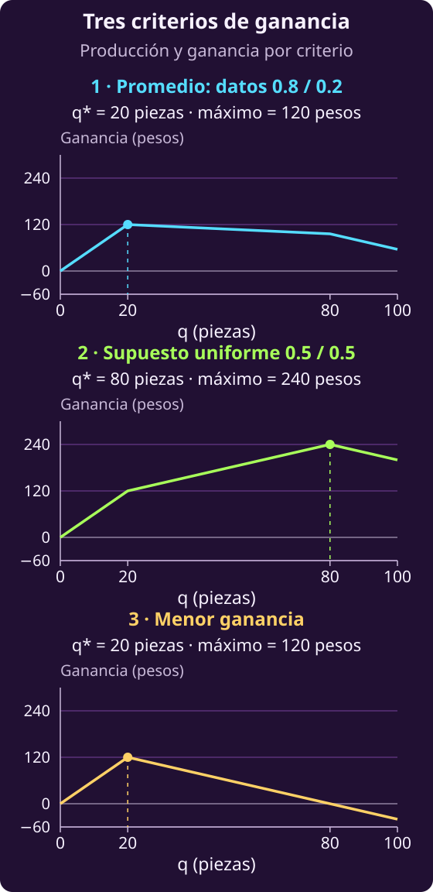

# Decidir cuánto pan producir antes de conocer la demanda

En salones, cada asignación tenía una molestia conocida. En la panadería,
una misma producción puede dejar ganancias distintas según cuántas piezas
se vendan. **Primero construiremos la ganancia; después decidiremos cómo
compararla cuando no conocemos la demanda.**

## 1 · Decidir esta noche para vender mañana

La dueña de una pequeña panadería deja listas las piezas por la noche y
a la mañana siguiente hornea todo lo preparado. Durante el día se dedica a
vender: no puede preparar nuevas tandas. Tiene capacidad para **100 piezas por jornada** y
debe decidir cuántas preparar antes de conocer la demanda total de mañana.

Producir cada pieza cuesta **2 pesos** y venderla deja un ingreso de
**8 pesos**. El costo de producción se paga por todas las piezas, aunque
algunas no se vendan.

Por su política de calidad, la panadería vende pan del día. Al cerrar regala
lo que sobró; no lo guarda para venderlo al día siguiente. En este modelo,
regalar el pan no genera ingresos ni costos adicionales y no hay otros
costos o ingresos que considerar.

La dueña quiere **maximizar la ganancia**: lo que queda de las ventas después
de pagar la producción. La dificultad es que **por la noche todavía no sabe
cuántas piezas querrán comprarle al día siguiente**.

**Piensa: ¿qué cantidad tiene que decidir la dueña esta noche?**

Llamaremos $q$ al número entero de piezas que prepara. La letra minúscula
$q$ representa **la decisión**; la mayúscula $Q$ representa **la capacidad**,
un dato entero no negativo, en piezas. Las condiciones son

$$0\le q\le Q,\qquad q\in\mathbb Z.$$

Aquí $Q=100$. Elegimos una sola cantidad $q$ antes de saber cuánto se venderá.

Para describir la incertidumbre, llamamos $\mathcal E$ al conjunto finito,
no vacío, de escenarios posibles. El índice $e\in\mathcal E$ identifica
un escenario. Usaremos estos datos:

- $d_e$: piezas que los clientes quieren comprar al precio dado en el
  escenario $e$; es un entero no negativo.
- $p_e$: probabilidad del escenario $e$.
- $v$: precio de **venta**, en pesos por pieza.
- $c$: **costo** de producción, en pesos por pieza.

Suponemos $v>c>0$. Las probabilidades cumplen $p_e\ge0$ para cada
$e\in\mathcal E$ y suman 1:

$$\sum_{e\in\mathcal E}p_e=1.$$

Para mañana se consideran dos escenarios, $\mathcal E=\{1,2\}$:

- Escenario 1: $d_1=20$ piezas, con probabilidad $p_1=0.8$.
- Escenario 2: $d_2=80$ piezas, con probabilidad $p_2=0.2$.

El precio es $v=8$ y el costo unitario es $c=2$. Suponemos que esas
probabilidades describen adecuadamente la incertidumbre. Para comparar las
cantidades posibles, la dueña decide **maximizar la ganancia esperada**:
el promedio ponderado por esas probabilidades.

El índice $e$ sirve para recorrer los escenarios; **no es una decisión**.
La misma cantidad $q$ debe servir para todos, porque se elige de noche.

## 2 · De las piezas al dinero ganado

**Piensa: si preparamos 65 piezas y solo nos piden 20, ¿cuántas vendemos? ¿Y si nos piden 80?**

En el primer caso vendemos 20; en el segundo, 65. Cuando sobra pan, las
ventas están limitadas por la demanda. Cuando falta, están limitadas por
lo que producimos. En el escenario $e$, las piezas vendidas son

$$\min(q,d_e).$$

Llamaremos $I_e(q)$ al **ingreso** por ventas en ese escenario. Se calcula
multiplicando las piezas vendidas por el precio:

$$I_e(q)=v\min(q,d_e).$$

El **costo** $C(q)$ corresponde a todas las piezas producidas, incluidas
las que regalamos. Es el mismo en cualquier escenario:

$$C(q)=cq.$$

Ambas expresiones están en pesos: multiplicamos pesos por pieza por piezas.
La **ganancia** $G_e(q)$ es el dinero que queda del ingreso después de pagar
la producción:

$$G_e(q)=I_e(q)-C(q).$$

El subíndice $e$ en $I_e(q)$ y $G_e(q)$ indica que el ingreso y la ganancia
pueden cambiar con el escenario. En $C(q)$ no aparece porque producir la
misma cantidad $q$ cuesta lo mismo, se venda o se regale el pan.

La ganancia puede ser negativa si las ventas no cubren el costo. Las ventas,
el ingreso y la ganancia se calculan a partir de $q$ y los datos; no son
cantidades que podamos escoger por separado.

## 3 · Construir la ganancia promedio

**Piensa: ¿deberían pesar igual los dos resultados si sus probabilidades son distintas?**

Para calcular el promedio propuesto, multiplicamos la ganancia de cada
escenario por su probabilidad y sumamos. Así obtenemos la **ganancia esperada**,
medida en pesos. El modelo completo es

$$
\begin{aligned}
&\max_q\quad\sum_{e\in\mathcal E}p_eG_e(q)\\
&\text{sujeto a}\\
&0\le q\le Q,\\
&q\in\mathbb Z.
\end{aligned}
$$

Las probabilidades y las demandas son datos del modelo. No podemos elegirlas
para mejorar el resultado.

**Las probabilidades permiten calcular ese promedio; no obligan a preferirlo.**
La dueña eligió ese criterio. Podría considerar inaceptable un resultado
muy bajo, aunque quedara compensado por una ganancia alta en otro escenario.

## 4 · Comprobar qué cuenta el objetivo

**Piensa: ¿recibir más dinero por ventas siempre significa ganar más?**

Comparemos dos producciones permitidas, sin buscar la mejor entre todas.
Las columnas corresponden a producir 20 y 65 piezas; los resultados están en pesos.

| Resultado | 20 | 65 |
|---|---:|---:|
| Ingreso esperado | 160 | 232 |
| Costo de producción | 40 | 130 |
| Ganancia esperada | 120 | 102 |

Para 65 piezas, los ingresos son 160 pesos si se piden 20 y 520 pesos si
se piden 80. El ingreso esperado se calcula así:

$$
\begin{aligned}
&0.8(160)+0.2(520)\\
&=232\text{ pesos}.
\end{aligned}
$$

Producir 65 da más ingreso esperado, pero el aumento del costo es mayor
que el del ingreso. Por eso deja menos ganancia esperada.

Minimizar solo el costo tampoco expresa ganar más: producir cero cuesta
cero y deja ganancia cero. Producir 20 cuesta 40 pesos y deja una ganancia
de 120 pesos en cualquiera de los dos escenarios.

Maximizar ingresos equivale a maximizar ganancia si el costo es el mismo
en todas las decisiones comparadas. Minimizar costos equivale a maximizar
ganancia si el ingreso es el mismo. Aquí no se cumplen esas condiciones
para el conjunto de producciones permitidas.

## 5 · Suponer escenarios igualmente probables

Ahora imaginemos que conocemos las mismas demandas posibles, pero **no
contamos con probabilidades justificadas**. No podemos seguir usando 0.8 y
0.2 como si todavía fueran datos.

**Piensa: si decidimos dar el mismo peso a cada escenario, ¿qué estamos suponiendo?**

Estamos eligiendo una distribución **uniforme**. Si la única información que
usamos es el conjunto finito de escenarios y no imponemos otras restricciones,
esa distribución maximiza la entropía. El [principio de máxima entropía](https://www.cs.cmu.edu/afs/cs/user/aberger/www/html/tutorial/node6.html) propone
entonces asignar a cada escenario la probabilidad

$$p_e=\frac{1}{|\mathcal E|}\qquad(e\in\mathcal E).$$

Aquí $|\mathcal E|$ es el número de escenarios. Con dos escenarios, cada uno
recibe probabilidad 0.5. Es un **supuesto para construir el modelo**, no una
consecuencia obligatoria de desconocer las probabilidades. Depende de cuáles
escenarios hayamos incluido. Volveremos a la entropía y a esta forma de elegir
probabilidades más adelante.

Con ese supuesto seguimos maximizando una ganancia esperada, ahora con pesos
iguales:

$$
\begin{aligned}
&\max_q\quad\frac{1}{|\mathcal E|}\sum_{e\in\mathcal E}G_e(q)\\
&\text{sujeto a}\\
&0\le q\le Q,\\
&q\in\mathbb Z.
\end{aligned}
$$

La diferencia puede cambiar qué producción preferimos. Producir 20 piezas
deja 120 pesos en los dos escenarios, así que su promedio sigue siendo 120.
Con 65 piezas, las ganancias son 30 y 390 pesos. Con pesos iguales, el promedio
es

$$0.5(30)+0.5(390)=210\text{ pesos}.$$

Entre estas dos cantidades, el modelo uniforme prefiere 65; el modelo con
probabilidades 0.8 y 0.2 prefiere 20. Cambiamos el supuesto sobre la demanda,
no el precio, el costo ni las condiciones de producción.

## 6 · Elegir pensando en la menor ganancia

**Piensa: ¿esperar una ganancia de 102 pesos garantiza ganar al menos esa cantidad mañana?**

No. Al producir 65 piezas, las ganancias son 30 pesos si se piden 20 y
390 pesos si se piden 80. Con las probabilidades originales, el promedio es
$0.8(30)+0.2(390)=102$ pesos; no es una ganancia mínima garantizada ni una
predicción exacta de mañana.

Podemos elegir otra prioridad: proteger la menor ganancia que obtendríamos
entre los escenarios incluidos. Primero fijamos una producción y buscamos
su peor resultado. Con 65 piezas, ese resultado es 30 pesos; con 20 piezas,
es 120 pesos. Después comparamos esas ganancias mínimas para elegir la
producción que deje la mayor.

Ese orden explica el modelo **max–min**: el mínimo recorre los escenarios
para una cantidad fija; el máximo elige la cantidad con mejor resultado mínimo.
El modelo es

$$
\begin{aligned}
&\max_q\quad\min_{e\in\mathcal E}G_e(q)\\
&\text{sujeto a}\\
&0\le q\le Q,\\
&q\in\mathbb Z.
\end{aligned}
$$

Este criterio protege la ganancia mínima **entre los escenarios incluidos**.
No afirma que el peor vaya a ocurrir ni considera con qué frecuencia ocurre.
Desconocer las probabilidades no obliga a elegirlo; también podríamos
adoptarlo con probabilidades conocidas si esa protección fuera nuestra prioridad.

Tanto el promedio como el peor caso dependen de los escenarios considerados.
Ninguno garantiza protección frente a cualquier demanda omitida. Cambiar
las demandas posibles o añadir costos requeriría revisar la formulación.

## 7 · Resumen de los tres modelos

Elegimos una sola cantidad de noche y horneamos todo lo preparado por la
mañana. Durante el día vendemos lo que permitan la producción y la demanda;
al cierre regalamos el sobrante, sin ingresos ni costos adicionales.
El modelo no incluye otros costos o ingresos.

| Símbolo | Qué representa |
|---|---|
| $\mathcal E$ | Conjunto de escenarios |
| $e$ | Índice de escenario |
| $q$ | Piezas por producir |
| $q^\star$ | Producción óptima |
| $Q$ | Capacidad en piezas |
| $d_e$ | Demanda en piezas |
| $v$ | Precio de venta |
| $c$ | Costo por pieza |
| $p_e$ | Probabilidad |
| $I_e(q)$ | Ingreso por ventas |
| $C(q)$ | Costo de producción |
| $G_e(q)$ | Ganancia por escenario |

La **variable** $q$ es el número entero de piezas que elegimos antes de
conocer la demanda. El conjunto $\mathcal E$ es finito y no vacío;
$e\in\mathcal E$ identifica un escenario. Usamos el mismo $q$ en todos ellos.

Los **datos** $Q$ y $d_e$ son enteros no negativos. El precio $v$ y el costo
$c$ se miden en pesos por pieza y cumplen $v>c>0$. La demanda cuenta las
piezas que los clientes quieren comprar a ese precio.

Para calcular la esperanza usamos probabilidades dadas o adoptadas bajo un
supuesto explícito. Deben cumplir $p_e\ge0$ para cada $e\in\mathcal E$ y

$$\sum_{e\in\mathcal E}p_e=1.$$

Estas son condiciones sobre los datos, no decisiones que optimizamos.
Las ventas son $\min(q,d_e)$. De ellas obtenemos las siguientes
**expresiones en pesos** para cada escenario:

$$I_e(q)=v\min(q,d_e).$$

$$C(q)=cq.$$

$$G_e(q)=I_e(q)-C(q).$$

El costo se paga por todas las piezas producidas y no depende del escenario.
Los tres modelos completos comparten las mismas condiciones sobre $q$.

**El máximo es un valor en pesos; una producción óptima es una cantidad de
piezas.** Para distinguirlos, $\operatorname{arg\,max}$ reúne las cantidades
que alcanzan el máximo. Escribimos $q^\star\in\operatorname{arg\,max}$ para
indicar que elegimos una de ellas: puede haber empates. En cada modelo,
$q^\star$ se refiere al criterio que estamos optimizando.

**Modelo 1 · Ganancia esperada con probabilidades dadas.** Usamos los datos
$p_e$ para ponderar las ganancias:

$$
\begin{aligned}
&\max_q\quad\sum_{e\in\mathcal E}p_eG_e(q)\\
&\text{sujeto a}\\
&0\le q\le Q,\\
&q\in\mathbb Z.
\end{aligned}
$$

Una producción óptima cumple

$$q^\star\in\operatorname*{arg\,max}_{\substack{0\le q\le Q\\q\in\mathbb Z}}
\sum_{e\in\mathcal E}p_eG_e(q).$$

Es un problema de **optimización discreta con una variable entera**. Podemos
resolverlo recorriendo $q=0,1,\ldots,Q$, calculando su ganancia esperada y
eligiendo una cantidad que alcance el mayor valor.

**Modelo 2 · Ganancia esperada con máxima entropía.** Si adoptamos la
uniformidad sobre el conjunto finito de escenarios, sin otras restricciones
sobre sus probabilidades, usamos $p_e=1/|\mathcal E|$:

$$
\begin{aligned}
&\max_q\quad\frac{1}{|\mathcal E|}\sum_{e\in\mathcal E}G_e(q)\\
&\text{sujeto a}\\
&0\le q\le Q,\\
&q\in\mathbb Z.
\end{aligned}
$$

Con este criterio, una producción óptima cumple

$$q^\star\in\operatorname*{arg\,max}_{\substack{0\le q\le Q\\q\in\mathbb Z}}
\frac{1}{|\mathcal E|}\sum_{e\in\mathcal E}G_e(q).$$

También es **optimización discreta con una variable entera**. Recorremos
$q=0,1,\ldots,Q$, calculamos el promedio simple de sus ganancias y elegimos
una cantidad con el mayor promedio.

**Modelo 3 · Mayor ganancia mínima.** Comparamos los escenarios sin usar
sus probabilidades:

$$
\begin{aligned}
&\max_q\quad\min_{e\in\mathcal E}G_e(q)\\
&\text{sujeto a}\\
&0\le q\le Q,\\
&q\in\mathbb Z.
\end{aligned}
$$

Una producción que alcanza la mayor ganancia mínima cumple

$$q^\star\in\operatorname*{arg\,max}_{\substack{0\le q\le Q\\q\in\mathbb Z}}
\min_{e\in\mathcal E}G_e(q).$$

Es **optimización discreta max–min con una variable entera**. Para cada
$q=0,1,\ldots,Q$ calculamos la menor ganancia entre los escenarios; después
elegimos una cantidad que alcance la mayor de esas ganancias mínimas.

Los tres recorridos son finitos: revisan las $Q+1$ cantidades permitidas.
Evaluar una cantidad recorre $|\mathcal E|$ escenarios y cuesta
$O(|\mathcal E|)$ operaciones. El costo total de esta enumeración es

$$O\bigl((Q+1)|\mathcal E|\bigr).$$

Este conteo supone el costo usual por operación aritmética. Depende del
valor numérico de $Q$, no solo de los bits que bastan para escribirlo; por
eso se llama **pseudopolinomial** cuando $Q$ se codifica en binario.

Los tres objetivos son **lineales por tramos**: se componen de segmentos de
recta. Con $q$ entero, admiten una reformulación de **programación lineal
entera mixta** mediante variables auxiliares continuas. Esa formulación
permite usar [*branch and bound*](https://web.stanford.edu/class/ee364b/lectures/bb_slides.pdf) (ramificación y acotación).
Su costo depende del número de nodos explorados, que puede crecer exponencialmente
en problemas enteros generales; no garantiza una mejora frente a enumerar este caso pequeño.

La única decisión física sigue siendo $q$, el número entero de piezas que
preparamos. Las auxiliares continuas representan ventas o cotas; no permiten
elegir la demanda ni preparar una cantidad distinta para cada escenario.

Si permitiéramos que $q$ fuera real, maximizaríamos una función cóncava sobre
el intervalo $[0,Q]$. Esa sería una **relajación convexa** del problema entero.

Elegir el peor caso es una prioridad explícita: no viene impuesta por la
falta de probabilidades. Protege únicamente frente a los escenarios incluidos.

La gráfica compara los tres criterios con los datos del ejemplo. Cada panel
marca una **cantidad óptima** y el **valor máximo** correspondiente. El caso
uniforme usa el supuesto 0.5/0.5; no lo presenta como una frecuencia observada.
Los segmentos solo ayudan a seguir los valores de las cantidades enteras.

## 8 · Dos tipos de pan comparten el horno

**Intenta formular el modelo sin abrir las pistas ni la respuesta y sin
consultar ChatGPT. Después de un primer intento, usa una pista si la necesitas.**

::: exercise {#opt-pan-ej-dos-panes title="Repartir el espacio entre dos tipos de pan"}
La dueña preparará dos tipos de pan durante la noche y horneará todo en una
sola tanda por la mañana. Durante el día solo vende; al cierre regala el
sobrante sin ingresos ni costos adicionales.

Las piezas tienen tamaños distintos. Para cada tipo conocemos el espacio
que ocupa una pieza en las bandejas, su costo de producción y su precio de
venta. El espacio por pieza y el costo son positivos; el precio supera al
costo. También conocemos el espacio total utilizable en las bandejas de
esa tanda. En esta simplificación, el espacio ocupado es la suma del espacio
reservado a todas las piezas; no hay otras condiciones de colocación.

Tenemos una lista de **escenarios conjuntos de demanda** y sus probabilidades:
cada escenario indica cuántas piezas de cada tipo querrán comprar los clientes
al precio fijado. Esos datos no suponen que las demandas de ambos panes sean
independientes. Se vende todo lo que permitan la producción y la demanda de
cada tipo. No hay otros costos ni ingresos.

La dueña debe decidir cuántas piezas enteras de cada tipo preparar antes de
saber qué escenario ocurrirá. Quiere maximizar la ganancia esperada.

1. Formula un modelo general que también sirva para más tipos de pan.
   Distingue datos, decisiones y expresiones calculadas; incluye todas las
   condiciones de producción.
2. Explica qué cambiarías si adoptara probabilidades uniformes sobre esa lista
   de escenarios, o si prefiriera maximizar su menor ganancia. Conserva las
   condiciones físicas del negocio.
3. Propón un método finito para encontrar una producción óptima y explica de
   qué depende su costo.
:::

::: hint {#opt-pan-pista-dos-panes-datos of="opt-pan-ej-dos-panes" title="Pista 1 · Ordenar los datos"}
Separa los datos que pertenecen a un tipo de pan de los que necesitan indicar
también un escenario. ¿Cuántas cantidades eliges durante la noche? ¿Cuáles
pueden cambiar al día siguiente sin que tú las elijas?
:::

::: hint {#opt-pan-pista-dos-panes-recursos of="opt-pan-ej-dos-panes" title="Pista 2 · Revisar espacio y ventas"}
Comprueba tu propuesta con dos preguntas: ¿cuánto espacio ocupan juntas las
piezas que preparas?, ¿cuántas puedes vender de un tipo si la producción y
la demanda no coinciden? Recuerda que producir una pieza cuesta aunque
termine regalada. Después revisa cómo comparas los resultados de los escenarios.
:::

::: answer {#opt-pan-resp-dos-panes of="opt-pan-ej-dos-panes" title="Una formulación con varios productos"}
**Datos e índices.** Llamamos $\mathcal J$ al conjunto de tipos de pan y
$\mathcal E$ al conjunto de escenarios; ambos son finitos y no vacíos.
El índice $j\in\mathcal J$ identifica un producto y $e\in\mathcal E$, un
escenario conjunto. Para el relato, $\mathcal J=\{1,2\}$.

| Signo | Qué representa |
|---|---|
| $\mathcal J$ | Tipos de pan |
| $\mathcal E$ | Escenarios conjuntos |
| $j$, $e$ | Índices |
| $q_j$ | Piezas del tipo $j$ |
| $q$ | Producción completa |
| $q^\star$ | Producción óptima |
| $a_j$ | Espacio por pieza |
| $B$ | Espacio disponible |
| $v_j$ | Precio de venta |
| $c_j$ | Costo por pieza |
| $d_{je}$ | Demanda por tipo y caso |
| $p_e$ | Probabilidad |
| $G_e(q)$ | Ganancia del escenario |
| $F$ | Producciones permitidas |
| $Q_j$ | Cota de piezas por tipo |

Los datos $a_j>0$ y $B\ge0$ se expresan en una misma unidad de superficie:
por ejemplo, cm² por pieza y cm² disponibles. Los precios y costos cumplen
$v_j>c_j>0$, en pesos por pieza. Cada $d_{je}$ es un entero no negativo,
en piezas. Las probabilidades son datos con $p_e\ge0$ y

$$\sum_{e\in\mathcal E}p_e=1.$$

**Decisiones y resultados.** Elegimos $q_j\in\mathbb Z_{\ge0}$ para cada
$j\in\mathcal J$. La colección de esas cantidades es $q$, la producción
completa. Es la misma en todos los escenarios: no podemos esperar a ver
la demanda para elegirla.

En el escenario $e$ vendemos $\min(q_j,d_{je})$ piezas del tipo $j$.
Sumamos sus ingresos y descontamos el costo de todas las piezas preparadas:

$$
\begin{aligned}
G_e(q)={}&\sum_{j\in\mathcal J}v_j\min(q_j,d_{je})\\
&-\sum_{j\in\mathcal J}c_jq_j.
\end{aligned}
$$

Esta ganancia está en pesos. Las ventas y la ganancia son **expresiones
calculadas**, no decisiones adicionales.

**Modelo completo.** El espacio compartido limita la producción:

$$
\begin{aligned}
&\max_q\quad\sum_{e\in\mathcal E}p_eG_e(q)\\
&\text{sujeto a}\\
&\sum_{j\in\mathcal J}a_jq_j\le B,\\
&q_j\in\mathbb Z_{\ge0}\qquad(j\in\mathcal J).
\end{aligned}
$$

Llamamos $F$ al conjunto de producciones que cumplen esa restricción y esos
dominios. El máximo da una ganancia esperada en pesos; una producción óptima
es una colección de cantidades que la alcanza:

$$q^\star\in\operatorname*{arg\,max}_{q\in F}
\sum_{e\in\mathcal E}p_eG_e(q).$$

Puede haber más de una. Para cambiar el criterio conservamos exactamente $F$.
Con **uniformidad adoptada sobre la lista de escenarios**, usamos
$p_e=1/|\mathcal E|$ y buscamos

$$q^\star\in\operatorname*{arg\,max}_{q\in F}
\frac{1}{|\mathcal E|}\sum_{e\in\mathcal E}G_e(q).$$

Esa uniformidad se refiere a escenarios conjuntos completos. No reemplaza
sus probabilidades por el producto de probabilidades de cada pan.
Para **proteger la menor ganancia**, buscamos

$$q^\star\in\operatorname*{arg\,max}_{q\in F}
\min_{e\in\mathcal E}G_e(q).$$

**Tipo, método y costo.** Es optimización entera con ganancias lineales por
tramos. Admite una reformulación lineal entera mixta con auxiliares continuas
para ventas o cotas; las decisiones físicas siguen siendo las cantidades $q_j$.

Un método exacto es enumerar. Como cada pieza consume espacio positivo,
la capacidad proporciona una cota para cada producto:

$$Q_j=\left\lfloor\frac{B}{a_j}\right\rfloor\qquad(j\in\mathcal J).$$

Estas cotas se deducen de los datos; no son nuevas decisiones. Enumeramos
$q_j=0,1,\ldots,Q_j$ para cada producto y descartamos las combinaciones que
excedan el espacio compartido. Para cada combinación permitida evaluamos
los escenarios y conservamos una que alcance el mejor valor del criterio.

Hay $\prod_{j\in\mathcal J}(Q_j+1)$ combinaciones antes de descartar ninguna.
Comprobar el espacio cuesta $O(|\mathcal J|)$ y evaluar un criterio cuesta
$O(|\mathcal J|\,|\mathcal E|)$. Bajo el conteo usual de operaciones, una
cota para todo el recorrido es

$$O\left(|\mathcal J|\,|\mathcal E|
\prod_{j\in\mathcal J}(Q_j+1)\right).$$

El método termina, pero el número de combinaciones puede crecer mucho con
los productos y la capacidad. Ser finito y exacto no lo hace eficiente en
todos los tamaños del problema.
:::

Continúa con [[opt-objetivo-clasificacion-practica|cómo comparar aciertos y probabilidades al clasificar mensajes]].

Para practicar después: [[opt-practica-riesgo|comparar la ganancia con lo que habríamos ganado conociendo la demanda]]. La [[opt-objetivo-panaderia-modelo|consulta opcional de panadería]] desarrolla esos criterios con más detalle.
