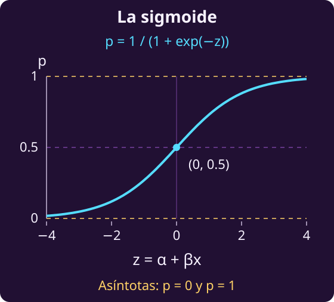
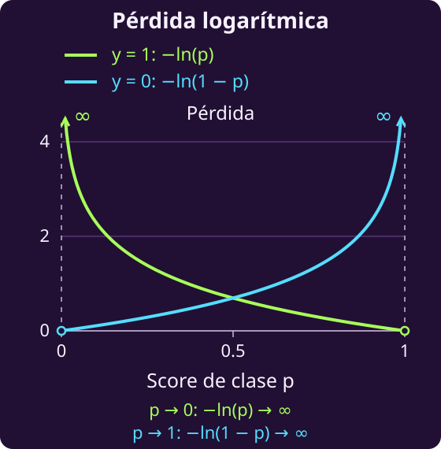

# Clasificar mensajes y evaluar probabilidades

**Clasificar** consiste en decidir a qué grupo pertenece un caso. Aquí
trabajaremos con dos clases, llamadas 0 y 1. Primero construiremos una regla
para asignarlas; después compararemos dos maneras de decidir qué regla es mejor.

## 1 · Distinguir los datos de lo que vamos a elegir

Tenemos $n\ge1$ casos ya revisados. Para cada caso conocemos una entrada
numérica y su clase correcta. Los escribimos como

$$(x_i,y_i),\qquad i=1,\ldots,n.$$

El índice $i$ identifica un caso; $x_i\in\mathbb R$ es su entrada y
$y_i\in\{0,1\}$, su etiqueta. Las entradas pueden tomar muchos valores:
**tener dos clases no significa que la entrada también deba ser binaria**.

Para darles un significado concreto, pensemos en mensajes: $y_i=1$ indica
un mensaje fraudulento y $y_i=0$, uno legítimo. La entrada $x_i$ cuenta
cuántos enlaces contiene. En este ejemplo es un entero no negativo; podría
valer 0, 1, 2 o más.

El número de enlaces puede ser una señal para clasificar, pero por sí solo
no garantiza que un mensaje sea fraudulento. Usaremos los mensajes revisados
para ajustar una regla y comprobar qué consigue con esa información.

**Piensa: ¿podemos cambiar las etiquetas para que nuestra regla acierte más?**

No. Las entradas y las etiquetas son **datos conocidos**. Elegiremos los
parámetros de la regla; no modificaremos los casos para mejorar su puntuación.

## 2 · Convertir una entrada en una probabilidad y una etiqueta

Elegimos dos números reales: $\alpha$, el **intercepto**, y $\beta$, la
**pendiente**. Con ellos calculamos un puntaje para cada caso:

$$z_i(\alpha,\beta)=\alpha+\beta x_i.$$

El intercepto fija el puntaje cuando la entrada vale cero. La pendiente
indica cuánto cambia ese puntaje al aumentar la entrada en una unidad.
Usamos **la misma pareja de parámetros para todos los casos** y permitimos
cualquier valor real:

$$\alpha,\beta\in\mathbb R.$$

**Piensa: el puntaje puede ser negativo o mayor que uno; ¿cómo lo convertiríamos en una probabilidad?**

Aquí proponemos una función concreta, llamada **sigmoide**:

$$\sigma(z)=\frac{1}{1+e^{-z}}.$$

La aplicamos al puntaje para estimar la probabilidad de clase 1:

$$p_i(\alpha,\beta)=\sigma\bigl(z_i(\alpha,\beta)\bigr).$$

La sigmoide transforma cualquier puntaje real en un número estrictamente
entre 0 y 1. A la clase 0 le asignamos el complemento $1-p_i(\alpha,\beta)$.
Esta regla se llama [regresión logística](https://cs229.stanford.edu/notes_archive/cs229-notes-all/cs229-notes1.pdf); aquí tiene una sola entrada.

El eje horizontal de la gráfica es **el puntaje**, no el número de enlaces.
Cuando $\beta$ es positiva, más enlaces elevan el puntaje; cuando es negativa,
lo reducen. Esa relación depende de los parámetros que elijamos.

Que las dos probabilidades sumen 1 permite usarlas como un modelo
probabilístico. No demuestra que estén bien **calibradas**: asignar 0.8 a
ciertos mensajes no garantiza que el 80 % de ellos sean fraudulentos.
Eso tendría que comprobarse con datos.

Para anunciar una etiqueta fijamos el umbral en 0.5. **El empate da clase 1**:

$$
\widehat y_i(\alpha,\beta)=
\begin{cases}
1 &\text{si }p_i(\alpha,\beta)\ge0.5,\\
0 &\text{si }p_i(\alpha,\beta)<0.5.
\end{cases}
$$

Solo elegimos $\alpha$ y $\beta$. El puntaje, la probabilidad y la etiqueta
se calculan a partir de ellos; no podemos escogerlos por separado para
hacer que cada mensaje salga bien.

## 3 · Contar cuántas etiquetas acertamos

Queremos acertar tantas etiquetas como sea posible y damos el mismo peso
a cada caso. **Piensa: ¿cómo contarías un acierto y dejarías fuera un error?**

Usamos un **indicador**, escrito $\mathbf1\{\cdot\}$: vale 1 cuando lo que
está entre llaves es verdadero y 0 cuando es falso. Así,
$\mathbf1\{\widehat y_i(\alpha,\beta)=y_i\}$ cuenta el acierto del caso $i$.
Sumamos los aciertos y dividimos entre el número de casos:

$$A(\alpha,\beta)=\frac1n\sum_{i=1}^n
\mathbf1\{\widehat y_i(\alpha,\beta)=y_i\}.$$

Esta proporción se llama **accuracy**. Toma valores entre 0 y 1 y no tiene
unidades. Nuestro primer problema de optimización es

$$\max_{\alpha,\beta\in\mathbb R}\quad A(\alpha,\beta).$$

**Piensa: si la clase correcta es 1, ¿cuenta distinto acertar con probabilidad 0.51 que con 0.99?**

No: ambos casos cuentan un acierto. Podemos cambiar los parámetros y las
probabilidades sin cambiar ninguna etiqueta. Mientras eso ocurra, accuracy
permanece en una **meseta**: su valor no cambia. Cuando una probabilidad cruza
el umbral, el conteo puede saltar.

Dentro de una meseta, sus derivadas no señalan cómo conseguir más aciertos.

## 4 · Valorar la probabilidad de la clase correcta

Podemos evaluar algo que el conteo de aciertos deja fuera: **cuánta
probabilidad recibe la clase correcta**. Proponemos usar el negativo de su
logaritmo natural, una medida llamada **pérdida logarítmica** o *log loss*.

Es una elección del modelo. Interesarse por las probabilidades no obliga
a usar esta fórmula; vamos a examinar qué mide y qué facilita al ajustar.

**Piensa: si la etiqueta correcta es 0, ¿debemos evaluar la probabilidad de clase 1 o su complemento?**

Evaluamos $p_i$ cuando $y_i=1$ y $1-p_i$ cuando $y_i=0$. Las pérdidas de
cada caso son, respectivamente, $-\ln p_i$ y $-\ln(1-p_i)$.

La pérdida se acerca a cero cuando la probabilidad de la clase correcta
se acerca a uno. Crece sin límite cuando esa probabilidad se acerca a cero.
Así, **equivocarse con mucha confianza recibe una penalización grande**.

Reunimos los dos casos en una sola expresión:

$$
\begin{aligned}
\ell_i(\alpha,\beta)={}&-y_i\ln p_i(\alpha,\beta)\\
&-(1-y_i)\ln\bigl(1-p_i(\alpha,\beta)\bigr).
\end{aligned}
$$

Como $y_i$ vale 0 o 1, uno de los dos términos desaparece. Para parámetros
finitos, la sigmoide mantiene positivos los argumentos de ambos logaritmos.
Promediamos las pérdidas de los $n$ casos:

$$L(\alpha,\beta)=\frac1n\sum_{i=1}^n\ell_i(\alpha,\beta).$$

El segundo problema de optimización es

$$\min_{\alpha,\beta\in\mathbb R}\quad L(\alpha,\beta).$$

La pérdida promedio se expresa en **nats por caso**, porque usamos
logaritmos naturales. No es un porcentaje de errores.

Con esta regla logística, la pérdida varía suavemente con los parámetros.
Sus derivadas pueden orientar cambios para reducirla, incluso cuando las
etiquetas todavía no cambian.
Esa es una razón para usarla como **objetivo sustituto** al ajustar una regla
con la que queremos acertar etiquetas.

## 5 · Comprobar cuándo coinciden las dos medidas

**Piensa: ¿reducir la pérdida siempre aumenta los aciertos?**

Consideremos un conjunto hipotético donde $n$ es múltiplo de 3 y dos
terceras partes de las etiquetas son 1. La tercera parte restante es 0.
Para comparar las dos medidas, construiremos algunas reglas **constantes**:
fijamos $\beta=0$ y así todas las observaciones reciben la misma probabilidad
$p$ de clase 1, cualquiera que sea su entrada $x_i$.

**¿Qué valor de $\alpha$ produce la probabilidad que queremos comparar?**
Al sustituir $\beta=0$ en la sigmoide y despejar, obtenemos

$$
\begin{aligned}
p&=\frac{1}{1+e^{-\alpha}},\\
e^{-\alpha}&=\frac{1-p}{p},\\
e^\alpha&=\frac{p}{1-p},\\
\alpha&=\ln\!\left(\frac{p}{1-p}\right).
\end{aligned}
$$

Esta transformación se llama **logit** y está definida para $0<p<1$.
Por ejemplo, para asignar $p=2/3$ a todos los casos elegimos
$\alpha=\ln 2$ y $\beta=0$. Las probabilidades 0 y 1 solo se alcanzan
como límites cuando $\alpha$ tiende a menos o más infinito.

**Aquí estamos construyendo ejemplos, no resolviendo todavía la optimización.**
Fijamos $\beta=0$ solo para esta comparación. En el modelo general,
el logit de $p_i$ es $\alpha+\beta x_i$, y ambos parámetros se pueden ajustar.

Las tres reglas de la tabla pertenecen a nuestra familia.
**Para calcular su pérdida promedio, agrupamos los casos por su etiqueta.**
Al sustituir $y_i$ en la pérdida de una observación, obtenemos:

- **Etiqueta 1:** hay $2n/3$ casos. Sustituimos $y_i=1$:

  $$\begin{aligned}
  \ell_i&=-1\ln p-0\ln(1-p)\\
  &=-\ln p.
  \end{aligned}$$

- **Etiqueta 0:** hay $n/3$ casos. Sustituimos $y_i=0$:

  $$\begin{aligned}
  \ell_i&=-0\ln p-1\ln(1-p)\\
  &=-\ln(1-p).
  \end{aligned}$$

Sumamos esas contribuciones y dividimos entre los $n$ casos:

$$
\begin{aligned}
L(\alpha,0)
&=\frac1n\left[\frac{2n}{3}(-\ln p)\right.\\
&\qquad\left.+\frac n3(-\ln(1-p))\right]\\
&=-\frac{2n}{3n}\ln p-\frac{n}{3n}\ln(1-p)\\
&=-\frac23\ln p-\frac13\ln(1-p).
\end{aligned}
$$

Los pesos $2/3$ y $1/3$ son las **proporciones de etiquetas en estos datos**;
$p$ es la **probabilidad que anuncia la regla**. Son cantidades distintas.

Las pérdidas están redondeadas y las fracciones de aciertos son exactas.

| $p$ | Aciertos | Pérdida |
|---|---:|---:|
| 0.49 | 1/3 | 0.700 |
| 2/3 | 2/3 | 0.637 |
| 0.9 | 2/3 | 0.838 |

Al pasar de 0.49 a 2/3, **mejoran ambas medidas**: baja la pérdida y sube
la proporción de aciertos. Pasar de 0.9 a 2/3 también reduce la pérdida,
pero conserva las etiquetas y, por tanto, los aciertos.

En cambio, pasar de 0.9 a 0.49 reduce la pérdida **y reduce los aciertos**.
La regla de 0.9 penaliza mucho a los casos de clase 0: les asigna solo 0.1
de probabilidad de pertenecer a su clase correcta.

Estos ejemplos muestran que los criterios pueden coincidir o discrepar.
No hemos encontrado los óptimos globales de los dos problemas ni probado
que sean distintos. Tampoco hay una garantía de que cada mejora de la
pérdida mejore accuracy.

Si el propósito es acertar etiquetas, debemos comprobar accuracy después
del ajuste. Para evaluar mensajes nuevos necesitamos además **datos que no
hayan intervenido en ese ajuste**. Ninguno de los dos objetivos garantiza
por sí solo buenos resultados fuera de los casos usados.

Algo parecido ocurre al contar aciertos en una actividad educativa:
responder bien con ayuda no demuestra que después se responderá sin ella.
En [[opt-objetivo-aprendizaje-practica|la práctica de aprendizaje]] revisarás esa diferencia.

## 6 · Resumen de los dos modelos

Los datos son $n\ge1$ pares $(x_i,y_i)$, con $i=1,\ldots,n$,
$x_i\in\mathbb R$ y $y_i\in\{0,1\}$. En el ejemplo, $x_i$ cuenta enlaces
y la clase 1 significa fraude. Ajustamos una sola regla para todos los casos.

| Símbolo | Qué representa |
|---|---|
| $n$ | Número de casos |
| $i$ | Índice de caso |
| $x_i$ | Entrada del caso |
| $y_i$ | Clase correcta |
| $\alpha$ | Intercepto |
| $\beta$ | Pendiente |
| $z_i$ | Puntaje |
| $\sigma$ | Sigmoide |
| $p_i$ | Probabilidad de clase 1 |
| $\widehat y_i$ | Clase anunciada |
| $\mathbf1\{\cdot\}$ | Indicador |
| $A$ | Proporción de aciertos |
| $\ell_i$ | Pérdida del caso |
| $L$ | Pérdida promedio |
| $\alpha^\star,\beta^\star$ | Parámetros óptimos |
| $T$ | Iteraciones |

**Las decisiones son $\alpha,\beta\in\mathbb R$.** Las entradas y las
etiquetas son datos. Los puntajes $z_i$, las probabilidades $p_i$, las
etiquetas anunciadas $\widehat y_i$ y las medidas se calculan a partir de
los datos y los parámetros elegidos. La sigmoide y el umbral forman parte
de la regla fijada. No hemos añadido variables auxiliares independientes:
$z_i$ y $p_i$ son expresiones calculadas, aunque les demos un nombre.
Ajustar $\alpha$ y $\beta$ es nuestra decisión sobre la regla; no cambia
la clase real de ningún mensaje.

$$z_i(\alpha,\beta)=\alpha+\beta x_i.$$

$$\sigma(z)=\frac{1}{1+e^{-z}},\qquad
p_i(\alpha,\beta)=\sigma\bigl(z_i(\alpha,\beta)\bigr).$$

$$
\widehat y_i(\alpha,\beta)=
\begin{cases}
1 &\text{si }p_i(\alpha,\beta)\ge0.5,\\
0 &\text{si }p_i(\alpha,\beta)<0.5.
\end{cases}
$$

El umbral es fijo y el empate da clase 1. La probabilidad de clase 0 es
$1-p_i$; ninguna de las dos probabilidades se elige por separado.

**Modelo 1 · Maximizar los aciertos.** El indicador vale 1 si acertamos
y 0 si nos equivocamos. La formulación completa es

$$
\begin{aligned}
&\max_{\alpha,\beta\in\mathbb R}\quad A(\alpha,\beta),\\
&A(\alpha,\beta)=\frac1n\sum_{i=1}^n
\mathbf1\{\widehat y_i(\alpha,\beta)=y_i\}.
\end{aligned}
$$

El máximo es **un valor de accuracy**. Para indicar qué parámetros lo
alcanzan, escribimos

$$(\alpha^\star,\beta^\star)\in
\operatorname*{arg\,max}_{\alpha,\beta\in\mathbb R} A(\alpha,\beta).$$

$\operatorname*{arg\,max}$ devuelve el conjunto de parejas óptimas; usamos
pertenencia porque puede haber empates. Los argumentos bajo el operador
indican qué elegimos: $\alpha$ y $\beta$, manteniendo fijos los datos.

Es optimización con parámetros continuos y un objetivo, en general,
discontinuo y no cóncavo. No es un problema de optimización convexa en general.

**Modelo 2 · Minimizar la pérdida logarítmica promedio.** Para cada caso,
la pérdida evalúa la probabilidad de su clase correcta:

$$
\begin{aligned}
\ell_i(\alpha,\beta)={}&-y_i\ln p_i(\alpha,\beta)\\
&-(1-y_i)\ln\bigl(1-p_i(\alpha,\beta)\bigr).
\end{aligned}
$$

La formulación completa es

$$
\begin{aligned}
&\min_{\alpha,\beta\in\mathbb R}\quad L(\alpha,\beta),\\
&L(\alpha,\beta)=\frac1n\sum_{i=1}^n\ell_i(\alpha,\beta).
\end{aligned}
$$

Es **minimización convexa, suave y no lineal**. Si una pareja finita
alcanza el mínimo, podemos elegirla mediante

$$(\alpha^\star,\beta^\star)\in
\operatorname*{arg\,min}_{\alpha,\beta\in\mathbb R} L(\alpha,\beta).$$

El mínimo es un valor de pérdida; $\operatorname*{arg\,min}$ reúne los
parámetros que lo alcanzan. Puede haber varias parejas o ninguna.

La convexidad no garantiza que aquí exista un mínimo con parámetros finitos.
Si los datos se pueden separar con puntajes estrictamente positivos para
la clase 1 y estrictamente negativos para la clase 0, podemos multiplicar
los parámetros por números cada vez mayores. La pérdida se acerca a cero
sin alcanzarlo. Hemos dejado los parámetros sin límites; en ese caso la
formulación tiene un ínfimo, pero no una pareja finita que lo alcance.

En ese último caso, el conjunto $\operatorname*{arg\,min}$ es vacío:
no existe una pareja óptima finita que podamos seleccionar. Reducir la
pérdida tampoco garantiza aumentar la proporción de aciertos.

### Métodos y costos de los dos modelos

**Piensa: ¿un objetivo suave siempre se puede optimizar más rápido que uno con saltos?**

No basta con mirar la forma del objetivo. También importan la familia de
reglas, el algoritmo y la precisión que buscamos. Aquí solo tenemos una
entrada y dos parámetros.

Para una pareja fija $\alpha,\beta$, evaluar accuracy o la pérdida requiere
recorrer los $n$ casos: cuesta $O(n)$ operaciones. En la pérdida logística,
un paso de **descenso por gradiente con todos los datos** también cuesta
$O(n)$: reúne las contribuciones de los casos para ajustar los dos parámetros.
Hacer $T$ iteraciones cuesta $O(Tn)$, bajo el conteo usual de operaciones
aritméticas. El número $T$ no es una constante garantizada: depende de los
datos, del método y de la precisión buscada.

Para accuracy podemos aprovechar una particularidad de este modelo.
Como $p_i\ge0.5$ equivale a $\alpha+\beta x_i\ge0$, una regla no constante
separa las entradas mediante un **corte**: anuncia clase 1 a un lado y
clase 0 al otro.

Podemos ordenar las entradas, mantener juntas las que tengan el mismo valor
y recorrer los cortes en ambas orientaciones. También incluimos las dos
reglas constantes. Ordenar cuesta $O(n\log n)$; actualizar los conteos al
recorrer los cortes cuesta $O(n)$. Así podemos encontrar un máximo exacto
de accuracy en **$O(n\log n)$**, sin buscar todas las parejas reales.

Volver a contar los $n$ casos desde cero para cada corte daría un barrido
innecesario de $O(n^2)$. Mejorar ese algoritmo es distinto de cambiar el
objetivo. **Usar log loss no garantiza resolver más rápido**: facilita
ajustes guiados por derivadas y evalúa probabilidades, pero optimiza otra medida.

## 7 · Practicar con tres o más categorías

**Intenta resolver el ejercicio sin abrir las pistas ni la respuesta y sin
usar ChatGPT. Escribe primero tu propuesta; usa las pistas solo después de
haber hecho un esfuerzo por formularla.**

::: exercise {#opt-clasificacion-ej-multiclase title="Anunciar una sola categoría entre varias"}
Ahora tenemos $K\ge3$ categorías conocidas, numeradas del 1 al $K$.
Son **excluyentes**: cada observación pertenece exactamente a una categoría.
No estamos asignando varias etiquetas simultáneas a un mismo caso; eso sería
un problema de clasificación multietiqueta.

Disponemos de $n\ge1$ observaciones ya revisadas. Para la observación $i$
conocemos la misma clase de entrada numérica univariada $x_i\in\mathbb R$
y una etiqueta correcta $y_i\in\{1,\ldots,K\}$. El índice $i$ recorre las
observaciones, no las categorías.

Queremos una regla compartida que, a partir de esa única entrada, asigne
probabilidades a las $K$ categorías y anuncie **una sola etiqueta**. Si
varias categorías empatan en la probabilidad más alta, anunciaremos la de
menor índice. Las entradas y etiquetas conocidas no se pueden modificar.

1. Distingue los datos de los parámetros que ajustarías. Propón cómo
   extender la regla para valorar todas las categorías y convertir esas
   valoraciones en probabilidades que, juntas, sumen uno.
2. Explica cómo obtendrías una sola etiqueta y formula dos objetivos:
   maximizar la proporción de aciertos y minimizar la pérdida logarítmica
   promedio de la clase correcta. Escribe qué parámetros se eligen.
3. Distingue el valor óptimo de los parámetros que lo alcanzan. Describe un
   método posible para cada objetivo y qué tendrías que contar para estimar
   su costo. No necesitas resolver los problemas ni inventar datos numéricos.

Si todavía no conoces una fórmula para producir todas las probabilidades,
explica qué condiciones tendría que cumplir. La respuesta presenta una
propuesta concreta; no es la única regla de clasificación posible.
:::

::: hint {#opt-clasificacion-pista-multiclase-datos of="opt-clasificacion-ej-multiclase" title="Pista 1 · Separar observaciones y categorías"}
Organiza la información antes de escribir el objetivo:

- Para cada observación conoces una entrada numérica y una etiqueta correcta.
- El número de categorías está fijado; no crece al añadir observaciones.
- Los ajustes de la regla se comparten entre todas las observaciones.

En el caso binario bastaba valorar una clase y tomar el complemento. ¿Qué
información falta para distinguir varias alternativas a partir de la misma
entrada? ¿Qué nombres necesitarías para separar el caso de la categoría?
:::

::: hint {#opt-clasificacion-pista-multiclase-probabilidades of="opt-clasificacion-ej-multiclase" title="Pista 2 · Revisar las probabilidades juntas"}
Comprueba tu propuesta con estas preguntas: ¿basta con obtener varios
números entre cero y uno para que formen las probabilidades de un mismo
caso? ¿Cómo verificarías que reparten toda la probabilidad disponible?

Una vez anunciada una etiqueta, ¿cuántos aciertos puede aportar esa
observación? Para la pérdida, ¿qué probabilidad debes evaluar entre todas
las que produjo la regla?
:::

::: answer {#opt-clasificacion-respuesta-multiclase of="opt-clasificacion-ej-multiclase" title="Respuesta · Comparar categorías con una regla compartida"}

### Datos, decisiones y expresiones calculadas

Los **datos fijos** son los $n\ge1$ pares $(x_i,y_i)$ y el número entero
$K\ge3$ de categorías. Cada $x_i$ es real y cada $y_i$ pertenece a
$\{1,\ldots,K\}$. Usamos $i=1,\ldots,n$ para las observaciones y
$k=1,\ldots,K$ para las categorías; $j$ será otro índice para recorrerlas
en una suma.

Proponemos **un intercepto y una pendiente por categoría**. Ahora
$\alpha=(\alpha_1,\ldots,\alpha_K)$ y
$\beta=(\beta_1,\ldots,\beta_K)$ son vectores. A diferencia del ejemplo
binario, cada uno reúne $K$ parámetros reales. Las decisiones permitidas son

$$\alpha,\beta\in\mathbb R^K.$$

Estos $2K$ parámetros ajustan la regla y se comparten entre los casos.
No elegimos una pareja diferente para cada observación ni cambiamos su clase
correcta. El dominio real no introduce cotas a los parámetros.

| Signo | Qué representa |
|---|---|
| $n$ | Número de casos |
| $K$ | Número de categorías |
| $i$ | Índice de caso |
| $k,j$ | Índices de categoría |
| $x_i$ | Entrada del caso |
| $y_i$ | Clase correcta |
| $\alpha_k$ | Intercepto de clase |
| $\beta_k$ | Pendiente de clase |
| $\alpha,\beta$ | Vectores de parámetros |
| $z_{ik}$ | Puntaje de clase |
| $p_{ik}$ | Probabilidad de clase |
| $\widehat y_i$ | Clase anunciada |
| $\mathbf1\{\cdot\}$ | Indicador |
| $\ell_i$ | Pérdida del caso |
| $A$ | Proporción de aciertos |
| $L$ | Pérdida promedio |
| $\alpha^\star,\beta^\star$ | Parámetros óptimos |
| $M$ | Candidatos evaluados |
| $T$ | Iteraciones |

Los puntajes y las probabilidades que aparecen a continuación son
**expresiones calculadas**, no variables auxiliares libres. Tampoco lo son
las etiquetas anunciadas ni las medidas $A$ y $L$. No añadimos variables
independientes para reformular los problemas.

### De los puntajes a una sola etiqueta

Calculamos un puntaje para la categoría $k$ en el caso $i$:

$$z_{ik}(\alpha,\beta)=\alpha_k+\beta_kx_i.$$

Una forma de convertir los $K$ puntajes en probabilidades es la función
[softmax, presentada en las notas de Stanford sobre clasificación](https://cs229.stanford.edu/notes_archive/cs229-notes-all/cs229-notes1.pdf#page=26).
Para aligerar la notación, escribimos $z_{ik}$ y $p_{ik}$ sin repetir sus
argumentos: ambos dependen de los vectores $\alpha,\beta$.

$$p_{ik}=\frac{e^{z_{ik}}}{\sum_{j=1}^K e^{z_{ij}}}.$$

Cada exponencial es positiva y el denominador suma las de todas las
categorías del mismo caso. Por eso

$$0<p_{ik}<1,\qquad\sum_{k=1}^K p_{ik}=1.$$

Son probabilidades propuestas por el modelo. Cumplir estas condiciones no
demuestra que estén calibradas ni que la entrada permita clasificar bien.

Para anunciar la etiqueta buscamos las categorías con probabilidad máxima.
Si hay empate, tomamos el menor índice del conjunto empatado:

$$\widehat y_i(\alpha,\beta)=
\min\left(\operatorname*{arg\,max}_{1\le k\le K}p_{ik}\right).$$

Aquí $\operatorname*{arg\,max}$ **recorre las categorías $k$ con los
parámetros ya fijados**. Más adelante lo usaremos para recorrer los
parámetros al ajustar la regla: son operaciones distintas. El mínimo
exterior solo resuelve el empate; no busca la categoría menos probable.

### Maximizar los aciertos

Cada caso aporta un acierto si la etiqueta anunciada coincide con la correcta:

$$A(\alpha,\beta)=\frac1n\sum_{i=1}^n
\mathbf1\{\widehat y_i(\alpha,\beta)=y_i\}.$$

La formulación completa es

$$\max_{\alpha,\beta\in\mathbb R^K} A(\alpha,\beta).$$

Para seleccionar parámetros que alcancen ese valor, escribimos

$$(\alpha^\star,\beta^\star)\in
\operatorname*{arg\,max}_{\alpha,\beta\in\mathbb R^K} A(\alpha,\beta).$$

Ahora se eligen **los dos vectores de parámetros** y se mantienen fijos
los $n$ datos y las $K$ categorías. El máximo es una proporción entre 0 y 1;
el argmax reúne las parejas de vectores que la alcanzan. Como solo hay
un número finito de conteos de aciertos posibles, alguno de los realizables
es el mayor, aunque distintas parejas puedan empatar.

El objetivo tiene mesetas y saltos y no es cóncavo en general. Este problema
con parámetros continuos **no es optimización convexa en general**.

Evaluar una regla dada cuesta $O(nK)$: calculamos y comparamos los puntajes
de $K$ categorías en cada uno de los $n$ casos. Un método posible es
proponer **$M\ge1$ parejas de vectores candidatas**, evaluarlas y conservar una
con el mayor conteo. El barrido de esos candidatos dados cuesta $O(MnK)$.

Esa búsqueda encuentra el mejor candidato de la lista, **no garantiza el
máximo global sobre todos los parámetros reales**. Es una aproximación
al problema original, sin garantía de precisión por el solo tamaño de la
lista. El recorrido exacto de un corte binario no se extiende automáticamente
a estas $K$ categorías.

### Minimizar la pérdida de la clase correcta

La etiqueta conocida $y_i$ indica cuál de las $K$ probabilidades debemos
evaluar. Así, $p_{i,y_i}$ significa la probabilidad asignada a la clase
correcta del caso $i$. Su pérdida es

$$\ell_i(\alpha,\beta)=-\ln p_{i,y_i}.$$

Promediamos sobre los casos y formulamos el segundo problema:

$$L(\alpha,\beta)=\frac1n\sum_{i=1}^n\ell_i(\alpha,\beta).$$

$$\min_{\alpha,\beta\in\mathbb R^K} L(\alpha,\beta).$$

La pérdida se mide en nats por caso. Una pareja finita que alcance el mínimo,
si existe, satisface

$$(\alpha^\star,\beta^\star)\in
\operatorname*{arg\,min}_{\alpha,\beta\in\mathbb R^K} L(\alpha,\beta).$$

Este es un problema de **minimización convexa, suave y no lineal**.
Un método posible es descenso por gradiente usando todos los datos.
Evaluar la pérdida o calcular ese gradiente cuesta $O(nK)$; realizar $T$
iteraciones cuesta $O(TnK)$ bajo el conteo usual de operaciones aritméticas.
$T$ depende de los datos, del método y de la precisión buscada; no representa
una constante garantizada ni asegura alcanzar un mínimo en tiempo finito.

Puede no existir un mínimo con parámetros finitos. Si podemos hacer que
el puntaje de la clase correcta sea estrictamente mayor que todos los
otros en cada caso, escalar esos parámetros acerca su probabilidad a uno
y la pérdida a cero, sin alcanzarlo. En esa situación el argmin es vacío.

Además, los parámetros son **redundantes**: sumar el mismo número a todos
los interceptos, o a todas las pendientes, no cambia las probabilidades.
El desplazamiento común de los puntajes se cancela en el cociente softmax.
Por eso no debemos prometer una pareja óptima única, incluso cuando existe
un mínimo. No necesitamos imponer regularización para formular el problema.

**Los dos objetivos siguen midiendo cosas distintas.** Uno cuenta etiquetas
acertadas y el otro evalúa probabilidades de las clases correctas. Reducir
la pérdida no garantiza mejorar accuracy. Para comprobar cómo funciona la
regla fuera del ajuste necesitamos otros datos que no hayan determinado
sus parámetros.
:::

Consulta opcional: [[opt-objetivo-clasificacion-modelo|generalizar la regla a varias características]].

Siguiente ejemplo: [[opt-objetivo-juego-practica|elegir una jugada cuando el rival responde]].
