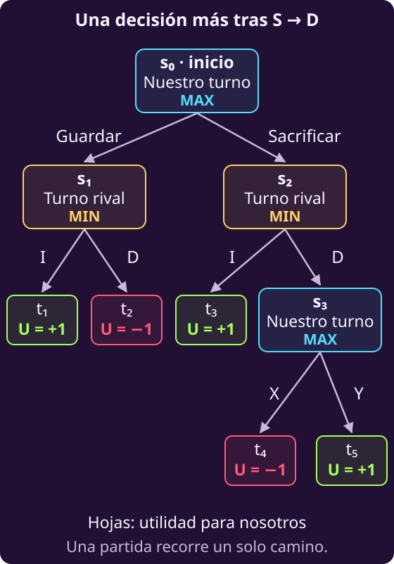

# Elegir una jugada cuando el rival responde

Hasta ahora comparábamos decisiones usando datos sobre sus consecuencias.
En un juego aparece otra dificultad: **la consecuencia también depende de
lo que decida otra persona**. Queremos ganar, pero el rival también.

Usaremos un juego pequeño cuyos resultados conocemos por completo. Después
extenderemos una de sus ramas para decidir también en un turno posterior.

## 1 · Separar nuestra jugada de la respuesta rival

Puedes **Guardar** una ficha o **Sacrificarla**. Después, el rival observa
tu acción y elige una respuesta llamada I o D. Las letras solo distinguen
sus dos opciones.

No hay azar: una misma combinación de acciones produce siempre el mismo
resultado. El juego es **determinista**. Después de esas dos decisiones,
los movimientos restantes son obligatorios y nadie puede cambiar el final.

Las columnas I y D son las respuestas del rival. Los valores son tus puntos:
+1 si ganas y −1 si pierdes.

| Acción | I | D |
|---|---:|---:|
| Guardar | +1 | −1 |
| Sacrificar | +1 | +1 |

Solo valoramos ganar: ni conservar fichas ni terminar antes da puntos.
El rival recibe la puntuación contraria. Ambas puntuaciones suman cero;
por eso es un juego de **suma cero**, no simplemente porque haya dos jugadores.

Ambos conocen la tabla. Suponemos que el rival elige la respuesta que más
le conviene: si puede hacernos perder, lo hace.

**¿Conocer las dos respuestas significa que podemos elegir una por él?**

No. Nosotros elegimos una fila; el rival elige una columna de esa fila.
Para escribir el modelo, separamos los datos de esas decisiones:

- $A$ es el conjunto de nuestras acciones permitidas.
- $B(a)$ contiene las respuestas permitidas al rival después de nuestra acción $a$.
- $U(a,b)$ es nuestra puntuación final, o **utilidad**, para esa combinación.

Los conjuntos son finitos y no vacíos. Son datos conocidos, igual que $U$.
Elegimos $a$; el rival elige $b$ después de observarnos. Las acciones no
tienen unidades físicas; la utilidad se mide en los puntos acordados.

## 2 · Construir el valor de una acción

**Si una fila permite ganar o perder, ¿qué resultado puede imponernos el rival?**

Como su utilidad es $-U$, obtener más puntos para él significa dejarnos
menos a nosotros. Para una acción propia ya fijada, el valor que podemos
asegurar es el menor entre sus respuestas permitidas:

$$v(a)=\min_{b\in B(a)}U(a,b).$$

Este número resume una fila de la tabla y se mide en los mismos puntos
que $U$. No podemos elegirlo libremente: depende de la acción y de los
resultados que deja disponibles al rival.

Ahora comparamos nuestras acciones. Queremos que ese valor sea lo más
alto posible, por lo que el modelo completo es

$$\begin{aligned}
\max_a\quad &\min_{b\in B(a)}U(a,b)\\
\text{sujeto a}\quad &a\in A.
\end{aligned}$$

**El máximo representa nuestra elección; el mínimo, la del rival.** Los
conjuntos $A$ y $B(a)$ contienen los dominios y todas las jugadas permitidas.
No hay otras restricciones de recursos. Maximizar conjuntamente sobre
$a$ y $b$ nos daría control sobre ambos jugadores y cambiaría el problema.

## 3 · Comprobar el modelo con los resultados conocidos

Abreviamos Guardar con $G$ y Sacrificar con $S$. Al sustituir los datos,
los conjuntos son $A=\{G,S\}$ y $B(G)=B(S)=\{I,D\}$. El modelo queda

$$\max_{a\in\{G,S\}}\min\{U(a,I),U(a,D)\}.$$

Cada acción recibe este valor:

$$
\begin{aligned}
v(G)&=\min\{1,-1\}=-1,\\
v(S)&=\min\{1,1\}=1.
\end{aligned}
$$

Sacrificar asegura la victoria con estas reglas. Guardar deja al rival
una respuesta que nos derrota. Si miráramos solo el mejor resultado de
cada fila, ambas recibirían un 1 y ocultaríamos esa diferencia.

Un máximo y un mínimo no implican por sí solos que exista un rival. En
salones podíamos atender al grupo con mayor molestia sin suponer que nadie
nos atacara. Aquí sí hay otra persona eligiendo según sus intereses.

Si quisiéramos aprovechar errores frecuentes de un rival, necesitaríamos
datos sobre cómo responde y otro modelo de su conducta. La tabla de
resultados no proporciona probabilidades para promediar sus columnas.

## 4 · Añadir una decisión después de la respuesta rival

Hasta aquí, después de nuestra acción y la respuesta rival, el final estaba
fijado. **Ahora cambiamos una sola rama del juego:** si elegimos Sacrificar
y el rival responde D, vuelve a ser nuestro turno.

En ese nuevo estado tenemos dos acciones, llamadas X y Y. Elegir X termina
en derrota, con utilidad −1; elegir Y termina en victoria, con utilidad +1.
Las otras ramas conservan sus resultados. Sigue sin haber azar y el rival
recibe la utilidad contraria a la nuestra. Ambos conocen las opciones y
observan las jugadas anteriores.

**¿Basta con decidir «Sacrificar» si después podríamos elegir X o Y?**

Para describir esta variante usamos un **árbol**, un caso particular de
un grafo. Cada nodo representa un estado y dice a quién le toca decidir.
Cada flecha representa una acción permitida. Las hojas son los finales y
muestran **nuestra utilidad**, incluso cuando la última acción la tomó el rival.

Los estados $s_0,s_1,s_2,s_3$ requieren una decisión; los cinco estados
$t_1,\ldots,t_5$ son finales. En nuestros turnos aparece **MAX**, porque
buscamos una utilidad alta. En los del rival aparece **MIN**, porque él
prefiere dejarnos una utilidad baja.

Una partida recorre **un solo camino** desde el inicio hasta un final.
Por ejemplo, Sacrificar → D → X termina en $t_4$, donde perdemos. El árbol
muestra también los caminos que esa partida no recorrió.

Son turnos sucesivos de una misma partida. Todavía no estamos planteando
jugar varias partidas ni aprender de resultados anteriores.

## 5 · Valorar los estados desde los finales

En la tabla original, $U(a,b)$ describía el resultado final de dos acciones.
En la variante, llegar por Sacrificar–D no termina la partida. **Reservaremos
$U(s)$ para la utilidad de un estado final** y usaremos $V(s)$ para el valor
que calculamos en cualquier estado.

Las utilidades de las hojas son datos. El valor de un estado intermedio
resume lo que podemos asegurar desde allí si ambos jugadores eligen según
sus intereses. No es otra cantidad que podamos decidir libremente.

**¿Qué valor tiene llegar a un estado donde todavía podemos elegir cómo terminar?**

Empezamos por $s_3$, nuestro último turno posible. Allí X da −1 y Y da +1:

$$V(s_3)=\max\{-1,1\}=1.$$

El valor es 1 porque podemos elegir Y. No significa que toda acción desde
ese estado sea igual de buena.

Ahora podemos valorar $s_2$, donde el rival responde a Sacrificar. Si elige
I, ganamos inmediatamente; si elige D, llegamos a $s_3$, donde podemos
asegurar 1. Por tanto,

$$V(s_2)=\min\{1,V(s_3)\}=1.$$

En $s_1$, después de Guardar, el rival elige entre dos finales conocidos:

$$V(s_1)=\min\{1,-1\}=-1.$$

Por último comparamos nuestras opciones en el estado inicial:

$$V(s_0)=\max\{V(s_1),V(s_2)\}=1.$$

El plan óptimo es **Sacrificar al inicio y elegir Y si después ocurre D**.
Si el rival responde I, la partida ya termina con victoria. Así, nuestro
plan dice qué hacer cuando vuelve a tocarnos, no solo cómo empezar.

Este razonamiento se llama **inducción hacia atrás**: calculamos primero
los valores de los finales y después los de sus estados anteriores.
La partida se juega hacia delante; lo que hacemos hacia atrás es valorar
las opciones. Los valores coinciden con los de la tabla inicial porque,
en la rama ampliada, podemos elegir la continuación que gana.

## 6 · Reunir el modelo del árbol

Para escribir la misma idea en cualquier árbol finito de este tipo,
necesitamos identificar los estados, las acciones permitidas y a quién le
toca jugar. Todas esas reglas, junto con las utilidades finales, son datos.

| Símbolo | Qué representa |
|---|---|
| $s$ | Estado de la partida |
| $A(s)$ | Acciones permitidas |
| $a$ | Acción en ese estado |
| $T(s,a)$ | Estado siguiente |
| $U(s)$ | Utilidad de un final |
| $V(s)$ | Valor del estado |
| $a^\star$ | Acción óptima |

Aquí $A(s)$ es el conjunto finito, no vacío, de acciones de un estado que
no es final. $T(s,a)$ indica adónde lleva la acción $a$. El jugador de turno
elige $a\in A(s)$; no elige la transición ni la utilidad del final.
Los valores $U$ y $V$ se miden siempre en **nuestros puntos**.

**En un final**, no queda ninguna acción por elegir:

$$V(s)=U(s).$$

**En nuestro turno**, elegimos la continuación con mayor valor:

$$V(s)=\max_{a\in A(s)}V\bigl(T(s,a)\bigr).$$

**En el turno rival**, él elige la continuación de menor valor para nosotros:

$$V(s)=\min_{a\in A(s)}V\bigl(T(s,a)\bigr).$$

La alternancia de máximos y mínimos se llama **minimax**. Los dominios
$A(s)$ recogen las jugadas permitidas; no hay otras restricciones de recursos.
Las hojas proporcionan los datos con los que se calculan todos los demás
valores, sin atribuirnos control sobre las decisiones del rival.

**El valor óptimo no es una jugada.** En un estado nuestro, el máximo devuelve
puntos; $\operatorname{arg\,max}$ reúne las acciones que alcanzan ese valor.
Una acción óptima satisface

$$a^\star\in\operatorname*{arg\,max}_{a\in A(s)}
V\bigl(T(s,a)\bigr).$$

Escribimos pertenencia porque varias acciones podrían empatar. En nuestro
árbol, el valor inicial es 1 y la única acción inicial óptima es Sacrificar.
En $s_3$, la acción óptima es Y.

Es **optimización discreta, finita y adversarial**. La inducción hacia atrás
permite valorar cada estado cuando ya conocemos los valores de todas sus
continuaciones. Aquí el árbol es pequeño y conocemos todas sus hojas;
podemos completar el razonamiento sin aproximar resultados futuros.
