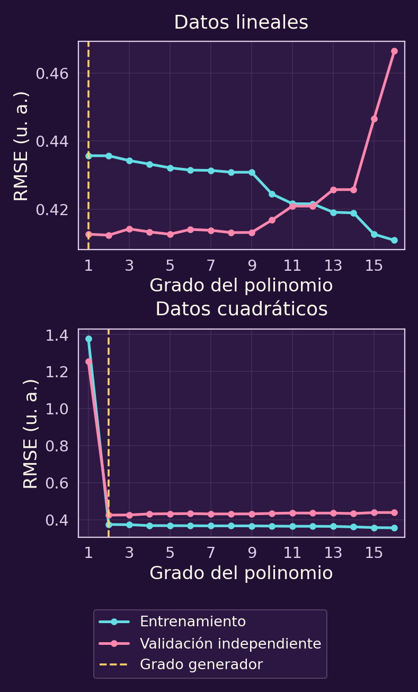

# Predecir un valor y elegir la complejidad del modelo

Una empresa de reparto quiere estimar **cuántos minutos tardará una entrega**
a partir de su distancia. La respuesta es un número. Veremos cómo pasar de
entregas observadas a una regla de predicción, medir sus errores y elegir
cuánta flexibilidad necesita la regla.

## 1 · Empezar por las entregas observadas

Una entrega registrada aporta dos números: distancia y tiempo. Por ejemplo,
las primeras tres filas de **101 entregas simuladas** son estas (cifras
redondeadas):

| $i$ | Distancia $x_i$ (km) | Tiempo $y_i$ (min) |
|---|---:|---:|
| 1 | 0.526 | 3.589 |
| 2 | 0.676 | 14.494 |
| 3 | 0.969 | 13.073 |
| $\vdots$ | $\vdots$ | $\vdots$ |
| $n$ | $x_n$ | $y_n$ |

La última fila representa cualquier conjunto con $n\ge1$ entregas;
en esta simulación, $n=101$. Escribimos cada fila como $(x_i,y_i)$,
con $i=1,\ldots,n$. **$n$ cuenta entregas; $i$ señala una de ellas.**
Los datos ya fueron observados: no podemos elegirlos para que la
predicción resulte más fácil. Aquí distancias y tiempos observados
son no negativos.

En la siguiente nube cada punto representa una entrega. Los tiempos varían
incluso para distancias parecidas: también influyen el tráfico, la preparación
del pedido y otros factores. Para hacer visibles los tiempos atípicos,
**añadimos 25 minutos de retraso a siete entregas**. Estos datos son
simulados para aprender el método; no describen los repartos de una
empresa real.

El eje horizontal mide distancia y el vertical, tiempo. La dispersión nos
pide una regla que resuma la tendencia sin esperar que acierte cada punto.

## 2 · Probar primero una recta

La regla más sencilla que usaremos es

$$f_\beta(x)=\beta_0+\beta_1x.$$

$\beta_0$ es el tiempo que la recta predice para $x=0$; $\beta_1$ indica
cuánto cambia el tiempo predicho cuando la distancia aumenta un kilómetro.
Por ejemplo, con $\beta_0=10$ y $\beta_1=4$, para una entrega de $3$ km
predecimos **$10+4(3)=22$ minutos**. La suma completa da minutos.

Los dos números de la recta son las **decisiones del ajuste**:
$\beta=(\beta_0,\beta_1)\in\mathbb R^2$. Elegimos una sola pareja para
todas las entregas; los pares $(x_i,y_i)$ permanecen fijos. No imponemos
restricciones a los coeficientes en este primer modelo.

Para la entrega $i$, la predicción es $\widehat y_i(\beta)=f_\beta(x_i)$.
Llamamos **residuo** al error con signo:

$$e_i(\beta)=y_i-\widehat y_i(\beta)=y_i-\beta_0-\beta_1x_i.$$

Si $e_i>0$, la entrega tardó más de lo predicho; si $e_i<0$, tardó menos.
Una vez elegida la recta, cada residuo queda determinado por los datos.

## 3 · Ver el error en seis entregas

Para hacer las cuentas a mano, tomemos seis entregas ficticias. Son un
ejemplo pequeño y distinto de la nube anterior; la regla general sigue
usando $n$ observaciones.

| Caso $i$ | Distancia (km) | Tiempo (min) |
|---|---|---|
| 1 | 1 | 15 |
| 2 | 2 | 17 |
| 3 | 3 | 23 |
| 4 | 4 | 25 |
| 5 | 5 | 31 |
| 6 | 6 | 33 |

Tomemos como referencia $f_\beta(x)=10+4x$. **La escogemos para calcular;
todavía no hemos buscado la mejor recta.** Por ejemplo,

$$
\begin{aligned}
\widehat y_1&=10+4(1)=14,\\
e_1&=15-14=1,\\
\widehat y_2&=10+4(2)=18,\\
e_2&=17-18=-1.
\end{aligned}
$$

Los seis residuos son $(1,-1,1,-1,1,-1)$. El promedio con signo vale
$(1-1+1-1+1-1)/6=0$, aunque ninguna predicción da en el punto observado.

El eje horizontal mide distancia y el vertical, tiempo. **Si un punto cae
sobre la recta, su segmento vertical mide cero:** la predicción acierta.
Cuanto más lejos queda el punto de la recta en dirección vertical, mayor
es el tamaño del error. Los segmentos de la figura miden un minuto.

**Piensa: ¿sirve promediar los residuos con su signo?** Un retraso puede
cancelar un adelanto. Para contar el tamaño de ambos, podemos usar el valor
absoluto o el cuadrado de cada residuo.

El **error absoluto medio**, o MAE, promedia los tamaños:

$$\mathrm{MAE}(\beta)=\frac1n\sum_{i=1}^n|e_i(\beta)|.$$

En las seis entregas, $|1|=|-1|=1$, así que

$$\mathrm{MAE}=\frac{1+1+1+1+1+1}{6}=1\text{ minuto}.$$

Para dar mayor peso a errores grandes, primero cuadramos cada residuo.
El **error cuadrático medio**, MSE, es el promedio de esos cuadrados:

$$\mathrm{MSE}(\beta)=\frac1n\sum_{i=1}^n e_i(\beta)^2.$$

El MSE se expresa en minutos cuadrados. Tomamos la raíz **después de
promediar** para volver a minutos; obtenemos RMSE:

$$\mathrm{RMSE}(\beta)=\sqrt{\frac1n\sum_{i=1}^n e_i(\beta)^2}.$$

En el ejemplo, $1^2=(-1)^2=1$:

$$\mathrm{RMSE}=\sqrt{\frac{1+1+1+1+1+1}{6}}=1\text{ minuto}.$$

**Las medidas no valoran igual los errores grandes.** Un residuo que pasa
de 1 a 3 minutos aporta 1 y 3 al valor absoluto, pero 1 y 9 al cuadrado.
La raíz final devuelve RMSE a minutos sin deshacer esa diferencia de peso.

La gráfica muestra las contribuciones de **un caso**. Para obtener MAE
hay que promediar los valores absolutos; para obtener RMSE hay que
promediar los cuadrados y después tomar la raíz.

## 4 · Ajustar la recta a las entregas

Una medida de error nos permite **elegir** la recta en vez de proponer sus
coeficientes a ojo. Si nos importa el error absoluto medio, resolvemos

$$\min_{\beta\in\mathbb R^2}\quad\mathrm{MAE}(\beta).$$

$$\beta^\star_{\mathrm{MAE}}\in
\operatorname*{arg\,min}_{\beta\in\mathbb R^2}\mathrm{MAE}(\beta).$$

Si queremos dar más peso a los errores grandes, resolvemos

$$\min_{\beta\in\mathbb R^2}\quad\mathrm{RMSE}(\beta).$$

$$\beta^\star_{\mathrm{RMSE}}\in
\operatorname*{arg\,min}_{\beta\in\mathbb R^2}\mathrm{RMSE}(\beta).$$

En ambos problemas elegimos **los dos coeficientes juntos**. El mínimo
es un valor de error; el argmin es el conjunto de parejas que lo alcanzan.
Usamos pertenencia porque puede haber varias soluciones.

**Son objetivos distintos y pueden elegir rectas diferentes.** Si queremos
penalizar especialmente los errores grandes, RMSE refleja esa preferencia.
MAE mide el tamaño de cada error sin elevarlo al cuadrado. La elección del
criterio debe responder al propósito de la predicción.

Con las seis entregas del cálculo manual, **resolver los dos problemas da
resultados diferentes**. El ajuste por RMSE es
$f_\beta(x)=10.6+(134/35)x$; un ajuste óptimo por MAE es
$f_\beta(x)=11.4+3.6x$. Evaluando ambas rectas obtenemos estos errores,
en minutos y redondeados:

| Ajuste | MAE | RMSE |
|---|---|---|
| Minimiza MAE | 0.800 | 1.033 |
| Minimiza RMSE | 0.914 | 0.956 |

Cada una gana con el objetivo para el que se ajustó. Estas rectas son
resultados de optimización, a diferencia de la referencia $10+4x$.

Volvamos ahora a las **101 entregas simuladas** del comienzo. Sus puntos
tienen dispersión y algunos tiempos atípicos. Al ajustar
**la misma nube** con MAE y con RMSE podemos ver cómo cambia la recta según
lo que penalizamos. La figura compara ambos ajustes; sus coeficientes y
errores se calcularon con los datos simulados.

El eje horizontal mide distancia y el vertical, tiempo. El ajuste por
MAE dio $f_\beta(x)=10.675+3.178x$; el ajuste por RMSE dio
$f_\beta(x)=8.556+3.705x$. Sus errores, en minutos, son:

| Ajuste | MAE | RMSE |
|---|---:|---:|
| Minimiza MAE | **3.630** | 7.166 |
| Minimiza RMSE | 4.270 | **6.841** |

Los coeficientes se muestran redondeados, pero los errores se calcularon
con los ajustes completos. Cada método logra el menor valor de su propia
medida. **La función objetivo expresa una preferencia:** RMSE carga más
peso a los residuos grandes y aquí mueve la recta hacia algunos puntos
atípicos.

### Minimizar RMSE mediante mínimos cuadrados

Ya definimos MSE como el promedio de los residuos al cuadrado. Para dos
parejas cualesquiera $\beta$ y $\gamma$, sus valores de MSE son
no negativos. Como la raíz cuadrada es estrictamente creciente,

$$
\begin{aligned}
\mathrm{MSE}(\beta)&\le\mathrm{MSE}(\gamma)\\
&\Longleftrightarrow\\
\sqrt{\mathrm{MSE}(\beta)}&\le\sqrt{\mathrm{MSE}(\gamma)}\\
&\Longleftrightarrow\\
\mathrm{RMSE}(\beta)&\le\mathrm{RMSE}(\gamma).
\end{aligned}
$$

Por tanto, **minimizar MSE y minimizar RMSE produce el mismo conjunto de
coeficientes óptimos**. El mínimo de RMSE es la raíz del mínimo de MSE.
Esta equivalencia no incluye a MAE.

MSE es una función **cuadrática, suave y convexa** de los coeficientes.
Este ajuste se conoce como [mínimos cuadrados en regresión lineal](https://cs229.stanford.edu/notes_archive/cs229-notes-all/cs229-notes1.pdf).
RMSE también es convexa: es la norma euclídea del vector de residuos dividida
entre $\sqrt n$. Puede no ser diferenciable cuando todos los residuos son
cero; por eso conviene distinguirla de MSE al hablar de derivadas.

## 5 · Ver qué pasa si cambiamos solo la pendiente

La optimización anterior mueve $\beta_0$ y $\beta_1$ a la vez. Para
imaginar la función objetivo, podemos hacer un **corte del problema**:
fijamos $\beta_0=10$ y dejamos variar solo $\beta_1$. Cada valor de la
pendiente produce una recta distinta y, al medir sus residuos sobre los
mismos datos, un valor de MAE y otro de RMSE.

En esta figura, el eje horizontal es $\beta_1$ y el vertical es el error
en minutos. Los puntos más bajos señalan las mejores pendientes **entre las
rectas cuyo intercepto es 10**. No tienen por qué coincidir con los ajustes
completos de la sección anterior, donde ambos coeficientes eran libres.
En este corte, MAE alcanza su mínimo con $\beta_1\approx3.250$ y RMSE
con $\beta_1\approx3.526$; las pendientes del ajuste completo fueron
$3.178$ y $3.705$, respectivamente.

## 6 · Conocer otras familias de reglas

Una recta quizá no describa bien todos los patrones. También podemos
encontrar tendencias cuadráticas, cúbicas, senoidales o recíprocas.
**Elegir una familia** delimita qué formas podrá tener la regla antes
de ajustar sus parámetros.

En otro experimento simulado, independiente de las entregas, generamos
**120 observaciones por familia** en posiciones irregulares y añadimos
ruido normal independiente con desviación estándar $0.4$ a sus respuestas.

En cada figura, la vista superior muestra en detalle el **intervalo
observado**; la inferior incluye valores de $x$ fuera de él. Su franja
sombreada marca dónde hubo entrenamiento. **Cada curva ajustada conserva
los mismos coeficientes en las dos vistas:** cambiar el intervalo
dibujado no equivale a volver a optimizar el modelo. Las escalas
verticales son distintas y se indican en los ejes.

Los primeros cuatro casos se entrenan en $[-1,1]$ y se dibujan hasta
$[-1.5,1.5]$; el recíproco se entrena en $[1,5]$ y se dibuja en
$[0.5,6]$.

**Lineal.** La relación generadora es $4+2x$. Una recta puede seguir
esta tendencia que crece a ritmo constante. Compara los ajustes de
grados 1, 2 y 15 dentro de la zona observada y luego mira cómo
continúan fuera de ella: un buen ajuste local no fija por sí solo la
continuación.

**Cuadrática.** La relación es $4+1.5x+4x^2$. Una recta no puede
reproducir la curvatura de una parábola; el grado 2 sí puede describirla,
aunque los puntos ruidosos no caigan exactamente sobre ella. También se
muestra el ajuste de grado 15.

**Cúbica.** La relación $4+2x-2x^2+3x^3$ cambia de curvatura.
Comparamos grados 1, 3 y 15. Aquí también conviene distinguir entre
seguir la forma general y perseguir cada variación del ruido.

**Senoidal.** La relación es $4+2\sin(5x)$ y se muestran grados 1,
5 y 15. Un polinomio puede aproximar una parte de la onda en el
intervalo donde se ajustó. Esa aproximación no lo convierte en una
función periódica: al prolongarla puede dejar de repetir las
oscilaciones.

**Recíproca.** La relación es $2+5/x$ y se muestran grados 1, 4 y 15.
La regla $1/x$ cambia con rapidez cuando $x$ se acerca a cero. Los datos
observados están lejos de ese punto; la vista extendida muestra qué
ocurre al acercarse, sin incluir $x=0$, donde la regla no está definida.

**Mira qué cambia al dar más grados al polinomio.** Más flexibilidad
permite acercarse a los datos, pero la forma fuera del intervalo
observado requiere una comprobación aparte. Las figuras muestran lo
que sucede en esta simulación; no establecen que un grado concreto sea
siempre el mejor.

Nos concentraremos en la familia de polinomios. Para un grado máximo
**fijo** $N$, la regla es

$$f_{\beta,N}(x)=\sum_{j=0}^{N}\beta_jx^j.$$

El índice $j=0,\ldots,N$ recorre los coeficientes. El término $j=0$ es
$\beta_0$, porque $x^0=1$. Para un $N$ fijo elegimos

$$\beta=(\beta_0,\ldots,\beta_N)\in\mathbb R^{N+1}.$$

**No confundamos $n$ con $N$:** $n$ cuenta las entregas observadas;
$N$ limita el grado y determina que ajustamos $N+1$ coeficientes.
El coeficiente de mayor índice puede ser cero; no exigimos grado exactamente
$N$.

La curva puede ser no lineal en $x$, pero sigue siendo **lineal en los
coeficientes que elegimos**: los valores $x_i^j$ son datos calculados.
Para cada grado fijo, minimizar MSE sigue siendo un problema convexo de
mínimos cuadrados. Una curva polinómica puede aproximar una onda o una
regla recíproca en un intervalo adecuado; eso **no la convierte en la
función seno ni en $1/x$ exactas**.

## 7 · Preguntar si conviene aumentar el grado

Si además elegimos el grado, necesitamos un límite finito conocido
$N_{\max}\ge1$, entero. Una primera propuesta sería

$$
\min_{\substack{N\in\{1,\ldots,N_{\max}\}\\
\beta\in\mathbb R^{N+1}}}\quad\mathrm{MSE}(\beta,N),
$$

con el error de entrenamiento

$$\mathrm{MSE}(\beta,N)=\frac1n
\sum_{i=1}^n\bigl(y_i-f_{\beta,N}(x_i)\bigr)^2.$$

La misma selección conjunta podría escribirse con RMSE sin cambiar su
argmin. Es una elección discreta de $N$ entre problemas convexos; no
buscamos un gradiente respecto del número entero de grado.

**Piensa: ¿qué impide que una curva más flexible gane solo por ajustarse
mejor a estas entregas?**

Cualquier modelo permitido para $N$ también está permitido para $N+1$:
basta añadir un coeficiente cero. En efecto,

$$
\begin{aligned}
f_{(\beta,0),N+1}(x)
&=\sum_{j=0}^{N}\beta_jx^j+0x^{N+1}\\
&=f_{\beta,N}(x).
\end{aligned}
$$

Las predicciones y el error no cambian. Al minimizar sobre una familia
que contiene a la anterior, **el mejor error de entrenamiento no puede
aumentar**. Esto vale para MAE y RMSE, además de MSE. Puede quedarse igual:
no afirmamos que el optimizador siempre deba elegir el grado más alto.

Si las $n$ entradas son distintas y permitimos $N\ge n-1$, existe un
polinomio que pasa por todos los puntos y logra error de entrenamiento
cero. Si dos entregas tienen la misma distancia pero tiempos diferentes,
ninguna función de esa distancia puede acertar exactamente ambos tiempos.

Ajustar los datos con exactitud puede recoger variaciones que no se repitan.
**Subajuste** significa que la familia es demasiado limitada para captar
el patrón, como una recta ante una tendencia cuadrática. **Sobreajuste**
significa que una curva capta particularidades del entrenamiento que
perjudican su predicción fuera de esa muestra. Un grado alto por sí solo
no prueba sobreajuste: necesitamos comparar con datos reservados.

Regresa a las figuras **lineal** y **cuadrática** de la sección 6.
Dentro de la franja sombreada de la vista extendida, compara los puntos
con las curvas; fuera de ella, observa cómo continúan **los mismos
ajustes**. Una curva puede seguir el ruido del entrenamiento y predecir
peor otros casos
del mismo intervalo: eso sería sobreajuste. También puede tener buen
error en casos nuevos de ese intervalo y fallar al extrapolar. Son
preguntas distintas, que mediremos por separado en la siguiente sección.
El [ejemplo de ajuste polinómico de scikit-learn](https://scikit-learn.org/stable/auto_examples/model_selection/plot_underfitting_overfitting.html)
ilustra esta comparación entre flexibilidad y error fuera del entrenamiento.

## 8 · Elegir la complejidad con datos reservados

Separamos los datos antes de comparar modelos:

1. **Entrenamiento:** usamos los $n$ pares para ajustar los coeficientes.
2. **Validación:** reservamos otros $m\ge1$ pares para elegir el grado.
3. **Prueba final:** dejamos un tercer conjunto sin consultar hasta fijar
   el modelo y las decisiones anteriores.

Para cada grado candidato ajustamos sus coeficientes **solo con entrenamiento**:

$$\beta^\star(N)\in
\operatorname*{arg\,min}_{\beta\in\mathbb R^{N+1}}
\mathrm{MSE}(\beta,N).$$

Si hay varios ajustes óptimos, fijamos de antemano una regla para escoger
uno, por ejemplo el de menor suma de cuadrados de sus coeficientes.
Así cada candidato tiene una predicción definida antes de ver la validación.

Escribimos los pares de validación como
$(x_r^{\mathrm{val}},y_r^{\mathrm{val}})$, con $r=1,\ldots,m$.
Calculamos sus residuos sin volver a ajustar los coeficientes:

$$e_r^{\mathrm{val}}(\beta,N)=
y_r^{\mathrm{val}}-f_{\beta,N}(x_r^{\mathrm{val}}).$$

Después los reunimos en RMSE de validación:

$$\mathrm{RMSE}_{\mathrm{val}}(\beta,N)=
\sqrt{\frac1m\sum_{r=1}^{m}e_r^{\mathrm{val}}(\beta,N)^2}.$$

La segunda decisión es

$$N^\star\in
\operatorname*{arg\,min}_{N\in\{1,\ldots,N_{\max}\}}
\mathrm{RMSE}_{\mathrm{val}}\bigl(\beta^\star(N),N\bigr).$$

En caso de empate elegimos el menor $N$. **Primero ajustamos coeficientes;
después comparamos grados.** La regla seleccionada es
$f_{\beta^\star(N^\star),N^\star}$. Aquí la conservamos para evaluarla en
prueba final, sin volver a ajustarla con los datos de validación.

Volvamos a las seis entregas del ejemplo y comparemos $N=1,\ldots,5$.
Reservamos para validación las distancias $1.5,2.5,3.5,4.5,5.5$ km,
con tiempos $16,20,24,28,32$ minutos, respectivamente. Son datos didácticos,
no un resultado empírico sobre una empresa de reparto.

En las curvas, los ejes son distancia y tiempo. En la comparación de errores,
el eje horizontal es $N$ y el vertical es **RMSE en minutos**.
Los coeficientes se ajustaron por mínimos cuadrados para cada grado:

| $N$ | Entrenamiento | Validación |
|---|---|---|
| 1 | 0.956 | 0.242 |
| 2 | 0.956 | 0.242 |
| 3 | 0.823 | 0.272 |
| 4 | 0.823 | 0.272 |
| 5 | 0.000 | 1.651 |

Los valores están redondeados. Los grados 1 y 2 empatan también antes de
redondear: el coeficiente cuadrático del ajuste de grado permitido 2 es cero.
Elegimos $N=1$ por la regla de desempate. El candidato 5 interpola el
entrenamiento y, sin embargo, tiene mayor error en estos datos reservados.
**El algoritmo puede resolver correctamente el objetivo de entrenamiento
y aun así elegir una regla que prediga peor casos nuevos.**

Repetimos la comparación con los **mismos 120 datos lineales y 120 datos
cuadráticos** de la sección 6, por separado. En cada familia ajustamos
los grados $N=1,\ldots,16$ con sus propios datos de entrenamiento.
Después calculamos RMSE en **300 casos nuevos dentro** del intervalo
observado y, aparte, en **300 casos nuevos fuera** de él: 150 a cada
lado. Los conjuntos tienen ruido independiente. El error interior sirve
para elegir $N$; los casos exteriores quedan reservados para examinar
la extrapolación y **no intervienen en esa elección**. No mezclamos sus
errores en un único promedio.

En la gráfica se comparan entrenamiento y validación **dentro del
intervalo**: el eje horizontal es el grado permitido $N$ y el
vertical, RMSE en **unidades arbitrarias** de la respuesta. Los errores
de entrenamiento bajan de $0.4357$ a $0.4108$ en el caso lineal y de
$1.3793$ a $0.3552$ en el cuadrático entre los grados 1 y 16. Eso
solo describe el ajuste a los datos usados. Para algunos grados,
comparamos el **RMSE dentro y fuera** del intervalo, siempre con los
mismos coeficientes ajustados en entrenamiento. Los valores están
redondeados.

**Patrón lineal:**

| Grado | Dentro | Fuera |
|---|---:|---:|
| 1 | 0.4126 | 0.4001 |
| 2 | 0.4124 | 0.4008 |
| 15 | 0.4465 | 41778.1 |

**Patrón cuadrático:**

| Grado | Dentro | Fuera |
|---|---:|---:|
| 1 | 1.2546 | 4.9173 |
| 2 | 0.4241 | 0.4222 |
| 15 | 0.4378 | 17634.4 |

Con los valores **sin redondear**, la validación interior elige $N=2$
en ambos patrones. En el lineal, su ventaja sobre $N=1$ es de solo
$0.00026$ unidades de RMSE; no sería razonable concluir que la relación
generadora dejó de ser lineal. En el cuadrático, $N=1$ subajusta de
forma visible. El grado 15 reduce el error de entrenamiento, pero su
validación interior es algo peor que la del grado elegido: **hay
sobreajuste medido dentro del intervalo** en esta simulación. Fuera de
él, el mismo ajuste de grado 15 se dispara. Ese fallo de extrapolación
es mucho mayor y es una observación distinta. El grado alto no implica
por sí solo este comportamiento en cualquier muestra o intervalo.

Podemos dibujar la relación generadora porque **esta es una simulación**:
conocemos la función que produjo los datos. En una aplicación real no
conoceríamos esa curva fuera de lo observado. Los casos exteriores
reservados permiten medir allí el error de estas reglas concretas, sin
usar esa medición para seleccionar el grado.

La validación ya intervino en nuestra elección. **Su error no es una
estimación insesgada del error final solo por haber sido reservada al inicio.**
La prueba final permite evaluar el modelo elegido con datos que no usamos
para ajustar coeficientes ni seleccionar el grado.

## 9 · Resumen de los modelos y sus métodos

| Signo | Qué representa |
|---|---|
| $n,i$ | Cantidad e índice de entregas |
| $x_i,y_i$ | Distancia y tiempo observados |
| $\beta_j\in\mathbb R$ | Coeficiente que elegimos |
| $\beta$ | Vector de coeficientes |
| $\gamma$ | Otro vector para comparar |
| $f_\beta,f_{\beta,N}$ | Reglas de predicción |
| $\widehat y_i,e_i$ | Predicción y residuo calculados |
| $u_i\ge0$ | Auxiliar para error absoluto |
| MAE, RMSE | Medidas de error, en minutos |
| MSE | Error en minutos cuadrados |
| $\beta^\star_{\mathrm{MAE}}$ | Ajuste por MAE |
| $\beta^\star_{\mathrm{RMSE}}$ | Ajuste por RMSE |
| $N\in\{1,\ldots,N_{\max}\}$ | Grado permitido, entero |
| $j=0,\ldots,N$ | Índice de coeficiente |
| $N_{\max}$ | Mayor grado candidato, dato |
| $m,r$ | Cantidad e índice de validación |
| $x_r^{\mathrm{val}},y_r^{\mathrm{val}}$ | Datos de validación |
| $e_r^{\mathrm{val}}$ | Residuo de validación |
| $\mathrm{RMSE}_{\mathrm{val}}$ | Error de validación |
| $\beta^\star(N)$ | Ajuste para el grado $N$ |
| $N^\star$ | Grado seleccionado |
| $T$ | Número de pasos del método |

**Decisiones y resultados.** Elegimos coeficientes reales y, al comparar
familias, un grado entero de un conjunto finito. Las predicciones, residuos
y medidas de error se calculan. Los $u_i$ son variables auxiliares de la
reformulación de MAE; no cambian los tiempos reales.

**Los dos modelos para la recta** eligen $\beta\in\mathbb R^2$:

$$\min_{\beta\in\mathbb R^2}\quad\mathrm{MAE}(\beta).$$

$$\min_{\beta\in\mathbb R^2}\quad\mathrm{RMSE}(\beta).$$

**Elegir grado y coeficientes solo por entrenamiento** sería resolver

$$
\min_{\substack{N\in\{1,\ldots,N_{\max}\}\\
\beta\in\mathbb R^{N+1}}}\quad\mathrm{MSE}(\beta,N).
$$

**Elegir el grado con validación** usa los coeficientes $\beta^\star(N)$
previamente ajustados con entrenamiento:

$$
\begin{gathered}
N^\star\in\operatorname*{arg\,min}_{N\in\{1,\ldots,N_{\max}\}}\\
\mathrm{RMSE}_{\mathrm{val}}\bigl(\beta^\star(N),N\bigr).
\end{gathered}
$$

Cada grado fijo da un ajuste convexo. La elección conjunta entre grados
no es un único problema convexo con todas las decisiones continuas: $N$
pertenece a un conjunto discreto.

**Recta con MAE.** Minimizamos $\mathrm{MAE}(\beta)$ sobre
$\beta\in\mathbb R^2$. Es un problema convexo, no suave en general.
La formulación con $u_i\ge\pm e_i$ y $u_i\ge0$ es un programa lineal.
Construir sus restricciones cuesta $O(n)$; resolverlo mediante un método
de programación lineal tiene un costo que depende del tamaño del problema,
el método y la precisión. No se deduce una resolución en $O(n)$ del costo
de escribir sus restricciones.

Para ver la reformulación completa, añadimos una variable auxiliar
$u_i\ge0$ por observación y exigimos $u_i\ge e_i(\beta)$ y
$u_i\ge-e_i(\beta)$. Las dos desigualdades implican
$u_i\ge|e_i(\beta)|$. Resolvemos

$$\min_{\beta\in\mathbb R^2,\ u\in\mathbb R^n}
\quad\frac1n\sum_{i=1}^n u_i$$

sujeto, para cada $i=1,\ldots,n$, a

$$
\begin{aligned}
u_i&\ge y_i-\beta_0-\beta_1x_i,\\
u_i&\ge-y_i+\beta_0+\beta_1x_i,\\
u_i&\ge0.
\end{aligned}
$$

Para coeficientes fijos, minimizar la suma lleva cada $u_i$ a su menor
valor permitido, $|e_i(\beta)|$. Así recuperamos exactamente MAE.
Los $u_i$ miden tamaños de error; no son tiempos observados. La
[reformulación del error absoluto como programa lineal](https://web.stanford.edu/~boyd/cvxbook/bv_cvxbook.pdf#page=308)
aparece en Boyd y Vandenberghe, sección 6.1.1.

**Recta con RMSE.** Minimizamos $\mathrm{RMSE}(\beta)$ sobre el mismo
dominio. Comparte argmin con MSE, una cuadrática convexa suave. Podemos
resolver mínimos cuadrados con factorización QR en $O(n)$ cuando las dos
columnas son independientes; para la recta basta que haya al menos dos
distancias distintas. Una descomposición SVD también permite tratar
coeficientes no determinados de manera única.

Un paso de gradiente de MSE con todos los datos cuesta $O(n)$; $T$ pasos
cuestan $O(Tn)$. $T$ depende del método, los datos y la precisión; no es
una constante garantizada. Evaluar MAE o RMSE de una recta fija cuesta
$O(n)$ y no equivale a resolver su problema de ajuste.

**Polinomio con grado fijo.** Tiene $N+1$ coeficientes y sigue siendo
lineal en ellos. Cuando $n\ge N+1$ y las columnas $1,x,\ldots,x^N$
son independientes, QR para mínimos cuadrados cuesta
$O\bigl(n(N+1)^2\bigr)$ en el conteo usual de operaciones aritméticas.
Con rango insuficiente podemos usar SVD. Evaluar el polinomio en los
$m$ casos de validación cuesta $O\bigl(m(N+1)\bigr)$.

**Selección de grado.** Recorremos los candidatos finitos, ajustamos cada
uno con entrenamiento y comparamos sus errores de validación. El costo
total suma los ajustes y las evaluaciones de todos los grados considerados.
Elegir $N$ es una decisión discreta entre problemas convexos; el test
final queda fuera de esa comparación.

## 10 · Elegir un modelo que quepa en el dispositivo

**Intenta formular tu propuesta sin abrir las pistas ni la respuesta y sin
pedir ayuda a ChatGPT.**

::: exercise {#opt-regresion-ej-capacidad title="Comparar curvas con una capacidad limitada"}
El equipo quiere instalar el predictor de tiempo en un dispositivo que
puede guardar **como máximo $B$ coeficientes**, donde $B\ge2$ es un entero
conocido. Su implementación guarda todos los coeficientes de la regla,
incluso los que valen cero. Puede evaluar los polinomios candidatos con
$N\in\{1,\ldots,N_{\max}\}$.

Una persona propone escoger la curva con menor error de entrenamiento.
Tenemos datos de entrenamiento, validación y prueba final ya separados.
Queremos elegir una regla que quepa en el dispositivo y funcione en
entregas que no se usaron para ajustar sus coeficientes.

1. Distingue los datos, las decisiones y las cantidades calculadas.
   Traduce la capacidad del dispositivo a una condición sobre el modelo.
2. Reformula la comparación propuesta usando RMSE: explica qué datos
   ajustan los coeficientes y cuáles eligen el grado. Escribe los problemas
   y decide cómo resolverías empates.
3. Describe un procedimiento finito para escoger la regla y qué harías
   con los datos de prueba final. ¿Qué afirmación sobre entregas futuras
   no puedes deducir del error de entrenamiento?
:::

::: hint {#opt-regresion-pista-capacidad of="opt-regresion-ej-capacidad" title="Pista 1 · Contar lo que debe guardar el dispositivo"}
Escribe los coeficientes de una recta y de un polinomio con término
cuadrático. ¿Cuántos lugares ocupan? Recuerda que el intercepto también
se guarda y que el dispositivo conserva los coeficientes cero.
:::

::: hint {#opt-regresion-pista-comparacion of="opt-regresion-ej-capacidad" title="Pista 2 · Separar ajuste y selección"}
Primero identifica cuáles de los candidatos caben. Para cada uno necesitarás
ajustar una regla y medirla en datos que no hayan elegido sus coeficientes.
¿Qué conjunto debes mantener sin consultar hasta terminar la comparación?
:::

::: answer {#opt-regresion-respuesta-capacidad of="opt-regresion-ej-capacidad" title="Respuesta · Restringir candidatos y comparar validación"}

$B$ y $N_{\max}$ son datos enteros, además de los tres conjuntos de entregas.
Un candidato de grado permitido $N$ ocupa $N+1$ coeficientes. Por tanto,
los grados disponibles forman el conjunto

$$\mathcal G=\{N\in\{1,\ldots,N_{\max}\}:N+1\le B\}.$$

Es finito y no vacío: $N=1$ está permitido porque $B\ge2$ y
$N_{\max}\ge1$. Los coeficientes pueden ser cero; la restricción cuenta
el almacenamiento de esta implementación, no el grado exacto de la curva.

Para cada $N\in\mathcal G$ ajustamos con entrenamiento:

$$\beta^\star(N)\in
\operatorname*{arg\,min}_{\beta\in\mathbb R^{N+1}}
\mathrm{MSE}(\beta,N).$$

Esto también minimiza RMSE de entrenamiento. Si hay varios vectores óptimos,
escogemos el de menor suma de cuadrados de sus coeficientes, como en la guía.
Después elegimos el grado con validación:

$$N^\star\in\operatorname*{arg\,min}_{N\in\mathcal G}
\mathrm{RMSE}_{\mathrm{val}}\bigl(\beta^\star(N),N\bigr).$$

Desempatamos con el menor $N$. La regla resultante cabe en el dispositivo
porque su grado pertenece a $\mathcal G$. Un error de entrenamiento menor
no demuestra que prediga mejor entregas futuras.

| Signo | Papel |
|---|---|
| $B$ | Capacidad conocida |
| $N_{\max}$ | Límite conocido |
| $\mathcal G$ | Candidatos permitidos |
| $N,\beta$ | Grado y coeficientes |
| $\beta^\star(N)$ | Ajuste por candidato |
| $N^\star$ | Grado seleccionado |

**Tipo, método y costo.** La selección es discreta y finita; cada ajuste
por MSE es convexo. Recorremos $\mathcal G$, ajustamos por QR o SVD y
comparamos RMSE de validación. Sumamos los costos de esos ajustes y
comparaciones, con las condiciones de tamaño y rango explicadas en el
resumen. No ajustamos el grado mediante un gradiente.

Congelamos la regla elegida y la evaluamos una vez con prueba final.
Ese conjunto no participa en escoger grados, coeficientes ni desempates.
El resultado permite evaluar la propuesta, no garantizar un error idéntico
en cualquier entrega futura.
:::

Siguiente ejemplo: [[opt-objetivo-juego-practica|elegir una jugada cuando el rival responde]].
