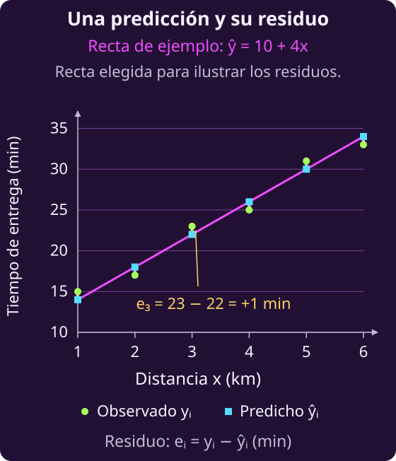
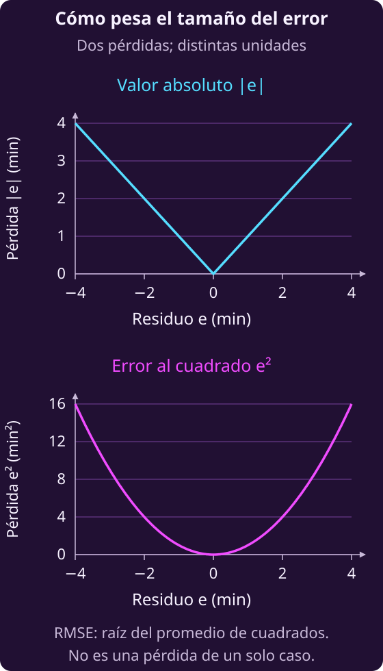
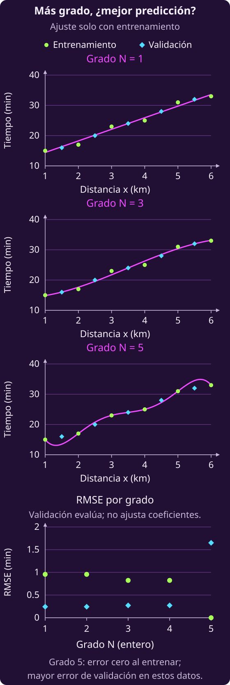

# Predecir un valor y elegir la complejidad del modelo

Una empresa de reparto quiere estimar **cuántos minutos tardará una entrega**
a partir de su distancia. Aquí la salida es un número, no una categoría.
Construiremos una regla, elegiremos cómo medir sus errores y compararemos
modelos con distinta cantidad de coeficientes.

## 1 · Separar las entregas observadas de la regla que elegimos

Tenemos $n\ge1$ entregas registradas:

$$(x_i,y_i),\qquad i=1,\ldots,n.$$

El índice $i$ recorre las entregas. La entrada $x_i$ es la distancia en
kilómetros y $y_i$ es el tiempo observado en minutos. En este contexto
ambos son números reales no negativos. El tráfico, la preparación del pedido
y otros factores pueden producir tiempos distintos para una misma distancia.

**Los datos no se eligen.** Lo que ajustamos es una regla para predecir el
tiempo. Empezamos con una recta:

$$f_\beta(x)=\beta_0+\beta_1x.$$

Las decisiones son el intercepto $\beta_0$ y la pendiente $\beta_1$:

$$\beta=(\beta_0,\beta_1)\in\mathbb R^2.$$

$\beta_0$ se mide en minutos y $\beta_1$ en minutos por kilómetro. Ambos
son libres: no imponemos cotas a los coeficientes. Usamos **la misma recta
para todos los casos**; no ajustamos una predicción independiente para cada
entrega. Este modelo tampoco impone por sí solo tiempos predichos positivos
para cualquier distancia.

La predicción y el **residuo**, o error con signo, se calculan:

$$\widehat y_i(\beta)=f_\beta(x_i).$$

$$e_i(\beta)=y_i-f_\beta(x_i).$$

Un residuo positivo significa que la entrega tardó más de lo anunciado;
uno negativo, que tardó menos. $e_i$ no es una decisión auxiliar libre:
queda determinado por los datos y los coeficientes elegidos.

## 2 · Medir el error sin cancelar retrasos y adelantos

**Piensa: ¿sirve promediar los residuos con su signo?**

Un error de un minuto por exceso puede cancelar uno por defecto, aunque
ninguna de las dos predicciones sea exacta. Para evitarlo consideramos dos
criterios distintos.

El **error absoluto medio**, o MAE, promedia el tamaño de los residuos:

$$\mathrm{MAE}(\beta)=\frac1n\sum_{i=1}^n|e_i(\beta)|.$$

La **raíz del error cuadrático medio**, o RMSE, primero eleva los residuos
al cuadrado, los promedia y toma la raíz:

$$\mathrm{RMSE}(\beta)=\sqrt{\frac1n\sum_{i=1}^n e_i(\beta)^2}.$$

**Ambas medidas se expresan en minutos.** Dentro de la raíz, el promedio
de cuadrados tiene unidades de minutos cuadrados.

Para verlo, usemos seis entregas ficticias. Esta tabla ilustra las fórmulas;
el modelo general sigue teniendo $n$ observaciones.

| Caso $i$ | Distancia (km) | Tiempo (min) |
|---|---|---|
| 1 | 1 | 15 |
| 2 | 2 | 17 |
| 3 | 3 | 23 |
| 4 | 4 | 25 |
| 5 | 5 | 31 |
| 6 | 6 | 33 |

Consideremos la recta de referencia $f_\beta(x)=10+4x$. **La escogemos para
hacer el cálculo; no afirmamos que sea la recta óptima.** Por ejemplo,

$$
\begin{aligned}
\widehat y_1&=10+4(1)=14,\\
e_1&=15-14=1,\\
\widehat y_2&=10+4(2)=18,\\
e_2&=17-18=-1.
\end{aligned}
$$

Los seis residuos son $(1,-1,1,-1,1,-1)$. Su promedio con signo es cero,
pero las medidas de error dan

$$\mathrm{MAE}=\frac{1+1+1+1+1+1}{6}=1.$$

$$\mathrm{RMSE}=\sqrt{\frac{1+1+1+1+1+1}{6}}=1.$$

El eje horizontal es distancia; el vertical, tiempo. Cada segmento vertical
conecta una predicción de la recta con el tiempo observado del mismo caso.

**Las medidas no valoran igual los errores grandes.** Un residuo que pasa
de 1 a 3 minutos aporta 1 y 3 al valor absoluto, pero 1 y 9 al cuadrado.
RMSE conserva esa mayor sensibilidad a residuos grandes, aunque la raíz
final devuelva la medida a minutos.

La gráfica muestra las contribuciones de **un caso**. Para obtener MAE
hay que promediar los valores absolutos; para obtener RMSE hay que
promediar los cuadrados y después tomar la raíz.

## 3 · Elegir qué error vamos a minimizar

Podemos pedir la recta que minimice MAE:

$$\min_{\beta\in\mathbb R^2}\quad\mathrm{MAE}(\beta).$$

$$\beta^\star_{\mathrm{MAE}}\in
\operatorname*{arg\,min}_{\beta\in\mathbb R^2}\mathrm{MAE}(\beta).$$

O podemos pedir la que minimice RMSE:

$$\min_{\beta\in\mathbb R^2}\quad\mathrm{RMSE}(\beta).$$

$$\beta^\star_{\mathrm{RMSE}}\in
\operatorname*{arg\,min}_{\beta\in\mathbb R^2}\mathrm{RMSE}(\beta).$$

En ambos problemas elegimos **los dos coeficientes juntos**. El mínimo
es un valor de error; el argmin es el conjunto de coeficientes que lo
alcanzan. Usamos pertenencia porque puede haber varias soluciones.

**Son objetivos distintos y pueden elegir rectas diferentes.** Si queremos
penalizar especialmente los errores grandes, RMSE refleja esa preferencia.
MAE mide el tamaño de cada error sin elevarlo al cuadrado. La elección del
criterio debe responder al propósito de la predicción.

Con las seis entregas anteriores, **resolver los dos problemas da resultados
diferentes**. El ajuste por RMSE es
$f_\beta(x)=10.6+(134/35)x$; un ajuste óptimo por MAE es
$f_\beta(x)=11.4+3.6x$. Evaluando ambas rectas obtenemos estos errores,
en minutos y redondeados:

| Ajuste | MAE | RMSE |
|---|---|---|
| Minimiza MAE | 0.800 | 1.033 |
| Minimiza RMSE | 0.914 | 0.956 |

Cada una gana con el objetivo para el que se ajustó. Estas rectas son
resultados de optimización, a diferencia de la referencia $10+4x$.

### Minimizar RMSE mediante mínimos cuadrados

Llamamos **MSE** al error cuadrático medio:

$$\mathrm{MSE}(\beta)=\frac1n\sum_{i=1}^n e_i(\beta)^2.$$

Para dos parejas cualesquiera $\beta$ y $\gamma$, los valores de MSE son
no negativos. Como la raíz cuadrada es estrictamente creciente,

$$
\begin{aligned}
\mathrm{MSE}(\beta)&\le\mathrm{MSE}(\gamma)\\
&\Longleftrightarrow\\
\sqrt{\mathrm{MSE}(\beta)}&\le\sqrt{\mathrm{MSE}(\gamma)}\\
&\Longleftrightarrow\\
\mathrm{RMSE}(\beta)&\le\mathrm{RMSE}(\gamma).
\end{aligned}
$$

Por tanto, **minimizar MSE y minimizar RMSE produce el mismo conjunto de
coeficientes óptimos**. El mínimo de RMSE es la raíz del mínimo de MSE;
sus unidades son distintas. Esta equivalencia no incluye a MAE.

MSE es una función **cuadrática, suave y convexa** de los coeficientes.
Este ajuste se conoce como [mínimos cuadrados en regresión lineal](https://cs229.stanford.edu/notes_archive/cs229-notes-all/cs229-notes1.pdf).
RMSE también es convexa: es la norma euclídea del vector de residuos dividida
entre $\sqrt n$. Puede no ser diferenciable cuando todos los residuos son
cero; por eso conviene distinguirla de MSE al hablar de derivadas.

### Expresar MAE con restricciones lineales

MAE es convexa, pero **no es suave en general** por los valores absolutos.
Podemos formularla como programación lineal añadiendo una variable
$u_i\ge0$ por observación. La usamos para representar el tamaño del error:

$$u_i\ge e_i(\beta),\qquad u_i\ge-e_i(\beta).$$

Estas dos desigualdades exigen $u_i\ge|e_i(\beta)|$. El problema completo es

$$\min_{\beta\in\mathbb R^2,\ u\in\mathbb R^n}
\quad\frac1n\sum_{i=1}^n u_i$$

sujeto, para cada $i=1,\ldots,n$, a

$$
\begin{aligned}
u_i&\ge y_i-\beta_0-\beta_1x_i,\\
u_i&\ge-y_i+\beta_0+\beta_1x_i,\\
u_i&\ge0.
\end{aligned}
$$

Para coeficientes fijos, minimizar la suma lleva cada $u_i$ a su menor
valor permitido, $|e_i(\beta)|$. Así recuperamos exactamente MAE.
**Los $u_i$ son auxiliares del modelo**, medidos en minutos; no son datos
observados ni tiempos que podamos decidir para las entregas.

Que la predicción sea una recta no convierte cualquier objetivo en un
programa lineal. Aquí obtenemos uno al reformular MAE; con MSE tenemos
una minimización cuadrática convexa. La [reformulación del error absoluto como programa lineal](https://web.stanford.edu/~boyd/cvxbook/bv_cvxbook.pdf#page=308)
aparece en Boyd y Vandenberghe, sección 6.1.1.

## 4 · Dejar que la curva tenga más coeficientes

Una recta puede resultar demasiado limitada. Ampliemos la familia a
polinomios de **grado a lo sumo $N$**:

$$f_{\beta,N}(x)=\sum_{j=0}^{N}\beta_jx^j.$$

El índice $j=0,\ldots,N$ recorre los coeficientes. El término $j=0$ es
$\beta_0$, porque $x^0=1$. Para un $N$ fijo elegimos

$$\beta=(\beta_0,\ldots,\beta_N)\in\mathbb R^{N+1}.$$

**No confundamos $n$ con $N$:** $n$ cuenta las entregas observadas;
$N$ limita el grado y determina que ajustamos $N+1$ coeficientes.
Ahora $\beta_j$ tiene unidades de minutos por kilómetro elevado a $j$.
El coeficiente de mayor índice puede ser cero; no exigimos grado exactamente
$N$.

La curva puede ser no lineal en $x$, pero sigue siendo **lineal en los
coeficientes que elegimos**: los valores $x_i^j$ son datos calculados.
Para cada grado fijo, minimizar MSE sigue siendo un problema convexo de
mínimos cuadrados.

Si además elegimos el grado, necesitamos un límite finito conocido
$N_{\max}\ge1$, entero. Una primera propuesta sería

$$
\min_{\substack{N\in\{1,\ldots,N_{\max}\}\\
\beta\in\mathbb R^{N+1}}}\quad\mathrm{MSE}(\beta,N),
$$

con el error de entrenamiento

$$\mathrm{MSE}(\beta,N)=\frac1n
\sum_{i=1}^n\bigl(y_i-f_{\beta,N}(x_i)\bigr)^2.$$

La misma selección conjunta podría escribirse con RMSE sin cambiar su
argmin. Es una elección discreta de $N$ entre problemas convexos; no
buscamos un gradiente respecto del número entero de grado.

**Piensa: ¿qué impide que una curva más flexible gane solo por ajustarse
mejor a estas entregas?**

Cualquier modelo permitido para $N$ también está permitido para $N+1$:
basta añadir un coeficiente cero. En efecto,

$$
\begin{aligned}
f_{(\beta,0),N+1}(x)
&=\sum_{j=0}^{N}\beta_jx^j+0x^{N+1}\\
&=f_{\beta,N}(x).
\end{aligned}
$$

Las predicciones y el error no cambian. Al minimizar sobre una familia
que contiene a la anterior, **el mejor error de entrenamiento no puede
aumentar**. Esto vale para MAE y RMSE, además de MSE. Puede quedarse igual:
no afirmamos que el optimizador siempre deba elegir el grado más alto.

Si las $n$ entradas son distintas y permitimos $N\ge n-1$, existe un
polinomio que pasa por todos los puntos y logra error de entrenamiento
cero. Si dos entregas tienen la misma distancia pero tiempos diferentes,
ninguna función de esa distancia puede acertar exactamente ambos tiempos.

Ajustar los datos con exactitud puede recoger variaciones que no se repitan.
**Sobreajustar** significa ajustar particularidades del entrenamiento que
perjudican la predicción fuera de esa muestra. No significa simplemente
«usar grado alto»; hace falta comprobar cómo funciona en otros datos.
El [ejemplo de ajuste polinómico de scikit-learn](https://scikit-learn.org/stable/auto_examples/model_selection/plot_underfitting_overfitting.html)
ilustra esta comparación entre flexibilidad y error fuera del entrenamiento.

## 5 · Elegir la complejidad con entregas reservadas

Separamos los datos antes de comparar modelos:

1. **Entrenamiento:** usamos los $n$ pares para ajustar los coeficientes.
2. **Validación:** reservamos otros $m\ge1$ pares para elegir el grado.
3. **Prueba final:** dejamos un tercer conjunto sin consultar hasta fijar
   el modelo y las decisiones anteriores.

Para cada grado candidato ajustamos sus coeficientes **solo con entrenamiento**:

$$\beta^\star(N)\in
\operatorname*{arg\,min}_{\beta\in\mathbb R^{N+1}}
\mathrm{MSE}(\beta,N).$$

Si hay varios ajustes óptimos, fijamos de antemano una regla para escoger
uno, por ejemplo el de menor suma de cuadrados de sus coeficientes.
Así cada candidato tiene una predicción definida antes de ver la validación.

Escribimos los pares de validación como
$(x_r^{\mathrm{val}},y_r^{\mathrm{val}})$, con $r=1,\ldots,m$.
Calculamos sus residuos sin volver a ajustar los coeficientes:

$$e_r^{\mathrm{val}}(\beta,N)=
y_r^{\mathrm{val}}-f_{\beta,N}(x_r^{\mathrm{val}}).$$

Después los reunimos en RMSE de validación:

$$\mathrm{RMSE}_{\mathrm{val}}(\beta,N)=
\sqrt{\frac1m\sum_{r=1}^{m}e_r^{\mathrm{val}}(\beta,N)^2}.$$

La segunda decisión es

$$N^\star\in
\operatorname*{arg\,min}_{N\in\{1,\ldots,N_{\max}\}}
\mathrm{RMSE}_{\mathrm{val}}\bigl(\beta^\star(N),N\bigr).$$

En caso de empate elegimos el menor $N$. **Primero ajustamos coeficientes;
después comparamos grados.** La regla seleccionada es
$f_{\beta^\star(N^\star),N^\star}$. Aquí la conservamos para evaluarla en
prueba final, sin volver a ajustarla con los datos de validación.

Volvamos a las seis entregas del ejemplo y comparemos $N=1,\ldots,5$.
Reservamos para validación las distancias $1.5,2.5,3.5,4.5,5.5$ km,
con tiempos $16,20,24,28,32$ minutos, respectivamente. Son datos didácticos,
no un resultado empírico sobre una empresa de reparto.

En las curvas, los ejes son distancia y tiempo. En la comparación de errores,
el eje horizontal es $N$ y el vertical es **RMSE en minutos**.
Los coeficientes se ajustaron por mínimos cuadrados para cada grado:

| $N$ | Entrenamiento | Validación |
|---|---|---|
| 1 | 0.956 | 0.242 |
| 2 | 0.956 | 0.242 |
| 3 | 0.823 | 0.272 |
| 4 | 0.823 | 0.272 |
| 5 | 0.000 | 1.651 |

Los valores están redondeados. Los grados 1 y 2 empatan también antes de
redondear: el coeficiente cuadrático del ajuste de grado permitido 2 es cero.
Elegimos $N=1$ por la regla de desempate. El candidato 5 interpola el
entrenamiento y, sin embargo, tiene mayor error en estos datos reservados.
**El algoritmo puede resolver correctamente el objetivo de entrenamiento
y aun así elegir una regla que prediga peor casos nuevos.**

La validación ya intervino en nuestra elección. **Su error no es una
estimación insesgada del error final solo por haber sido reservada al inicio.**
La prueba final permite evaluar el modelo elegido con datos que no usamos
para ajustar coeficientes ni seleccionar el grado.

## 6 · Resumen de los modelos y sus métodos

| Signo | Qué representa |
|---|---|
| $n,i$ | Cantidad e índice de entregas |
| $x_i,y_i$ | Distancia y tiempo observados |
| $\beta_j\in\mathbb R$ | Coeficiente que elegimos |
| $\beta$ | Vector de coeficientes |
| $\gamma$ | Otro vector para comparar |
| $f_\beta,f_{\beta,N}$ | Reglas de predicción |
| $\widehat y_i,e_i$ | Predicción y residuo calculados |
| $u_i\ge0$ | Auxiliar para error absoluto |
| MAE, RMSE | Medidas de error, en minutos |
| MSE | Error en minutos cuadrados |
| $\beta^\star_{\mathrm{MAE}}$ | Ajuste por MAE |
| $\beta^\star_{\mathrm{RMSE}}$ | Ajuste por RMSE |
| $N\in\{1,\ldots,N_{\max}\}$ | Grado permitido, entero |
| $j=0,\ldots,N$ | Índice de coeficiente |
| $N_{\max}$ | Mayor grado candidato, dato |
| $m,r$ | Cantidad e índice de validación |
| $x_r^{\mathrm{val}},y_r^{\mathrm{val}}$ | Datos de validación |
| $e_r^{\mathrm{val}}$ | Residuo de validación |
| $\mathrm{RMSE}_{\mathrm{val}}$ | Error de validación |
| $\beta^\star(N)$ | Ajuste para el grado $N$ |
| $N^\star$ | Grado seleccionado |
| $T$ | Número de pasos del método |

**Decisiones y resultados.** Elegimos coeficientes reales y, al comparar
familias, un grado entero de un conjunto finito. Las predicciones, residuos
y medidas de error se calculan. Los $u_i$ son variables auxiliares de la
reformulación de MAE; no cambian los tiempos reales.

**Los dos modelos para la recta** eligen $\beta\in\mathbb R^2$:

$$\min_{\beta\in\mathbb R^2}\quad\mathrm{MAE}(\beta).$$

$$\min_{\beta\in\mathbb R^2}\quad\mathrm{RMSE}(\beta).$$

**Elegir grado y coeficientes solo por entrenamiento** sería resolver

$$
\min_{\substack{N\in\{1,\ldots,N_{\max}\}\\
\beta\in\mathbb R^{N+1}}}\quad\mathrm{MSE}(\beta,N).
$$

**Elegir el grado con validación** usa los coeficientes $\beta^\star(N)$
previamente ajustados con entrenamiento:

$$
\begin{gathered}
N^\star\in\operatorname*{arg\,min}_{N\in\{1,\ldots,N_{\max}\}}\\
\mathrm{RMSE}_{\mathrm{val}}\bigl(\beta^\star(N),N\bigr).
\end{gathered}
$$

Cada grado fijo da un ajuste convexo. La elección conjunta entre grados
no es un único problema convexo con todas las decisiones continuas: $N$
pertenece a un conjunto discreto.

**Recta con MAE.** Minimizamos $\mathrm{MAE}(\beta)$ sobre
$\beta\in\mathbb R^2$. Es un problema convexo, no suave en general.
La formulación con $u_i\ge\pm e_i$ y $u_i\ge0$ es un programa lineal.
Construir sus restricciones cuesta $O(n)$; resolverlo mediante un método
de programación lineal tiene un costo que depende del tamaño del problema,
el método y la precisión. No se deduce una resolución en $O(n)$ del costo
de escribir sus restricciones.

**Recta con RMSE.** Minimizamos $\mathrm{RMSE}(\beta)$ sobre el mismo
dominio. Comparte argmin con MSE, una cuadrática convexa suave. Podemos
resolver mínimos cuadrados con factorización QR en $O(n)$ cuando las dos
columnas son independientes; para la recta basta que haya al menos dos
distancias distintas. Una descomposición SVD también permite tratar
coeficientes no determinados de manera única.

Un paso de gradiente de MSE con todos los datos cuesta $O(n)$; $T$ pasos
cuestan $O(Tn)$. $T$ depende del método, los datos y la precisión; no es
una constante garantizada. Evaluar MAE o RMSE de una recta fija cuesta
$O(n)$ y no equivale a resolver su problema de ajuste.

**Polinomio con grado fijo.** Tiene $N+1$ coeficientes y sigue siendo
lineal en ellos. Cuando $n\ge N+1$ y las columnas $1,x,\ldots,x^N$
son independientes, QR para mínimos cuadrados cuesta
$O\bigl(n(N+1)^2\bigr)$ en el conteo usual de operaciones aritméticas.
Con rango insuficiente podemos usar SVD. Evaluar el polinomio en los
$m$ casos de validación cuesta $O\bigl(m(N+1)\bigr)$.

**Selección de grado.** Recorremos los candidatos finitos, ajustamos cada
uno con entrenamiento y comparamos sus errores de validación. El costo
total suma los ajustes y las evaluaciones de todos los grados considerados.
Elegir $N$ es una decisión discreta entre problemas convexos; el test
final queda fuera de esa comparación.

## 7 · Elegir un modelo que quepa en el dispositivo

**Intenta formular tu propuesta sin abrir las pistas ni la respuesta y sin
pedir ayuda a ChatGPT.**

::: exercise {#opt-regresion-ej-capacidad title="Comparar curvas con una capacidad limitada"}
El equipo quiere instalar el predictor de tiempo en un dispositivo que
puede guardar **como máximo $B$ coeficientes**, donde $B\ge2$ es un entero
conocido. Su implementación guarda todos los coeficientes de la regla,
incluso los que valen cero. Puede evaluar los polinomios candidatos con
$N\in\{1,\ldots,N_{\max}\}$.

Una persona propone escoger la curva con menor error de entrenamiento.
Tenemos datos de entrenamiento, validación y prueba final ya separados.
Queremos elegir una regla que quepa en el dispositivo y funcione en
entregas que no se usaron para ajustar sus coeficientes.

1. Distingue los datos, las decisiones y las cantidades calculadas.
   Traduce la capacidad del dispositivo a una condición sobre el modelo.
2. Reformula la comparación propuesta usando RMSE: explica qué datos
   ajustan los coeficientes y cuáles eligen el grado. Escribe los problemas
   y decide cómo resolverías empates.
3. Describe un procedimiento finito para escoger la regla y qué harías
   con los datos de prueba final. ¿Qué afirmación sobre entregas futuras
   no puedes deducir del error de entrenamiento?
:::

::: hint {#opt-regresion-pista-capacidad of="opt-regresion-ej-capacidad" title="Pista 1 · Contar lo que debe guardar el dispositivo"}
Escribe los coeficientes de una recta y de un polinomio con término
cuadrático. ¿Cuántos lugares ocupan? Recuerda que el intercepto también
se guarda y que el dispositivo conserva los coeficientes cero.
:::

::: hint {#opt-regresion-pista-comparacion of="opt-regresion-ej-capacidad" title="Pista 2 · Separar ajuste y selección"}
Primero identifica cuáles de los candidatos caben. Para cada uno necesitarás
ajustar una regla y medirla en datos que no hayan elegido sus coeficientes.
¿Qué conjunto debes mantener sin consultar hasta terminar la comparación?
:::

::: answer {#opt-regresion-respuesta-capacidad of="opt-regresion-ej-capacidad" title="Respuesta · Restringir candidatos y comparar validación"}

$B$ y $N_{\max}$ son datos enteros, además de los tres conjuntos de entregas.
Un candidato de grado permitido $N$ ocupa $N+1$ coeficientes. Por tanto,
los grados disponibles forman el conjunto

$$\mathcal G=\{N\in\{1,\ldots,N_{\max}\}:N+1\le B\}.$$

Es finito y no vacío: $N=1$ está permitido porque $B\ge2$ y
$N_{\max}\ge1$. Los coeficientes pueden ser cero; la restricción cuenta
el almacenamiento de esta implementación, no el grado exacto de la curva.

Para cada $N\in\mathcal G$ ajustamos con entrenamiento:

$$\beta^\star(N)\in
\operatorname*{arg\,min}_{\beta\in\mathbb R^{N+1}}
\mathrm{MSE}(\beta,N).$$

Esto también minimiza RMSE de entrenamiento. Si hay varios vectores óptimos,
escogemos el de menor suma de cuadrados de sus coeficientes, como en la guía.
Después elegimos el grado con validación:

$$N^\star\in\operatorname*{arg\,min}_{N\in\mathcal G}
\mathrm{RMSE}_{\mathrm{val}}\bigl(\beta^\star(N),N\bigr).$$

Desempatamos con el menor $N$. La regla resultante cabe en el dispositivo
porque su grado pertenece a $\mathcal G$. Un error de entrenamiento menor
no demuestra que prediga mejor entregas futuras.

| Signo | Papel |
|---|---|
| $B$ | Capacidad conocida |
| $N_{\max}$ | Límite conocido |
| $\mathcal G$ | Candidatos permitidos |
| $N,\beta$ | Grado y coeficientes |
| $\beta^\star(N)$ | Ajuste por candidato |
| $N^\star$ | Grado seleccionado |

**Tipo, método y costo.** La selección es discreta y finita; cada ajuste
por MSE es convexo. Recorremos $\mathcal G$, ajustamos por QR o SVD y
comparamos RMSE de validación. Sumamos los costos de esos ajustes y
comparaciones, con las condiciones de tamaño y rango explicadas en el
resumen. No ajustamos el grado mediante un gradiente.

Congelamos la regla elegida y la evaluamos una vez con prueba final.
Ese conjunto no participa en escoger grados, coeficientes ni desempates.
El resultado permite evaluar la propuesta, no garantizar un error idéntico
en cualquier entrega futura.
:::

Siguiente ejemplo: [[opt-objetivo-juego-practica|elegir una jugada cuando el rival responde]].
