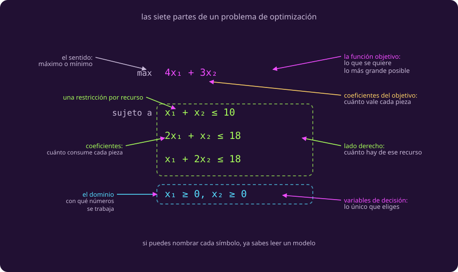

# Tres bitácoras para practicar

**¿Puedo hacerlo yo solo, con una historia que no he visto?**

Hoja de práctica, no de sesión. No trae teoría nueva: trae **tres historias sin
resolver**, una por cada cosa que la clase 1 dejó sin practicar: la **cota**, el
**mínimo con $\ge$** y la **proporción**. Cada una tiene su respuesta plegada, y
conviene no abrirla antes de haber escrito algo.

## Antes de empezar: qué hay que producir

Las tres piden lo mismo, y el resultado siempre tiene esta forma.

::: figure {#opt-anatomia title="Las siete partes de un problema de optimización"}

:::

**Si puedes apuntar a cualquier símbolo y decir cómo se llama, ya sabes leer un
modelo.** Escribirlo es hacer el camino al revés.

::: table {#opt-que-entregar title="Los cuatro pasos, y en qué orden"}
| Paso | Qué produces | Con qué |
|---|---|---|
| 1 | **La tabla limpia**, y las trampas señaladas | Las tres preguntas de *Leer la bitácora* |
| 2 | **El modelo en forma canónica**, con las siete partes | El lienzo de *Escribir el modelo* |
| 3 | **El dibujo y la respuesta** | El método de *El dibujo* |
| 4 | **Qué recurso sobra**, y hasta dónde aguanta tu supuesto | *El dibujo* y *Qué es una respuesta* |
:::

> [!WARNING]
> Cada bitácora trae trampas como las de la clase 1: algo que no sirve, algo que
> hay que suponer, o una frase con dos lecturas. **No todas traen las tres.** Si
> terminas una sin haber encontrado ninguna, vuelve a leerla.

## 1 · El taller de reparaciones

Aparece un patrón nuevo: una **cota** sobre una variable.

> **Bitácora del taller.** Se acumularon dos tipos de arreglo pendientes: sellos
> de escotilla y válvulas de presión. El depósito nos abona por cada uno
> reparado: 6 créditos por sello, 4 por válvula.
>
> De turno de taller quedan 16 horas. El sello se lleva 2 horas y la válvula 1.
>
> De refacciones hay 16 piezas en el cajón. El sello gasta 1 y la válvula 2.
>
> Los kits de sellado son el problema: solo quedan 4, y sin kit no se puede
> reparar un sello. Cada sello gasta uno.
>
> El taller está en la cubierta 3, como siempre.
>
> Y el jefe de máquinas dice que hay que dejar hechas las válvulas.

::: exercise {#opt-ej-taller title="Modela el taller"}
Haz los cuatro pasos de la tabla de arriba.
:::

::: hint {#opt-pista-taller of="opt-ej-taller" title="Dos avisos"}
El renglón de los kits **no es una restricción de recurso como las otras**: solo
menciona una de las dos variables. Ése es el patrón «cota» de
[[patrones-lineales|Patrones lineales]].

Y ojo con lo que dice el jefe de máquinas: decide si es una regla dura o una
preferencia, **anótalo como supuesto**, y comprueba al final si tu elección
cambió algo.
:::

::: answer {#opt-resp-taller of="opt-ej-taller"}
**La tabla.** Sobra la cubierta 3. **Lo que falta es cuántos kits gasta una
válvula**: la bitácora dice que cada sello gasta uno y de la válvula no dice
nada, así que se supone que **la válvula no gasta ninguno**. Ése es el supuesto
que hace que la cota se escriba $s \le 4$ y no $s + kv \le 4$ con algún gasto
$k$ por válvula. La frase ambigua es la del jefe de máquinas: «hay que dejar
hechas las válvulas» no dice cuántas.

**El modelo**, tomando esa frase como preferencia y no como regla:

$$
\begin{aligned}
\max_{s,\, v} \quad & 6s + 4v && \text{créditos} \\
\text{sujeto a} \quad & 2s + v \le 16 && \text{horas de taller} \\
& s + 2v \le 16 && \text{refacciones} \\
& s \le 4 && \text{kits de sellado} \\
& s \ge 0,\; v \ge 0
\end{aligned}
$$

**La respuesta.** Las esquinas son $(0,0)$, $(0,8)$, $(4,0)$ y $(4,6)$, que valen
0, 32, 24 y **48**. El mejor plan es **4 sellos y 6 válvulas, 48 créditos**.

**Qué sobra.** Las horas: se gastan $2\cdot4 + 6 = 14$ de 16, así que **sobran 2
horas**. Las refacciones se acaban exactas y los kits también. Y la preferencia
del jefe se cumple sola: el plan hace 6 válvulas.

**Lo que hay que ver aquí.** La cota de los kits **muerde**: sin ella el plan
haría más sellos, que se pagan mejor. Una cota sobre una sola variable puede ser
la restricción que decide todo.
:::

## 2 · La ración de la tripulación

Aparecen dos cosas nuevas a la vez: se **minimiza**, y las restricciones van con
$\ge$.

> **Bitácora de la despensa.** Hay que armar la ración diaria con lo que queda:
> barras de alga y cubos de proteína. Lo que importa es que salga barata, porque
> el depósito nos cobra: 2 créditos por barra y 4 por cubo.
>
> Médicamente hay dos pisos que no se pueden bajar. De calorías, cada tripulante
> necesita 24 al día; la barra aporta 4 y el cubo 6.
>
> De proteína el mínimo es 9. La barra da 1.
>
> El almacén está a 6 grados.
>
> Se me olvidaba: el cubo da 3 de proteína, el triple que la barra.
>
> Y la doctora insiste en que no conviene una ración de puros cubos.

::: exercise {#opt-ej-racion title="Modela la ración"}
Los mismos cuatro pasos. Ojo con dos cosas: **qué se quiere**, y **hacia qué lado
apuntan las desigualdades**.
:::

::: hint {#opt-pista-racion of="opt-ej-racion" title="Lo que cambia"}
Aquí no se maximiza: **se minimiza el costo**. Y los dos requisitos son pisos, no
techos, así que van con $\ge$ y no con $\le$.

Para entregárselo a un solver hay que voltearlas, como dice la tabla de signos de
[[patrones-lineales|Patrones lineales]]. Para dibujarlas a mano no hace falta:
solo cambia de qué lado de la recta queda la zona buena, y eso se sabe probando
un punto.
:::

::: answer {#opt-resp-racion of="opt-ej-racion"}
**La tabla.** Sobra la temperatura del almacén. Falta cuánta ración se puede
almacenar, o sea si hay un tope: la bitácora no lo dice, así que se supone que no
lo hay. La frase ambigua es la de la doctora.

**El modelo.** Con $a$ barras y $b$ cubos:

$$
\begin{aligned}
\min_{a,\, b} \quad & 2a + 4b && \text{créditos} \\
\text{sujeto a} \quad & 4a + 6b \ge 24 && \text{calorías} \\
& a + 3b \ge 9 && \text{proteína} \\
& a \ge 0,\; b \ge 0
\end{aligned}
$$

**La respuesta.** Las esquinas son $(0,4)$, $(3,2)$ y $(9,0)$, que cuestan 16,
**14** y 18. La ración más barata son **3 barras y 2 cubos, por 14 créditos**.

**Qué sobra.** Nada: en el óptimo las dos exigencias se cumplen **exactas**,
$4\cdot3+6\cdot2 = 24$ calorías y $3 + 3\cdot2 = 9$ de proteína. Que no sobre
nada tiene sentido: pagas por cada unidad, así que cualquier exceso es dinero
tirado.

**Lo que hay que ver aquí.** Con $\ge$ y un mínimo, **la región no está
encerrada**: se extiende hacia arriba y a la derecha sin límite. No pasa nada,
porque el objetivo se minimiza y empujar la recta hacia abajo sí tiene tope. Una
región abierta no es un problema sin respuesta, que es lo que dice la
advertencia de [[que-es-una-respuesta|Qué es una respuesta]].
:::

## 3 · La antena de comunicaciones

El tercer patrón: una **proporción** entre las dos variables.

> **Bitácora de comunicaciones.** Hay ventana de enlace con la estación y hay que
> repartirla entre paquetes de datos científicos y paquetes de telemetría. Nos
> pagan por lo que llegue: 5 créditos por paquete de datos, 3 por paquete de
> telemetría.
>
> De ancho de banda hay 12 unidades, y cada paquete de cualquier tipo gasta 1.
>
> De energía para el transmisor hay 22. El paquete de datos gasta 1.
>
> La antena apunta a 47 grados de elevación.
>
> Se me olvidaba: el paquete de telemetría gasta 2 de energía, el doble que el de
> datos.
>
> Y protocolo de vuelo: por cada paquete de datos hay que mandar al menos dos de
> telemetría.

::: exercise {#opt-ej-antena title="Modela la antena"}
Los mismos cuatro pasos. La última frase es la interesante.
:::

::: hint {#opt-pista-antena of="opt-ej-antena" title="La frase difícil"}
«Por cada paquete de datos, al menos dos de telemetría» compara una variable con
otra. Escríbela primero tal como suena —telemetría al menos el doble que
datos— y después junta las dos variables de un solo lado, que es lo que pide la
forma canónica.

Y fíjate en que ésta **no** es una frase ambigua: dice exactamente qué hacer. Lo
que le falta a esta bitácora es un dato, no una lectura.
:::

::: answer {#opt-resp-antena of="opt-ej-antena"}
**La tabla.** Sobran los 47 grados de elevación. Falta cuántos paquetes caben en
la ventana de enlace, o sea su duración: la bitácora dice que hay ventana y
nunca dice de cuánto. **Y aquí no hay frase ambigua**: ninguna de las de esta
bitácora se puede leer de dos maneras.

**El modelo.** Con $d$ paquetes de datos y $t$ de telemetría, la frase del
protocolo es $t \ge 2d$, que en forma canónica se escribe $2d - t \le 0$:

$$
\begin{aligned}
\max_{d,\, t} \quad & 5d + 3t && \text{créditos} \\
\text{sujeto a} \quad & d + t \le 12 && \text{ancho de banda} \\
& d + 2t \le 22 && \text{energía} \\
& 2d - t \le 0 && \text{protocolo} \\
& d \ge 0,\; t \ge 0
\end{aligned}
$$

**La respuesta.** Las esquinas son $(0,0)$, $(0,11)$, $(2,10)$ y $(4,8)$, que
valen 0, 33, 40 y **44**. El mejor plan es **4 de datos y 8 de telemetría, 44
créditos**.

**Qué sobra.** La energía: se gastan $4 + 2\cdot8 = 20$ de 22, así que **sobran
2**. El ancho de banda se acaba exacto, y el protocolo se cumple justo:
$8 = 2\cdot4$.

**Lo que hay que ver aquí.** El protocolo **está apretado en el óptimo**. Los
paquetes de datos se pagan mejor, así que sin esa regla el plan mandaría más; es
la regla la que fija la mezcla. Una restricción de proporción no habla de ningún
recurso y aun así puede ser la que manda.
:::

## Lo que hay que llevarse

- El trabajo es **siempre el mismo**: leer, señalar las trampas, escribir en
  forma canónica, resolver, y preguntarle a la respuesta qué sobró.
- En el taller manda la **cota** y en la antena la **proporción**: en esos dos,
  el patrón raro de [[patrones-lineales|Patrones lineales]] **es el que decide la
  respuesta**. En la ración lo que cambia es el sentido.
- Minimizar no es un problema distinto: es el mismo con el sentido volteado.
