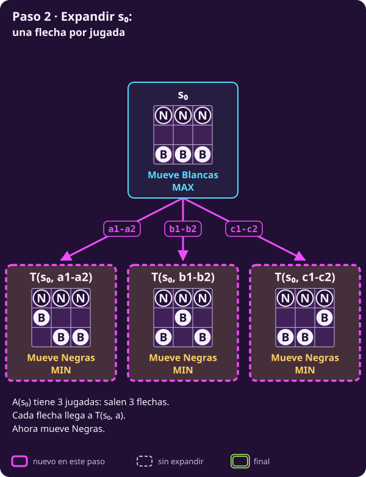
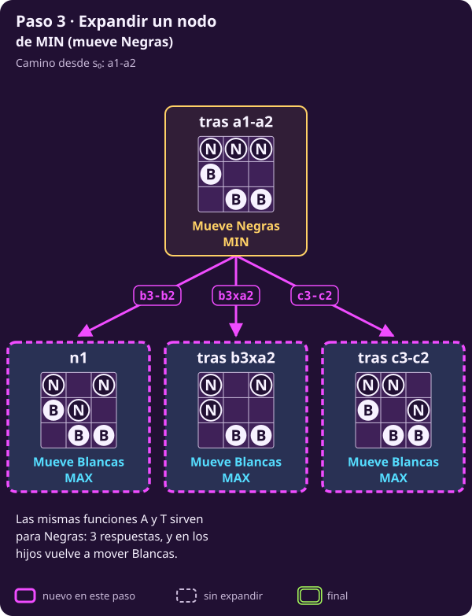
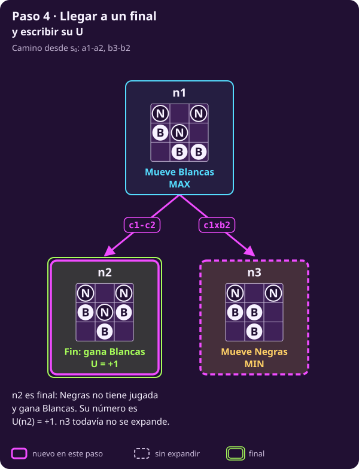

# Escribir el juego

**¿Qué necesita saber una computadora para jugar un juego por turnos?**

Al terminar tendrás **siete piezas** que sirven para escribir cualquier juego
de este tipo: ajedrez, gato o hexapawn. Cada una tiene su definición, su
dominio y un ejemplo. Usamos hexapawn porque es pequeño, pero ninguna pieza
depende de él.

> **Las reglas, en cuatro líneas.** Tablero de 3×3; Blancas (B) abajo en la
> fila 1 y Negras (N) arriba en la fila 3. Empiezan Blancas. Un peón avanza
> una casilla si está vacía o captura en diagonal hacia delante. Gana quien
> llega a la fila del rival, captura todos los peones rivales o deja al rival
> sin jugada; ganar vale $+1$ y perder, $-1$.

> **Supuestos de esta página.** Cada uno tiene nombre, porque lo usaremos
> después:
>
> - **por turnos:** hay dos jugadores y mueven uno a la vez;
> - **determinista:** no hay azar;
> - **información perfecta:** cada jugador ve el estado completo y todas las
>   jugadas anteriores;
> - **finito:** toda partida termina;
> - **suma cero:** lo que gana uno lo pierde el otro.
>
> En [[diagnosticar-el-juego|Diagnosticar el juego]] veremos qué cambia
> cuando alguno de estos supuestos no se cumple.

> **Notación de conjuntos.** La página la usa toda; si alguna te es nueva,
> aquí está en una línea. También está en la
> [[notacion-juegos|hoja de notación]].
>
> - $x\in X$: $x$ es un elemento de $X$; $x\notin X$: no lo es.
> - $X\subseteq Y$: todo elemento de $X$ está en $Y$.
> - $X\setminus Y$: los elementos de $X$ que no están en $Y$.
> - $X\times Y$: los pares $(x,y)$ con $x\in X$ y $y\in Y$.
> - $\{x,y,z\}$: el conjunto formado por esos elementos.
> - $\{x\in X : P(x)\}$: los elementos de $X$ que cumplen la condición
>   $P$; los dos puntos se leen «tales que».
> - $\mathbb{R}$: los números reales.
> - $f: X\to Y$: una función que a cada elemento de $X$, su **dominio**, le
>   asigna uno de $Y$, su **codominio**.

## 1 · Una partida, vuelta por vuelta

**Piensa: cuando te toca jugar, ¿qué tienes que saber antes de mover?**

Toda partida repite la misma vuelta hasta que termina. La figura la dibuja.
Los símbolos se definen más abajo; por ahora basta con leer las preguntas.

::: figure {#jue-c1-ciclo title="Una partida, vuelta por vuelta"}

:::

**Cómo leerla:**

- Se entra arriba, con el estado inicial $s_0$.
- Cada vuelta pregunta primero si la partida terminó. Si terminó, sale por
  la derecha con un número: cuánto vale el resultado.
- Si no terminó, pregunta a quién le toca y qué puede hacer. El jugador
  elige una jugada, y eso da el estado nuevo para la siguiente vuelta.

**Las siete piezas son las cajas de esta figura.** $S$ es lo que puede
ir en la caja «Estado»; $s_0$, por dónde se entra; $S_F$, $\mathrm{Pl}$, $A$,
$T$ y $U$ contestan las preguntas. El resto de la página define cada una.
Al final de cada sección, un recuadro, «El juego hasta ahora», muestra
las piezas ya escritas para hexapawn; las que faltan llevan «?».

**Una caja es distinta: «Elige una jugada».** Ninguna regla la contesta. Las
reglas dicen qué jugadas hay, no cuál conviene. Decidir esa jugada es el
problema que resuelve el resto de la unidad.

## 2 · La idea: el juego es un grafo

**Piensa: mientras juegas, ¿qué cambia de una jugada a la siguiente?**

Una partida pasa de una situación a otra. Si dibujamos cada situación como un
punto y cada jugada como una flecha de la situación de antes a la de después,
el juego entero se vuelve un dibujo de puntos y flechas. Ese dibujo es un
**grafo**.

::: definition {#jue-c1-grafo title="Grafo dirigido"}
Un **grafo dirigido** es un par $G=(\mathcal{N},E)$:

- $\mathcal{N}$ es un conjunto de **nodos**;
- $E\subseteq \mathcal{N}\times \mathcal{N}$ es un conjunto de **aristas**: pares ordenados
  $(u,v)$ que se dibujan como una flecha de $u$ a $v$.

Si $(u,v)\in E$, decimos que $v$ es **hijo** de $u$ y $u$ es **padre** de $v$.
Un **camino** es una sucesión de nodos donde cada uno es hijo del anterior.
Un **ciclo** es un camino que vuelve a su primer nodo. Una **hoja** es un
nodo sin hijos. Una **raíz** es un nodo desde el que hay
un camino a todos los demás. Un **árbol** es un grafo con raíz donde cada
nodo, salvo la raíz, tiene exactamente un padre.

*Ejemplo:* con $\mathcal{N}=\{x,y,z\}$ y $E=\{(x,y),(x,z)\}$, de $x$ salen dos flechas;
$y$ y $z$ son hojas.
:::

En esta página construimos el grafo de hexapawn **pieza por pieza**. Cada
pieza del modelo le agrega algo al dibujo: primero un nodo, luego etiquetas,
luego flechas y al final números.

## 3 · Los estados: qué es cada nodo

**Piensa: ¿basta con mirar el tablero para seguir jugando?**

**El principio general.** Un estado reúne lo suficiente para contestar, sin
mirar la historia de la partida, las cuatro preguntas de
[[leer-el-reglamento|la página anterior]]: qué jugadas hay, cómo cambia todo
con cada una, si la partida terminó y cuánto vale si terminó.

::: definition {#jue-c1-estado title="Estados y estado inicial"}
- $\mathcal{S}$ es el **universo de situaciones**: todo lo que se puede
  escribir con la descripción del estado, se alcance o no jugando.
- $s_0\in\mathcal{S}$ es el **estado inicial**: la situación antes de la
  primera jugada.
- $S\subseteq\mathcal{S}$ es el **conjunto de estados** del juego: las
  situaciones que se alcanzan desde $s_0$ aplicando las reglas. Lo
  calcularemos al final de la página, con las reglas que siguen.

**Las reglas que siguen, en una línea cada una.** Cada una tiene más abajo
su sección, con su definición, su dominio, su codominio y un ejemplo:

- $S_F$: los estados donde la partida ya terminó;
- $\mathrm{Pl}(s)$: a quién le toca mover en $s$;
- $A(s)$: las jugadas permitidas en $s$;
- $T(s,a)$: el estado al que se llega al hacer la jugada $a$ en $s$;
- $U(s)$: cuánto vale el resultado en un estado $s$ donde la partida terminó.

Las cuatro primeras se pueden aplicar a cualquier situación de
$\mathcal{S}$; así se encuentra $S$. Una vez que lo tenemos, nos quedamos
solo con los estados de $S$. $U$ no hace falta para encontrar $S$: solo le
pone un número a cada final.

**Qué significa:** cada estado será un nodo del grafo, y $s_0$ será el nodo
de donde parte todo.

**Qué no es:** un estado no es una partida ni una lista de jugadas. Es una
foto del momento con todo lo que hace falta para seguir.
:::

**En hexapawn.** Un estado tiene dos partes.

1. **El tablero.** Llamemos $C=\{a1,b1,c1,a2,b2,c2,a3,b3,c3\}$ a las nueve
   casillas: la letra es la columna y el número, la fila. En cada casilla
   puede haber una de tres cosas, y cada una tiene su símbolo:

   - $B$: un peón **blanco**;
   - $N$: un peón **negro**;
   - $\cdot$: nada, la casilla está **vacía**.

   Un tablero es una función $\tau: C\to\{B,N,\cdot\}$: a cada casilla le
   asigna lo que hay en ella. Por ejemplo, al empezar, $\tau(a1)=B$, $\tau(a3)=N$
   y $\tau(a2)=\cdot$.
2. **El turno:** quién mueve. Usamos las mismas letras: $B$ si mueve Blancas
   y $N$ si mueve Negras, así que el turno es un elemento de $\{B,N\}$.
   **De aquí sale $\mathrm{Pl}$:** en la sección 5, la función
   $\mathrm{Pl}(s)$ (quién mueve en $s$) lee este turno y lo traduce a MAX o
   MIN.

Un estado es el par $s=(\tau,\ \text{turno})$. El universo $\mathcal{S}$ son
todos los pares que se pueden escribir así: cualquier tablero con cualquier
turno. Como cada una de las 9 casillas tiene 3 opciones, hay $3^9$ tableros
($3$ multiplicado por sí mismo 9 veces), y con 2 turnos, $2\times 3^9$
pares. El inicial es:

$$s_0=(\tau_0,\ B),\qquad \tau_0(x)=\begin{cases}B & \text{si } x\in\{a1,b1,c1\},\\
N & \text{si } x\in\{a3,b3,c3\},\\ \cdot & \text{en las demás casillas}.\end{cases}$$

**Por qué guardamos el turno.** En general el tablero solo no basta: en
ajedrez la misma posición puede tocarle a cualquiera de los dos, y quien
mueve cambia qué jugadas hay. En el hexapawn de 3×3 resulta que el turno sí
se podría deducir del tablero, pero eso solo se sabe después de generar
todos los estados. El principio general es guardarlo.

> **Palabras de ajedrez que usamos.** No hace falta saber jugarlo. **Jaque**:
> el rey está atacado. **Mate**: jaque sin jugada que lo evite; pierde quien lo
> sufre. **Ahogado**: no hay jugada y no hay jaque; es empate. **Tablas**:
> empate. **Enroque** y **captura al paso**: dos jugadas especiales que solo se
> permiten según lo que pasó antes en la partida.

**El mismo principio, en ajedrez.** Además del tablero y el turno, un estado
de ajedrez guarda si cada rey y cada torre ya se movieron (para el enroque),
si se puede capturar al paso, cuántas jugadas van sin capturas (la regla de
las 50 jugadas) y qué posiciones ya ocurrieron (las tablas por repetición).
Nada de eso se ve en el tablero, pero decide qué jugadas hay o cómo termina.

> **El juego hasta ahora · 2 de 7 piezas**
>
> | Pieza | En hexapawn |
> |---|---|
> | $S$ | Pares (tablero, turno) que se alcanzan desde $s_0$ |
> | $s_0$ | B en a1, b1 y c1; N en a3, b3 y c3; mueve Blancas |
> | $S_F$ | ? |
> | $\mathrm{Pl}$ | ? |
> | $A$ | ? |
> | $T$ | ? |
> | $U$ | ? |

## 4 · Los finales: dónde se acaba el grafo

**El principio general.** Algunos estados terminan la partida. Ahí nadie
mueve y lo único que importa es el resultado.

::: definition {#jue-c1-finales title="Estados finales"}
$S_F\subseteq S$ es el **conjunto de estados finales**: aquellos en los que
la partida ya terminó.

**Qué significa:** en el grafo, los finales serán las **hojas**. Nunca sale
una flecha de un final.

**Qué no es:** un final no es una posición perdida. Una posición está
**perdida** para un jugador si el rival puede asegurarle la derrota, haga
lo que haga; puede estarlo sin haber terminado, y el perdedor todavía tiene
que mover.
:::

**Una regla general.** Todo estado donde el jugador de turno no tenga
ninguna jugada permitida tiene que estar en $S_F$: el reglamento debe decir
qué pasa ahí. En ajedrez son el mate y el ahogado. Por eso, en un estado que
no es final, siempre hay al menos una jugada.

**En hexapawn.** Un estado $s=(\tau,\text{turno})$ es final si se cumple
cualquiera de estas tres condiciones:

1. hay un peón blanco en la fila 3 o uno negro en la fila 1;
2. a uno de los dos ya no le quedan peones;
3. al jugador de turno no le queda ninguna jugada según cómo se mueven los
   peones: no puede avanzar ni capturar con ninguno.

> **El juego hasta ahora · 3 de 7 piezas**
>
> | Pieza | En hexapawn |
> |---|---|
> | $S$ | Pares (tablero, turno) que se alcanzan desde $s_0$ |
> | $s_0$ | B en a1, b1 y c1; N en a3, b3 y c3; mueve Blancas |
> | $S_F$ | Un peón llegó a la fila rival, un lado se quedó sin peones o el de turno no tiene jugada |
> | $\mathrm{Pl}$ | ? |
> | $A$ | ? |
> | $T$ | ? |
> | $U$ | ? |

## 5 · Quién mueve: la etiqueta de cada nodo

**Piensa: en un estado que no es final, ¿quién decide la siguiente jugada?**

::: definition {#jue-c1-pl title="Jugador de turno"}
$\mathrm{Pl}: S\setminus S_F\to\{\text{MAX},\text{MIN}\}$ asigna a cada estado
no final el **jugador que mueve** ahí (Pl, de *player*).

**Dominio:** solo los estados no finales; en un final nadie mueve.
**Codominio:** los dos jugadores. **MAX** es el jugador desde cuyo lado
mediremos el resultado (sección 8): busca que sea alto. **MIN** busca que sea
bajo. Un **nodo de MAX** es un estado con $\mathrm{Pl}(s)=\text{MAX}$, y
uno **de MIN**, con $\mathrm{Pl}(s)=\text{MIN}$.

**Qué significa:** en el grafo, cada nodo que no es hoja lleva la etiqueta
MAX o MIN.
:::

**En hexapawn.** Blancas es MAX y Negras es MIN. $\mathrm{Pl}(s)$ se lee del
**turno guardado en el estado** (sección 3), sin calcular nada:

$$
\mathrm{Pl}(\tau,\ \text{turno})=
\begin{cases}
\text{MAX} & \text{si turno} = B,\\
\text{MIN} & \text{si turno} = N.
\end{cases}
$$

Por ejemplo, en $s_0$ el turno es $B$, así que $\mathrm{Pl}(s_0)=\text{MAX}$.

Con esto ya podemos dibujar el primer nodo del grafo.

::: figure {#jue-c1-paso-1 title="Paso 1: un nodo, el estado inicial"}

:::

Cada parte del nodo es una pieza del modelo: el tablero y el turno forman
el estado, y el turno da $\mathrm{Pl}(s_0)$. El borde está punteado porque
todavía no sabemos qué sale de él. Para eso hacen falta las dos piezas
siguientes.

> **El juego hasta ahora · 4 de 7 piezas**
>
> | Pieza | En hexapawn |
> |---|---|
> | $S$ | Pares (tablero, turno) que se alcanzan desde $s_0$ |
> | $s_0$ | B en a1, b1 y c1; N en a3, b3 y c3; mueve Blancas |
> | $S_F$ | Un peón llegó a la fila rival, un lado se quedó sin peones o el de turno no tiene jugada |
> | $\mathrm{Pl}$ | Turno de Blancas: MAX. Turno de Negras: MIN |
> | $A$ | ? |
> | $T$ | ? |
> | $U$ | ? |

## 6 · Las acciones: cuántas flechas salen

**Piensa: al empezar, ¿cuántas jugadas tiene Blancas?**

::: definition {#jue-c1-acciones title="Acciones permitidas"}
Llamemos $\mathcal{A}$ al conjunto de todas las jugadas que se pueden
escribir en el juego, y $a$ a una jugada cualquiera. Para cada estado no
final $s$, $A(s)\subseteq\mathcal{A}$ es el conjunto de **jugadas
permitidas** en $s$, y nunca está vacío.

**Dominio:** los estados no finales, $S\setminus S_F$. **Codominio:** los
subconjuntos no vacíos de $\mathcal{A}$.

**Qué significa:** en el grafo, de cada nodo no final sale **una flecha por
cada jugada** de $A(s)$.

**Qué no es:** $A(s)$ no dice qué jugada conviene. Solo dice cuáles respetan
las reglas.
:::

**En hexapawn.** Una jugada se escribe en tres partes:
**casilla de salida + símbolo + casilla de llegada**. El símbolo dice qué
hace el peón:

| Símbolo | Qué hace el peón | Ejemplo |
|:---:|---|:---:|
| **-** (guion) | **Avanza** a la casilla de enfrente, que está vacía | $\text{b1}\textbf{-}\text{b2}$ |
| **x** | **Captura** el peón rival de una diagonal de enfrente | $\text{c1}\textbf{x}\text{b2}$ |

**Al empezar, ningún peón puede capturar:** los peones negros están en la
fila 3, y la diagonal de enfrente de un peón blanco está en la fila 2. Por
eso las tres jugadas iniciales son avances:

$$A(s_0)=\{\text{a1-a2},\ \text{b1-b2},\ \text{c1-c2}\}.$$

¿Y si a un jugador no le queda ninguna jugada? Por la regla general de la
sección 4, ese estado es final, así que nunca hace falta un $A(s)$ vacío.

> **El juego hasta ahora · 5 de 7 piezas**
>
> | Pieza | En hexapawn |
> |---|---|
> | $S$ | Pares (tablero, turno) que se alcanzan desde $s_0$ |
> | $s_0$ | B en a1, b1 y c1; N en a3, b3 y c3; mueve Blancas |
> | $S_F$ | Un peón llegó a la fila rival, un lado se quedó sin peones o el de turno no tiene jugada |
> | $\mathrm{Pl}$ | Turno de Blancas: MAX. Turno de Negras: MIN |
> | $A$ | Avanzar a la casilla vacía de enfrente o capturar en diagonal hacia delante |
> | $T$ | ? |
> | $U$ | ? |

## 7 · La transición: a dónde llega cada flecha

::: definition {#jue-c1-transicion title="Función de transición"}
$T(s,a)$ es el estado al que se llega al hacer la jugada $a$ en el estado
$s$:

$$T:\ \{(s,a)\ :\ s\in S\setminus S_F,\ a\in A(s)\}\ \to\ S.$$

**Dominio:** los pares de un estado no final y una de sus jugadas.
**Codominio:** los estados.

**Qué significa:** en el grafo, la flecha de la jugada $a$ va de $s$ a
$T(s,a)$.

**Que sea una función** quiere decir que la misma jugada desde el mismo
estado lleva **siempre** al mismo estado: no hay azar.
:::

**En hexapawn.** $T(s,a)$ mueve el peón, quita el peón capturado si lo hay y
cambia el turno. Por ejemplo, $T(s_0,\text{b1-b2})$ es:

::: table {#jue-c1-tras-b2 title="El estado T(s₀, b1-b2): mueven Negras"}
| | a | b | c |
|---|:---:|:---:|:---:|
| **3** | N | N | N |
| **2** | · | B | · |
| **1** | B | · | B |
:::

Con $A$ y $T$, el nodo inicial se **expande**: le salen sus flechas y
aparecen sus hijos. **Expandir** un nodo es calcular $A(s)$ y, para cada
jugada, $T(s,a)$.

::: figure {#jue-c1-paso-2 title="Paso 2: expandir s₀, una flecha por jugada"}

:::

Cada hijo es $T(s_0,a)$ para una jugada $a$, y en los tres le toca a
**MIN**: después de que mueve Blancas, le toca a Negras. Ahora expandimos
uno de ellos, el que sale de a1-a2. Para no llenar la figura, desde aquí
cada paso muestra solo el nodo que se expande y sus hijos, con el camino
que lleva a él.

::: figure {#jue-c1-paso-3 title="Paso 3: expandir un nodo de MIN"}

:::

Las mismas dos funciones sirven para los nodos de Negras: $A$ da sus jugadas
y $T$ las aplica. En las figuras, «tras a1-a2» abrevia $T(s_0,\text{a1-a2})$,
el estado al que se llega con esa jugada. Al estado tras a1-a2 y b3-b2 lo
llamaremos **n1**; lo usaremos toda la unidad.

::: exercise {#jue-c1-ej-acciones title="Decide qué jugadas hay en n1"}
Este es n1. Mueven Blancas.

| | a | b | c |
|---|:---:|:---:|:---:|
| **3** | N | · | N |
| **2** | B | N | · |
| **1** | · | B | B |

1. Escribe $A(\text{n1})$.
2. Escribe $T(\text{n1},\text{c1-c2})$. ¿Es final? ¿Por qué condición?
:::

::: hint {#jue-c1-pista-acciones of="jue-c1-ej-acciones" title="Peón por peón"}
Revisa cada peón blanco: ¿la casilla de enfrente está vacía? ¿Hay un peón
negro en alguna diagonal de enfrente?
:::

::: answer {#jue-c1-resp-acciones of="jue-c1-ej-acciones"}
1. $A(\text{n1})=\{\text{c1-c2},\ \text{c1xb2}\}$. El peón de a2 no puede
   avanzar porque a3 está ocupada, y no tiene a quién capturar en b3. El de b1
   tiene b2 ocupada enfrente y nada que capturar en a2 ni en c2.
2. $T(\text{n1},\text{c1-c2})$, con turno de Negras:

   | | a | b | c |
   |---|:---:|:---:|:---:|
   | **3** | N | · | N |
   | **2** | B | N | B |
   | **1** | · | B | · |

   Es **final por la condición 3**: Negras no tiene jugada. a3 y c3 tienen
   enfrente un peón blanco y en diagonal un peón propio; b2 tiene enfrente a
   b1 y nada que capturar. Gana Blancas.
:::

> **El juego hasta ahora · 6 de 7 piezas**
>
> | Pieza | En hexapawn |
> |---|---|
> | $S$ | Pares (tablero, turno) que se alcanzan desde $s_0$ |
> | $s_0$ | B en a1, b1 y c1; N en a3, b3 y c3; mueve Blancas |
> | $S_F$ | Un peón llegó a la fila rival, un lado se quedó sin peones o el de turno no tiene jugada |
> | $\mathrm{Pl}$ | Turno de Blancas: MAX. Turno de Negras: MIN |
> | $A$ | Avanzar a la casilla vacía de enfrente o capturar en diagonal hacia delante |
> | $T$ | Mover el peón, quitar el capturado si lo hay y cambiar el turno |
> | $U$ | ? |

## 8 · La utilidad: el número de cada final

**Piensa: cuando la partida termina, ¿qué número debería recibir la
computadora para saber si le fue bien?**

::: definition {#jue-c1-utilidad title="Utilidad"}
$U: S_F\to\mathbb{R}$ asigna a cada estado final un número: **lo que vale
ese resultado para MAX**.

**Dominio:** solo los finales; un estado a medio juego no tiene utilidad.
**Codominio:** los números reales.

**Qué significa:** en el grafo, cada hoja lleva escrito su $U$. Como lo que
gana uno lo pierde el otro, para MIN ese final vale $-U(s)$: basta un número
por hoja.
:::

### Qué número poner en un final

La utilidad **copia lo que el reglamento dice que vale el resultado**. No le
agregamos preferencias que el reglamento no tiene. Según el juego, hay varias
opciones:

| Opción | Qué mide | Cuándo se usa |
|---|---|---|
| $+1$ ganar, $0$ empatar, $-1$ perder | Solo el resultado | Cualquier juego que termina en ganar, empatar o perder: ajedrez, gato, hexapawn |
| Los puntos del reglamento | El marcador final | Juegos que cuentan puntos, como el Go o el backgammon |
| Premiar ganar rápido | El resultado y lo que tardó | Tentador, pero exige saber cuánto puede durar una partida y mezcla una preferencia nuestra con el resultado |

**Cambiar la escala está permitido; cambiar el orden, no.** En un torneo de
ajedrez se dan 1, ½ y 0 puntos. Si a cada número le restas ½ y lo
multiplicas por 2, quedan $+1$, $0$ y $-1$: el orden entre resultados es el
mismo, así que convienen las mismas jugadas, y ahora lo que gana uno lo
pierde el otro.

La tercera opción no es parte del juego. Cuando un programa de ajedrez
prefiere el mate más corto, lo usa para **desempatar** entre jugadas que
ganan las dos; no cambia la utilidad.

**En hexapawn** el reglamento solo dice quién gana, así que usamos la
primera opción. No hay empates, porque quedarse sin jugada es derrota.

Para que $U$ sea una función del estado, quién ganó se tiene que poder leer
de $s=(\tau,\text{turno})$:

- **ganó Blancas** si hay un B en la fila 3, si no quedan N, o si el turno es
  de Negras y Negras no tiene jugada;
- **ganó Negras** en los tres casos simétricos.

Cuando el jugador de turno no puede mover, gana **el otro**. Entonces:

$$U(s)=\begin{cases}+1 & \text{si en } s \text{ ganó Blancas},\\
-1 & \text{si en } s \text{ ganó Negras}.\end{cases}$$

Con la utilidad, el primer final del grafo recibe su número.

::: figure {#jue-c1-paso-4 title="Paso 4: llegar a un final y escribir su U"}

:::

> **El juego hasta ahora · las 7 piezas**
>
> | Pieza | En hexapawn |
> |---|---|
> | $S$ | Pares (tablero, turno) que se alcanzan desde $s_0$ |
> | $s_0$ | B en a1, b1 y c1; N en a3, b3 y c3; mueve Blancas |
> | $S_F$ | Un peón llegó a la fila rival, un lado se quedó sin peones o el de turno no tiene jugada |
> | $\mathrm{Pl}$ | Turno de Blancas: MAX. Turno de Negras: MIN |
> | $A$ | Avanzar a la casilla vacía de enfrente o capturar en diagonal hacia delante |
> | $T$ | Mover el peón, quitar el capturado si lo hay y cambiar el turno |
> | $U$ | $+1$ si gana Blancas; $-1$ si gana Negras |

## 9 · Reunir el juego

Las siete piezas juntas son el **modelo** del juego. Un aviso de palabras:
**jugada** y **acción** son lo mismo; una **posición** es un estado visto como
tablero; y el **turno** ($B$ o $N$) es el dato guardado en el estado, que
$\mathrm{Pl}$ traduce a MAX o MIN. Todas son **datos**: las
fija el reglamento, no el jugador.

::: definition {#jue-c1-juego title="Juego por turnos"}
Un **juego por turnos** de dos jugadores, determinista, de información
perfecta, finito y de suma cero es la **tupla**, es decir, la lista ordenada
de piezas,

$$\bigl(S,\ s_0,\ S_F,\ \mathrm{Pl},\ A,\ T,\ U\bigr).$$

El jugador de turno elige $a\in A(s)$. Todo lo demás lo deciden las reglas:
a dónde lleva la jugada, cuándo termina y cuánto vale.
:::

::: table {#jue-c1-piezas title="Las siete piezas, en general, en hexapawn y en ajedrez"}
| Pieza | De dónde a dónde | Qué significa | En hexapawn | En ajedrez |
|---|---|---|---|---|
| $S$ | Subconjunto de $\mathcal{S}$ | Las situaciones alcanzables | Pares (tablero, turno) | Tablero, turno, enroques, al paso, contador de 50 jugadas, posiciones ya vistas |
| $s_0$ | Elemento de $S$ | Cómo empieza | Tres peones por lado, mueve Blancas | La posición inicial, mueven blancas |
| $S_F$ | Subconjunto de $S$ | Dónde termina | Llegar, capturar todo o dejar sin jugada | Mate, ahogado, repetición, 50 jugadas, material insuficiente |
| $\mathrm{Pl}$ | $S\setminus S_F\to\{\text{MAX},\text{MIN}\}$ | Quién mueve | El turno guardado | El turno guardado |
| $A$ | $S\setminus S_F\to$ conjuntos no vacíos de jugadas | Qué se puede hacer | Avanzar o capturar | Jugadas legales, sin dejar el rey en jaque |
| $T$ | $\{(s,a): s\in S\setminus S_F,\ a\in A(s)\}\to S$ | Qué pasa al hacerlo | Mover, capturar y cambiar el turno | Mover y actualizar enroques, al paso, contador e historial |
| $U$ | $S_F\to\mathbb{R}$ | Cuánto vale para MAX | $+1$ o $-1$ | $+1$, $0$ o $-1$ |
:::

**Cuántos estados hay.** Ya con $A$ y $T$ podemos generar $S$: partir de
$s_0$ y aplicar todas las jugadas posibles hasta que no aparezcan estados
nuevos. En hexapawn, de los $3^9\cdot 2$ pares del universo, solo **135** se
alcanzan. En ajedrez nadie puede hacer esa cuenta: hay del orden de $10^{44}$
posiciones legales.

## 10 · Una partida completa, escrita con las piezas

**Piensa: con las siete piezas, ¿puedes jugar una partida sin mirar el
reglamento?**

Sí. Cada vuelta de la figura del ciclo, en la sección 1, es un renglón:
¿está en $S_F$?, $\mathrm{Pl}$, $A$, una jugada elegida y $T$. Llamemos
$s_1, s_2, \dots$ a los estados de esta partida, en orden.

Primero, los cinco tableros, fila por fila. En cada celda van las casillas
a, b y c de esa fila.

| Fila | $s_0$ | $s_1$ | $s_2$ | $s_3$ | $s_4$ |
|---|:---:|:---:|:---:|:---:|:---:|
| **3** | N N N | N N N | N · N | N · N | N · N |
| **2** | · · · | B · · | N · · | N B · | · B · |
| **1** | B B B | · B B | · B B | · · B | N · B |
| **Turno** | B | N | B | N | B |

Ahora, la partida, vuelta por vuelta:

| Estado | ¿Está en $S_F$? | $\mathrm{Pl}(s)$ | $A(s)$ | Se elige | $T(s,a)$ |
|---|---|---|---|---|---|
| $s_0$ | No | MAX | $\{\text{a1-a2},\ \text{b1-b2},\ \text{c1-c2}\}$ | a1-a2 | $s_1$ |
| $s_1$ | No | MIN | $\{\text{b3-b2},\ \text{b3xa2},\ \text{c3-c2}\}$ | b3xa2 | $s_2$ |
| $s_2$ | No | MAX | $\{\text{b1-b2},\ \text{b1xa2},\ \text{c1-c2}\}$ | b1-b2 | $s_3$ |
| $s_3$ | No | MIN | $\{\text{a2-a1},\ \text{a3xb2},\ \text{c3-c2},\ \text{c3xb2}\}$ | a2-a1 | $s_4$ |
| $s_4$ | **Sí** | — | — | — | — |

$s_4$ es final por la condición 1: hay un peón negro en la fila 1. Ganó
Negras, así que

$$U(s_4)=-1.$$

**Fíjate en la columna «Se elige».** Es la única que no salió de las piezas:
las demás las calcula cualquiera con las reglas. Las jugadas de esa
columna las escogimos nosotros, sin ningún criterio.

## 11 · La pregunta que falta: qué jugada elegir

**Piensa: en $s_0$, ¿pudo Blancas evitar perder?**

Una sola partida no lo dice. Para saberlo hay que considerar **todas** las
respuestas de Negras, no solo las que hizo esta vez. Eso es el problema de
la unidad, y se escribe como en la unidad de optimización: qué te dan y qué
tienes que encontrar.

::: definition {#jue-c1-problema title="El problema: elegir la jugada"}
**Dado:** el juego $(S,\ s_0,\ S_F,\ \mathrm{Pl},\ A,\ T,\ U)$.

**Encontrar:** en cada estado donde le toca a MAX, la jugada de $A(s)$ que
le asegura la mayor utilidad posible, suponiendo que MIN responde siempre lo
mejor que puede, es decir, lo peor para MAX.
:::

**Por qué en cada estado, y no solo en $s_0$.** El rival puede llevarte a
cualquier estado. Una respuesta que solo dice cómo empezar se queda sin
jugada en cuanto el rival hace algo inesperado.

Dos nombres para esta respuesta llegan en las páginas siguientes:

- el número que MAX puede asegurar desde $s$ será el **valor** $V(s)$, en
  [[el-juego-como-grafo|El juego como grafo]];
- una regla que dice qué jugada hacer en cada estado será una
  **estrategia**, en [[diagnosticar-el-juego|Diagnosticar el juego]].

**Las clases 2 a 4 son maneras distintas de contestar esta pregunta.** La
clase 2 la contesta cuando el juego cabe completo; la clase 3, cuando no
cabe; la clase 4, cuando los dos eligen a la vez y el modelo tiene que
cambiar.

**Punto de control:** para cualquier tablero de hexapawn deberías poder
escribir su estado, decir si es final, quién mueve, cuáles son sus jugadas,
a dónde lleva cada una y, si es final, cuánto vale. Deberías poder escribir
una partida completa con esas piezas, decir qué cambiaría en cada pieza si
el juego fuera ajedrez y decir qué pide el problema de la unidad.

## Lo que hay que llevarse

- Un juego por turnos se escribe con siete piezas: $S$, $s_0$, $S_F$,
  $\mathrm{Pl}$, $A$, $T$ y $U$. Cada una tiene dominio y significado, y
  sirve para cualquier juego de este tipo.
- Cada pieza dibuja algo del grafo: los estados son los nodos, $\mathrm{Pl}$
  los etiqueta, $A$ y $T$ trazan las flechas y $U$ pone números en las hojas.
- La utilidad copia lo que el reglamento dice que vale el resultado. En
  hexapawn, $+1$ o $-1$.
- Una partida es una vuelta que se repite: ¿terminó?, ¿a quién le toca?,
  ¿qué puede hacer?, elegir y ¿a dónde lleva? Las reglas contestan todo
  menos elegir.
- El problema de la unidad: dado el juego, encontrar en cada estado de MAX
  la jugada que le asegura más si MIN responde lo mejor que puede.

Continúa con [[el-juego-como-grafo|el juego como grafo]].
