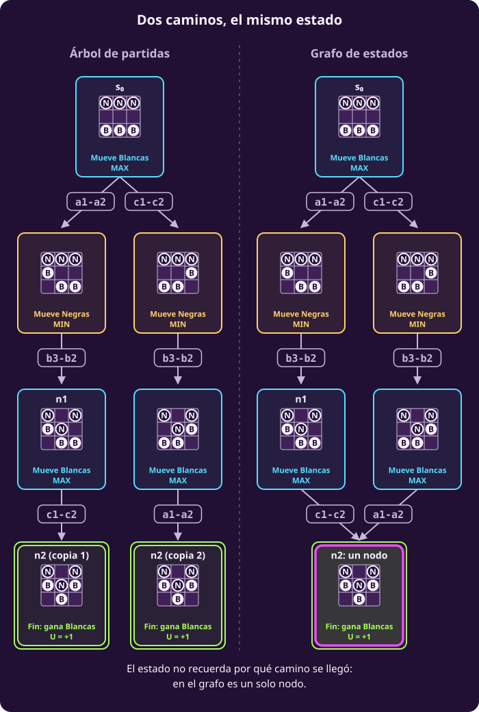

# El juego como grafo

**¿Cómo se ve el juego completo, y quién lo dibuja?**

Al terminar podrás escribir el **grafo de cualquier juego** a partir de sus
siete piezas, leer en él una partida completa y decir qué recibe un algoritmo
como entrada: si el grafo, o las reglas para generarlo.

> **Las reglas, en cuatro líneas.** Tablero de 3×3; Blancas (B) abajo en la
> fila 1 y Negras (N) arriba en la fila 3. Empiezan Blancas. Un peón avanza
> una casilla si está vacía o captura en diagonal hacia delante. Gana quien
> llega a la fila del rival, captura todos los peones rivales o deja al rival
> sin jugada; ganar vale $+1$ y perder, $-1$.

> **Supuestos de esta página.** Los mismos de
> [[escribir-el-juego|Escribir el juego]]: dos jugadores por turnos, sin
> azar, todo a la vista, toda partida termina y suma cero.

## 1 · Del modelo al grafo

**Piensa: con las siete piezas, ¿ya está decidido cuántos nodos y cuántas
flechas tiene el grafo?**

Sí. En la página anterior cada pieza le agregó algo al dibujo. Ahora lo
escribimos de una vez y en general.

::: definition {#jue-c1-grafo-del-juego title="Grafo del juego"}
El **grafo del juego** $(S,\ s_0,\ S_F,\ \mathrm{Pl},\ A,\ T,\ U)$ es el grafo
dirigido $G=(S,E)$: sus nodos son los estados y sus aristas son

$$E=\bigl\{\bigl(s,T(s,a)\bigr) : s\in S\setminus S_F,\ a\in A(s)\bigr\}.$$

Cada arista lleva el nombre de su jugada $a$. Cada nodo lleva una etiqueta:

- si $s\notin S_F$, su jugador $\mathrm{Pl}(s)$, MAX o MIN;
- si $s\in S_F$, su utilidad $U(s)$.
:::

Tres propiedades se leen directamente de la definición:

1. **La raíz es $s_0$.** Todo estado se alcanza desde $s_0$, porque $S$ son
   los estados alcanzables.
2. **Las hojas son exactamente los finales.** De un final no sale ninguna
   arista, y de un no final sale al menos una, porque $A(s)$ nunca está vacío.
3. **Una partida es un camino de la raíz a una hoja.** Cada jugada recorre
   una arista y la partida termina al llegar a un final.

**En hexapawn hay una propiedad más:** no hay ciclos, porque los peones solo
avanzan y ninguna jugada devuelve a un estado anterior. No pasa en todos los
juegos: en ajedrez una posición se puede repetir, y por eso existe la regla de
tablas por repetición.

## 2 · El subgrafo de n1, nodo por nodo

El grafo entero de hexapawn tiene 135 nodos: demasiados para dibujarlos aquí.
Por eso dibujamos solo un pedazo.

::: definition {#jue-c1-subgrafo title="Subgrafo de un estado"}
El **subgrafo de un estado** $s$ son los estados que se alcanzan desde $s$,
con las aristas entre ellos. Es otra vez el grafo de un juego: el mismo
juego, empezando en $s$ en lugar de en $s_0$.
:::

Tomamos **n1**, el estado tras a1-a2 y b3-b2, y dibujamos su subgrafo entero,
sin dejar fuera ningún nodo.

::: figure {#jue-c1-subgrafo-n1 title="El subgrafo de n1"}

:::

**Cómo leerlo:**

- Los nodos están numerados **n1 a n13** en el orden en que los visitaremos
  en la clase 2. Cada uno es un estado: tablero y turno.
- Hay **7 finales**, con borde doble: n2, n5, n9, n10, n11, n12 y n13. Seis
  valen $+1$ y uno, n13, vale $-1$.
- Hay **12 aristas**, una por jugada. Dentro de este dibujo, cada nodo salvo
  n1 tiene un solo padre: el subgrafo de n1 es un árbol. En el grafo entero
  de hexapawn no pasa lo mismo: a n2 también se llega por otro camino, como
  veremos en la sección 3.

::: exercise {#jue-c1-ej-partida title="Decide qué partida es este camino"}
1. Escribe las jugadas del camino n1 → n3 → n6 → n7 → n8 → n9 (la flecha
   se lee «y luego»: de un nodo a su hijo) y quién hace cada una.
2. ¿Cómo termina esa partida?
3. ¿Existe en este grafo una partida desde n1 que gane Negras? Escribe su
   camino.
:::

::: hint {#jue-c1-pista-partida of="jue-c1-ej-partida" title="Lee las flechas"}
Cada flecha del dibujo lleva el nombre de su jugada, y la etiqueta del nodo
de donde sale dice quién la hace: MAX es Blancas y MIN es Negras.
:::

::: answer {#jue-c1-resp-partida of="jue-c1-ej-partida"}
1. c1xb2 (Blancas), c3-c2 (Negras), b1xc2 (Blancas), a3xb2 (Negras) y a2-a3
   (Blancas).
2. Blancas llega a la fila 3 con a2-a3: gana Blancas y $U(\text{n9})=+1$.
3. Sí: n1 → n3 → n13, con c1xb2 y c3xb2. En n13 a Blancas no le queda
   jugada, así que gana Negras y $U(\text{n13})=-1$. Que exista un camino
   así no quiere decir que Negras pueda forzarlo: Blancas podía jugar c1-c2
   en n1. Decidir eso es el trabajo de la clase 2.
:::

## 3 · Árbol de partidas y grafo de estados

**Piensa: si dos partidas distintas llegan al mismo tablero con el mismo
turno, ¿son dos nodos o uno?**

Hay dos formas de dibujar un juego, y conviene distinguirlas.

::: definition {#jue-c1-arbol-grafo title="Árbol de partidas y grafo de estados"}
- En el **grafo de estados**, cada estado aparece **una sola vez**, aunque se
  llegue a él por varios caminos. Es el grafo de la sección 1.
- En el **árbol de partidas**, cada nodo es un **camino desde la raíz**: el
  mismo estado aparece una vez por cada orden de jugadas que llega a él.

Cuando dos caminos distintos llegan al mismo estado, se dice que hay una
**transposición**.
:::

Hexapawn tiene transposiciones. Jugar a1-a2, b3-b2 y c1-c2 deja el mismo
tablero, con el mismo turno, que jugar c1-c2, b3-b2 y a1-a2. Es justamente
el final n2.

::: figure {#jue-c1-transposicion title="Dos caminos, el mismo estado"}

:::

El estado no recuerda por qué camino se llegó, y eso es justo lo que dice su
definición: guarda lo suficiente para seguir **sin mirar la historia**. Por
eso, en el grafo, es un solo nodo.

**Cuánto cambia.** En hexapawn, el árbol de partidas completo tiene **252
nodos** y el grafo de estados, **135**. Si un algoritmo recuerda qué estados
ya valoró, trabaja sobre el grafo y no repite cuentas.

## 4 · ¿El grafo ya está dibujado?

**Piensa: cuando un programa juega ajedrez, ¿alguien le entregó antes el
grafo con todos los estados?**

No. Y esta es la idea que más confunde la primera vez, así que la decimos
con todas sus letras:

> **Los algoritmos de esta unidad no reciben el grafo. Reciben las reglas:** $s_0$,
> $S_F$, $\mathrm{Pl}$, $A$, $T$ y $U$. Con ellas **genera** los nodos que
> necesita, expandiéndolos uno por uno.

Recuerda que **expandir** un nodo $s$ es calcular $A(s)$ y, para cada jugada,
$T(s,a)$: así aparecen sus hijos. En los pasos de la página anterior, los
nodos punteados existían en el juego pero todavía nadie los había expandido.

Hay dos maneras de usar las reglas:

::: table {#jue-c1-explicito-implicito title="Dos formas de tener el grafo"}
| | Grafo explícito | Grafo implícito |
|---|---|---|
| **Qué se hace** | Se expanden **todos** los estados antes de jugar y se guarda el grafo entero | Se expande un estado **solo cuando hace falta** y se puede olvidar después |
| **Qué se necesita** | Memoria para todos los estados | Memoria para el camino que se está mirando |
| **En hexapawn** | Posible: 135 estados | También posible |
| **En ajedrez** | Imposible: del orden de $10^{44}$ posiciones | La única opción |
:::

Las dos formas describen **el mismo grafo**. Lo que cambia es **cuándo** se
calcula cada nodo y **cuánto** se guarda. En toda la unidad, salvo que digamos
otra cosa, el grafo es **implícito**: el algoritmo parte de $s_0$ y genera lo
demás con $A$ y $T$.

::: exercise {#jue-c1-ej-entrada title="Decide qué recibe el algoritmo"}
Un programa va a decidir la primera jugada de Blancas en hexapawn.

1. ¿Qué datos necesita recibir?
2. ¿Necesita recibir la lista de los 135 estados?
3. ¿Qué operación hace cada vez que llega a un estado que no es final?
:::

::: hint {#jue-c1-pista-entrada of="jue-c1-ej-entrada" title="Piensa en el ajedrez"}
Lo que recibe tiene que servir también para un juego cuyo grafo no cabe en
ninguna computadora.
:::

::: answer {#jue-c1-resp-entrada of="jue-c1-ej-entrada"}
1. Las reglas: el estado inicial $s_0$ y cómo calcular $S_F$, $\mathrm{Pl}$,
   $A$, $T$ y $U$ para cualquier estado.
2. No. Puede generar cada estado cuando lo necesita. En hexapawn podría
   generarlos todos antes, pero en ajedrez no.
3. Lo **expande**: calcula $A(s)$ y, para cada jugada, $T(s,a)$.
:::

### No recibir el grafo no es no recorrerlo

**Piensa: si el algoritmo no recibe el grafo, ¿quiere decir que no lo
recorre?**

No. «No recibe el grafo» habla de la **entrada**: nadie le entrega los
nodos. Pero el algoritmo sí **genera** nodos y los recorre. Lo que distingue
a los métodos de la unidad es **cuánto** generan y **si llegan a los
finales**.

Esta tabla es un adelanto. Ningún método se explica aquí; cada uno tiene su
página.

::: table {#jue-c1-recibe-genera title="Qué recibe y qué genera cada método"}
| Método | Qué recibe | Qué genera | ¿Llega a los finales? | Resultado |
|---|---|---|---|---|
| Minimax | Las reglas, como funciones | El árbol entero: lo recorre y olvida cada rama al terminarla | Sí | Exacto |
| Alfa-beta | Las reglas | Menos: poda las ramas que no pueden cambiar la decisión | Sí, en lo que recorre | Exacto: el mismo que minimax |
| Minimax con corte | Las reglas y una estimación de cada posición, $\mathrm{EVAL}$ | Solo unas jugadas hacia delante, hasta una profundidad fija | No | Aproximado |
| Monte Carlo (MCTS) | Las reglas y la capacidad de simular partidas | Partidas al azar, jugadas hasta el final | Sí, en las simulaciones | Estimado |
| Análisis hacia atrás | Un grafo explícito, dado o generado antes | Nada nuevo: ya lo tiene | Sí | Exacto |
:::

Tres cosas que leer en la tabla:

- **La poda ahorra porque el grafo no estaba dado.** Lo que ahorra
  alfa-beta es **no generar** las ramas que poda. Si alguien le hubiera
  entregado el grafo dibujado, ese trabajo ya estaría hecho.
- **Aproximado y estimado no son lo mismo.** El corte confía en una
  $\mathrm{EVAL}$ escrita a mano. Monte Carlo promedia los resultados de
  partidas simuladas.
- **El análisis hacia atrás necesita el grafo explícito.** Pone su $U$ a
  cada final y etiqueta los nodos de los finales hacia atrás, hasta $s_0$.
  Así se construyen las **tablas de finales** de ajedrez: todas las
  posiciones con pocas piezas, generadas y resueltas de antemano.

Dónde se explica cada uno:

- minimax, en [[minimax|Minimax]], clase 2;
- alfa-beta, en [[alfa-beta|Alfa-beta]], clase 2;
- minimax con corte, en [[cortar-y-evaluar|Cortar y evaluar a mano]], clase 3;
- Monte Carlo, en [[simular-en-vez-de-evaluar|Simular en vez de evaluar]], clase 3;
- el análisis hacia atrás no tiene página propia: es la idea de la sección
  5, aplicada a un grafo entero.

## 5 · Resolver el juego es llenar el grafo de números

Las hojas ya tienen su número: $U$. Los demás nodos todavía no tienen
ninguno. **Resolver el juego** será ponerle a cada nodo un número, su
**valor** $V(s)$: lo que MAX puede asegurar desde $s$ si MIN responde
siempre con lo peor para MAX. En un final, $V(s)=U(s)$. La definición
formal, junto con la de jugada y estrategia, está en
[[diagnosticar-el-juego|Diagnosticar el juego]].

En la clase 2 lo haremos sobre el grafo de n1, de las hojas hacia la raíz, con
el método que ya conoces del [[opt-objetivo-juego-practica|ejemplo del juego]]
de la unidad de optimización: máximos en los nodos de MAX y mínimos en los de
MIN.

**Punto de control:** deberías poder escribir los nodos y las aristas del grafo de un juego
a partir de sus piezas, leer una partida como un camino de la raíz a una
hoja, explicar una transposición y decir qué recibe un algoritmo como
entrada y qué genera.

## Lo que hay que llevarse

- El grafo del juego tiene un nodo por estado y una arista por jugada:
  $G=(S,E)$ con $E=\{(s,T(s,a))\}$. Las hojas son los finales y una partida es un
  camino de la raíz a una hoja.
- El árbol de partidas repite un estado por cada camino que llega a él; el
  grafo de estados lo guarda una vez. En hexapawn, 252 nodos contra 135.
- Un algoritmo no recibe el grafo: recibe las reglas y genera los nodos al
  expandirlos. Tener el grafo entero es posible en hexapawn e imposible en
  ajedrez.
- No recibir el grafo no es no recorrerlo: cada método genera una parte
  distinta, y alfa-beta ahorra justo lo que no genera.

Continúa con [[diagnosticar-el-juego|diagnosticar el juego]].
