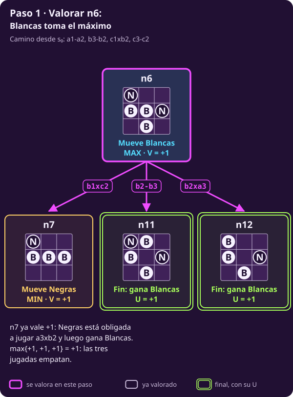
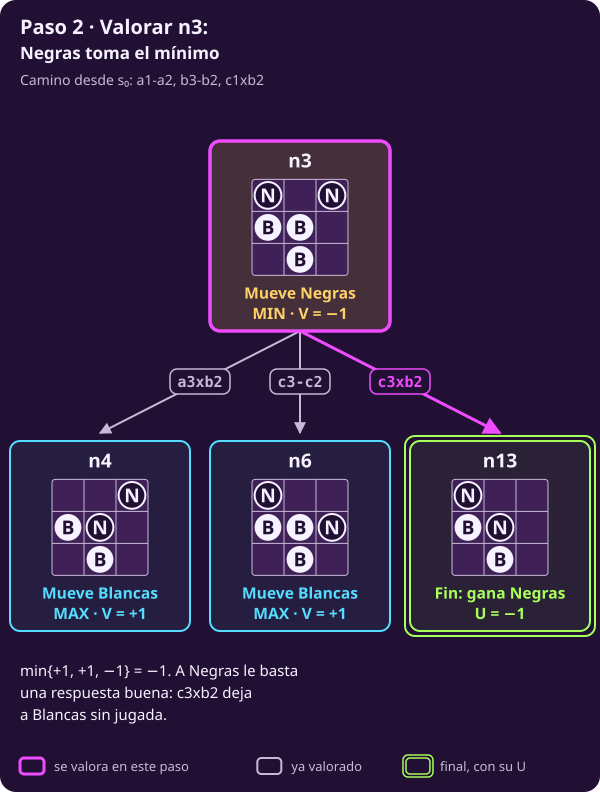
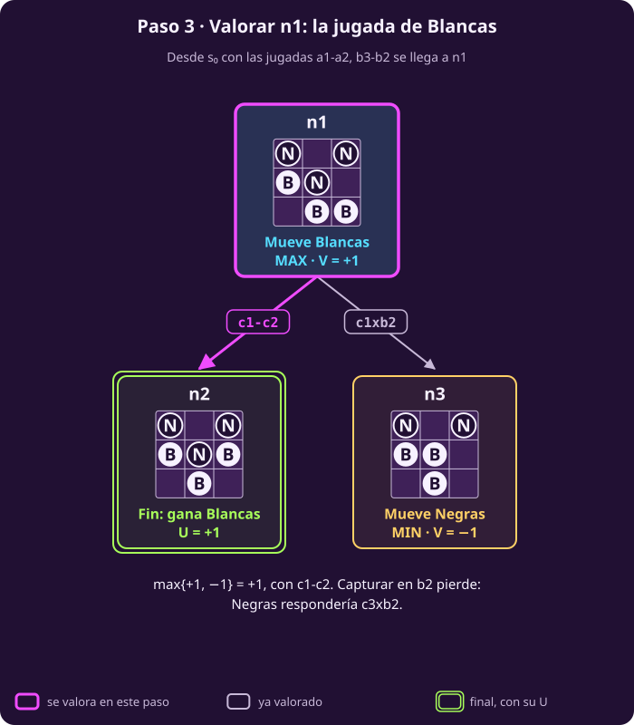

# Minimax a mano

**¿Quién gana si los dos juegan perfecto, y con qué jugada?**

Al terminar tendrás **el valor de n1 calculado a mano**, la jugada que lo
alcanza y la respuesta a por qué gana quien juega segundo.

> **Las reglas, en cuatro líneas.** Tablero de 3×3; Blancas (B) abajo en la
> fila 1 y Negras (N) arriba en la fila 3. Empiezan Blancas. Un peón avanza
> una casilla si está vacía o captura en diagonal hacia delante. Gana quien
> llega a la fila del rival, captura todos los peones rivales o deja al rival
> sin jugada; ganar vale $+1$ y perder, $-1$.

> **Supuestos de esta página.** Los mismos de
> [[escribir-el-juego|Escribir el juego]]: dos jugadores por turnos, sin
> azar, todo a la vista, toda partida termina y suma cero.

> **Las piezas que usa esta página.** Vienen de
> [[escribir-el-juego|Escribir el juego]]; si alguna no te suena, vuelve a
> su definición.
>
> - $S_F$: los estados donde la partida ya terminó (@jue-c1-finales).
> - $\mathrm{Pl}(s)$: quién mueve en un estado no final, MAX o MIN. Se lee
>   del turno guardado en el estado: Blancas es MAX y Negras es MIN
>   (@jue-c1-pl).
> - $A(s)$: las jugadas permitidas en $s$ (@jue-c1-acciones).
> - $T(s,a)$: el estado al que lleva la jugada $a$ desde $s$
>   (@jue-c1-transicion).
> - $U(s)$: lo que vale un final para MAX: $+1$ si gana Blancas y $-1$ si
>   gana Negras (@jue-c1-utilidad).

## 1 · El problema, en n1

**Piensa: ¿qué pedía el problema de la unidad?**

En @jue-c1-problema lo escribimos así: dado el juego, encontrar en cada
estado de MAX la jugada que le asegura más, si MIN responde lo mejor que
puede. Esta página lo resuelve en un solo estado, **n1**: el que se alcanza
con $\text{a1}\textbf{-}\text{a2}$ y $\text{b3}\textbf{-}\text{b2}$.

::: table {#jue-c2-n1 title="n1: mueven Blancas"}
| | a | b | c |
|---|:---:|:---:|:---:|
| **3** | N | · | N |
| **2** | B | N | · |
| **1** | · | B | B |
:::

> **El problema de esta página.**
>
> **Dado:** el juego de hexapawn, con sus siete piezas, y el estado n1.
>
> **Encontrar:** cuánto asegura Blancas desde n1, y con cuál de sus dos
> jugadas, $\text{c1}\textbf{-}\text{c2}$ o $\text{c1}\textbf{x}\text{b2}$.

El subgrafo entero de n1 ya lo dibujaste en
[[el-juego-como-grafo|El juego como grafo]]. Aquí está otra vez:

::: figure {#jue-c2-subgrafo title="El subgrafo de n1, como lo dejó la clase 1"}

:::

Las hojas ya tienen su número, $U$. Los nodos de en medio todavía no. Esta
página les pone uno a cada uno.

## 2 · La regla: máximo, mínimo y utilidad

**Piensa: si sabes cuánto vale cada hijo de un nodo, ¿cuánto vale el
nodo?**

Depende de quién mueve. Si mueve MAX, elige el hijo que más vale. Si mueve
MIN, el que menos. Y un final ya tiene su número. Ésa es toda la regla.

::: definition {#jue-c2-valor title="Valor minimax"}
El **valor** de un estado $s$ es el número $V(s)$ que se calcula así:

- si $s\in S_F$: $\ V(s)=U(s)$;
- si $\mathrm{Pl}(s)=\text{MAX}$: $\ V(s)=\max_{a\in A(s)} V\bigl(T(s,a)\bigr)$;
- si $\mathrm{Pl}(s)=\text{MIN}$: $\ V(s)=\min_{a\in A(s)} V\bigl(T(s,a)\bigr)$.

**Qué significa:** $V(s)$ es lo que MAX puede **asegurar** desde $s$ si MIN
siempre responde con lo peor para MAX. Es el mismo $V$ de
[[el-juego-como-grafo|El juego como grafo]], ahora con su fórmula.

**Qué no es:** no es lo que pasará en una partida real. Si MIN se equivoca,
MAX puede obtener más; nunca menos.
:::

La fórmula define $V(s)$ con los valores de los **hijos**. Por eso se
calcula de abajo hacia arriba: un nodo se valora solo cuando ya se conocen
todos sus hijos.

## 3 · Empezar por los finales

**Piensa: ¿qué número le toca a cada hoja?**

Ninguno se calcula: los da $U$. En el subgrafo hay 7 finales.

- **Valen $+1$**, porque gana Blancas: n2, n5, n9, n10, n11 y n12.
- **Vale $-1$**, porque gana Negras: n13. Ahí Blancas no tiene jugada.

Seis de siete finales los gana Blancas. Eso **no** dice que Blancas gane:
falta saber si Negras puede llevar la partida al séptimo.

## 4 · Subir por la rama más honda

**Piensa: ¿cuál es el primer nodo que puedes valorar?**

Uno cuyos hijos sean todos finales. El más hondo es **n8**: mueve Blancas
(MAX) y sus dos hijos, n9 y n10, valen $+1$.

$$V(\text{n8})=\max\{+1,\ +1\}=+1.$$

Su padre, **n7**, es de Negras y tiene un solo hijo: Negras está
**obligada** a jugar $\text{a3}\textbf{x}\text{b2}$. Un nodo con un solo
hijo copia el valor de ese hijo, sea MAX o MIN: $V(\text{n7})=+1$.

Lo mismo pasa con **n4**: mueve Blancas, su única jugada es
$\text{a2}\textbf{-}\text{a3}$ y lleva a n5, que vale $+1$. Entonces
$V(\text{n4})=+1$.

## 5 · Valorar n6: el turno de Blancas

**Estamos aquí:** en n6, al que se llega con
$\text{c1}\textbf{x}\text{b2}$ y $\text{c3}\textbf{-}\text{c2}$. Mueve
Blancas. Ya conocemos sus tres hijos: n7, n11 y n12.

::: exercise {#jue-c2-ej-paso-max title="Decide el valor de n6"}
1. Calcula $V(\text{n6})$.
2. ¿Qué jugadas de Blancas lo alcanzan?
:::

::: hint {#jue-c2-pista-paso-max of="jue-c2-ej-paso-max" title="Qué operación toca"}
Mira quién mueve en n6: eso decide si tomas el máximo o el mínimo de los
valores de los hijos. Los valores de n7, n11 y n12 ya están arriba.
:::

::: answer {#jue-c2-resp-paso-max of="jue-c2-ej-paso-max"}
1. Mueve Blancas, así que es el máximo:
   $V(\text{n6})=\max\{+1,\ +1,\ +1\}=+1$.
2. **Las tres**: $\text{b1}\textbf{x}\text{c2}$ (n7),
   $\text{b2}\textbf{-}\text{b3}$ (n11) y $\text{b2}\textbf{x}\text{a3}$
   (n12). Empatan. Que varias jugadas empaten es normal; la sección 8 vuelve
   sobre esto.
:::

::: figure {#jue-c2-paso-1 title="Paso 1: valorar n6"}

:::

## 6 · Valorar n3: el turno de Negras

**Estamos aquí:** en n3, tras $\text{c1}\textbf{x}\text{b2}$. Mueve Negras.
Sus hijos son n4, n6 y n13, y ya sabes cuánto vale cada uno.

::: exercise {#jue-c2-ej-paso-min title="Decide qué hace Negras"}
1. Calcula $V(\text{n3})$.
2. ¿Qué jugada elige Negras?
3. Dos de sus tres jugadas pierden. ¿Por qué no importa?
:::

::: hint {#jue-c2-pista-paso-min of="jue-c2-ej-paso-min" title="Desde el lado de Negras"}
El valor está en puntos de Blancas. Negras quiere que sea **bajo**. ¿Cuál de
sus tres hijos es el peor para Blancas?
:::

::: answer {#jue-c2-resp-paso-min of="jue-c2-ej-paso-min"}
1. Mueve Negras, así que es el mínimo:
   $V(\text{n3})=\min\{+1,\ +1,\ -1\}=-1$.
2. **$\text{c3}\textbf{x}\text{b2}$**, que lleva a n13: Blancas se queda
   sin jugada y gana Negras.
3. Porque Negras no está obligada a jugarlas. Al rival le basta **una**
   respuesta buena.
:::

::: figure {#jue-c2-paso-2 title="Paso 2: valorar n3"}

:::

Capturar en b2 vale $-1$ para Blancas: Negras responde
$\text{c3}\textbf{x}\text{b2}$ y gana. Éste es el paso que una lectura
optimista se salta.

## 7 · Valorar n1 y elegir la jugada

**Piensa: el número $V(\text{n1})$, ¿le dice a Blancas qué hacer?**

Primero el número. En n1 mueve Blancas; n2 vale $+1$ y n3 vale $-1$:

$$V(\text{n1})=\max\{+1,\ -1\}=+1.$$

::: figure {#jue-c2-paso-3 title="Paso 3: valorar n1"}

:::

El $+1$ **no** es una jugada: es lo que Blancas asegura. La jugada es la
que lo alcanza. Se escribe con el $\operatorname{arg\,max}$ de
[[diagnosticar-el-juego|Diagnosticar el juego]], el conjunto de jugadas
que dan el máximo:

$$a^{∗}\in\operatorname*{arg\,max}_{a\in A(\text{n1})} V\bigl(T(\text{n1},a)\bigr)=\{\text{c1}\textbf{-}\text{c2}\}.$$

La estrella marca la jugada elegida, y se escribe $\in$ porque podría haber
varias. Aquí hay una sola: **Blancas debe jugar
$\text{c1}\textbf{-}\text{c2}$**. Deja a Negras sin jugada y gana en ese
momento.

Así queda el subgrafo con todos sus valores. Las flechas resaltadas son las
jugadas que alcanzan el valor de su padre:

::: figure {#jue-c2-resuelto title="El subgrafo de n1, resuelto"}

:::

Los mismos valores, en el orden en que los calculamos:

1. **n8**, mueve Blancas: el máximo de n9 = +1 y n10 = +1 da **+1**.
2. **n7**, mueve Negras: su único hijo, n8, da **+1**.
3. **n4**, mueve Blancas: su único hijo, n5, da **+1**.
4. **n6**, mueve Blancas: el máximo de n7, n11 y n12, los tres +1, da
   **+1**.
5. **n3**, mueve Negras: el mínimo de n4 = +1, n6 = +1 y n13 = −1 da
   **−1**.
6. **n1**, mueve Blancas: el máximo de n2 = +1 y n3 = −1 da **+1**.

## 8 · Cuando dos jugadas empatan

**Piensa: en n6, las tres jugadas valen $+1$. ¿Da igual cuál jugar?**

Para el valor, sí: las tres ganan. Pero no ganan igual de rápido. Contando
desde n6:

- $\text{b2}\textbf{-}\text{b3}$ y $\text{b2}\textbf{x}\text{a3}$ llegan a
  la fila 3 **en la primera jugada**;
- $\text{b1}\textbf{x}\text{c2}$ gana **en la tercera**: Negras responde
  $\text{a3}\textbf{x}\text{b2}$ y Blancas todavía tiene que avanzar.

Preferir ganar rápido es razonable, pero **no está en el reglamento**: la
utilidad solo dice quién gana (@jue-c1-utilidad). Por eso no la cambiamos.
Lo usamos solo para **desempatar** dentro del
$\operatorname{arg\,max}$, como hacen los programas de ajedrez con el mate
más corto. La justificación es práctica: una partida más corta deja menos
jugadas en las que equivocarse.

> [!WARNING]
> Meter «ganar rápido» en la utilidad, por ejemplo con $U=\pm(10-k)$ donde
> $k$ cuenta las jugadas, tiene un costo. $U$ dejaría de leerse del estado
> $(\tau,\text{turno})$: habría que guardar también $k$. Y el problema
> cambiaría: ya no preguntaría quién gana, sino cuánto tarda. El desempate
> da la misma preferencia sin tocar el modelo.

## 9 · El juego completo

**Piensa: si minimax resuelve 13 nodos, ¿qué impide resolver los 252?**

Nada: es el mismo procedimiento, y la computadora lo hace en un instante.
Estos son los valores de las tres primeras jugadas de Blancas:

::: table {#jue-c2-juego-completo title="Hexapawn completo: las tres aperturas"}
| Primera jugada de Blancas | Valor |
|---|---:|
| $\text{a1}\textbf{-}\text{a2}$ | −1 |
| $\text{b1}\textbf{-}\text{b2}$ | −1 |
| $\text{c1}\textbf{-}\text{c2}$ | −1 |
:::

Las tres valen $-1$, así que $V(s_0)=-1$: **quien empieza pierde** si el
rival juega perfecto. Ésa es la respuesta a la pregunta de la clase. En tus
partidas, quien jugó segundo tenía desde el inicio una respuesta ganadora;
si alguna vez ganó quien empezó, alguien se equivocó en el camino.

Y n1 viene justo de una equivocación. Tras $\text{a1}\textbf{-}\text{a2}$,
Negras tenía tres respuestas:

| Respuesta de Negras | Valor |
|---|---:|
| $\text{b3}\textbf{-}\text{b2}$, que lleva a n1 | +1 |
| $\text{b3}\textbf{x}\text{a2}$ | −1 |
| $\text{c3}\textbf{-}\text{c2}$ | +1 |

Solo la captura gana para Negras. **Nuestro problema empezó con un error
de Negras**, y por eso Blancas gana desde n1.

::: exercise {#jue-c2-ej-que-asegura title="Decide qué dice cada número"}
1. $V(\text{n1})=+1$ y $V(s_0)=-1$. ¿Se contradicen? Blancas mueve en los
   dos.
2. Si en n3 Negras jugara $\text{a3}\textbf{x}\text{b2}$, ¿cuánto obtendría
   Blancas? ¿Contradice eso que $V(\text{n3})=-1$?
:::

::: hint {#jue-c2-pista-que-asegura of="jue-c2-ej-que-asegura" title="Qué mide V"}
$V(s)$ habla de lo que se puede **asegurar desde $s$**. ¿Desde qué estado
habla cada número? ¿Y qué supone sobre el rival?
:::

::: answer {#jue-c2-resp-que-asegura of="jue-c2-ej-que-asegura"}
1. No. Hablan de estados distintos. Desde $s_0$, Negras puede asegurar la
   victoria. Desde n1 ya no: para llegar ahí, Negras jugó
   $\text{b3}\textbf{-}\text{b2}$ en vez de la captura.
2. $+1$: ese hijo, n4, vale $+1$. No lo contradice. $V(\text{n3})=-1$ es lo
   que Blancas obtiene si Negras juega **bien**; contra un error, Blancas
   puede obtener más, nunca menos.
:::

**Punto de control:** deberías poder tomar un árbol de cuatro o cinco
niveles, valorar sus finales con $U$, subir con máximos y mínimos hasta la
raíz y decir qué jugada elige MAX. Si te trabas al subir, vuelve a la lista
de la sección 7.

## Lo que hay que llevarse

- $V(s)$ es $U(s)$ en un final, el máximo de los hijos si mueve MAX y el
  mínimo si mueve MIN. Se calcula desde los finales hacia la raíz.
- El valor es un número; la jugada sale del $\operatorname{arg\,max}$. En
  n1, $V=+1$ con $\text{c1}\textbf{-}\text{c2}$.
- La utilidad sigue siendo $\pm1$. Preferir ganar rápido es un desempate
  dentro del $\operatorname{arg\,max}$, no un cambio de $U$.
- Hexapawn vale $-1$: con juego perfecto gana Negras, la que juega segundo.

Continúa con [[minimax-como-algoritmo|minimax como algoritmo]].
