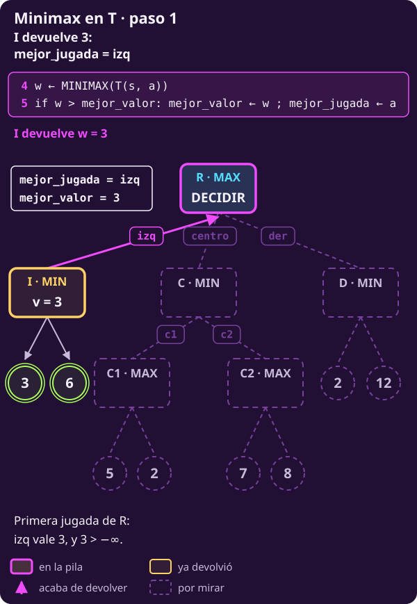
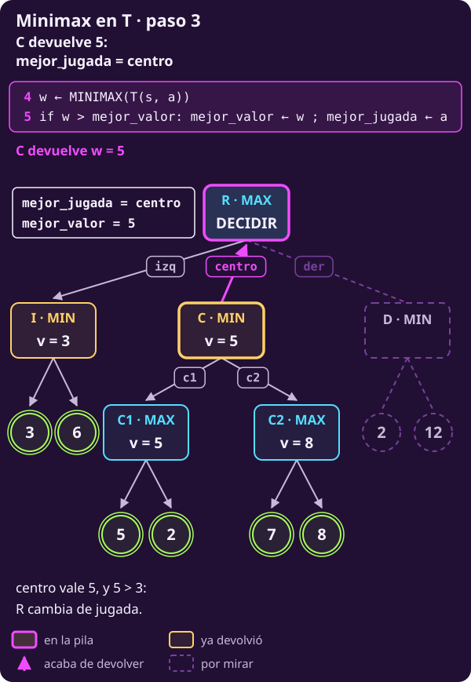
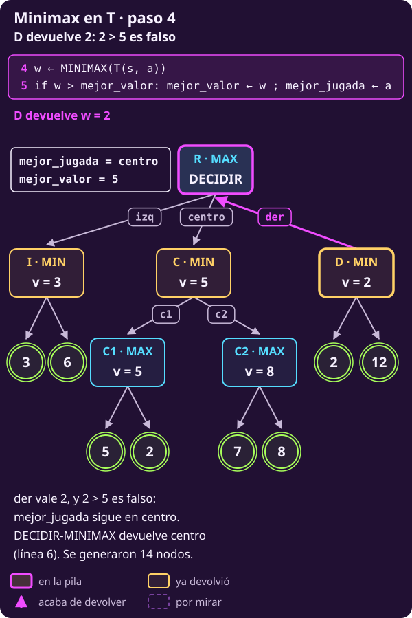

# Minimax como algoritmo

**¿Cómo se escribe lo que hicimos a mano para que un agente, en cualquier
juego finito, devuelva la jugada que debe hacer?**

Al terminar tendrás:

- **el pseudocódigo de DECIDIR-MINIMAX**, que devuelve una jugada, y de su
  auxiliar **MINIMAX**, que devuelve un valor;
- una **traza línea por línea** en un árbol de juguete, el **árbol T**;
- la prueba de que es correcto, y **un subárbol de hexapawn** resuelto por
  tu cuenta, ahora con Negras en la raíz.

> **Las reglas, en cuatro líneas.** Tablero de 3×3; Blancas (B) abajo en la
> fila 1 y Negras (N) arriba en la fila 3. Empiezan Blancas. Un peón avanza
> una casilla si está vacía o captura en diagonal hacia delante. Gana quien
> llega a la fila del rival, captura todos los peones rivales o deja al rival
> sin jugada; ganar vale $+1$ y perder, $-1$.

> **Supuestos de esta página.** Los mismos de
> [[escribir-el-juego|Escribir el juego]]: dos jugadores por turnos, sin
> azar, todo a la vista, toda partida termina y suma cero.

En [[minimax|Minimax a mano]] valoramos los 13 nodos de n1 y vimos que
$V(\text{n1})=+1$ se alcanza con $\text{c1}\textbf{-}\text{c2}$. Esta
página convierte ese cálculo en un procedimiento que no depende de
hexapawn.

## 1 · Qué recibe y qué devuelve

**Piensa: a Blancas, en n1, ¿de qué le sirve saber que $V(\text{n1})=+1$?**

De poco, si no sabe **con qué jugada** lo consigue. Un agente que juega no
entrega un número: entrega una **jugada**. El valor es el **medio** para
elegirla, no el fin.

> **El problema del agente.**
>
> **Dado (lo que recibe):** un estado $s$ donde mueve MAX y las reglas del
> juego, como funciones que se pueden evaluar en cualquier estado:
>
> - $S_F$, para preguntar si un estado es final (@jue-c1-finales);
> - $\mathrm{Pl}$, quién mueve: MAX o MIN (@jue-c1-pl);
> - $A$, las jugadas permitidas (@jue-c1-acciones);
> - $T$, a dónde lleva cada jugada (@jue-c1-transicion);
> - $U$, cuánto vale un final para MAX (@jue-c1-utilidad).
>
> **Encontrar (lo que devuelve):** **una jugada**
>
> $$a^{∗}\in\operatorname*{arg\,max}_{a\in A(s)} V\bigl(T(s,a)\bigr),$$
>
> la que lleva al hijo de mayor valor. Para compararlas hace falta
> $V$ de @jue-c2-valor en cada hijo: eso lo calcula el auxiliar.

Por eso el algoritmo tiene **dos funciones**:

- **DECIDIR-MINIMAX($s$)** devuelve **una jugada**. Es lo que llama el
  agente.
- **MINIMAX($s$)** devuelve **un número**, $V(s)$. Solo lo llama DECIDIR
  (y se llama a sí mismo).

**Lo que no recibe es el grafo.** Nadie le entrega los 13 nodos de n1 ni los
135 estados del juego. Minimax los **genera**: cada vez que necesita los
hijos de un estado, calcula $A(s)$ y, para cada jugada, $T(s,a)$. Es la idea
de [[el-juego-como-grafo|El juego como grafo]]: el grafo es implícito.

## 2 · El algoritmo

**Piensa: para valorar n3 tuvimos que valorar antes n4, n6 y n13. ¿Cómo se
escribe eso en un programa?**

Con una función que se llama a sí misma sobre cada hijo. Dos letras, y
**nunca se mezclan**:

- **$v$** es lo mejor que ha visto **este** nodo entre sus hijos, hasta
  ahora. En la raíz se llama **mejor_valor**.
- **$w$** es lo que devuelve **un** hijo. La llamada al hijo va siempre en
  su propia línea, $w\leftarrow\ldots$, y después se compara.

```text
INPUT   un estado s donde mueve MAX, y las
        reglas S_F, Pl, A, T y U de un juego
        finito, por turnos y sin azar.
        No recibe el grafo.
OUTPUT  una jugada de A(s) que alcanza V(s).

 1 function DECIDIR-MINIMAX(s)
 2   mejor_valor ← −∞ ; mejor_jugada ← ninguna
 3   for each a in A(s)
       # cuánto vale a con juego perfecto
 4     w ← MINIMAX(T(s, a))
       # estricto: un empate deja la primera
 5     if w > mejor_valor:
         mejor_valor ← w ; mejor_jugada ← a
 6   return mejor_jugada       # la jugada, no w

 7 function MINIMAX(s)         # devuelve V(s)
 8   if s ∈ S_F: return U(s)   # final: su U
 9   if Pl(s) = MAX
10     v ← −∞                  # menor que todo
11     for each a in A(s)
12       w ← MINIMAX(T(s, a))  # el hijo da w
13       v ← max(v, w)         # el mayor
14     return v
15   else                      # Pl(s) = MIN
16     v ← +∞                  # mayor que todo
17     for each a in A(s)
18       w ← MINIMAX(T(s, a))
19       v ← min(v, w)         # el menor
20     return v
```

El mismo algoritmo en Python, completo. Las reglas son funciones que ya
existen; el número entre paréntesis es la línea del pseudocódigo:

```python
from math import inf

# Las reglas ya existen como funciones:
# es_final(s), pl(s) ("MAX" o "MIN"),
# acciones(s), transicion(s, a), utilidad(s).

def decidir_minimax(s):         # (1)
    # (2) Nada visto: -inf pierde con todo.
    mejor_valor = -inf
    mejor_jugada = None
    for a in acciones(s):       # (3)
        # (4) Cuánto vale a si después los
        # dos juegan bien.
        w = minimax(transicion(s, a))
        # (5) Solo si mejora estrictamente:
        # en un empate se queda la primera.
        if w > mejor_valor:
            mejor_valor = w
            mejor_jugada = a
    return mejor_jugada         # (6) jugada

def minimax(s):                 # (7) da V(s)
    if es_final(s):             # (8) su U
        return utilidad(s)
    if pl(s) == "MAX":          # (9) mayor
        v = -inf                # (10)
        for a in acciones(s):   # (11)
            # (12) el hijo devuelve w
            w = minimax(transicion(s, a))
            v = max(v, w)       # (13)
        return v                # (14)
    else:                       # (15) menor
        v = inf                 # (16)
        for a in acciones(s):   # (17)
            # (18) el hijo devuelve w
            w = minimax(transicion(s, a))
            v = min(v, w)       # (19)
        return v                # (20)
```

**Cada pieza del modelo, en su línea:**

- **8** · $S_F$ y $U$: en un final, devuelve su utilidad.
- **9 y 15** · $\mathrm{Pl}$: decide si toma el máximo o el mínimo.
- **3, 11 y 17** · $A$: recorre las jugadas permitidas.
- **4, 12 y 18** · $T$: genera el hijo, y la llamada lo valora.
- **5** · el $>$: cambia de jugada solo si mejora.

- **DECIDIR es el MAX de la raíz con memoria.** Sus líneas 2–5 hacen lo
  mismo que 10–13, pero además recuerdan **qué jugada** dio el mejor
  número. Por eso no basta con llamar MINIMAX en la raíz.
- **El $>$ estricto de la línea 5** resuelve los empates: gana la primera
  jugada del $\operatorname{arg\,max}$ en el orden de $A(s)$. Ahí entra un
  desempate como el de ganar rápido.

> **Si en la raíz mueve MIN**, se invierten dos líneas: la 2 empieza con
> `mejor_valor ← +∞` y la 5 pregunta `w < mejor_valor`. MINIMAX no cambia: ya lee quién mueve con
> $\mathrm{Pl}$. Lo usarás con Negras en @jue-c2-ej-propio.

## 3 · Un ejemplo a mano: el árbol T

**Piensa: antes de soltarlo en hexapawn, ¿qué hace cada línea en un árbol
tan chico que quepa en una mano?**

El **árbol T** es de juguete: no viene de ningún juego, y sus hojas ya
traen la utilidad. Lo usan también las páginas que siguen.

- **R**, la raíz: mueve MAX y tiene tres jugadas, **izq**, **centro** y
  **der**, en ese orden.
- **I**, **C** y **D**: mueve MIN. I tiene las hojas 3 y 6; D, las hojas
  2 y 12.
- **C** tiene dos hijos donde mueve MAX: **C1** (jugada c1), con hojas 5 y
  2, y **C2** (jugada c2), con hojas 7 y 8.
- Las hojas se nombran por su número; todas son distintas.

::: figure {#jue-c2-t-arbol title="El árbol T: el problema"}

:::

**Cómo leer la traza:**

- **Una fila al entrar a un nodo interno** y **una por cada hijo que
  regresa**. Las hojas no tienen fila propia: su número aparece solo en la
  columna $w$; si quien regresa es un nodo, va su nombre entre paréntesis.
- **línea · pila:** la última línea que se ejecutó en esa fila, y el
  camino de llamadas abiertas, de la raíz al nodo activo. $\text{R›C›C2}$
  quiere decir que R espera a C y C espera a C2. **Es todo lo que hay en
  memoria.**
- En las filas de **R**, la columna $v$ es **mejor_valor**.
- **jugada** es mejor_jugada de R después de la fila, con «—» mientras
  vale ninguna. Solo cambia en una fila de R, en la línea 5; en las demás
  se repite, para que la veas viajar por toda la traza.

### Tramo 1 · La rama izq

| # | línea · pila | v | w | jugada |
|---:|---|---:|---|---|
| 1 | 2 · R | −∞ |  | — |
| 2 | 16 · R›I | +∞ |  | — |
| 3 | 18–19 · R›I | 3 | 3 | — |
| 4 | 18–19 · R›I | 3 | 6 | — |
| 5 | 4–5 · R | 3 | 3 (I) | izq |

- **Fila 2:** MINIMAX(I) pasa la línea 8 (no es final), la 9 (mueve MIN) y
  llega a la 16 con $v=+\infty$.
- **Fila 4:** la hoja 6 no cambia nada: $\min(3,6)=3$.
- **Fila 5:** I devuelve $w=3$ y la línea 5 pregunta $3>-\infty$: **sí**.
  mejor_jugada pasa de **ninguna** a **izq**, con mejor_valor $=3$.

::: figure {#jue-c2-t-minimax-1 title="Tramo 1: I devuelve 3 y R guarda izq"}

:::

### Tramo 2 · Bajar por centro

| # | línea · pila | v | w | jugada |
|---:|---|---:|---|---|
| 6 | 16 · R›C | +∞ |  | izq |
| 7 | 10 · R›C›C1 | −∞ |  | izq |
| 8 | 12–13 · R›C›C1 | 5 | 5 | izq |
| 9 | 12–13 · R›C›C1 | 5 | 2 | izq |
| 10 | 18–19 · R›C | 5 | 5 (C1) | izq |
| 11 | 10 · R›C›C2 | −∞ |  | izq |
| 12 | 12–13 · R›C›C2 | 7 | 7 | izq |
| 13 | 12–13 · R›C›C2 | 8 | 8 | izq |

- **Filas 7 y 11:** C1 y C2 son de MAX, así que empiezan en la línea 10
  con $v=-\infty$ y suben con $\max$.
- **Fila 10:** C1 devuelve $w=5$ a C, que pasa de $+\infty$ a $v=5$.
- **En la fila 12 la pila es R›C›C2.** En memoria hay tres $v$, uno por
  nivel: R tiene mejor_valor $=3$, C tiene $v=5$ y C2 tiene $v=7$. I y C1
  ya devolvieron su número y se olvidaron; D todavía no existe.
- mejor_jugada sigue en **izq** todo el tramo.

::: figure {#jue-c2-t-minimax-2 title="Tramo 2: a media ejecución, con la pila R›C›C2"}

:::

### Tramo 3 · C devuelve 5 y R cambia de jugada

| # | línea · pila | v | w | jugada |
|---:|---|---:|---|---|
| 14 | 18–19 · R›C | 5 | 8 (C2) | izq |
| 15 | 4–5 · R | 5 | 5 (C) | centro |

- **Fila 14:** C2 devuelve $w=8$, pero $\min(5,8)=5$: **C ya no cambia**.
  Fíjate: el 8 se calculó y no sirvió de nada. Alfa-beta aprovecha
  exactamente eso.
- **Fila 15:** C devuelve $w=5$ y la línea 5 pregunta $5>3$: **sí**.
  mejor_jugada pasa de **izq** a **centro**, con mejor_valor $=5$.

::: figure {#jue-c2-t-minimax-3 title="Tramo 3: C devuelve 5 y R guarda centro"}

:::

### Tramo 4 · der no cambia nada

| # | línea · pila | v | w | jugada |
|---:|---|---:|---|---|
| 16 | 16 · R›D | +∞ |  | centro |
| 17 | 18–19 · R›D | 2 | 2 | centro |
| 18 | 18–19 · R›D | 2 | 12 | centro |
| 19 | 4–5 · R | 5 | 2 (D) | centro |
| 20 | 6 · R | 5 |  | centro |

- **Fila 19:** D devuelve $w=2$ y la línea 5 pregunta $2>5$: **no**.
  mejor_jugada se queda en **centro**. La hoja 12, la más alta del árbol,
  no sirve: MIN nunca dejaría que MAX llegue a ella.
- **Fila 20:** la línea 6 devuelve **centro**. El número 5 se queda dentro
  de DECIDIR: el agente solo entrega la jugada.

::: figure {#jue-c2-t-minimax-4 title="Tramo 4: D devuelve 2, que no mejora 5"}

:::

**En resumen:** mejor_jugada pasó de **ninguna → izq → centro**, y der no
la cambió porque su 2 no supera el 5 de centro. MINIMAX generó los **14
nodos** del árbol: los 13 debajo de R, más la raíz.

::: exercise {#jue-c2-ej-t-orden title="Llena la traza con los hijos al revés"}
Ahora $A(s)$ da las jugadas **al revés** en todos los nodos: R prueba
**der, centro, izq**; C prueba **c2** antes que **c1**; y en cada nodo la
hoja de la derecha va primero (D ve 12 antes que 2).

**Tramo 1 · der**

| # | línea · pila | v | w | jugada |
|---:|---|---:|---|---|
| 1 | 2 · R | −∞ |  | — |
| 2 | 16 · R›D | +∞ |  | — |
| 3 | 18–19 · R›D | 12 | 12 | — |
| 4 | 18–19 · R›D | ? | ? | — |
| 5 | 4–5 · R | ? | ? (D) | ? |

**Tramo 2 · Bajar por centro**

| # | línea · pila | v | w | jugada |
|---:|---|---:|---|---|
| 6 | 16 · R›C | +∞ |  | ? |
| 7 | 10 · ? | −∞ |  | ? |
| 8 | 12–13 · ? | ? | ? | ? |
| 9 | 12–13 · ? | ? | ? | ? |
| 10 | 18–19 · R›C | ? | ? | ? |
| 11 | 10 · ? | −∞ |  | ? |
| 12 | 12–13 · ? | ? | ? | ? |
| 13 | 12–13 · ? | ? | ? | ? |

**Tramo 3 · C regresa a R**

| # | línea · pila | v | w | jugada |
|---:|---|---:|---|---|
| 14 | 18–19 · R›C | ? | ? | ? |
| 15 | 4–5 · R | ? | ? (C) | ? |

**Tramo 4 · izq**

| # | línea · pila | v | w | jugada |
|---:|---|---:|---|---|
| 16 | 16 · R›I | +∞ |  | ? |
| 17 | 18–19 · R›I | ? | ? | ? |
| 18 | 18–19 · R›I | ? | ? | ? |
| 19 | 4–5 · R | ? | ? (I) | ? |
| 20 | 6 · R | ? |  | ? |

1. Llena los «?».
2. ¿Por qué jugadas pasa mejor_jugada, y en qué filas?
3. ¿Cambia la jugada que devuelve DECIDIR? ¿Cambia cuántos nodos genera?
:::

::: hint {#jue-c2-pista-t-orden of="jue-c2-ej-t-orden" title="Sigue la línea 5"}
No copies los números del ejemplo: las hojas también van al revés, así
que cambian los $v$ de en medio (C2 ve 8 antes que 7; C1, 2 antes que 5;
I, 6 antes que 3). Recorre igual: una fila al entrar (línea 10 o 16) y una
por cada hijo que regresa. En las filas de R, compara el $w$ que llega
contra mejor_valor con $>$ estricto.
:::

::: answer {#jue-c2-resp-t-orden of="jue-c2-ej-t-orden"}
En negrita, lo que era «?». Las pilas que faltaban: R›C›C2 en las
filas 7 a 9 y R›C›C1 en las filas 11 a 13.

**Tramo 1 · der**

| # | línea · pila | v | w | jugada |
|---:|---|---:|---|---|
| 1 | 2 · R | −∞ |  | — |
| 2 | 16 · R›D | +∞ |  | — |
| 3 | 18–19 · R›D | 12 | 12 | — |
| 4 | 18–19 · R›D | **2** | **2** | — |
| 5 | 4–5 · R | **2** | **2 (D)** | **der** |

**Tramo 2 · Bajar por centro**

| # | línea · pila | v | w | jugada |
|---:|---|---:|---|---|
| 6 | 16 · R›C | +∞ |  | **der** |
| 7 | 10 · R›C›C2 | −∞ |  | **der** |
| 8 | 12–13 · R›C›C2 | **8** | **8** | **der** |
| 9 | 12–13 · R›C›C2 | **8** | **7** | **der** |
| 10 | 18–19 · R›C | **8** | **8 (C2)** | **der** |
| 11 | 10 · R›C›C1 | −∞ |  | **der** |
| 12 | 12–13 · R›C›C1 | **2** | **2** | **der** |
| 13 | 12–13 · R›C›C1 | **5** | **5** | **der** |

**Tramo 3 · C regresa a R**

| # | línea · pila | v | w | jugada |
|---:|---|---:|---|---|
| 14 | 18–19 · R›C | **5** | **5 (C1)** | **der** |
| 15 | 4–5 · R | **5** | **5 (C)** | **centro** |

**Tramo 4 · izq**

| # | línea · pila | v | w | jugada |
|---:|---|---:|---|---|
| 16 | 16 · R›I | +∞ |  | **centro** |
| 17 | 18–19 · R›I | **6** | **6** | **centro** |
| 18 | 18–19 · R›I | **3** | **3** | **centro** |
| 19 | 4–5 · R | **5** | **3 (I)** | **centro** |
| 20 | 6 · R | **5** |  | **centro** |

1. Las cuatro tablas de arriba.
2. **ninguna → der** (fila 5, $2>-\infty$) **→ centro** (fila 15, $5>2$).
   En la fila 19, I devuelve 3 y $3>5$ es falso.
3. **No y no.** Devuelve **centro** y genera los mismos **14 nodos**. Para
   MINIMAX el orden solo cambia el camino de mejor_jugada, porque siempre
   mira todo. En alfa-beta, el orden decidirá cuánto se ahorra.
:::

## 4 · Ahora en hexapawn: n1

**Piensa: ¿qué hace DECIDIR-MINIMAX en n1, donde mueven Blancas?**

Exactamente lo mismo que en R, con dos jugadas en vez de tres:

1. **Línea 2:** mejor_valor $=-\infty$, mejor_jugada $=$ ninguna.
2. **$\text{c1}\textbf{-}\text{c2}$:** la línea 4 llama a MINIMAX(n2), que
   es final y devuelve $w=+1$ en la línea 8. $+1>-\infty$: mejor_jugada
   pasa a $\text{c1}\textbf{-}\text{c2}$.
3. **$\text{c1}\textbf{x}\text{b2}$:** MINIMAX(n3) recorre n4 a n13 y
   devuelve $w=-1$. $-1>+1$ es falso: no cambia.
4. **Línea 6:** devuelve $\text{c1}\textbf{-}\text{c2}$.

El recorrido es **en profundidad**: baja por la primera jugada hasta un
final, regresa, y solo entonces prueba la siguiente. Su orden de visita es
justo la numeración n1, n2, …, n13. Qué hay en memoria a media ejecución
está en la sección «Para profundizar».

## 5 · Por qué es correcto

**Piensa: ¿cómo sabemos que el $+1$ es lo que Blancas asegura, y no solo
un número que salió de la cuenta?**

La **altura** de un nodo es el número de jugadas de la continuación más
larga desde él hasta un final; los finales tienen altura 0. Se demuestra:

> MINIMAX($s$) es el valor que MAX puede asegurar desde $s$ si MIN responde
> siempre lo mejor que puede.

**Por inducción sobre la altura**, desde los finales:

1. **Altura 0.** En un final no hay nada que decidir. La línea 8 devuelve
   $U(s)$, que es exactamente lo que vale.
2. **Altura mayor.** Todos los hijos tienen menor altura, así que su $w$
   es correcto. Si mueve MAX, puede elegir cualquier hijo y asegura el mayor
   $w$; no puede asegurar más, porque después de su jugada MIN responde
   bien. Si mueve MIN, el argumento es el mismo con el menor.

**Y DECIDIR devuelve una jugada correcta:** sus líneas 3–5 calculan el
máximo de los $w=V(T(s,a))$ y guardan la primera jugada que lo alcanza,
así que mejor_jugada está en el $\operatorname{arg\,max}$.

Es la misma inducción hacia atrás del
[[opt-objetivo-juego-practica|ejemplo del juego]] de la unidad de
optimización, escrita como procedimiento.

::: exercise {#jue-c2-ej-induccion title="Decide dónde se usa que MIN juega bien"}
1. ¿En qué paso de la inducción se usa que MIN responde lo mejor que puede?
2. Si Negras se equivocara en n3 y jugara $\text{a3}\textbf{x}\text{b2}$,
   ¿Blancas obtendría más o menos que $V(\text{n3})=-1$?
:::

::: hint {#jue-c2-pista-induccion of="jue-c2-ej-induccion" title="Busca los dos lugares"}
Hay dos lugares en el paso de altura mayor: uno en los nodos de MIN y otro
en los de MAX. En los de MAX, fíjate en la frase que dice qué **no** puede
asegurar.
:::

::: answer {#jue-c2-resp-induccion of="jue-c2-ej-induccion"}
1. En el paso de **altura mayor**, en dos lugares. En un nodo de MIN, al
   decir que vale el **menor** de sus hijos. En uno de MAX, al decir que MAX
   no puede asegurar más que el mayor, porque después responde MIN.
2. **Más**: $+1$, el valor de n4. El valor es lo que MAX asegura contra
   cualquier respuesta; contra un rival que se equivoca puede obtener más,
   nunca menos.
:::

## 6 · Resolver un caso por tu cuenta

**Piensa: sin la página anterior abierta, ¿puedes escribir y valorar un
árbol desde cero, y decidir la jugada de Negras?**

Llamemos **e1** a la posición que sale tras $\text{b1}\textbf{-}\text{b2}$,
$\text{c3}\textbf{x}\text{b2}$ y $\text{a1}\textbf{x}\text{b2}$. Mueve
**Negras**, que es MIN: la raíz es de MIN.

::: table {#jue-c2-e1 title="e1: mueven Negras"}
| | a | b | c |
|---|:---:|:---:|:---:|
| **3** | N | N | · |
| **2** | · | B | · |
| **1** | · | · | B |
:::

::: exercise {#jue-c2-ej-propio title="Resuelve el subárbol de e1"}
1. Escribe el árbol completo desde e1, con las jugadas en el orden fijo:
   por casilla de salida y, para cada peón, primero avanzar y después
   capturar. Numera los nodos e1, e2, … en el orden en que MINIMAX los
   visita. ¿Cuántos nodos tiene y cuántos son finales?
2. Pon su $U$ a cada final y sube hasta la raíz.
3. ¿Cuánto vale e1?
4. Corre DECIDIR-MINIMAX en e1 **con las dos líneas invertidas** para MIN.
   ¿Por qué valores pasa mejor_jugada y qué jugada devuelve?
:::

::: hint {#jue-c2-pista-propio-a of="jue-c2-ej-propio" title="Pista 1 · Las jugadas de Negras"}
Empieza con $A(\text{e1})$. El peón de b3 tiene b2 ocupada enfrente y nada
que capturar. El de a3 puede avanzar o capturar.
:::

::: hint {#jue-c2-pista-propio-b of="jue-c2-ej-propio" title="Pista 2 · Las respuestas de Blancas"}
Tras $\text{a3}\textbf{-}\text{a2}$, el peón blanco de b2 queda bloqueado:
b3 está ocupada y no hay nada que capturar en a3 ni en c3. ¿Qué jugada le
queda a Blancas?
:::

::: answer {#jue-c2-resp-propio of="jue-c2-ej-propio"}
El árbol tiene **11 nodos**: 5 finales y 6 donde alguien decide.

- **e1 · Raíz** · mueve Negras (MIN)
  - **e2 · a3-a2** · mueve Blancas (MAX)
    - **e3 · c1-c2** · mueve Negras (MIN)
      - **e4 · a2-a1** · FINAL: Negras llega a la fila 1, $U=-1$
      - **e5 · b3xc2** · mueve Blancas (MAX)
        - **e6 · b2-b3** · FINAL: Blancas llega a la fila 3, $U=+1$
  - **e7 · a3xb2** · mueve Blancas (MAX)
    - **e8 · c1-c2** · mueve Negras (MIN)
      - **e9 · b2-b1** · FINAL: Negras llega, $U=-1$
      - **e10 · b3xc2** · FINAL: Negras captura todo, $U=-1$
    - **e11 · c1xb2** · FINAL: Negras sin jugada, $U=+1$

Junto a cada nodo, quién mueve: Blancas es MAX y toma el mayor; Negras es
MIN y toma el menor.

| Nodo | Hijos | $V$ |
|---|---|---:|
| e5 · MAX | e6: +1 | +1 |
| e3 · MIN | e4: −1 · e5: +1 | −1 |
| e2 · MAX | e3: −1 | −1 |
| e8 · MIN | e9: −1 · e10: −1 | −1 |
| e7 · MAX | e8: −1 · e11: +1 | +1 |
| e1 · MIN | e2: −1 · e7: +1 | **−1** |

e1 vale **$-1$**: gana Negras.

DECIDIR para MIN empieza con `mejor_valor ← +∞` y pregunta
`w < mejor_valor`:

- **ninguna → $\text{a3}\textbf{-}\text{a2}$:** e2 devuelve $w=-1$ y
  $-1<+\infty$.
- **$\text{a3}\textbf{x}\text{b2}$** devuelve $w=+1$ y $+1<-1$ es falso:
  no cambia.

Devuelve **$\text{a3}\textbf{-}\text{a2}$**, el avance. La captura parece
atractiva, pero Blancas responde $\text{c1}\textbf{x}\text{b2}$ y deja a
Negras sin jugada.
:::

**Punto de control:** deberías poder escribir DECIDIR-MINIMAX y MINIMAX de
memoria, decir qué recibe el agente y qué devuelve, trazar el árbol T fila
por fila diciendo cuándo cambia mejor_jugada, y decir en qué paso de la
demostración se usa que el rival juega bien.

## Lo que hay que llevarse

- El agente **recibe un estado y las reglas** ($S_F$, $\mathrm{Pl}$, $A$,
  $T$, $U$), **no el grafo**, y **devuelve una jugada**.
- **DECIDIR-MINIMAX** (líneas 1–6) elige la jugada; **MINIMAX** (7–20)
  calcula el valor de cada hijo. El valor es el medio, la jugada el fin.
- **$v$** es lo mejor visto por este nodo; **$w$**, lo que devuelve un
  hijo. En T, mejor_jugada pasa de ninguna a izq y a centro; der no la
  cambia porque $2>5$ es falso.
- Es correcto por inducción sobre la altura. MINIMAX mira todo: el orden
  de los hijos no cambia la jugada ni los nodos generados.

Continúa con [[cuando-decide-un-dado|cuando decide un dado]].

## Para profundizar

### Qué hay en memoria a media ejecución

Solo **la pila**: el camino de la raíz al nodo activo, con un $v$ por nivel
y las jugadas pendientes de cada uno. La figura congela n1 cuando empieza
MINIMAX(n8):

::: figure {#jue-c2-genera title="MINIMAX a media ejecución"}

:::

- **El camino resaltado es todo lo que hay en memoria.**
- **n2, n4 y n5 ya devolvieron $+1$ y se olvidaron**: su número quedó en
  el $v$ de su padre.
- **n9 a n13 todavía no existen.** Se generarán con $A$ y $T$.

::: exercise {#jue-c2-ej-memoria title="Decide qué hay en memoria"}
Ahora empieza MINIMAX(n13), el último nodo que se visita.

1. ¿Qué nodos están en memoria, esperando?
2. ¿Qué $v$ tiene cada uno en ese momento?
3. ¿Cuáles ya se generaron y se olvidaron?
:::

::: hint {#jue-c2-pista-memoria of="jue-c2-ej-memoria" title="Sigue el camino"}
En memoria solo está el camino de n1 a n13. Para el $v$ de cada uno, mira
qué hijos suyos ya devolvieron su valor.
:::

::: answer {#jue-c2-resp-memoria of="jue-c2-ej-memoria"}
1. El camino: n1 y n3, más n13, que se acaba de generar.
2. En n1, mejor_valor $=+1$: n2 ya devolvió $+1$. En n3,
   $v=\min\{+1,+1\}=+1$: n4 y n6 ya devolvieron $+1$. Cuando n13 devuelva
   $w=-1$, n3 pasará a $v=-1$.
3. Todos los demás: n2, n4, n5, n6, n7, n8, n9, n10, n11 y n12. Se
   generaron, devolvieron su valor y se olvidaron.
:::

### Por qué termina

En un juego **finito**, ninguna cadena de llamadas es infinita. En
hexapawn ningún peón retrocede, así que la partida más larga tiene 7
jugadas: ninguna pila pasa de 7 niveles, y cada nodo del árbol se visita
una sola vez.

### Cuánto cuesta

MINIMAX visita **cada nodo del árbol una vez**: 14 en T, 13 desde n1, 252
desde $s_0$. Para un juego cualquiera:

- $b$, el **factor de ramificación**: el máximo de jugadas en un estado;
- $m$, la **profundidad máxima**: la partida más larga.

Hay a lo más $1+b+b^2+\cdots+b^m$ nodos.

::: remark {#jue-c2-costo-minimax title="Costo de minimax"}
Con recorrido en profundidad,

$$\text{tiempo}=O(b^m),\qquad \text{memoria}=O(bm).$$

El tiempo es exponencial en la profundidad: cada nivel multiplica el
trabajo por $b$. La memoria es pequeña: solo la pila, de $m$ niveles, con
a lo más $b$ jugadas pendientes por nivel.
:::

En hexapawn, $b=4$ y $m=7$: la cota $1+4+\cdots+4^7=21\,845$ queda muy por
encima de los 252 nodos reales, porque en promedio un estado no final tiene
unas 2.3 jugadas. Es un techo, no un conteo.

### Recordar lo que ya se valoró

En [[el-juego-como-grafo|El juego como grafo]] contamos 252 nodos en el
árbol y solo **135 estados distintos**: hay transposiciones. Si MINIMAX
guarda el valor de cada estado la primera vez, la segunda solo lo consulta:
es una **tabla de transposición**. El trabajo baja de 252 nodos a 135
estados, a cambio de un valor guardado por estado.

**Funciona porque $V(s)$ depende solo de $s$:** las cinco reglas leen
únicamente $(\tau,\text{turno})$, no el camino. Si $U$ dependiera de
cuántas jugadas van, dos caminos al mismo tablero podrían valer distinto.

::: table {#jue-c2-que-cambia-minimax title="Qué cambia cuando cambia el juego"}
| Cambio en el juego | Efecto en minimax |
|---|---|
| Más jugadas por turno (crece $b$) | Cada nivel multiplica más; el tiempo crece como $b^m$ |
| Partidas más largas (crece $m$) | Cada nivel extra multiplica el tiempo por $b$; la memoria solo crece en $b$ |
| Muchos caminos llegan al mismo estado | Una tabla de transposición ahorra mucho, a cambio de memoria |
| Un final cambia de utilidad | Hay que recalcular sus antecesores; el costo no cambia |
:::
