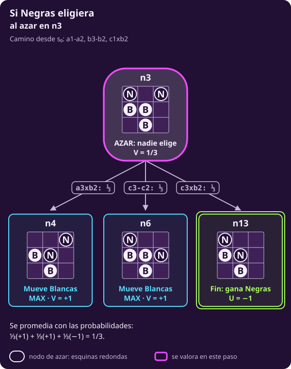
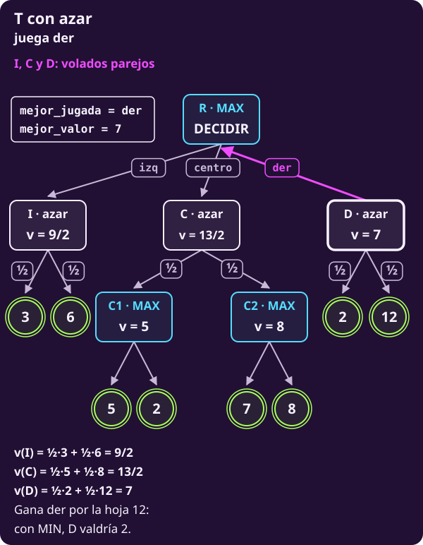

# Cuando decide un dado

**¿Qué cambia si un nodo no lo decide nadie?**

Al terminar tendrás **un tercer tipo de nodo**, el de azar, y sabrás
valorarlo. También sabrás reconocer los dos errores de modelado más comunes
con el azar.

> **Las reglas, en cuatro líneas.** Tablero de 3×3; Blancas (B) abajo en la
> fila 1 y Negras (N) arriba en la fila 3. Empiezan Blancas. Un peón avanza
> una casilla si está vacía o captura en diagonal hacia delante. Gana quien
> llega a la fila del rival, captura todos los peones rivales o deja al rival
> sin jugada; ganar vale $+1$ y perder, $-1$.

> **Supuestos de esta página.** Los de
> [[escribir-el-juego|Escribir el juego]] **salvo uno**: ya no es
> determinista. Algunos nodos los decide el azar, con probabilidades
> conocidas. En [[diagnosticar-el-juego|Diagnosticar el juego]], un juego
> así pedía un árbol con nodos de azar.

> **Las piezas que usa esta página.** Vienen de
> [[escribir-el-juego|Escribir el juego]]: $S_F$, los finales
> (@jue-c1-finales); $\mathrm{Pl}(s)$, quién mueve, leído del turno guardado
> (@jue-c1-pl); $A(s)$, las jugadas permitidas (@jue-c1-acciones); $T(s,a)$,
> a dónde lleva cada una (@jue-c1-transicion); y $U(s)$, $+1$ si gana
> Blancas y $-1$ si gana Negras (@jue-c1-utilidad).

## 1 · El problema, en general, cuando hay azar

**Piensa: ¿qué le falta al juego de la clase 1 para poder describir un
dado?**

Una sola pieza: **las probabilidades**. Un juego con azar es la misma tupla
de @jue-c1-juego con una pieza más, $\Pr$:

$$\bigl(S,\ s_0,\ S_F,\ \mathrm{Pl},\ A,\ T,\ \Pr,\ U\bigr).$$

Lo demás se queda igual. Lo que cambia, pieza por pieza:

::: table {#jue-c2-azar-cambia title="Qué cambia cuando hay azar"}
| | Con azar |
|---|---|
| $\mathrm{Pl}(s)$ | MAX, MIN o **AZAR**. *Antes, solo MAX o MIN* |
| $A(s)$ | En un nodo de azar, los **resultados** posibles |
| $\Pr(a)$ | **Nueva:** la probabilidad de cada resultado; suman 1 |
| $S$, $s_0$, $S_F$, $T$, $U$ | Iguales que en la clase 1 |
| $V(s)$ | Lo que MAX obtiene **en promedio**. *Antes, lo que asegura* |
| Ser racional | Buscar la mayor utilidad **esperada**. *Antes, sin azar, la utilidad esperada y la asegurada eran la misma* |
:::

> **Repaso de valor esperado.** Si un resultado aleatorio vale
> $x_1,\dots,x_n$ con probabilidades $p_1,\dots,p_n$, que suman 1, su
> **valor esperado** es $p_1x_1+\cdots+p_nx_n$. Es el promedio
> ponderado: lo que obtendrías en promedio si repitieras la situación muchas
> veces. Por ejemplo, ganar 6 con probabilidad $1/2$ y 0 con $1/2$ vale en
> promedio 3.

Con eso, el problema de la unidad (@jue-c1-problema) se escribe igual,
salvo por una palabra:

::: definition {#jue-c2-problema-azar title="El problema, con azar"}
**Dado:** las reglas del juego con azar,
$\bigl(S,\ s_0,\ S_F,\ \mathrm{Pl},\ A,\ T,\ \Pr,\ U\bigr)$, con las
probabilidades conocidas.

**Encontrar:** en cada estado $s$ donde le toca a MAX, una jugada

$$a^{∗}\in\operatorname*{arg\,max}_{a\in A(s)} V\bigl(T(s,a)\bigr),$$

donde $V$ toma el máximo en los nodos de MAX, el mínimo en los de MIN y el
**promedio** en los de azar. La sección 3 lo escribe completo.

**Qué significa:** MAX elige la jugada con la mayor utilidad **esperada**,
suponiendo que MIN es racional y que el azar sigue sus probabilidades. Es
la definición de racional de @jue-c1-racional, que ya decía «la jugada que
**espera** que le dé la mayor utilidad»: con azar, esa palabra trabaja.

**Qué no es:** no garantiza ganar ninguna partida concreta. Un dado puede
salir mal; lo que se asegura es el mejor promedio.
:::

**Lo que dicen las reglas y lo que elige alguien.** En un nodo de azar,
$\Pr$ es un **dato** del juego, como $T$. Nadie la elige: viene en el
reglamento (un dado justo da $1/6$ a cada cara) o en lo que sabemos del
rival.

Hexapawn no tiene dados. Para ver el azar sin cambiar de juego, le
agregamos dos cosas, una por sección: un volado antes de empezar, y un
rival que mueve sin pensar. Los dos son **casos de este problema**.

## 2 · Un volado decide quién empieza

**Piensa: si un volado decide quién empieza, ¿quién elige en ese primer
nodo?**

Nadie. Antes de la primera jugada se tira una moneda: con águila empieza
Blancas, con sol empieza Negras. Ese nodo no tiene un jugador. Tiene un
**azar**, con probabilidades conocidas.

::: definition {#jue-c2-nodo-azar title="Nodo de azar"}
En un juego con azar, el jugador de turno puede ser también el azar:

$$\mathrm{Pl}: S\setminus S_F\to\{\text{MAX},\ \text{MIN},\ \text{AZAR}\}.$$

En un estado con $\mathrm{Pl}(s)=\text{AZAR}$:

- $A(s)$ son los **resultados posibles**: las caras del dado, los lados de
  la moneda;
- cada resultado $a\in A(s)$ ocurre con probabilidad $\Pr(a)>0$, y esas
  probabilidades suman 1;
- $T(s,a)$ sigue siendo el estado al que se llega con ese resultado.

**Qué significa:** las piezas son las mismas de @jue-c1-pl; solo
$\mathrm{Pl}$ gana un valor, y aparecen las probabilidades.

**Qué no es:** un nodo de azar no es un jugador. No quiere nada: no busca
valores altos ni bajos.
:::

En el volado, los dos resultados llevan a dos estados que ya sabemos
valorar:

- **Águila, probabilidad $1/2$:** empieza Blancas. Es $s_0$, y
  $V(s_0)=-1$: gana quien juega segundo.
- **Sol, probabilidad $1/2$:** empieza Negras. Ahora Blancas juega segundo,
  y por simetría gana: ese estado vale $+1$.

Como nadie elige, se **promedia**:

$$V(\text{volado})=\tfrac12(-1)+\tfrac12(+1)=0.$$

El volado vuelve **justo** un juego que no lo era: ninguno de los dos tiene
ventaja antes de tirar la moneda.

## 3 · Valorar un nodo de azar

**Piensa: ¿qué operación le toca a un nodo de azar: máximo, mínimo o
ninguna de las dos?**

Ninguna de las dos: el promedio ponderado. Con eso, la regla de
@jue-c2-valor gana un renglón:

::: definition {#jue-c2-valor-esperado title="Valor con nodos de azar"}
- si $s\in S_F$: $\ V(s)=U(s)$;
- si $\mathrm{Pl}(s)=\text{MAX}$: $\ V(s)=\max_{a\in A(s)} V\bigl(T(s,a)\bigr)$;
- si $\mathrm{Pl}(s)=\text{MIN}$: $\ V(s)=\min_{a\in A(s)} V\bigl(T(s,a)\bigr)$;
- si $\mathrm{Pl}(s)=\text{AZAR}$: $\ V(s)=\sum_{a\in A(s)}\Pr(a)\,V\bigl(T(s,a)\bigr)$.

**Qué significa:** quien tiene intereses, optimiza; lo que no los tiene, se
promedia.

**Qué no es:** con azar, $V(s)$ ya no es lo que MAX **asegura**. Es lo que
obtiene **en promedio** si juega bien.
:::

## 4 · Un rival que mueve al azar

**Piensa: si sabes que Negras mueve sin pensar, eligiendo cualquier jugada
con la misma probabilidad, ¿sigue siendo un nodo MIN?**

> **El problema de esta sección.**
>
> **Dado:** el juego de hexapawn y un dato sobre el rival: Negras elige
> cada jugada al azar, todas con la misma probabilidad.
>
> **Encontrar:** cuánto vale n3 en promedio para Blancas, y qué apertura le
> conviene a Blancas en $s_0$.

No. Un rival así no busca nada: es un dado con forma de persona. Sus nodos
son de **azar**, y todas sus jugadas tienen la misma probabilidad: $1/2$ si
tiene dos, $1/3$ si tiene tres. Así queda n3, donde Negras tiene tres:

::: figure {#jue-c2-azar-n3 title="Si Negras eligiera al azar en n3"}

:::

$$V(\text{n3})=\tfrac13(+1)+\tfrac13(+1)+\tfrac13(-1)=\tfrac13.$$

Contra la Negras de [[minimax|Minimax a mano]], n3 valía $-1$. Contra una
que mueve al azar, vale $1/3$: Negras solo encuentra la captura ganadora
una de cada tres veces.

**El juego completo cambia más.** Con minimax, las tres aperturas de
Blancas valen $-1$: da igual cuál juegue. Si **todas** las jugadas de Negras
son al azar, la computadora calcula:

::: table {#jue-c2-rival-azar title="Las aperturas contra una Negras que mueve al azar"}
| Primera jugada | Contra Negras perfecta | Contra Negras al azar |
|---|---:|---:|
| $\text{a1}\textbf{-}\text{a2}$ | −1 | 5/9 |
| $\text{b1}\textbf{-}\text{b2}$ | −1 | 3/4 |
| $\text{c1}\textbf{-}\text{c2}$ | −1 | 5/9 |
:::

Contra un rival al azar, **$\text{b1}\textbf{-}\text{b2}$ es la mejor
apertura**. Minimax no podía decirlo: para él, las tres pierden igual.

::: exercise {#jue-c2-ej-probabilidad title="Decide qué probabilidad de ganar da el valor"}
Con $U=\pm1$ y sin empates, un valor esperado $V$ y la probabilidad $p$ de
que gane Blancas cumplen $V=p\cdot(+1)+(1-p)\cdot(-1)$.

1. Despeja $p$ en función de $V$.
2. ¿Con qué probabilidad gana Blancas en n3 contra una Negras al azar?
3. ¿Y con cada apertura de la tabla?
:::

::: hint {#jue-c2-pista-probabilidad of="jue-c2-ej-probabilidad" title="Una ecuación lineal"}
Desarrolla el lado derecho: queda $V=2p-1$. Despeja $p$ y sustituye cada
valor de la tabla.
:::

::: answer {#jue-c2-resp-probabilidad of="jue-c2-ej-probabilidad"}
1. $V=2p-1$, así que $p=\dfrac{V+1}{2}$.
2. En n3, $p=\dfrac{1/3+1}{2}=\dfrac23$.
3. $\text{a1}\textbf{-}\text{a2}$ y $\text{c1}\textbf{-}\text{c2}$:
   $p=\dfrac{5/9+1}{2}=\dfrac79$. $\text{b1}\textbf{-}\text{b2}$:
   $p=\dfrac{3/4+1}{2}=\dfrac78$. Contra un rival al azar, Blancas gana 7 de
   cada 8 partidas abriendo por el centro.
:::

## 5 · Dos errores de modelado

**Piensa: ¿qué pasa si te equivocas de tipo de nodo?**

Hay dos maneras de equivocarse, una en cada dirección:

::: table {#jue-c2-errores-azar title="Confundir el azar con un rival, y al revés"}
| Error | Qué pasa |
|---|---|
| **Tratar al azar como rival:** pones MIN donde Negras mueve al azar | Las tres aperturas valen $-1$ y te da igual cuál jugar. Pierdes lo que hacía mejor a $\text{b1}\textbf{-}\text{b2}$ |
| **Tratar al rival como azar:** pones AZAR donde Negras juega perfecto | Crees que $\text{b1}\textbf{-}\text{b2}$ gana 7 de cada 8 veces. En realidad pierdes siempre |
:::

El primero te vuelve **demasiado prudente**: supones lo peor de algo que no
quiere nada. El segundo, **demasiado optimista**: le das a un rival de
verdad la torpeza de un dado. La regla es la de la definición: **quien
tiene intereses, optimiza; lo que no los tiene, se promedia.**

## 6 · El procedimiento: expectiminimax

**Piensa: ¿cuántas líneas hay que agregarle a DECIDIR-MINIMAX y MINIMAX?**

Seis, todas al final: el caso del azar. El procedimiento se llama
**expectiminimax**. Las líneas 1 a 20 son las de
[[minimax-como-algoritmo|Minimax como algoritmo]]; solo la 15 deja de ser
un «else» a secas, porque ahora hay un tercer caso.

```text
INPUT   un estado s donde mueve MAX; las
        reglas S_F, Pl, A, T y U de un juego
        finito por turnos, con
        Pl(s) ∈ {MAX, MIN, AZAR}; y las
        probabilidades Pr. No recibe el grafo.
OUTPUT  una jugada de A(s) con el mayor
        valor esperado.

 1 function DECIDIR-EXPECTIMINIMAX(s)
 2   mejor_valor ← −∞ ; mejor_jugada ← ninguna
 3   for each a in A(s)
       # cuánto vale a, en promedio
 4     w ← EXPECTIMINIMAX(T(s, a))
       # estricto: un empate deja la primera
 5     if w > mejor_valor:
         mejor_valor ← w ; mejor_jugada ← a
 6   return mejor_jugada      # la jugada, no w

 7 function EXPECTIMINIMAX(s)
 8   if s ∈ S_F: return U(s)  # final: su U
 9   if Pl(s) = MAX
10     v ← −∞
11     for each a in A(s)
12       w ← EXPECTIMINIMAX(T(s, a))
13       v ← max(v, w)        # el mayor
14     return v
15   else if Pl(s) = MIN
16     v ← +∞
17     for each a in A(s)
18       w ← EXPECTIMINIMAX(T(s, a))
19       v ← min(v, w)        # el menor
20     return v
21   else                     # Pl(s) = AZAR
     # nadie elige: se suman todos
22     v ← 0                  # suma, no ±∞
23     for each a in A(s)
24       w ← EXPECTIMINIMAX(T(s, a))
25       v ← v + Pr(a) · w    # pesa su Pr
26     return v               # valor esperado
```

El mismo procedimiento en Python, línea por línea. `pr(s, a)` es
$\Pr(a)$ en el estado $s$; el número entre paréntesis es la línea del
pseudocódigo:

```python
from math import inf

# Las reglas: es_final(s), pl(s), acciones(s),
# transicion(s, a), utilidad(s) y pr(s, a).
# pl(s) da "MAX", "MIN" o "AZAR".

def decidir_expectiminimax(s):  # (1)
    # (2) Aún no ha visto ninguna jugada.
    mejor_valor = -inf
    mejor_jugada = None
    for a in acciones(s):       # (3)
        # (4) ¿Cuánto vale a, en promedio?
        w = expectiminimax(transicion(s, a))
        # (5) Solo si mejora estrictamente.
        if w > mejor_valor:
            mejor_valor = w
            mejor_jugada = a
    return mejor_jugada         # (6) jugada

def expectiminimax(s):          # (7)
    if es_final(s):             # (8) su U
        return utilidad(s)
    if pl(s) == "MAX":          # (9)
        v = -inf                # (10)
        for a in acciones(s):   # (11)
            w = expectiminimax(  # (12)
                transicion(s, a))
            v = max(v, w)       # (13) mayor
        return v                # (14)
    elif pl(s) == "MIN":        # (15)
        v = inf                 # (16)
        for a in acciones(s):   # (17)
            w = expectiminimax(  # (18)
                transicion(s, a))
            v = min(v, w)       # (19) menor
        return v                # (20)
    else:                       # (21) AZAR
        v = 0                   # (22) desde 0
        for a in acciones(s):   # (23) todos
            w = expectiminimax(  # (24)
                transicion(s, a))
            v = v + pr(s, a) * w  # (25)
        return v                # (26)
```

::: table {#jue-c2-t-que-cambia-azar title="Qué cambia respecto de minimax"}
| Líneas | Qué hacen |
|---|---|
| 1–14 y 16–20 | Lo mismo que en minimax |
| 15 | Pregunta si mueve MIN |
| 22 | $v$ empieza en 0, no en $\mp\infty$ |
| 25 | **Suma** $\Pr(a)\cdot w$ de todos los hijos |
:::

Igual que minimax, **recibe las reglas y genera los estados** mientras
recorre. El costo crece: en un nodo de azar hay que valorar **todos** los
resultados, porque todos cuentan en el promedio.

### El árbol T con dados

**Piensa: si I, C y D los decidiera una moneda, ¿seguiría ganando centro?**

Toma el árbol T de [[minimax-como-algoritmo|Minimax como algoritmo]] y
cambia una sola cosa: **I, C y D son nodos de azar**, cada hijo con
probabilidad $\tfrac12$. R, C1 y C2 siguen siendo de MAX.

::: figure {#jue-c2-t-fig-azar title="El árbol T con I, C y D de azar"}

:::

La traza de DECIDIR-EXPECTIMINIMAX(R), con el formato de
[[minimax-como-algoritmo|Minimax como algoritmo]]: una fila al entrar a un
nodo de azar (línea 22, $v=0$) y una por cada hijo que regresa (líneas
24–25 en el azar, 4–5 en la raíz). En las filas de R, $v$ es mejor_valor,
y la columna jugada lleva mejor_jugada en todas las filas («—» si ninguna).
C1 y C2 se valoran como en minimax y aquí solo devuelven su $w$.

**Tramo 1 · izq y centro**

::: table {#jue-c2-t-traza-azar title="Traza de DECIDIR-EXPECTIMINIMAX en el árbol T"}
| # | línea · pila | v | w | jugada |
|---:|---|---:|---|---|
| 1 | 2 · R | −∞ |  | — |
| 2 | 22 · R›I | 0 |  | — |
| 3 | 24–25 · R›I | 3/2 | 3 | — |
| 4 | 24–25 · R›I | 9/2 | 6 | — |
| 5 | 4–5 · R | 9/2 | 9/2 (I) | izq |
| 6 | 22 · R›C | 0 |  | izq |
| 7 | 24–25 · R›C | 5/2 | 5 (C1) | izq |
| 8 | 24–25 · R›C | 13/2 | 8 (C2) | izq |
| 9 | 4–5 · R | 13/2 | 13/2 (C) | centro |
:::

- **Fila 3:** la hoja 3 pesa $\tfrac12$: $v=0+\tfrac12\cdot3=3/2$.
- **Fila 5:** $9/2>-\infty$: mejor_jugada pasa a **izq**.
- **Fila 9:** $13/2>9/2$: mejor_jugada pasa a **centro**.

**Tramo 2 · der**

| # | línea · pila | v | w | jugada |
|---:|---|---:|---|---|
| 10 | 22 · R›D | 0 |  | centro |
| 11 | 24–25 · R›D | 1 | 2 | centro |
| 12 | 24–25 · R›D | 7 | 12 | centro |
| 13 | 4–5 · R | 7 | 7 (D) | der |
| 14 | 6 · R | 7 |  | der |

- **Fila 12:** la hoja 12 sube el promedio de D de 1 a 7.
- **Fila 13:** $7>13/2$: mejor_jugada pasa a **der**, y la línea 6 la
  devuelve.

Con MIN en I, C y D, minimax jugaba **centro** (5): D valía 2, el peor de
sus hijos. Con azar juega **der**, gracias a la **hoja 12**. A un MIN la
hoja 12 no le cambia nada: con el 2, D ya vale 2 y R se queda con
centro. A un promedio sí: cada hoja mueve el resultado.
**Guarda esta hoja: volverá.**

::: exercise {#jue-c2-t-ej-azar title="Cambia una moneda"}
En D, la hoja 2 sale ahora con probabilidad $\tfrac35$ y la hoja 12 con
$\tfrac25$. Lo demás no cambia.

1. ¿Cuánto vale D? ¿Qué jugada devuelve DECIDIR-EXPECTIMINIMAX(R)?
2. Si la hoja 2 sale con probabilidad $p$, ¿desde qué $p$ deja de jugar
   der?
:::

::: hint {#jue-c2-t-pista-azar of="jue-c2-t-ej-azar" title="Solo cambia el tramo de D"}
I y C no cambian. La línea 25 en D suma $\Pr\cdot w$ con las nuevas
probabilidades, y la línea 5 compara ese número con $13/2$.
:::

::: answer {#jue-c2-t-resp-azar of="jue-c2-t-ej-azar"}
1. $V(\text{D})=\tfrac35\cdot2+\tfrac25\cdot12=6$. Como $6>13/2$ es falso,
   la línea 5 no cambia de jugada: devuelve **centro**.
2. $V(\text{D})=2p+12(1-p)=12-10p$, que es mayor que $13/2$ solo si
   $p<\tfrac{11}{20}$. Con $p=\tfrac{11}{20}$ empatan en $13/2$ y gana
   centro, que llegó primero: el $>$ de la línea 5 es estricto.
:::

## 7 · Con azar importan las distancias

**Piensa: si cambias los números de los finales sin cambiar su orden,
¿cambia la decisión?**

Con minimax, no: elegir el máximo o el mínimo solo depende del orden. Con
azar, sí, porque un promedio depende de **cuánto** valen los finales.

Recuerda la variante de la [[tarea-leer-y-escribir|tarea de la clase 1]],
donde quedarse sin jugada es empate y vale 0. Imagina que Blancas puede
elegir entre un **empate seguro** y un **volado** entre ganar y perder:

- con ganar $+1$ y perder $-1$, el volado vale $\tfrac12(+1)+\tfrac12(-1)=0$:
  igual que el empate;
- con ganar $+1$ y perder $-2$, el orden de los resultados no cambia, pero
  el volado vale $\tfrac12(+1)+\tfrac12(-2)=-\tfrac12$: ahora conviene el
  empate.

Por eso, con azar, la utilidad tiene que medir **cuánto** se prefiere cada
resultado, no solo cuál es mejor. El cambio de escala de
[[escribir-el-juego|Escribir el juego]], que pasa 1, ½ y 0 a $+1$, 0 y $-1$,
sigue siendo seguro: estira todas las distancias por igual. Lo que cambia la
decisión es mover un resultado más que los otros, como aquí el de perder.

::: exercise {#jue-c2-ej-escala title="Decide si tiras el volado"}
Ganar vale $+1$ y empatar, 0. ¿Para qué valores de perder, $-L$ con $L>0$,
conviene el volado sobre el empate seguro? ¿Qué pasa en el límite?
:::

::: hint {#jue-c2-pista-escala of="jue-c2-ej-escala" title="Compara con cero"}
El volado vale $\tfrac12(+1)+\tfrac12(-L)$. ¿Cuándo es mayor que 0?
:::

::: answer {#jue-c2-resp-escala of="jue-c2-ej-escala"}
El volado vale $\dfrac{1-L}{2}$. Es mayor que 0 cuando $L<1$: **conviene si
perder cuesta menos de lo que vale ganar**. Con $L=1$ empatan, y con
$L>1$ conviene el empate. El orden «perder < empatar < ganar» es el mismo en
los tres casos; lo que cambia la decisión es la distancia entre ellos.
:::

**Punto de control:** deberías poder valorar un árbol con nodos MAX, MIN y
de azar, decir para cada nodo si se maximiza, se minimiza o se promedia, y
explicar qué error comete quien confunde un rival con el azar.

## Lo que hay que llevarse

- Con azar, el juego gana una pieza, $\Pr$, y el problema cambia una
  palabra: MAX busca la mayor utilidad **esperada**, no la asegurada.
- Un nodo de azar tiene $\mathrm{Pl}(s)=\text{AZAR}$: nadie elige, y se
  valora con el **promedio ponderado** de sus hijos.
- En hexapawn: el volado para empezar vale 0, y contra una Negras al azar
  la mejor apertura es $\text{b1}\textbf{-}\text{b2}$, que gana 7 de cada 8
  veces.
- Tratar al azar como rival te vuelve demasiado prudente; tratar a un rival
  como azar, demasiado optimista.
- Expectiminimax es DECIDIR y MINIMAX con un caso más, el del azar: $v$
  empieza en 0 y suma $\Pr(a)\cdot w$ de **todos** los hijos. En el
  árbol T con monedas juega der, gracias a la hoja 12, que a un MIN no le
  cambiaba nada: con el 2, D ya valía 2 y R se quedaba con centro.
- Con azar importan las distancias entre utilidades, no solo su orden.

Continúa con [[alfa-beta|alfa-beta a mano]].
