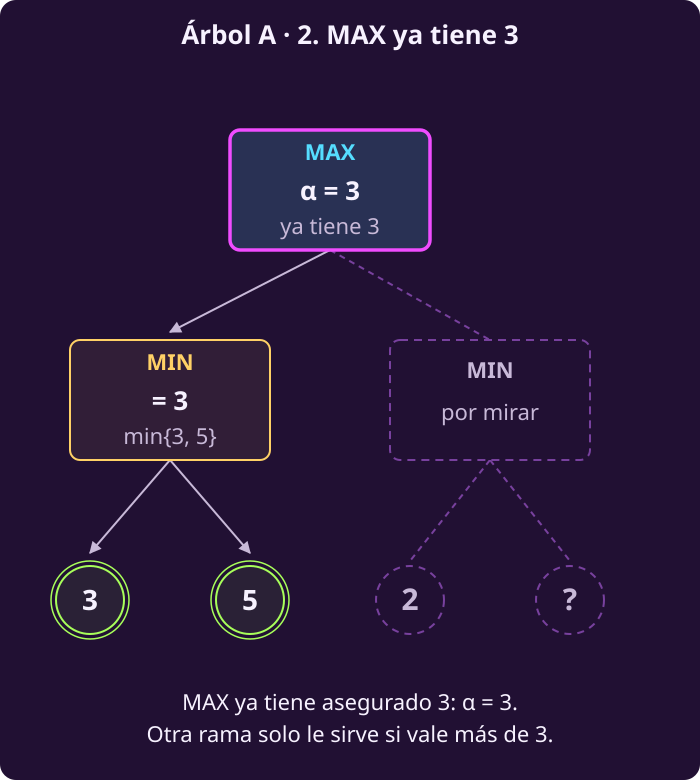
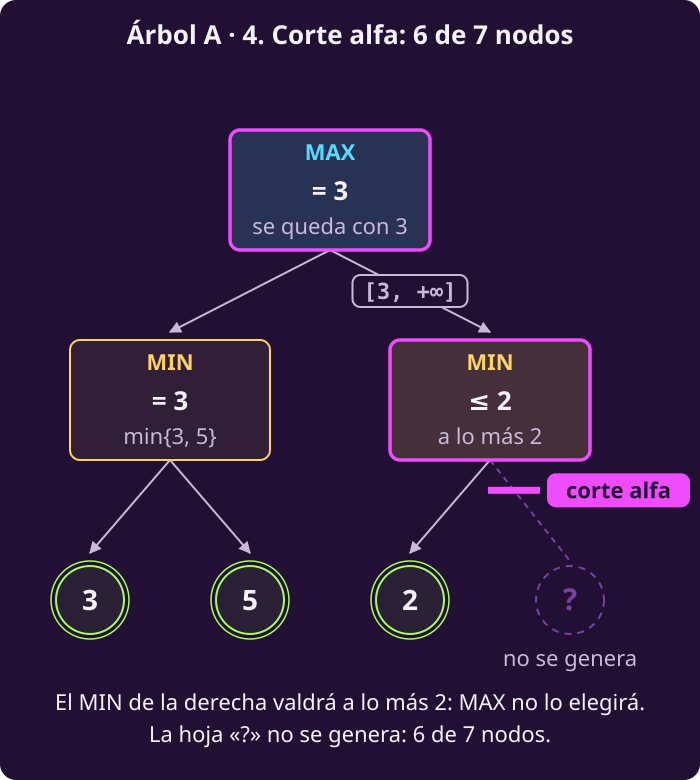

# Alfa-beta a mano

**¿Cómo dejar ramas sin generar sin cambiar la respuesta?**

Al terminar tendrás:

- **la idea de alfa-beta**, vista en dos árboles de siete nodos;
- **qué son $\alpha$ y $\beta$**, y en qué nodo corta cada una;
- **dos recorridos de n1 hechos a mano**: uno genera 5 de los 13 estados y
  otro genera 8, y los dos dan el mismo valor que minimax.

> **Las reglas, en cuatro líneas.** Tablero de 3×3; Blancas (B) abajo en la
> fila 1 y Negras (N) arriba en la fila 3. Empiezan Blancas. Un peón avanza
> una casilla si está vacía o captura en diagonal hacia delante. Gana quien
> llega a la fila del rival, captura todos los peones rivales o deja al rival
> sin jugada; ganar vale $+1$ y perder, $-1$.

> **Supuestos de esta página.** Los mismos de
> [[escribir-el-juego|Escribir el juego]]: dos jugadores por turnos, sin
> azar, todo a la vista, toda partida termina y suma cero.

> **Las piezas que usa esta página.** Las cinco primeras vienen de
> [[escribir-el-juego|Escribir el juego]]; $V$, de
> [[minimax|Minimax a mano]].
>
> - $S_F$: los estados donde la partida ya terminó (@jue-c1-finales).
> - $\mathrm{Pl}(s)$: quién mueve, MAX (Blancas) o MIN (Negras), leído del
>   turno guardado (@jue-c1-pl).
> - $A(s)$: las jugadas permitidas en $s$ (@jue-c1-acciones).
> - $T(s,a)$: el estado al que lleva la jugada $a$ (@jue-c1-transicion).
> - $U(s)$: lo que vale un final para MAX: $+1$ si gana Blancas, $-1$ si
>   gana Negras (@jue-c1-utilidad).
> - $V(s)$: el valor minimax, lo que MAX puede asegurar desde $s$
>   (@jue-c2-valor).
> - $v$: **nuevo en esta página.** El mejor valor visto **hasta ahora**
>   entre los hijos del nodo actual. Cambia mientras el nodo revisa a sus
>   hijos.

> **El problema de esta página.**
>
> **Dado:** el estado n1 y las reglas del juego, $S_F$, $\mathrm{Pl}$, $A$,
> $T$ y $U$: lo mismo que recibe minimax.
>
> **Encontrar:** $V(\text{n1})$ y la jugada que lo alcanza, **sin generar**
> los estados que no pueden cambiar la respuesta.

## 1 · La idea, sin letras griegas

**Piensa: si ya tienes una jugada que te da 3, ¿necesitas saber cuánto vale
exactamente otra que te da 2 o menos?**

- **Minimax mira todo.** Genera cada estado del árbol, hasta los finales.
- **Alfa-beta deja de mirar una rama en cuanto sabe que no cambia la
  decisión de arriba.** Y lo que no se mira **no se genera**: ése es el
  ahorro.
- **La respuesta en la raíz es la misma** que la de minimax: el mismo valor
  y la misma jugada.

## 2 · Un árbol de siete nodos

**Piensa: ¿en qué momento MAX ya sabe que la rama de la derecha no le
sirve?**

El **árbol A**: arriba mueve MAX; abajo, dos nodos de MIN, cada uno con dos
hojas. Se recorre en profundidad, de izquierda a derecha. Una hoja aparece
como «?»: es la que nunca llegaremos a ver.

::: figure {#jue-c2-ab-a-1 title="Árbol A, paso 1: la rama de la izquierda"}

:::

**El MIN de la izquierda toma la menor de sus hojas: vale 3.**

::: figure {#jue-c2-ab-a-2 title="Árbol A, paso 2: MAX ya tiene 3"}

:::

**De vuelta en la raíz, MAX ya tiene 3 asegurado.** No aceptará menos. El
dibujo lo anota $\alpha=3$; el nombre se explica en la sección 4.

::: figure {#jue-c2-ab-a-3 title="Árbol A, paso 3: la primera hoja de la derecha"}
![El mismo árbol A. El MIN de la derecha ya se generó; sobre la arista que llega a él va la anotación [3, +∞]. Su primera hoja, 2, va resaltada, y el nodo muestra «v = 2 ≤ 3». La segunda hoja aún no se genera](../_assets/jue-ab-arbol-a-paso-3.svg)
:::

**El MIN de la derecha llega con $[3,+\infty]$ y su primera hoja vale 2.**

- Entre corchetes van **dos números heredados**: a la izquierda, lo que **MAX**
  ya tiene asegurado (3); a la derecha, lo que **MIN** ya tiene asegurado
  (nada todavía: $+\infty$).
- Con esa hoja, MIN **ya puede dejar a MAX en 2 o menos** aquí.

::: figure {#jue-c2-ab-a-4 title="Árbol A, paso 4: el corte"}

:::

**MAX tiene 3 por la izquierda; por la derecha recibiría 2 o menos. Nunca
entrará ahí.**

- La hoja «?» **no se genera**. Es un **corte alfa**: lo provocó lo que MAX
  ya tenía.
- El MIN de la derecha devuelve 2, pero **eso no es su valor**: solo se
  sabe que vale **a lo más 2**. Su valor exacto depende de «?», que nunca
  se genera: el algoritmo no lo sabrá.
- La raíz vale **3**, igual que con minimax. Se generaron **6 de 7** nodos.

¿Y si el árbol se recorriera de derecha a izquierda? Entonces el MIN de la
derecha va primero, nadie tiene nada asegurado todavía, y **se generan los
7**: no hay corte. **El orden decide cuánto se ahorra.**

::: exercise {#jue-c2-ej-hoja-oculta title="Decide si importa la hoja oculta"}
1. Si la hoja «?» valiera 100, ¿cambiaría el valor de la raíz?
2. ¿Y si valiera $-50$?
:::

::: hint {#jue-c2-pista-hoja-oculta of="jue-c2-ej-hoja-oculta" title="Quién elige ahí"}
En ese nodo elige MIN, y ya tiene un 2. ¿Puede el valor del nodo subir por
encima de 2, valga lo que valga la otra hoja?
:::

::: answer {#jue-c2-resp-hoja-oculta of="jue-c2-ej-hoja-oculta"}
1. No. MIN se quedaría con el 2: el nodo vale 2, y MAX prefiere su 3.
2. Tampoco. El nodo valdría $-50$, todavía peor para MAX. La raíz sigue en
   3.

**Valga lo que valga «?», el nodo vale a lo más 2**, y eso ya basta para que
MAX no entre. Por eso no hace falta generarla.
:::

## 3 · El espejo: raíz MIN

**Piensa: si arriba mueve MIN, ¿quién provoca el corte?**

El **árbol B** es el mismo dibujo con los papeles al revés: arriba mueve
MIN; abajo, dos nodos de MAX. Hojas: 8 y 6 a la izquierda; 9 y «?» a la
derecha.

::: figure {#jue-c2-ab-b-1 title="Árbol B, paso 1: MIN ya tiene 8"}

:::

**El MAX de la izquierda toma la mayor de sus hojas: 8.** Entonces MIN, en
la raíz, **ya tiene 8 asegurado**: no aceptará más. El dibujo lo anota
$\beta=8$.

::: figure {#jue-c2-ab-b-2 title="Árbol B, paso 2: el corte"}
![El mismo árbol B, terminado. El MAX de la derecha lleva la anotación [−∞, 8]; su primera hoja, 9, va resaltada con «9 ≥ 8». Su segunda hoja es una caja punteada con «?». Una barra de acento con la leyenda «corte beta» va bajo ese nodo, que muestra «≥ 9». La raíz muestra «= 8»](../_assets/jue-ab-arbol-b-paso-2.svg)
:::

**El MAX de la derecha llega con $[-\infty,8]$; su primera hoja vale 9.**

- MAX **ya puede conseguir 9 o más** aquí. MIN tiene 8 por la izquierda:
  nunca dejará que la partida llegue aquí.
- La hoja «?» **no se genera**. Es un **corte beta**: lo provocó lo que MIN
  ya tenía.
- El MAX de la derecha devuelve 9, pero el algoritmo solo sabe que vale
  **al menos 9**: no generó la otra hoja, así que no conoce su valor exacto.
- La raíz vale **8**. Se generaron **6 de 7** nodos.

## 4 · Alfa y beta, en una tabla

**Piensa: en los dos árboles, ¿qué número decidió cada corte?**

En el árbol A, lo que **MAX** ya tenía (3). En el árbol B, lo que **MIN**
ya tenía (8). Alfa-beta lleva esos dos números en cada nodo.

::: definition {#jue-c2-alfa-beta title="Alfa y beta"}
En cada nodo del recorrido hay dos números:

| | $\alpha$ («alfa») | $\beta$ («beta») |
|---|---|---|
| Qué es | Lo mejor que **MAX** ya tiene asegurado en el camino desde la raíz | Lo mejor que **MIN** ya tiene asegurado en ese camino |
| Empieza en | $-\infty$ | $+\infty$ |
| Se mueve | Solo sube | Solo baja |
| Lo actualiza | Un nodo de MAX, cuando $v$ lo supera | Un nodo de MIN, cuando $v$ queda debajo |
| Corta en | Un nodo de **MIN**, si $v\le\alpha$ | Un nodo de **MAX**, si $v\ge\beta$ |

- **Cada hijo hereda** el $\alpha$ y el $\beta$ que tiene su padre **en el
  momento de generarlo**.
- **Qué significa:** el valor que puede cambiar la decisión de arriba está
  entre $\alpha$ y $\beta$. Lo que cae fuera, alguno de los dos ya lo
  evitó.
- **Qué no es:** ni $\alpha$ ni $\beta$ es el valor del nodo. Son lo que
  cada jugador tiene asegurado **fuera del hijo que se está revisando**.
:::

> [!WARNING]
> **El corte se llama como la cota que usa, no como el nodo donde ocurre.**
> El corte **alfa** pasa en un nodo de **MIN**: lo provoca lo que MAX ya
> tenía. El corte **beta** pasa en un nodo de **MAX**: lo provoca lo que
> MIN ya tenía.

## 5 · Los dos cortes

**Piensa: ¿qué tiene que pasar exactamente para dejar de revisar hijos?**

::: definition {#jue-c2-cortes title="Corte alfa y corte beta"}
$v$ es el mejor valor visto hasta ahora entre los hijos del nodo actual.

**Corte alfa**, en un nodo de MIN:

- condición: $v\le\alpha$;
- por qué: MIN ya puede dejar a MAX en $v$ o menos, y MAX tiene asegurado
  $\alpha$ en otra parte. **MAX nunca elegirá entrar aquí;**
- efecto: los hijos que faltan **no se generan**.

**Corte beta**, en un nodo de MAX:

- condición: $v\ge\beta$;
- por qué: MAX ya puede conseguir $v$ o más, y MIN tiene asegurado $\beta$
  en otra parte. **MIN nunca dejará que la partida llegue aquí;**
- efecto: los hijos que faltan **no se generan**.
:::

Dos avisos:

- **El igual cuenta.** Un empate con lo que el otro ya tiene no le sirve a
  nadie, así que también se corta.
- **Un corte no da el valor del nodo: devuelve una cota.** «A lo más $v$»
  tras un corte alfa; «al menos $v$» tras un corte beta. La sección 9
  vuelve sobre esto.

::: exercise {#jue-c2-ej-empate-a title="Decide si se corta con un empate"}
En el árbol A, cambia la hoja 2 por un **3**: el MIN de la derecha tiene
ahora hojas 3 y «?».

1. Ese nodo llega con $[3,+\infty]$ y su primera hoja vale 3. ¿Se corta?
2. ¿Cambia el valor de la raíz?
:::

::: hint {#jue-c2-pista-empate-a of="jue-c2-ej-empate-a" title="Mira el signo"}
El nodo es de MIN, así que toca el corte alfa. Su condición es $v\le\alpha$,
no $v<\alpha$.
:::

::: answer {#jue-c2-resp-empate-a of="jue-c2-ej-empate-a"}
1. Sí: $v=3\le\alpha=3$, un **corte alfa**, por el igual. Aquí MIN puede
   dejar a MAX en 3 o menos, y MAX ya tiene 3 por la izquierda: entrar no
   lo mejora.
2. No: la raíz sigue en **3**. Se generan otra vez 6 de 7 nodos.
:::

## 6 · La ventana [α, β]

**Piensa: ¿con qué números llegó el MIN de la derecha del árbol A, y qué
valores le habrían importado a la raíz?**

Los dos números de un nodo se escriben juntos, $[\alpha,\beta]$, y se llaman
**ventana**.

::: figure {#jue-c2-ab-ventana title="La ventana [α, β]"}
![Una recta numérica de −∞ a +∞ con dos marcas, α y β. La banda entre ellas va resaltada con la leyenda «aquí el valor importa». A la izquierda de α, la leyenda «v ≤ α: corte alfa (nodo de MIN)»; a la derecha de β, «v ≥ β: corte beta (nodo de MAX)», y la nota «El igual cuenta». Abajo, dos rectas de ejemplo: la del MIN de la derecha del árbol A, con [3, +∞] y 2 ≤ 3, y la del MAX de la derecha del árbol B, con [−∞, 8] y 9 ≥ 8](../_assets/jue-ab-ventana.svg)
:::

- **Solo importa lo que cae estrictamente dentro**, entre $\alpha$ y
  $\beta$. Solo ese valor puede cambiar la decisión de arriba. Se escribe
  $[\alpha,\beta]$ por costumbre, pero **los extremos no están dentro**: si
  $v$ toca $\alpha$ o $\beta$, ya se corta.
- **Sale por la izquierda** ($v\le\alpha$), en un nodo de MIN: **corte
  alfa**.
- **Sale por la derecha** ($v\ge\beta$), en un nodo de MAX: **corte beta**.
- **En la raíz** la ventana es $[-\infty,+\infty]$: todavía nada está
  asegurado.
- **Al bajar, la ventana solo se encoge**: el hijo hereda la de su padre, y
  dentro de cada nodo $\alpha$ solo sube y $\beta$ solo baja.

En una línea: **cortar es lo mismo que decir que la ventana se cerró**, es
decir, que al actualizarla quedaría $\alpha\ge\beta$.

## 7 · n1 en orden fijo, por partes

**Piensa: si Blancas ya tiene una jugada que gana, ¿necesita saber
exactamente cuánto vale la otra?**

Volvemos al subgrafo de n1. Minimax generó sus 13 estados y obtuvo
$V(\text{n1})=+1$ con $\text{c1}\textbf{-}\text{c2}$. **Nosotros ya
conocemos ese $+1$; el algoritmo empezará sin él.** Lo usaremos al final
para comprobar.

> [!NOTE]
> **En n1, $U$ solo vale $+1$ o $-1$.** Por eso, en cuanto la raíz tiene
> $\alpha=+1$, ya tiene el máximo posible, y el primer corte se lee como
> «ya gané». La lógica es la misma de los árboles A y B, que la muestran con
> números variados.

::: figure {#jue-c2-ab-fijo-1 title="Orden fijo, parte 1: n2 da +1"}

:::

**Blancas genera n2, tras $\text{c1}\textbf{-}\text{c2}$: es final y vale
$+1$.** La raíz pasa a $\alpha=+1$: Blancas **ya tiene asegurado $+1$**.

::: exercise {#jue-c2-ej-primer-corte title="Decide si se corta en n3"}
Después, Blancas genera n3, tras $\text{c1}\textbf{x}\text{b2}$; ahí mueve
Negras. Su primera respuesta, $\text{a3}\textbf{x}\text{b2}$, lleva a n4, y
la única jugada de n4 lleva a n5, que vale $+1$.

1. ¿Por qué n3 llega con $\alpha=+1$ y no con $-\infty$?
2. Tras valorar n4, n3 tiene $v=+1$. ¿Se cumple la condición de algún
   corte? ¿Cuál?
3. ¿Qué devuelve n3 a la raíz y qué sabe el algoritmo de su valor exacto?
:::

::: hint {#jue-c2-pista-primer-corte of="jue-c2-ej-primer-corte" title="Hereda y compara"}
Un hijo hereda el $\alpha$ de su padre **en el momento de generarlo**. ¿Qué
había pasado en n1 antes de generar n3? Para el corte, n3 es de MIN: mira
la condición del corte alfa.
:::

::: answer {#jue-c2-resp-primer-corte of="jue-c2-ej-primer-corte"}
1. Porque antes de generar n3, la raíz ya había valorado n2 y había subido
   su $\alpha$ a $+1$. n3 lo hereda.
2. Sí: $v=+1\le\alpha=+1$, un **corte alfa**. Las dos respuestas que faltan,
   $\text{c3}\textbf{-}\text{c2}$ (n6) y $\text{c3}\textbf{x}\text{b2}$
   (n13), no se generan.
3. Devuelve $+1$. Del valor exacto solo sabe que es **a lo más $+1$**.
   Minimax calculó que es $-1$, pero alfa-beta no lo sabe ni lo necesita.
:::

::: figure {#jue-c2-ab-fijo-2 title="Orden fijo, parte 2: el corte alfa en n3"}
![n3, de MIN, con la anotación [+1, +∞]. Debajo, n4, de MAX, con [+1, +∞], y su único hijo n5, final, que vale +1. n3 muestra «v = +1 ≤ +1» y «≤ +1 (cota)». Una barra de acento con la leyenda «corte alfa» va bajo n3. Al lado, dos cajas punteadas con «?»: n6 con lo que cuelga de él, tras c3-c2, y n13, tras c3xb2; no se generan](../_assets/jue-ab-fijo-parte-2.svg)
:::

**En n3, Negras ya puede dejar a Blancas en $+1$ o menos**: le basta
$\text{a3}\textbf{x}\text{b2}$. Sus otras respuestas solo podrían bajar ese
número. Para Blancas, «$+1$ o menos» no mejora el $+1$ que ya tiene.

- **Corte alfa en n3**: n6, todo lo que cuelga de n6, y n13 **no se
  generan**.
- Se generan **5 estados de 13**: n1, n2, n3, n4 y n5.
- La raíz da **$+1$, con $\text{c1}\textbf{-}\text{c2}$**: lo mismo que
  minimax.

El recorrido completo, sobre el dibujo de n1. El número en la esquina de
cada nodo es el orden de visita.

::: figure {#jue-c2-ab-fijo title="Alfa-beta con el orden fijo"}

:::

**La traza.** Cada renglón numerado es un estado que se genera, en orden, con
la ventana con que llega. Las viñetas de abajo son lo que pasa **al
volver** a un nodo ya generado.

1. **n1** · MAX · $[-\infty,+\infty]$ · genera n2.
2. **n2** · final · $[-\infty,+\infty]$ · vale $+1$.
   - De vuelta en n1: $\alpha$ sube a $+1$. Genera n3.
3. **n3** · MIN · $[+1,+\infty]$ · genera n4.
4. **n4** · MAX · $[+1,+\infty]$ · genera n5, su único hijo.
5. **n5** · final · $[+1,+\infty]$ · vale $+1$.
   - De vuelta en n4: devuelve $+1$.
   - De vuelta en n3: $v=+1\le\alpha=+1$, **corte alfa**. Devuelve $+1$,
     una cota: **a lo más $+1$**.
   - De vuelta en n1: ese $+1$ **empata** con el de n2, no lo mejora. La
     jugada sigue siendo $\text{c1}\textbf{-}\text{c2}$. Devuelve $+1$.

## 8 · n1 en orden invertido, por partes

**Piensa: si Blancas hubiera mirado primero la captura, ¿se habría
ahorrado lo mismo?**

Repetimos todo con el orden **invertido en todos los nodos**: la última
jugada de cada lista se revisa primero.

- El árbol y sus finales no cambian, y los nodos **conservan sus números**.
- En las figuras, el dibujo está reflejado para que de izquierda a derecha se
  lea el nuevo orden.

::: figure {#jue-c2-ab-inv-1 title="Orden invertido, parte 1: Negras ya tiene −1"}

:::

**La raíz empieza por n3, y n3 por n13**, tras
$\text{c3}\textbf{x}\text{b2}$: final, vale $-1$.

- En n3, $v=-1$. ¿$-1\le\alpha=-\infty$? No: no hay corte.
- n3 actualiza $\beta=-1$: **Negras ya tiene asegurado $-1$**.

**Ahora Blancas, en n6.** n6 hereda $[-\infty,-1]$. Su primer hijo, en el
orden invertido, es n12, tras $\text{b2}\textbf{x}\text{a3}$: final, vale
$+1$. En n6, $v=+1$.

::: exercise {#jue-c2-ej-corte-beta title="Decide si se corta en n6"}
1. En n6, $\beta=-1$ y $v=+1$. Es un nodo de MAX. ¿Se cumple la condición
   de algún corte?
2. ¿Qué hijos de n6 no se generan?
3. Dilo en palabras: ¿por qué Negras no necesita saber cuánto vale n6
   exactamente?
:::

::: hint {#jue-c2-pista-corte-beta of="jue-c2-ej-corte-beta" title="Desde el lado de Negras"}
$\beta=-1$ es lo que Negras ya tiene asegurado en n3 con otra jugada. Si
entra en n6, Blancas consigue al menos $+1$. ¿Le conviene a Negras?
:::

::: answer {#jue-c2-resp-corte-beta of="jue-c2-ej-corte-beta"}
1. Sí: $v=+1\ge\beta=-1$, un **corte beta**.
2. n11, tras $\text{b2}\textbf{-}\text{b3}$, y n7, tras
   $\text{b1}\textbf{x}\text{c2}$, con todo lo que cuelga de n7: n8, n9 y
   n10.
3. Negras ya tiene $\text{c3}\textbf{x}\text{b2}$, que gana. Si jugara
   $\text{c3}\textbf{-}\text{c2}$, Blancas conseguiría **al menos** $+1$.
   Negras nunca elegirá esa jugada, y no importa cuánto más valga.
:::

::: figure {#jue-c2-ab-inv-2 title="Orden invertido, parte 2: el corte beta en n6"}
![n6, de MAX, con la anotación [−∞, −1]. Su primer hijo, n12, tras b2xa3, va resaltado: final, vale +1. n6 muestra «+1 ≥ −1» y «≥ +1 (cota)». Una barra de acento con la leyenda «corte beta» va bajo n6. Sus otros dos hijos, n11 tras b2-b3 y n7 tras b1xc2, son cajas punteadas con «?»: no se generan](../_assets/jue-ab-invertido-parte-2.svg)
:::

**Corte beta en n6**: n11, n7 y lo que cuelga de n7 **no se generan**. n6
devuelve $+1$: **al menos $+1$**.

::: figure {#jue-c2-ab-inv-3 title="Orden invertido, parte 3: Negras termina, y la raíz también"}
![De vuelta en n3, falta n4, de MAX, con [−∞, −1]; su único hijo, n5, vale +1, y bajo n5 va la nota «en n4, +1 ≥ −1: corta, pero no ahorra». n3 devuelve −1. La raíz muestra «α = −1». Su último hijo, n2, llega con [−1, +∞] y vale +1. La raíz muestra +1](../_assets/jue-ab-invertido-parte-3.svg)
:::

**Negras termina, y la raíz también.**

- De vuelta en n3, $v$ sigue en $-1$. Falta n4, que hereda $[-\infty,-1]$.
- Su único hijo, n5, vale $+1$. Como $+1\ge\beta$, **se cumpliría un corte
  beta**, pero n4 ya no tiene más hijos que ahorrar.
- n3 devuelve $-1$: revisó todos sus hijos, así que **es su valor exacto**.
- En la raíz, $\alpha$ sube a $-1$. El último hijo, n2, llega con
  $[-1,+\infty]$ y vale $+1$.
- La raíz devuelve **$+1$, con $\text{c1}\textbf{-}\text{c2}$**. Mismo valor,
  misma jugada. Se generan **8 estados de 13**.

El recorrido completo, sobre el dibujo reflejado de n1:

::: figure {#jue-c2-ab-invertido title="Alfa-beta con el orden invertido"}

:::

**La traza**, con el mismo formato que la del orden fijo:

1. **n1** · MAX · $[-\infty,+\infty]$ · genera n3.
2. **n3** · MIN · $[-\infty,+\infty]$ · genera n13.
3. **n13** · final · $[-\infty,+\infty]$ · vale $-1$.
   - De vuelta en n3: $v=-1$, sin corte. $\beta$ baja a $-1$. Genera n6.
4. **n6** · MAX · $[-\infty,-1]$ · genera n12.
5. **n12** · final · $[-\infty,-1]$ · vale $+1$.
   - De vuelta en n6: $v=+1\ge\beta=-1$, **corte beta**. Devuelve $+1$,
     una cota: **al menos $+1$**.
   - De vuelta en n3: $v$ sigue en $-1$. Genera n4.
6. **n4** · MAX · $[-\infty,-1]$ · genera n5, su único hijo.
7. **n5** · final · $[-\infty,-1]$ · vale $+1$.
   - De vuelta en n4: $+1\ge-1$, pero no queda nada que ahorrar. Devuelve
     $+1$.
   - De vuelta en n3: $v$ sigue en $-1$, sin más hijos. Devuelve $-1$.
   - De vuelta en n1: $\alpha$ sube a $-1$. Genera n2.
8. **n2** · final · $[-1,+\infty]$ · vale $+1$.
   - De vuelta en n1: $+1$ mejora a $-1$; la jugada pasa a
     $\text{c1}\textbf{-}\text{c2}$. Devuelve $+1$.

## 9 · Una cota no es un valor

**Piensa: n3 devolvió $+1$ en el primer recorrido. ¿Vale $+1$?**

No. En los dos recorridos, la **raíz** devuelve el valor exacto, $+1$. Los
nodos donde hubo corte, no:

- **n3, orden fijo:** devolvió $+1$; su valor exacto es $-1$. El algoritmo
  solo sabe que vale **a lo más $+1$**.
- **n6, orden invertido:** devolvió $+1$; su valor exacto es $+1$. El
  algoritmo solo sabe que vale **al menos $+1$**. El número coincide **por
  suerte**: el algoritmo no lo sabe. Para el valor exacto tendría que
  generar n11 y n7.
- **El MIN de la derecha del árbol A:** devolvió 2; el algoritmo solo sabe
  que vale **a lo más 2**, porque nunca generó la hoja «?».

**Por eso la raíz elige su jugada solo cuando $v$ mejora estrictamente.** En
el orden fijo, n3 devolvió un $+1$ que empata con el de n2. Si un empate
cambiara la jugada, la raíz elegiría $\text{c1}\textbf{x}\text{b2}$, que
pierde. El detalle está en
[[alfa-beta-como-algoritmo|Alfa-beta como algoritmo]].

**Punto de control:** deberías poder recorrer un árbol pequeño con
alfa-beta, anotar $[\alpha,\beta]$ al llegar a cada nodo, marcar cada corte
como alfa o beta y decir qué nodos no se generan. Si te pierdes, vuelve a
los pasos del árbol A y sigue una figura a la vez. El árbol de tres niveles
de la página siguiente es la prueba.

## Lo que hay que llevarse

- Alfa-beta deja de mirar una rama en cuanto sabe que no cambia la decisión
  de arriba. **Lo que no mira no lo genera**, y la raíz da lo mismo que
  minimax.
- $\alpha$: lo que **MAX** ya tiene asegurado; corta en un nodo de **MIN**
  si $v\le\alpha$. $\beta$: lo que **MIN** ya tiene asegurado; corta en un
  nodo de **MAX** si $v\ge\beta$. **El igual cuenta.**
- Solo importa lo que cae dentro de la ventana $[\alpha,\beta]$; al bajar,
  la ventana solo se encoge.
- Un nodo donde se cortó devuelve **una cota**, no su valor.
- **El orden decide el ahorro:** en n1, 5 estados con el orden fijo y 8 con
  el invertido; en el árbol A, 6 de 7 o los 7.

Continúa con [[alfa-beta-como-algoritmo|alfa-beta como algoritmo]].
