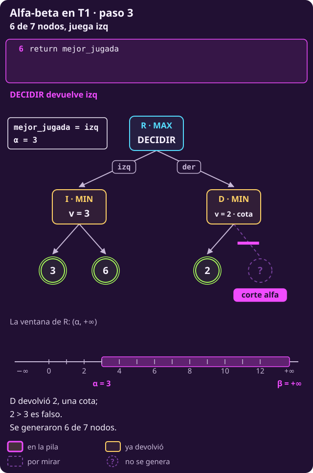
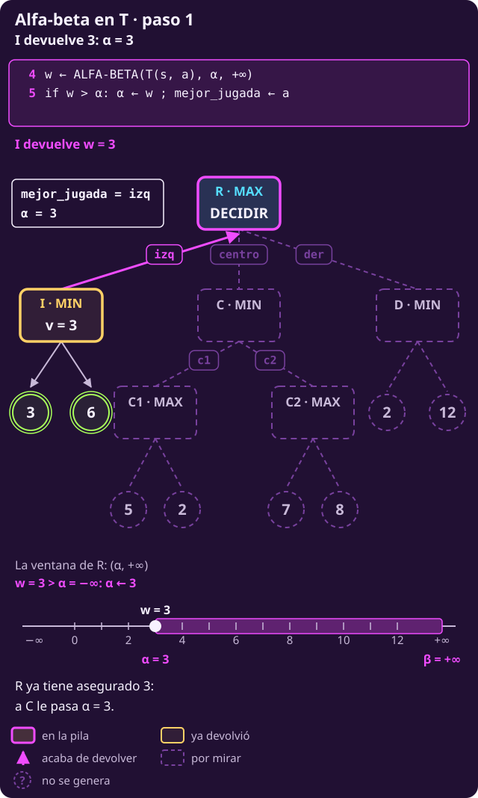
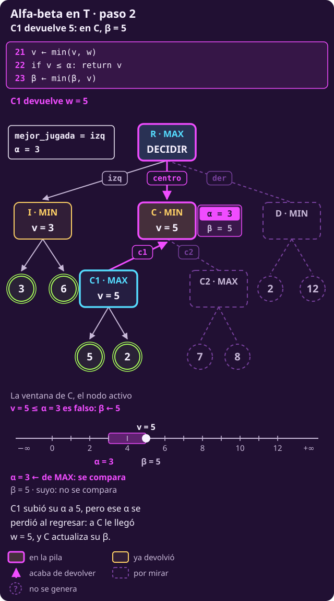
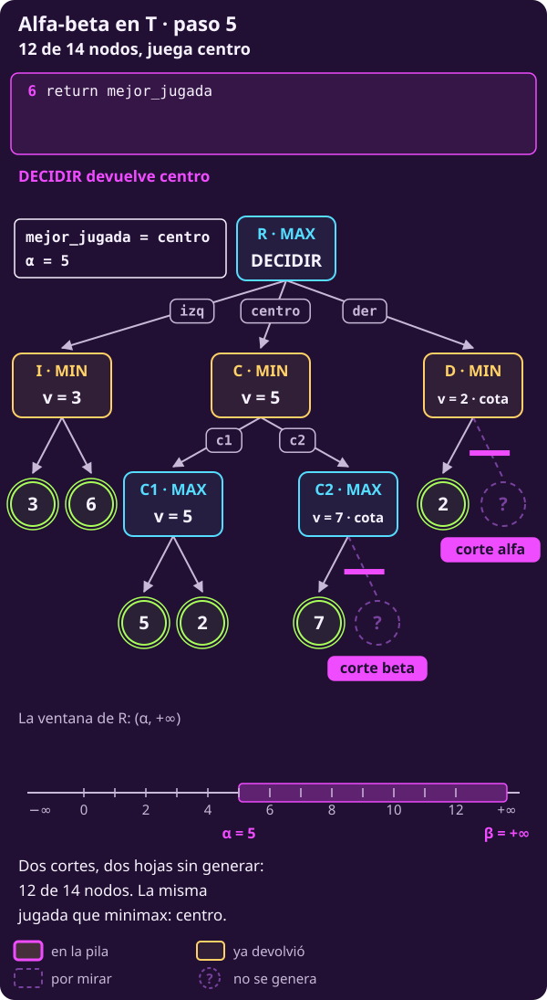
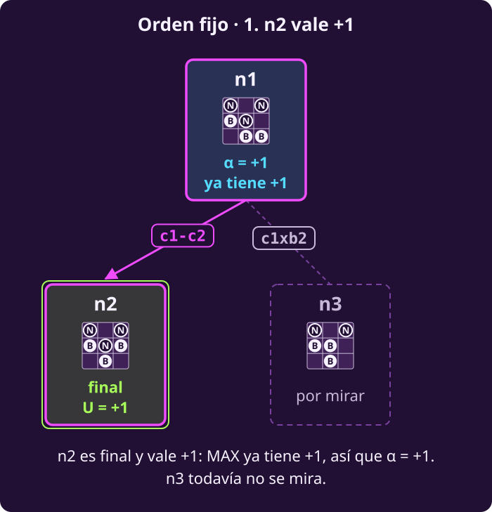

# Alfa-beta a mano

**¿Cómo dejar ramas sin generar sin cambiar la jugada?**

Al terminar tendrás:

- **qué son $\alpha$ y $\beta$** y **la regla** que dice, en cada nodo,
  con qué número se compara y si se corta;
- **el código**: DECIDIR-ALFA-BETA, que devuelve la jugada, y su recursión
  ALFA-BETA; son las líneas de minimax y cuatro más;
- **el árbol T recorrido hijo por hijo**, con la comparación de cada `if`
  y la jugada que va guardando la raíz;
- **n1 de hexapawn**: 5 de sus 13 estados, y la misma jugada que minimax.

> **Lo que traes de [[minimax-como-algoritmo|Minimax como algoritmo]].**
>
> - DECIDIR-MINIMAX y MINIMAX, líneas 1–20, con las reglas $S_F$,
>   $\mathrm{Pl}$, $A$, $T$, $U$ y el valor $V$ (@jue-c2-valor). La raíz
>   guarda `mejor_valor` y `mejor_jugada`.
> - $v$: lo mejor que ha visto **este** nodo entre sus hijos; $w$: lo que
>   devuelve **un** hijo.

## 1 · La idea

**Piensa: si ya tienes una jugada que te da 3, ¿necesitas saber cuánto vale
exactamente otra que te da 2 o menos?**

- **Minimax mira todo**: genera cada estado, hasta los finales.
- **Alfa-beta deja de mirar una rama en cuanto sabe que no cambia la
  decisión de arriba.** Lo que no mira **no lo genera**: ése es el ahorro.
- Para saberlo, cada nodo carga **dos números** de lo que pasó arriba:
  $\alpha$, lo que **MAX** ya tiene asegurado, y $\beta$, lo que **MIN** ya
  tiene asegurado. La sección 2 los define.
- **La raíz entrega lo mismo** que minimax: la misma jugada, con el mismo
  valor.

## 2 · Alfa, beta y la regla

**Piensa: para saber que una rama no sirve, ¿qué tiene que recordar cada
nodo de lo que pasó arriba?**

Dos números. Los dos se miden **en puntos de MAX**, como $U$. Las líneas
que cita esta sección son las del código de la sección 3, justo abajo: aquí
basta saber qué hace cada una.

::: definition {#jue-c2-alfa-beta title="Alfa y beta"}
Sea un nodo del recorrido y el camino de la raíz hasta él.

- **$\alpha$ («alfa»)** es el **mayor** valor que algún nodo de **MAX** del
  camino ya tiene asegurado con una jugada revisada. Para MAX es un
  **piso**: tendrá al menos $\alpha$.
- **$\beta$ («beta»)** es el **menor** valor que algún nodo de **MIN** del
  camino ya tiene asegurado con una jugada revisada. Para MAX es un
  **techo**: tendrá a lo más $\beta$.

|  | $\alpha$ | $\beta$ |
|---|---|---|
| Dueño | MAX | MIN |
| Empieza en | $-\infty$ | $+\infty$ |
| Se mueve | solo sube | solo baja |
| Lo cambia | MAX, línea 15 | MIN, línea 23 |
| Lo lee | MIN, línea 22 | MAX, línea 14 |

El par se escribe $(\alpha,\beta)$ y se llama **ventana**; la sección 6
dice por qué.
:::

::: definition {#jue-c2-t-regla title="La regla de alfa-beta"}
1. **Hereda los dos.** Al generarse, cada nodo recibe el $\alpha$ y el
   $\beta$ que su padre tiene en ese momento (líneas 4, 12 y 20). **El suyo
   también empieza heredado**: por ejemplo, en el árbol T de la sección 5,
   C1, de MAX, arranca con el $\alpha=3$ que trae de la raíz.
2. **Lee el del rival.** Después de cada hijo compara su $v$ con el número
   del **rival**:
   - un nodo de **MAX** compara $v$ con $\beta$: si $v\ge\beta$, deja de
     mirar hijos (línea 14, **corte beta**);
   - un nodo de **MIN** compara $v$ con $\alpha$: si $v\le\alpha$, deja de
     mirar hijos (línea 22, **corte alfa**).

   **El número del rival no cambia mientras el nodo trabaja**: MAX nunca
   escribe $\beta$ y MIN nunca escribe $\alpha$; solo lo leen en su `if`.
3. **Actualiza el suyo.** Si no corta, MAX sube $\alpha$ (línea 15) y MIN
   baja $\beta$ (línea 23). Es el único de los dos que cambia.
4. **Al padre solo sube $v$**, y le llega como su $w$. Las $\alpha$ y $\beta$
   que el hijo cambió **se pierden al regresar**: el padre sigue con las
   suyas.

**El igual cuenta**: $v\ge\beta$ y $v\le\alpha$. Un empate con lo que el
rival ya tiene no le sirve a nadie. El corte se llama como el número que
lo provoca: el **alfa** pasa en un nodo de **MIN**; el **beta**, en uno de
**MAX**.
:::

> [!NOTE]
> **El puente con «$\alpha\ge\beta$».** Los libros dicen «se corta cuando
> $\alpha\ge\beta$». El código compara $v$ con el número del rival. Es lo
> mismo, un paso antes: en un nodo de MAX con $v\ge\beta$, si no cortara,
> la línea 15 haría $\alpha\leftarrow v\ge\beta$. La línea 14 corta justo
> antes (y la 22, igual, en uno de MIN).

## 3 · El código

**Piensa: en DECIDIR-MINIMAX, ¿en qué líneas habría que pasar, leer y
actualizar $\alpha$ y $\beta$ para que la regla se cumpla?**

Es DECIDIR-MINIMAX con $\alpha$ y $\beta$. En la raíz, `mejor_valor` se
llama $\alpha$ y se le pasa a cada hijo (línea 4). Las líneas 1–13 son las
de minimax; las **nuevas son 14, 15, 22 y 23**:

- **14 y 22 leen** el número del rival y, si toca, cortan;
- **15 y 23 actualizan** el número propio.

Cada línea, explicada, está en
[[alfa-beta-como-algoritmo|Alfa-beta como algoritmo]]; aquí basta con
seguirlas.

```text
INPUT   un estado s donde mueve MAX, y las
        reglas S_F, Pl, A, T y U de un juego
        finito, por turnos y sin azar.
OUTPUT  una jugada de A(s) que alcanza V(s).

 1 function DECIDIR-ALFA-BETA(s)
     # α hace de mejor_valor
 2   α ← −∞ ; mejor_jugada ← ninguna
 3   for each a in A(s)
       # sin rival arriba de la raíz: β = +∞
 4     w ← ALFA-BETA(T(s, a), α, +∞)
       # estricto: un empate puede ser cota
 5     if w > α: α ← w ; mejor_jugada ← a
 6   return mejor_jugada        # la jugada

 7 function ALFA-BETA(s, α, β)  # devuelve v
 8   if s ∈ S_F: return U(s)
 9   if Pl(s) = MAX
10     v ← −∞
11     for each a in A(s)
12       w ← ALFA-BETA(T(s, a), α, β)
13       v ← max(v, w)
         # compara v con β, el número de MIN
14       if v ≥ β: return v     # corte beta
15       α ← max(α, v)          # sube su α
16     return v                 # valor o cota
17   else                       # Pl(s) = MIN
18     v ← +∞
19     for each a in A(s)
20       w ← ALFA-BETA(T(s, a), α, β)
21       v ← min(v, w)
         # compara v con α, el número de MAX
22       if v ≤ α: return v     # corte alfa
23       β ← min(β, v)          # baja su β
24     return v                 # valor o cota
```

El mismo código en Python; el número entre paréntesis es la línea del
pseudocódigo:

```python
from math import inf

# Las reglas ya existen como funciones:
# es_final(s), pl(s) ("MAX" o "MIN"),
# acciones(s), transicion(s, a) y
# utilidad(s).

def decidir_alfa_beta(s):     # (1)
    # (2) alfa hace de mejor_valor
    alfa = -inf
    mejor_jugada = None
    for a in acciones(s):     # (3)
        # (4) pasa su alfa; beta: inf
        hijo = transicion(s, a)
        w = alfa_beta(hijo, alfa, inf)
        # (5) estricto: una cota que empata
        # con alfa puede valer menos
        if w > alfa:
            alfa = w
            mejor_jugada = a
    return mejor_jugada       # (6)

def alfa_beta(s, alfa, beta): # (7)
    if es_final(s):           # (8)
        return utilidad(s)
    if pl(s) == "MAX":        # (9)
        v = -inf              # (10)
        for a in acciones(s): # (11)
            # (12) hereda la ventana
            hijo = transicion(s, a)
            w = alfa_beta(hijo, alfa, beta)
            v = max(v, w)     # (13)
            # (14) lee el del rival
            if v >= beta:
                return v
            # (15) actualiza el suyo
            alfa = max(alfa, v)
        return v              # (16)
    else:                     # (17)
        v = inf               # (18)
        for a in acciones(s): # (19)
            # (20) hereda la ventana
            hijo = transicion(s, a)
            w = alfa_beta(hijo, alfa, beta)
            v = min(v, w)     # (21)
            # (22) lee el del rival
            if v <= alfa:
                return v
            # (23) actualiza el suyo
            beta = min(beta, v)
        return v              # (24)
```

**Cómo leer las trazas.** Es la tabla de la traza de minimax con dos
columnas más. Una fila al entrar a un nodo interno y una por cada hijo que
regresa; las hojas van plegadas en la columna $w$.

- **línea · pila:** qué líneas corren y la pila de llamadas. Un hijo que
  regresa a un nodo de MAX es 12–15 (o 12–14 si corta); a uno de MIN,
  20–23 (o 20–22). En la raíz, 4–5.
- **$(\alpha,\beta)$:** la ventana del último nodo de la pila al terminar
  la fila.
- **corta:** la comparación del `if`, **corte o no**: «3≤−∞ no», «7≥5 sí».
  En la raíz es la línea 5: «3>−∞ sí» cambia la jugada; «2>5 no», no.
- **v:** en las filas de R es `mejor_valor`, que aquí se llama $\alpha$.
- **jugada:** `mejor_jugada` en ese momento; «—» si todavía no hay.
- **Fila ✗:** está en la traza de minimax y no en ésta: su hoja (en
  cursiva) no se genera. Así cada fila lleva el mismo número que en la
  traza de minimax del mismo árbol; la de T está en
  [[minimax-como-algoritmo|Minimax como algoritmo]].

## 4 · Etapa 1: el árbol T1

**Piensa: ¿en qué momento MAX ya sabe que la rama de la derecha no le
sirve?**

**T1** tiene siete nodos. Arriba, R (MAX). Con $\text{izq}$ llega a I (MIN),
con hojas 3 y 6; con $\text{der}$, a D (MIN), con hojas 2 y 12. Minimax:
I vale 3, D vale 2, R vale **3** y juega **izq**.

### Tramo 1 · La rama izq

| # | línea · pila | $(\alpha ,\beta )$ | $v$ | $w$ | corta | jugada |
|---|---|---|---|---|---|---|
| 1 | 2 · R | $(-\infty,+\infty)$ | $-\infty$ |  |  | — |
| 2 | 18 · R›I | $(-\infty,+\infty)$ | $+\infty$ |  |  | — |
| 3 | 20–23 · R›I | $(-\infty,3)$ | 3 | 3 | $3\le -\infty$ no | — |
| 4 | 20–23 · R›I | $(-\infty,3)$ | 3 | 6 | $3\le -\infty$ no | — |
| 5 | 4–5 · R | $(3,+\infty)$ | 3 | 3 (I) | $3>-\infty$ sí | izq |

::: figure {#jue-c2-t1-ab-1 title="T1, fila 5: I devuelve 3 y R sube α"}

:::

- I es de MIN y lee $\alpha=-\infty$: $3\le-\infty$ es falso, así que
  nunca corta. Baja su $\beta$ a 3.
- **Fila 5:** R recibe $w=3$; $3>-\infty$, así que $\alpha\leftarrow3$ y
  `mejor_jugada ← izq` (línea 5).

### Tramo 2 · D corta

| # | línea · pila | $(\alpha ,\beta )$ | $v$ | $w$ | corta | jugada |
|---|---|---|---|---|---|---|
| 6 | 18 · R›D | $(3,+\infty)$ | $+\infty$ |  |  | izq |
| 7 | 20–22 · R›D | $(3,+\infty)$ | 2 | 2 | $2\le 3$ sí | izq |
| 8 ✗ | R›D | — | — | $\textit{12}$ | — | — |
| 9 | 4–5 · R | $(3,+\infty)$ | 3 | 2 (D) | $2>3$ no | izq |
| 10 | 6 · R | $(3,+\infty)$ | 3 |  |  | izq |

::: figure {#jue-c2-t1-ab-2 title="T1, fila 7: el corte alfa en D"}

:::

**D es de MIN: compara su $v=2$ con $\alpha=3$, el número de MAX que
heredó; $2\le3$ → corte alfa, línea 22.**

- En palabras: MIN ya puede dejar a MAX en 2 o menos aquí, y MAX tiene 3
  por la izquierda. MAX nunca entrará a D.
- **Fila 8 ✗: la hoja 12 no se genera.** Valga 100 o $-50$, D vale a lo
  más 2. D devuelve 2.

::: figure {#jue-c2-t1-ab-3 title="T1, fila 10: 6 de 7 nodos"}

:::

**Fila 9:** R recibe $w=2$; $2>3$ es falso: se queda **izq**. Se generaron
**6 de 7** nodos.

**El orden decide el ahorro.** Con D primero, R llega a I con $\alpha=2$.
I ve 3: ¿$3\le2$? No, así que no corta y genera también la hoja 6: se
generan **los 7**.

## 5 · Etapa 2: se agrega el centro

**Piensa: si MIN también puede asegurarse algo, ¿quién corta entonces?**

**T** es T1 con un hijo más de R, en medio: con $\text{centro}$ llega a C
(MIN), que tiene dos hijos de MAX, C1 (hojas 5 y 2) y C2 (hojas 7 y 8).
Catorce nodos. Minimax: I = 3, C1 = 5, C2 = 8, C = 5, D = 2; R vale **5** y
juega **centro**. La traza tiene las 20 filas de la de DECIDIR-MINIMAX en
T, dos de ellas con ✗.

### Tramo 1 · La rama izq

| # | línea · pila | $(\alpha ,\beta )$ | $v$ | $w$ | corta | jugada |
|---|---|---|---|---|---|---|
| 1 | 2 · R | $(-\infty,+\infty)$ | $-\infty$ |  |  | — |
| 2 | 18 · R›I | $(-\infty,+\infty)$ | $+\infty$ |  |  | — |
| 3 | 20–23 · R›I | $(-\infty,3)$ | 3 | 3 | $3\le -\infty$ no | — |
| 4 | 20–23 · R›I | $(-\infty,3)$ | 3 | 6 | $3\le -\infty$ no | — |
| 5 | 4–5 · R | $(3,+\infty)$ | 3 | 3 (I) | $3>-\infty$ sí | izq |

::: figure {#jue-c2-t-ab-1 title="T, fila 5: I devuelve 3"}

:::

Igual que en T1: I devuelve 3, y en la fila 5 R pasa a $\alpha=3$ con
**izq**.

### Tramo 2 · C1, y el α que se pierde

| # | línea · pila | $(\alpha ,\beta )$ | $v$ | $w$ | corta | jugada |
|---|---|---|---|---|---|---|
| 6 | 18 · R›C | $(3,+\infty)$ | $+\infty$ |  |  | izq |
| 7 | 10 · R›C›C1 | $(3,+\infty)$ | $-\infty$ |  |  | izq |
| 8 | 12–15 · R›C›C1 | $(5,+\infty)$ | 5 | 5 | $5\ge +\infty$ no | izq |
| 9 | 12–15 · R›C›C1 | $(5,+\infty)$ | 5 | 2 | $5\ge +\infty$ no | izq |
| 10 | 20–23 · R›C | $(3,5)$ | 5 | 5 (C1) | $5\le 3$ no | izq |

::: figure {#jue-c2-t-ab-2 title="T, fila 10: C1 devuelve 5 y C baja β"}

:::

- **Filas 6–7:** C hereda $(3,+\infty)$, y C1 lo mismo. El $\alpha=3$ de
  C1 es **suyo**, pero empezó heredado de R.
- **Filas 8–9:** C1 es de MAX y lee $\beta=+\infty$: «5≥+∞ no». Sube
  **su** $\alpha$ a 5 (línea 15) y devuelve $v=5$.
- **Fila 10: el $\alpha=5$ de C1 se pierde al regresar.** A C solo le llega
  $w=5$, y sigue con su $\alpha=3$. **C es de MIN: compara su $v=5$ con
  $\alpha=3$; $5\le3$ es falso → no corta, y baja su $\beta$ a 5 (línea
  23).** C queda con $(3,5)$.

### Tramo 3 · El corte beta en C2

| # | línea · pila | $(\alpha ,\beta )$ | $v$ | $w$ | corta | jugada |
|---|---|---|---|---|---|---|
| 11 | 10 · R›C›C2 | $(3,5)$ | $-\infty$ |  |  | izq |
| 12 | 12–14 · R›C›C2 | $(3,5)$ | 7 | 7 | $7\ge 5$ sí | izq |
| 13 ✗ | R›C›C2 | — | — | $\textit{8}$ | — | — |

::: figure {#jue-c2-t-ab-3 title="T, fila 12: el corte beta en C2"}

:::

**C2 es de MAX: compara su $v=7$ con $\beta=5$, el número de MIN que
heredó; $7\ge5$ → corte beta, línea 14.**

- En palabras: MAX ya puede conseguir 7 o más en C2, y MIN tiene 5 con
  c1. MIN nunca dejará que la partida llegue a C2.
- **Fila 13 ✗: la hoja 8 no se genera.** C2 devuelve 7.

### Tramo 4 · C devuelve 5 y D corta

| # | línea · pila | $(\alpha ,\beta )$ | $v$ | $w$ | corta | jugada |
|---|---|---|---|---|---|---|
| 14 | 20–23 · R›C | $(3,5)$ | 5 | 7 (C2) | $5\le 3$ no | izq |
| 15 | 4–5 · R | $(5,+\infty)$ | 5 | 5 (C) | $5>3$ sí | centro |
| 16 | 18 · R›D | $(5,+\infty)$ | $+\infty$ |  |  | centro |
| 17 | 20–22 · R›D | $(5,+\infty)$ | 2 | 2 | $2\le 5$ sí | centro |
| 18 ✗ | R›D | — | — | $\textit{12}$ | — | — |

::: figure {#jue-c2-t-ab-4 title="T, fila 17: el corte alfa en D"}

:::

- **Fila 14:** C recibe la cota 7 y la trata como cualquier $w$:
  $\min(5,7)=5$; «5≤3 no». C devuelve 5.
- **Fila 15:** en R, $5>3$: $\alpha$ sube a 5 y la jugada pasa a
  **centro**.
- **Fila 17. D es de MIN: compara su $v=2$ con $\alpha=5$, el número de
  MAX que heredó; $2\le5$ → corte alfa, línea 22.** En la fila 18 ✗, la
  hoja 12 no se genera; D devuelve 2.

### Tramo 5 · La raíz decide

| # | línea · pila | $(\alpha ,\beta )$ | $v$ | $w$ | corta | jugada |
|---|---|---|---|---|---|---|
| 19 | 4–5 · R | $(5,+\infty)$ | 5 | 2 (D) | $2>5$ no | centro |
| 20 | 6 · R | $(5,+\infty)$ | 5 |  |  | centro |

::: figure {#jue-c2-t-ab-5 title="T, fila 20: 12 de 14 nodos"}

:::

- **Fila 19:** en R, $2>5$ es falso: se queda **centro**.
- `mejor_jugada` fue — → izq (fila 5) → centro (fila 15). DECIDIR devuelve
  **centro**, como minimax, con **12 de 14** nodos.

**Una cota no es un valor.** C2 devolvió **7**, pero vale **8**: no miró
la hoja 8. Tras un corte beta, el número devuelto solo dice «**al menos**
7»; tras uno alfa, como en D, «**a lo más** 2». A C le basta: cualquier
cosa $\ge5$ la descarta.

## 6 · La ventana

**Piensa: en T, ¿qué tienen en común los dos números que provocaron cada
corte?**

Los dos son del **rival** del nodo que corta, y los dos vienen de una
jugada ya revisada más arriba. Juntos, $\alpha$ y $\beta$ marcan los
valores que todavía importan.

::: figure {#jue-c2-ab-ventana title="La ventana (α, β)"}

:::

- **La ventana $(\alpha,\beta)$ son los valores estrictamente entre
  $\alpha$ y $\beta$**: los únicos que pueden cambiar la decisión de arriba.
  Se escribe con paréntesis porque **los extremos no están dentro**: tocar
  uno ya corta.
- **Sale por la izquierda** ($v\le\alpha$) en un nodo de MIN: corte alfa.
  **Sale por la derecha** ($v\ge\beta$) en uno de MAX: corte beta.
- **En la raíz** es $(-\infty,+\infty)$. **Al bajar solo se encoge**: el
  hijo hereda la de su padre, y dentro de cada nodo $\alpha$ solo sube y
  $\beta$ solo baja.

## 7 · El juego real: n1 de hexapawn

**Piensa: si Blancas ya tiene una jugada que gana, ¿necesita saber cuánto
vale exactamente la otra?**

Minimax generó los 13 estados de n1 y obtuvo $V(\text{n1})=+1$ con
$\text{c1}\textbf{-}\text{c2}$. Ahora, la misma regla, con las jugadas en
el orden fijo.

::: figure {#jue-c2-ab-fijo-1 title="n1, parte 1: n2 da +1"}

:::

::: figure {#jue-c2-ab-fijo-2 title="n1, parte 2: el corte alfa en n3"}

:::

- n2 vale $+1$: en la línea 5, $+1>-\infty$, y la raíz sube a $\alpha=+1$
  con $\text{c1}\textbf{-}\text{c2}$.
- n3 hereda $(+1,+\infty)$; n4 devuelve $+1$ (su único hijo, n5, vale
  $+1$).
- **n3 es de MIN: compara su $v=+1$ con $\alpha=+1$, el número de MAX que
  heredó; $+1\le+1$ → corte alfa, línea 22.** n6, lo que cuelga de él, y
  n13 no se generan. Ojo: **no corta la raíz**. Con $\alpha=+1$ ningún hijo
  puede mejorarla, pero DECIDIR no tiene línea de corte; corta el primer
  nodo de MIN que hereda ese $\alpha$ y ve un $+1$.
- n3 devuelve $+1$, pero **vale $-1$**: es una cota, «a lo más $+1$». En la
  raíz, $+1>+1$ es falso: se queda $\text{c1}\textbf{-}\text{c2}$. Con un
  $\ge$ la raíz elegiría $\text{c1}\textbf{x}\text{b2}$, que pierde.

::: figure {#jue-c2-ab-fijo title="Alfa-beta en n1 con el orden fijo"}

:::

**$+1$ con $\text{c1}\textbf{-}\text{c2}$**, como minimax, con **5** de los
13 estados. Con las jugadas en el orden inverso se generan 8: está en
[[alfa-beta-como-algoritmo|Alfa-beta como algoritmo]], donde se estudia el
orden.

## 8 · Ejercicios

::: exercise {#jue-c2-t-ej-tabla title="Completa la traza de T con el centro primero"}
Mismo árbol T, pero R revisa sus jugadas en el orden **centro, izq, der**
(dentro de C, C1 y C2, nada cambia). La numeración es la de la traza de
minimax en ese mismo orden. Las filas 1–11 van a medio llenar.

| # | línea · pila | $(\alpha ,\beta )$ | $v$ | $w$ | corta | jugada |
|---|---|---|---|---|---|---|
| 1 | 2 · R | $(-\infty,+\infty)$ | $-\infty$ |  |  | — |
| 2 | 18 · R›C | ? | $+\infty$ |  |  | — |
| 3 | 10 · R›C›C1 | $(-\infty,+\infty)$ | $-\infty$ |  |  | — |
| 4 | 12–15 · R›C›C1 | ? | 5 | 5 | ? | — |
| 5 | 12–15 · R›C›C1 | $(5,+\infty)$ | 5 | 2 | $5\ge +\infty$ no | — |
| 6 | 20–23 · R›C | ? | 5 | 5 (C1) | ? | — |
| 7 | 10 · R›C›C2 | ? | $-\infty$ |  |  | — |
| 8 | ? · R›C›C2 | $(-\infty,5)$ | 7 | 7 | ? | — |
| 9 ✗ | R›C›C2 | — | — | ? | — | — |
| 10 | 20–23 · R›C | $(-\infty,5)$ | 5 | 7 (C2) | $5\le -\infty$ no | — |
| 11 | 4–5 · R | ? | 5 | 5 (C) | ? | ? |

1. Llena los «?».
2. Escribe las filas 12 a 20, con sus ✗.
3. ¿Cuántos de los 14 nodos se generan? ¿Dónde se corta, de qué tipo y
   qué no se genera?
:::

::: hint {#jue-c2-t-pista-tabla of="jue-c2-t-ej-tabla" title="Qué cambia al ir primero"}
C llega con $(-\infty,+\infty)$: nadie tiene nada asegurado todavía. Pero
después de C, la raíz ya tiene $\alpha=5$, e I y D lo heredan. En cada
fila de corta, di qué nodo es, con qué número del rival compara y en qué
línea.
:::

::: answer {#jue-c2-t-resp-tabla of="jue-c2-t-ej-tabla"}
En negrita, lo que era «?»; las filas 12–20 son las que faltaban.

| # | línea · pila | $(\alpha ,\beta )$ | $v$ | $w$ | corta | jugada |
|---|---|---|---|---|---|---|
| 1 | 2 · R | $(-\infty,+\infty)$ | $-\infty$ |  |  | — |
| 2 | 18 · R›C | $\mathbf{(-\infty,+\infty)}$ | $+\infty$ |  |  | — |
| 3 | 10 · R›C›C1 | $(-\infty,+\infty)$ | $-\infty$ |  |  | — |
| 4 | 12–15 · R›C›C1 | $\mathbf{(5,+\infty)}$ | 5 | 5 | **5≥+∞ no** | — |
| 5 | 12–15 · R›C›C1 | $(5,+\infty)$ | 5 | 2 | $5\ge +\infty$ no | — |
| 6 | 20–23 · R›C | $\mathbf{(-\infty,5)}$ | 5 | 5 (C1) | **5≤−∞ no** | — |
| 7 | 10 · R›C›C2 | $\mathbf{(-\infty,5)}$ | $-\infty$ |  |  | — |
| 8 | $\textbf{12–14}$ · R›C›C2 | $(-\infty,5)$ | 7 | 7 | **7≥5 sí** | — |
| 9 ✗ | R›C›C2 | — | — | $\textit{8}$ | — | — |
| 10 | 20–23 · R›C | $(-\infty,5)$ | 5 | 7 (C2) | $5\le -\infty$ no | — |
| 11 | 4–5 · R | $\mathbf{(5,+\infty)}$ | 5 | 5 (C) | **5>−∞ sí** | $\textbf{centro}$ |
| 12 | 18 · R›I | $(5,+\infty)$ | $+\infty$ |  |  | centro |
| 13 | 20–22 · R›I | $(5,+\infty)$ | 3 | 3 | $3\le 5$ sí | centro |
| 14 ✗ | R›I | — | — | $\textit{6}$ | — | — |
| 15 | 4–5 · R | $(5,+\infty)$ | 5 | 3 (I) | $3>5$ no | centro |
| 16 | 18 · R›D | $(5,+\infty)$ | $+\infty$ |  |  | centro |
| 17 | 20–22 · R›D | $(5,+\infty)$ | 2 | 2 | $2\le 5$ sí | centro |
| 18 ✗ | R›D | — | — | $\textit{12}$ | — | — |
| 19 | 4–5 · R | $(5,+\infty)$ | 5 | 2 (D) | $2>5$ no | centro |
| 20 | 6 · R | $(5,+\infty)$ | 5 |  |  | centro |

Se generan **11 de 14** nodos, con **tres cortes**:

- **C2 es de MAX:** compara su $v=7$ con $\beta=5$; $7\ge5$ → corte beta,
  línea 14. No se genera la hoja 8.
- **I es de MIN:** compara su $v=3$ con $\alpha=5$; $3\le5$ → corte alfa,
  línea 22. No se genera la hoja 6.
- **D es de MIN:** compara su $v=2$ con $\alpha=5$; $2\le5$ → corte alfa,
  línea 22. No se genera la hoja 12.

Uno menos que con izq primero (12): **la mejor jugada primero corta más**.
:::

::: exercise {#jue-c2-t-ej-empate-raiz title="Decide la regla del empate en la raíz"}
Cambia D en T: sus hojas son ahora **5 y 1** (en ese orden). Lo demás
queda igual.

1. ¿Con qué ventana llega D? ¿Se corta tras su primera hoja? ¿Qué
   devuelve, y cuánto vale de verdad?
2. En la raíz, la línea 5 dice `if w > α`. ¿Qué jugada entrega
   DECIDIR-ALFA-BETA?
3. ¿Y si la línea 5 dijera `if w ≥ α`? ¿Cuánto obtendría MAX?
:::

::: hint {#jue-c2-t-pista-empate-raiz of="jue-c2-t-ej-empate-raiz" title="El igual corta abajo, no arriba"}
D es de MIN y hereda el $\alpha$ de R después de C. Recuerda que en la
línea 22 el igual cuenta. Después, compara lo que D devuelve con el
$\alpha$ de R.
:::

::: answer {#jue-c2-t-resp-empate-raiz of="jue-c2-t-ej-empate-raiz"}
1. D llega con $(5,+\infty)$. **D es de MIN: compara su $v=5$ con
   $\alpha=5$; $5\le5$ → corte alfa, línea 22**: la hoja 1 no se genera. D
   devuelve **5**, una cota («a lo más 5»); de verdad vale
   $\min(5,1)=1$.
2. $5>5$ es falso: se queda **centro**, que vale 5. Correcto.
3. Con $\ge$, $5\ge5$ elegiría **der**, que vale **1**: MAX obtendría 1 en
   vez de 5. **Un hijo que cortó devuelve una cota, y una cota que empata
   no debe ganar.** Por eso la línea 5 es estricta.
:::

**Punto de control:** deberías poder recorrer un árbol pequeño con
DECIDIR-ALFA-BETA, anotar $(\alpha,\beta)$ al llegar a cada nodo, decir en
cada `if` «este nodo es de …, compara su $v$ con … del rival, línea …»,
decir qué nodos no se generan y qué jugada sale.

## Lo que hay que llevarse

- **El código** es DECIDIR-MINIMAX con $\alpha$ y $\beta$: 14 y 22 leen el
  número del rival y cortan; 15 y 23 actualizan el propio
  (@jue-c2-t-regla). Al padre solo sube $v$.
- $\alpha$ es un **piso** para MAX y $\beta$ un **techo**; los dos en puntos
  de MAX. La ventana $(\alpha,\beta)$ no incluye sus extremos: **el igual
  corta**.
- Un nodo que cortó devuelve **una cota**, no su valor (C2 devolvió 7 y
  vale 8). Por eso la raíz cambia de jugada solo con $w>\alpha$.
- **El orden decide el ahorro:** T, 12 de 14 con izq primero y 11 con
  centro primero; n1, 5 de 13.

Continúa con [[alfa-beta-como-algoritmo|alfa-beta como algoritmo]].
