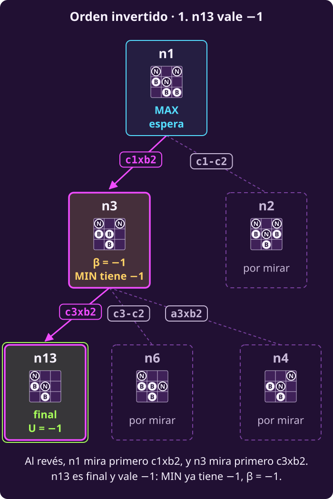
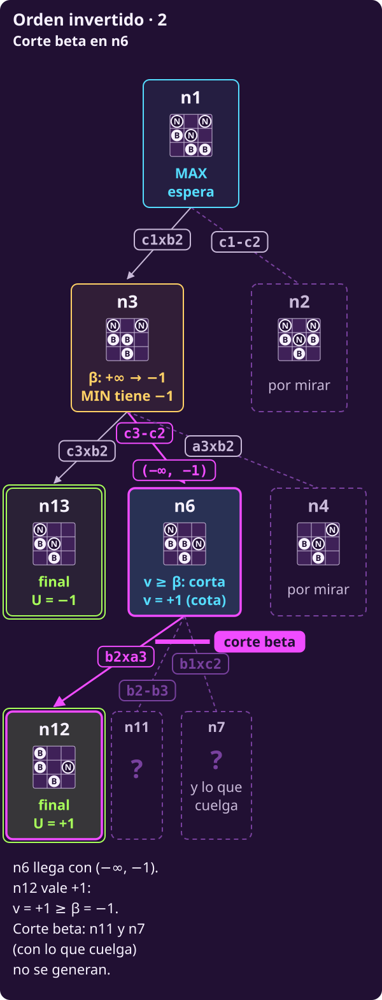
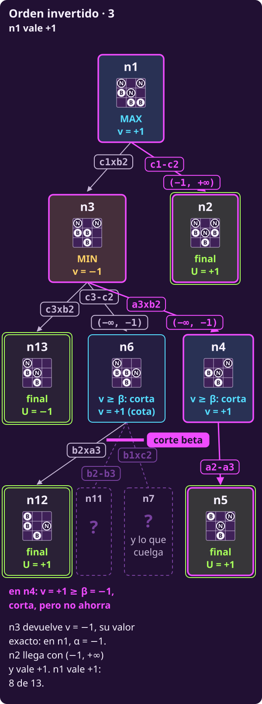

# Alfa-beta como algoritmo

**¿Cómo se escribe alfa-beta para cualquier juego, de modo que devuelva la
jugada?**

Al terminar tendrás:

- **DECIDIR-ALFA-BETA**, que devuelve la jugada, y **ALFA-BETA**, su
  recursión, explicadas **línea por línea**;
- **qué líneas cambian** respecto a DECIDIR-MINIMAX y MINIMAX;
- **qué hay en memoria** a media ejecución: el paso por C en el árbol T,
  una fila por línea, con la pila;
- **por qué el orden decide el ahorro**: n1 al revés genera 8 de 13.

> **Las piezas que usa esta página.** Las reglas vienen de
> [[escribir-el-juego|Escribir el juego]]: $S_F$ (@jue-c1-finales),
> $\mathrm{Pl}(s)$ (@jue-c1-pl), $A(s)$ (@jue-c1-acciones), $T(s,a)$
> (@jue-c1-transicion) y $U(s)$ (@jue-c1-utilidad). De
> [[alfa-beta|Alfa-beta a mano]]:
>
> - $\alpha$ y $\beta$ (@jue-c2-alfa-beta): lo que **MAX** y lo que **MIN**
>   ya tienen asegurado en el camino desde la raíz. El par
>   $(\alpha,\beta)$ es la **ventana**.
> - La regla de alfa-beta (@jue-c2-t-regla).
> - $v$: lo mejor que ha visto **este** nodo entre sus hijos; $w$: lo que
>   **devuelve un hijo**, en el momento en que regresa.
> - El **árbol T**: raíz R de MAX; sus hijos I, C y D, de MIN; C tiene dos
>   hijos de MAX, C1 y C2. Hojas: I (3, 6), C1 (5, 2), C2 (7, 8),
>   D (2, 12).
> - **n1**: la posición de hexapawn, con Blancas (MAX) por mover; sus
>   utilidades son $+1$ y $-1$.

## 1 · Qué cambia respecto a minimax

**Piensa: ¿qué líneas de DECIDIR-MINIMAX y MINIMAX hay que tocar para
cortar?**

Pocas. Como viste en [[alfa-beta|Alfa-beta a mano]], hay **cuatro
nuevas**; por eso las de `return` se recorren. Así se alinean con las de
minimax:

| Alfa-beta | Minimax | Qué cambia |
|---|---|---|
| 1–6 | 1–6 | `mejor_valor` se llama $\alpha$ y la 4 pasa $(\alpha,+\infty)$ |
| 7–13 | 7–13 | Recibe $\alpha$ y $\beta$; la 12 se los pasa al hijo |
| $\textbf{14–15}$ | — | **Nuevas:** corte beta; sube $\alpha$ |
| 16 | 14 | Igual: `return v` |
| 17–21 | 15–19 | Iguales; la 20 pasa $\alpha$ y $\beta$ |
| $\textbf{22–23}$ | — | **Nuevas:** corte alfa; baja $\beta$ |
| 24 | 20 | Igual: `return v` |

Las cuatro nuevas son la regla de @jue-c2-t-regla: **14 y 22 leen** el
número del rival; **15 y 23 actualizan** el propio.

## 2 · El procedimiento

**Piensa: ¿por qué la raíz llama a sus hijos con su $\alpha$, y no con
$-\infty$?**

```text
INPUT   un estado s donde mueve MAX, y las
        reglas S_F, Pl, A, T y U de un juego
        finito, por turnos y sin azar.
OUTPUT  una jugada de A(s) que alcanza V(s).

 1 function DECIDIR-ALFA-BETA(s)
     # α hace de mejor_valor
 2   α ← −∞ ; mejor_jugada ← ninguna
 3   for each a in A(s)
       # sin rival arriba de la raíz: β = +∞
 4     w ← ALFA-BETA(T(s, a), α, +∞)
       # estricto: un empate puede ser cota
 5     if w > α: α ← w ; mejor_jugada ← a
 6   return mejor_jugada        # la jugada

 7 function ALFA-BETA(s, α, β)  # devuelve v
 8   if s ∈ S_F: return U(s)
 9   if Pl(s) = MAX
10     v ← −∞
11     for each a in A(s)
12       w ← ALFA-BETA(T(s, a), α, β)
13       v ← max(v, w)
         # compara v con β, el número de MIN
14       if v ≥ β: return v     # corte beta
15       α ← max(α, v)          # sube su α
16     return v                 # valor o cota
17   else                       # Pl(s) = MIN
18     v ← +∞
19     for each a in A(s)
20       w ← ALFA-BETA(T(s, a), α, β)
21       v ← min(v, w)
         # compara v con α, el número de MAX
22       if v ≤ α: return v     # corte alfa
23       β ← min(β, v)          # baja su β
24     return v                 # valor o cota
```

El mismo código en Python; el número entre paréntesis es la línea del
pseudocódigo:

```python
from math import inf

# Las reglas ya existen como funciones:
# es_final(s), pl(s) ("MAX" o "MIN"),
# acciones(s), transicion(s, a) y
# utilidad(s).

def decidir_alfa_beta(s):     # (1)
    # (2) alfa hace de mejor_valor
    alfa = -inf
    mejor_jugada = None
    for a in acciones(s):     # (3)
        # (4) pasa su alfa; beta: inf
        hijo = transicion(s, a)
        w = alfa_beta(hijo, alfa, inf)
        # (5) estricto: una cota que empata
        # con alfa puede valer menos
        if w > alfa:
            alfa = w
            mejor_jugada = a
    return mejor_jugada       # (6)

def alfa_beta(s, alfa, beta): # (7)
    if es_final(s):           # (8)
        return utilidad(s)
    if pl(s) == "MAX":        # (9)
        v = -inf              # (10)
        for a in acciones(s): # (11)
            # (12) hereda la ventana
            hijo = transicion(s, a)
            w = alfa_beta(hijo, alfa, beta)
            v = max(v, w)     # (13)
            # (14) lee el del rival
            if v >= beta:
                return v
            # (15) actualiza el suyo
            alfa = max(alfa, v)
        return v              # (16)
    else:                     # (17)
        v = inf               # (18)
        for a in acciones(s): # (19)
            # (20) hereda la ventana
            hijo = transicion(s, a)
            w = alfa_beta(hijo, alfa, beta)
            v = min(v, w)     # (21)
            # (22) lee el del rival
            if v <= alfa:
                return v
            # (23) actualiza el suyo
            beta = min(beta, v)
        return v              # (24)
```

**Lo que hay que ver en el código:**

- **Línea 4.** La raíz es un nodo de MAX: su $\alpha$ es lo que ya tiene
  con las jugadas revisadas. Pasarlo deja que el hijo corte en cuanto
  sabe que no lo supera. Con $-\infty$ la jugada sería la misma, pero en T
  D ya no cortaría: 13 nodos en vez de 12.
- **Línea 5, estricta.** Un hijo que devuelve $w>\alpha$ cayó dentro de su
  ventana $(\alpha,+\infty)$: **su valor es exacto**. Uno que devuelve
  $w\le\alpha$ puede venir de un corte y solo promete «a lo más $w$».
  En n1, orden fijo, $\text{c1}\textbf{x}\text{b2}$ devuelve $+1$ por un
  corte y vale $-1$; con $\ge$ la raíz la elegiría y perdería. En T
  lo muestra @jue-c2-t-ej-empate-raiz.
- **La raíz no corta.** DECIDIR no tiene línea 14: revisa todas sus
  jugadas. Cortan los nodos de abajo, con el $\alpha$ que ella les pasa.
- **Un corte ahorra de verdad.** Los hijos que faltan nunca llegan a la
  línea 12 o 20: su $T(s,a)$ no se calcula.
- **Raíz de MIN**, si mueven Negras: se invierte. $\beta\leftarrow+\infty$,
  la línea 4 llama con $(-\infty,\beta)$ y la 5 guarda si $w<\beta$.

> **Si lees Russell y Norvig, 4.ª ed.** Su ALPHA-BETA-SEARCH también
> devuelve la jugada, como DECIDIR, pero la jugada viaja por la recursión:
> MAX-VALUE y MIN-VALUE devuelven el par $(v,\text{jugada})$, y la raíz es
> una llamada más a MAX-VALUE con $(-\infty,+\infty)$. Además actualizan
> $\alpha$ **antes** del `if` del corte. Es equivalente: cuando $v\ge\beta$
> el nodo regresa de inmediato, así que da igual si $\alpha$ ya subió; y
> la jugada que sale de la raíz es la misma.

## 3 · Lo que hay en memoria

> **▶ [Ve la pila en el corte beta de C2](../_assets/traza_arbol_t.html#alfa-beta-paso-12)** — abre la traza de T justo en ese paso.

**Piensa: en la línea 15 de C1, ¿qué ve la pila que C no ve?**

La traza de [[alfa-beta|Alfa-beta a mano]] tiene una fila por hijo. Aquí
el paso por C, sus filas 6 a 15, se abre en **una fila por línea**, con la
pila. Las ramas I y D ya no se repiten: están en aquella traza.

- **línea:** qué líneas corren. Al entrar a un nodo corren 7, 8 («¿es
  final?», no) y 9 («¿mueve MAX?»); en uno de MIN, también la 17.
- **pila:** las llamadas abiertas; la última es la que ejecuta.
- **queda:** lo que cambió en la memoria de ese nodo.

### Tramo a · C1: su α nace heredado y sube

| línea | pila | ejecuta | queda |
|---|---|---|---|
| 3–4 | R | centro: llama C(3,+∞) |  |
| 7–9, 17–18 | R›C | MIN; llega con $(3,+\infty)$ | $v$ = $+\infty$ |
| 19–20 | R›C | c1: llama C1(3,+∞) |  |
| 7–10 | R›C›C1 | MAX; llega con $(3,+\infty)$ | $v$ = $-\infty$ |
| 11–12 | R›C›C1 | hoja 5 | $w$ = 5 |
| 13 | R›C›C1 | $v$ ← max(−∞, $5)$ | $v$ = 5 |
| 14 | R›C›C1 | $5\ge +\infty$ no |  |
| 15 | R›C›C1 | α ← max(3, $5)$ | α = 5 |
| 11–12 | R›C›C1 | hoja 2 | $w$ = 2 |
| 13 | R›C›C1 | $v$ ← max(5, $2)$ | $v$ = 5 |
| 14 | R›C›C1 | $5\ge +\infty$ no |  |
| 15 | R›C›C1 | α ← max(5, $5)$ | α = 5 |
| 16 | R›C›C1 | devuelve 5 |  |

::: figure {#jue-c2-t-c1-regresa title="C1 regresó: en C, α = 3 y β = 5"}

:::

- **La línea 4 pasa el $\alpha=3$ de la raíz.** Por eso C, y luego C1,
  llegan con $(3,+\infty)$.
- **En la línea 15, la pila guarda dos $\alpha$:** el de C1, que sube a 5,
  y el de C, que sigue en 3. C1 es de MAX: el $\alpha$ es **suyo**, aunque
  empezó heredado.

### Tramo b · C actualiza su β, y C2 corta

| línea | pila | ejecuta | queda |
|---|---|---|---|
| 20 | R›C | C1 regresa | $w$ = 5 |
| 21 | R›C | $v$ ← min(+∞, $5)$ | $v$ = 5 |
| 22 | R›C | $5\le 3$ no |  |
| 23 | R›C | β ← min(+∞, $5)$ | β = 5 |
| 19–20 | R›C | c2: llama C2(3,5) |  |
| 7–10 | R›C›C2 | MAX; llega con $(3,5)$ | $v$ = $-\infty$ |
| 11–12 | R›C›C2 | hoja 7 | $w$ = 7 |
| 13 | R›C›C2 | $v$ ← max(−∞, $7)$ | $v$ = 7 |
| 14 | R›C›C2 | $7\ge 5$ sí: devuelve 7 | hoja 8: no |

- **Al regresar C1, a C solo le llega $w=5$.** El $\alpha=5$ de C1 se
  perdió con su marco. C es de MIN: compara 5 con **su** $\alpha=3$ (línea
  22, «5≤3 no») y baja **su** $\beta$ a 5 (línea 23).
- **Corte beta en C2.** C2 llega con $(3,5)$ y su primera hoja da
  $v=7\ge\beta=5$: la línea 14 regresa y **la hoja 8 no se genera**.

::: figure {#jue-c2-t-ab-pila title="ALFA-BETA a media ejecución en T"}
![El árbol T en el instante del corte beta en C2 (línea 14). Resaltado, el camino R, C, C2; I y C1 aparecen tenues, con «devolvió 3» y «devolvió 5»: ya regresaron y sus marcos no existen. La hoja 7 acaba de devolver w = 7; la hoja 8 es un círculo punteado con «?»: no se generará. D y sus hojas siguen por mirar. Abajo, la pila de llamadas, tres marcos: R, con α = 3 y mejor_jugada = izq, va en centro; C, con α = 3, β = 5 y v = 5, va en c2; C2, con α = 3, β = 5 y v = 7: v ≥ β, corta. El α = 5 que C1 alcanzó se perdió al regresar; a C solo le llegó w = 5](../_assets/jue-t-ab-pila.svg)
:::

**Qué guarda cada marco de la pila** en el instante del corte beta:

- **el estado** $s$ y la jugada por la que va su `for`;
- **su ventana** $(\alpha,\beta)$, que pudo encogerse desde que llegó;
- **su $v$**, lo mejor visto entre sus hijos.

La memoria sigue siendo $O(bm)$: solo el camino actual, como en minimax.

### Tramo c · C devuelve 5 y la raíz cambia de jugada

| línea | pila | ejecuta | queda |
|---|---|---|---|
| 20 | R›C | C2 regresa | $w$ = 7 |
| 21 | R›C | $v$ ← min(5, $7)$ | $v$ = 5 |
| 22 | R›C | $5\le 3$ no |  |
| 23 | R›C | β ← min(5, $5)$ | β = 5 |
| 24 | R›C | devuelve 5 |  |
| 4 | R | C regresa | $w$ = 5 |
| 5 | R | $5>3$ sí | α = 5; centro |

- **C2 devolvió 7, una cota**: «al menos 7»; su valor exacto es 8. A C le
  basta: $\min(5,7)=5$.
- **En la línea 5, $5>3$:** la raíz guarda centro con $\alpha=5$. Lo que
  sigue, D y su corte alfa, está en la traza por hijo.

## 4 · El orden decide el ahorro

**Piensa: si la mejor jugada llega al final, ¿con qué $\alpha$ trabajan
los primeros hijos?**

En [[alfa-beta|Alfa-beta a mano]], n1 con el orden fijo generó 5 de sus 13
estados. Ahora, **el orden invertido**: la última jugada de cada lista se
revisa primero; los nodos conservan sus números y los dibujos van
reflejados.

::: figure {#jue-c2-ab-inv-1 title="Orden invertido, parte 1: n3 baja β a −1"}

:::

::: figure {#jue-c2-ab-inv-2 title="Orden invertido, parte 2: el corte beta en n6"}

:::

::: figure {#jue-c2-ab-inv-3 title="Orden invertido, parte 3: Negras termina, y la raíz también"}

:::

- n3 empieza por n13, que vale $-1$. **n3 es de MIN: compara su $v=-1$
  con $\alpha=-\infty$, el número de MAX que heredó; $-1\le-\infty$ es
  falso → no corta**, y baja $\beta$ a $-1$ (línea 23).
- n6 hereda $(-\infty,-1)$ y su primer hijo, n12, vale $+1$. **n6 es de
  MAX: compara su $v=+1$ con $\beta=-1$, el número de MIN que heredó;
  $+1\ge-1$ → corte beta, línea 14.** n11, n7 y lo que cuelga de n7 no se
  generan. n6 devuelve $+1$: «al menos $+1$».
- n4 también cumple $+1\ge-1$ en la línea 14, pero no le quedan hijos: **un
  corte solo ahorra si quedan hermanos por generar**.
- n3 revisó todos sus hijos: devuelve $-1$, **su valor exacto**.
- **En la raíz, primero** $-1>-\infty$: $\alpha$ sube a $-1$ y
  `mejor_jugada` ← $\text{c1}\textbf{x}\text{b2}$, la única que conoce.
  **Después** n2 llega con $(-1,+\infty)$ y vale $+1$; $+1>-1$, así que
  $\alpha$ sube a $+1$ y la jugada pasa a $\text{c1}\textbf{-}\text{c2}$.

::: figure {#jue-c2-ab-invertido title="Alfa-beta con el orden invertido"}

:::

**Los dos órdenes dan $+1$ con $\text{c1}\textbf{-}\text{c2}$**, como
minimax: **5** estados con el orden fijo, **8** con el invertido. Con el
invertido, mientras se revisa n3 la raíz solo tiene $\alpha=-\infty$: n3
no puede cortar contra nada.

::: table {#jue-c2-ahorro title="Nodos generados por cada recorrido"}
| Recorrido | T | n1 | Hexapawn |
|---|---:|---:|---:|
| Minimax | 14 | 13 | 252 |
| Alfa-beta, orden dado | 12 | 5 | 82 |
| Alfa-beta, orden invertido | 14 | 8 | 72 |
:::

- **Cuanto antes aparece una buena jugada, más se corta.** En T y en n1
  gana el orden dado; en el juego completo, el invertido. Ningún orden es
  el mejor siempre.
- Nadie conoce de antemano la mejor jugada: los programas reales
  **adivinan un buen orden**, por ejemplo capturas primero. Eso vuelve en
  la clase 3.

## 5 · Ejercicios

::: exercise {#jue-c2-t-ej-invertido title="Llena la traza con el orden invertido"}
Recorre T con **cada lista de hijos al revés**: la raíz revisa der, centro,
izq; D ve 12 y luego 2; C ve C2 y luego C1; C2 ve 8 y luego 7; C1, 2 y
luego 5; I, 6 y luego 3. La tabla es la de la traza por hijo de
[[alfa-beta|Alfa-beta a mano]]. Llena los «?».

| # | línea · pila | $(\alpha ,\beta )$ | $v$ | $w$ | corta | jugada |
|---|---|---|---|---|---|---|
| 1 | 2 · R | $(-\infty,+\infty)$ | $-\infty$ |  |  | — |
| 2 | 18 · R›D | $(-\infty,+\infty)$ | $+\infty$ |  |  | — |
| 3 | 20–23 · R›D | $(-\infty,12)$ | 12 | 12 | $12\le -\infty$ no | — |
| 4 | 20–23 · R›D | $(-\infty,2)$ | 2 | 2 | $2\le -\infty$ no | — |
| 5 | 4–5 · R | ? | ? | ? | ? | ? |
| 6 | 18 · R›C | ? | $+\infty$ |  |  | ? |
| 7 | 10 · R›C›C2 | ? | $-\infty$ |  |  | ? |
| 8 | ? · R›C›C2 | ? | ? | 8 | ? | ? |
| 9 | ? · R›C›C2 | ? | ? | 7 | ? | ? |
| 10 | ? · R›C | ? | ? | ? | ? | ? |
| 11 | 10 · R›C›C1 | ? | $-\infty$ |  |  | ? |
| 12 | ? · R›C›C1 | ? | ? | 2 | ? | ? |
| 13 | ? · R›C›C1 | ? | ? | 5 | ? | ? |
| 14 | ? · R›C | ? | ? | ? | ? | ? |
| 15 | 4–5 · R | ? | ? | ? | ? | ? |
| 16 | 18 · R›I | ? | $+\infty$ |  |  | ? |
| 17 | ? · R›I | ? | ? | 6 | ? | ? |
| 18 | ? · R›I | ? | ? | 3 | ? | ? |
| 19 | 4–5 · R | ? | ? | ? | ? | ? |
| 20 | 6 · R | ? | ? |  |  | ? |

1. ¿Cuántos de los 14 nodos se generan?
2. ¿En qué fila se cumple una condición de corte, y qué ahorra?
3. ¿Qué jugada devuelve? ¿Por qué se corta menos que en el orden dado?
:::

::: hint {#jue-c2-t-pista-invertido of="jue-c2-t-ej-invertido" title="Lo que sube y lo que no"}
Después de la fila 5, $\alpha$ de R vale 2. En la fila 10, C solo recibe
el $w$ de C2: el $\alpha$ que C2 subió no viaja. En las filas 17 y 18,
decide si la línea 22 regresa o la 23 baja $\beta$.
:::

::: answer {#jue-c2-t-resp-invertido of="jue-c2-t-ej-invertido"}
| # | línea · pila | $(\alpha ,\beta )$ | $v$ | $w$ | corta | jugada |
|---|---|---|---|---|---|---|
| 1 | 2 · R | $(-\infty,+\infty)$ | $-\infty$ |  |  | — |
| 2 | 18 · R›D | $(-\infty,+\infty)$ | $+\infty$ |  |  | — |
| 3 | 20–23 · R›D | $(-\infty,12)$ | 12 | 12 | $12\le -\infty$ no | — |
| 4 | 20–23 · R›D | $(-\infty,2)$ | 2 | 2 | $2\le -\infty$ no | — |
| 5 | 4–5 · R | $(2,+\infty)$ | 2 | 2 (D) | $2>-\infty$ sí | der |
| 6 | 18 · R›C | $(2,+\infty)$ | $+\infty$ |  |  | der |
| 7 | 10 · R›C›C2 | $(2,+\infty)$ | $-\infty$ |  |  | der |
| 8 | 12–15 · R›C›C2 | $(8,+\infty)$ | 8 | 8 | $8\ge +\infty$ no | der |
| 9 | 12–15 · R›C›C2 | $(8,+\infty)$ | 8 | 7 | $8\ge +\infty$ no | der |
| 10 | 20–23 · R›C | $(2,8)$ | 8 | 8 (C2) | $8\le 2$ no | der |
| 11 | 10 · R›C›C1 | $(2,8)$ | $-\infty$ |  |  | der |
| 12 | 12–15 · R›C›C1 | $(2,8)$ | 2 | 2 | $2\ge 8$ no | der |
| 13 | 12–15 · R›C›C1 | $(5,8)$ | 5 | 5 | $5\ge 8$ no | der |
| 14 | 20–23 · R›C | $(2,5)$ | 5 | 5 (C1) | $5\le 2$ no | der |
| 15 | 4–5 · R | $(5,+\infty)$ | 5 | 5 (C) | $5>2$ sí | centro |
| 16 | 18 · R›I | $(5,+\infty)$ | $+\infty$ |  |  | centro |
| 17 | 20–23 · R›I | $(5,6)$ | 6 | 6 | $6\le 5$ no | centro |
| 18 | 20–22 · R›I | $(5,6)$ | 3 | 3 | $3\le 5$ sí | centro |
| 19 | 4–5 · R | $(5,+\infty)$ | 5 | 3 (I) | $3>5$ no | centro |
| 20 | 6 · R | $(5,+\infty)$ | 5 |  |  | centro |

1. **Los 14.** Ningún corte deja hermanos sin generar.
2. **Fila 18:** en I, $v=3\le\alpha=5$ y la línea 22 regresa, pero I ya
   no tenía hijos pendientes: **no ahorra nada**. En la fila 12, C1 ve 2
   con $\beta=8$: $2\ge8$ es falso.
3. **Centro**, la misma que en el orden dado: en la fila 19, $3>5$ es
   falso. Se corta menos porque **la mejor jugada llega en medio**:
   mientras se revisa C, la raíz solo tiene $\alpha=2$, y dentro de C los
   valores altos (8) llegan antes que los bajos.
:::

::: exercise {#jue-c2-ej-se-corta title="Decide si se corta"}
1. Un nodo de MIN recibe $\alpha=4$ y $\beta=9$. Su primer hijo devuelve 6,
   el segundo 3, y tiene un tercer hijo. ¿Hay corte después del primero?
   ¿Cuánto vale $\beta$ entonces? ¿Hay corte después del segundo?
2. En el recorrido invertido de n1, n4 tenía $\beta=-1$ y su único hijo
   valía $+1$. La condición $v\ge\beta$ se cumplía. ¿Ahorró algo?
:::

::: hint {#jue-c2-pista-se-corta of="jue-c2-ej-se-corta" title="La línea 22, y después la 23"}
Para el inciso 1, sigue las líneas 21, 22 y 23 una vez por hijo. Para el
inciso 2, pregúntate qué deja sin generar un corte.
:::

::: answer {#jue-c2-resp-se-corta of="jue-c2-ej-se-corta"}
1. Tras el primero, $v=6$ y $6\le4$ es falso: no hay corte, y $\beta$ baja a
   $\min\{9,6\}=6$. Tras el segundo, $v=\min\{6,3\}=3\le\alpha=4$: **corte
   alfa**, y el tercer hijo no se genera. El nodo devuelve 3, que es una
   cota: vale a lo más 3.
2. No. La línea 14 regresa, pero n4 ya no tenía hijos pendientes. Un corte
   ahorra solo cuando quedan hijos por generar.
:::

**Punto de control:** deberías poder escribir DECIDIR-ALFA-BETA y
ALFA-BETA de memoria, decir qué líneas los distinguen de minimax, decir
qué guarda cada marco de la pila, y llenar la traza de T en cualquier
orden.

## Para profundizar

### Qué devuelve ALFA-BETA: el invariante

Lo que devuelve una llamada ALFA-BETA($s$, $\alpha$, $\beta$), y su padre
recibe como $w$, cumple siempre:

| Si $w$ cae… | Entonces $V(s)$ es… |
|---|---|
| $w\le\alpha$ | a lo más $w$ |
| $w\ge\beta$ | al menos $w$ |
| $\alpha<w<\beta$ | exactamente $w$ |

- **El invariante es lo que se garantiza; puede ser exacto.** En T, D
  devuelve $2\le\alpha=5$: el invariante solo promete «a lo más 2», y vale
  exactamente 2, pero el algoritmo no lo sabe. En el orden invertido, I
  devuelve $3\le5$ habiendo visto a todos sus hijos: también es exacto.
  C2, en cambio, devuelve 7 y vale 8.
- **En la raíz,** con $(-\infty,+\infty)$, cualquier $w$ cae dentro: **el
  valor de la raíz es exacto**.
- **Fail-soft y fail-hard.** Esta versión es *fail-soft*: al cortar
  devuelve su $v$ tal cual, aunque salga de la ventana. La *fail-hard*
  devolvería $\alpha$ o $\beta$ en su lugar. La raíz da lo mismo.

### Por qué los cortes son seguros

- **Corte alfa,** en un nodo de MIN con $v\le\alpha$: MIN ya puede dejar a
  MAX en $v$ o menos aquí, y más arriba MAX tiene otra alternativa que le
  da $\alpha\ge v$. Los hijos que faltan solo podrían **bajar** este nodo:
  MAX seguiría prefiriendo su alternativa.
- **Corte beta,** en un nodo de MAX con $v\ge\beta$: lo mismo con los
  papeles cambiados. MIN nunca deja que la partida llegue aquí.
- **Termina** por la misma razón que minimax: recorre el mismo árbol
  finito y solo puede salir antes de un `for`.

### Cuánto cuesta

::: remark {#jue-c2-costo-alfa-beta title="Costo de alfa-beta"}
Con $b$ jugadas por estado y profundidad $m$:

- **Peor caso:** sin cortes, $O(b^m)$, como minimax.
- **Mejor caso:** si en cada nodo la mejor jugada va primero,
  $O(b^{m/2})=O\bigl((\sqrt b)^m\bigr)$: con el mismo tiempo, **el doble
  de profundidad**.
- **Memoria:** $O(bm)$, solo el camino actual.
:::

### Una ventana más chica

En hexapawn, $U$ solo vale $+1$ o $-1$, así que nada sale de $[-1,+1]$.
Si solo se quiere **el valor** de n1, no la jugada, se puede llamar
directamente a la recursión, ALFA-BETA(n1, $-1$, $+1$). Ahí n1 es un nodo
de MAX como cualquier otro, con su línea 14:

- **Orden dado: 2 estados.** n2 vale $+1\ge\beta=+1$: corte beta en n1.
  Nada es mejor que ganar.
- **Orden invertido: 4 estados.** n3 corta en su primer hijo, porque
  $-1\le\alpha=-1$, y devuelve $-1$; después n2 da $+1$.
- **Todo el juego:** 82 → **49** en orden dado y 72 → **53** en invertido.

Lo devuelto puede ser una cota, pero aquí es segura: «al menos $+1$» y «a
lo más $-1$» ya son exactas. **DECIDIR-ALFA-BETA no tiene línea 14**: para
aprovechar lo mismo y entregar la jugada, su `for` tendría que terminar en
cuanto un $w$ vale $+1$, como la línea 9 de
[[jugar-contra-el-reloj|Jugar contra el reloj]]. La misma idea, conocer
las cotas de $U$, es la que permite podar en árboles con azar.

::: exercise {#jue-c2-ej-igualdad title="Decide si importa el igual"}
Cambia la línea 22 por `if v < α` y la 14 por `if v > β`. Recorre otra vez
n1 con el orden fijo.

1. ¿Se corta en n3?
2. ¿Cuántos estados se generan?
3. ¿Cambia el valor de la raíz?
:::

::: hint {#jue-c2-pista-igualdad of="jue-c2-ej-igualdad" title="Revisa n3 y n6"}
Usa el subgrafo de n1, @jue-c2-subgrafo. En n3, $v=+1$ y $\alpha=+1$. ¿Es
$+1<+1$? Si n3 no corta, sus otros hijos se generan: revisa si alguno de
ellos corta con las condiciones estrictas.
:::

::: answer {#jue-c2-resp-igualdad of="jue-c2-ej-igualdad"}
1. No: $+1<+1$ es falso.
2. Los **13**. Sin el corte en n3, el recorrido genera n6 y n13, y ninguna
   otra condición estricta deja hijos sin generar.
3. No: la raíz sigue dando $+1$. Pero con utilidades $\pm1$ los empates
   son la regla: en el juego completo, sin el igual, alfa-beta genera
   **228** estados en orden fijo y **171** en invertido, contra 82 y 72.
:::

### La misma idea que ramificar y acotar

Alfa-beta es [[ramificar-y-acotar|ramificar y acotar]] con dos jugadores:

- **`mejor`**, el valor de un plan que ya tenemos → $\alpha$ para MAX y
  $\beta$ para MIN.
- **La cota de un subproblema** → en un nodo de MIN, su $v$: lo más que esa
  rama puede dar a MAX. En uno de MAX, al revés: lo menos.
- **Cerrar si la cota no supera `mejor`** → cortar si $v\le\alpha$ o si
  $v\ge\beta$.
- **Un nodo cerrado no tiene su óptimo calculado** → un nodo donde se cortó
  solo tiene una cota.

## Lo que hay que llevarse

- **DECIDIR-ALFA-BETA devuelve la jugada.** Es DECIDIR-MINIMAX con
  `mejor_valor` llamado $\alpha$, que la raíz pasa a sus hijos (línea 4).
- **Cuatro líneas nuevas** en la recursión: 14 y 22 leen el número del
  rival y cortan; 15 y 23 actualizan el propio. Además cambian las que
  reciben o pasan $\alpha$ y $\beta$ (2, 4, 5, 7, 12 y 20).
- **La pila** guarda, por marco, el estado, la ventana y $v$; lo que un
  hijo cambió se pierde al regresar. Memoria $O(bm)$.
- **Un nodo que cortó devuelve una cota**; por eso la línea 5 es estricta.
- **El orden decide el ahorro:** 12 de 14 en T, 5 u 8 de 13 en n1;
  $O(b^{m/2})$ en el mejor caso.

Continúa con la [[tarea-mirar-todo-y-podar|tarea de refuerzo]].
