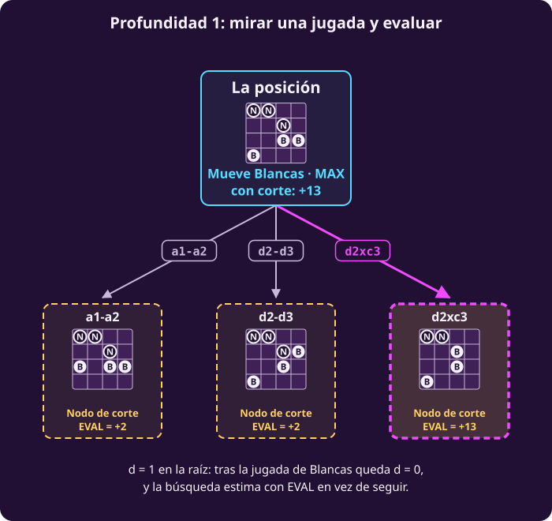

# Cortar y evaluar a mano

**¿Qué hacemos si no podemos llegar a los finales?**

Al terminar habrás calculado a mano **minimax con corte** en una posición
de peones de 4×4: mirar unas pocas jugadas hacia delante y estimar las
posiciones donde te detienes. Verás que puede equivocarse.

> **Las reglas, en el tablero de 4×4.** Columnas a–d y filas 1–4; Blancas
> (B) empieza con cuatro peones en la fila 1 y Negras (N) con cuatro en la
> fila 4. Empiezan Blancas. Un peón avanza una casilla si está vacía o
> captura en diagonal hacia delante. Gana quien llega a la fila del rival,
> captura todo o deja al rival sin jugada. $U=+1$ si gana Blancas y $U=-1$
> si gana Negras.

> **Supuestos de esta página.** Los mismos de
> [[escribir-el-juego|Escribir el juego]]: dos jugadores por turnos, sin
> azar, todo a la vista, toda partida termina y suma cero. Uno nuevo: **no
> nos alcanza el tiempo para llegar a los finales**.

## 1 · El mismo juego, en un tablero más grande

**Piensa: de las siete piezas de hexapawn, ¿cuáles cambian si el tablero
pasa a 4×4?**

Casi ninguna. Las reglas son las de la clase 1 con una fila y una columna
más:

- **Cambian $S$ y $s_0$.** Un estado sigue siendo un par (tablero, turno),
  ahora con 16 casillas. Al empezar hay cuatro peones por lado y mueve
  Blancas.
- **No cambian $S_F$, $\mathrm{Pl}$, $A$, $T$ ni $U$**
  (@jue-c1-finales, @jue-c1-pl, @jue-c1-acciones, @jue-c1-transicion,
  @jue-c1-utilidad): se llega a la fila del rival, se captura todo o se deja
  al rival sin jugada; $\mathrm{Pl}$ lee el turno guardado; $U=\pm1$.

Hay un detalle que la clase 1 dejó anunciado. En el 3×3, el turno se
podía deducir del tablero, aunque lo guardábamos por principio. **En el 4×4
ya no:** la computadora encontró 2925 tableros que se alcanzan con los dos
turnos. Guardar el turno en el estado era necesario.

::: table {#jue-c3-octapawn-inicio title="El tablero de 4×4 al empezar"}
| | a | b | c | d |
|---|:---:|:---:|:---:|:---:|
| **4** | N | N | N | N |
| **3** | · | · | · | · |
| **2** | · | · | · | · |
| **1** | B | B | B | B |
:::

## 2 · Medir cuánto crece el árbol

**Piensa: si el tablero pasa de 3×3 a 4×4, ¿el árbol crece al doble, al
triple o más?**

Mucho más. La computadora contó los dos árboles completos:

::: table {#jue-c3-crecimiento title="Del tablero de 3×3 al ajedrez"}
| Juego | Nodos del árbol | Estados distintos | Con juego perfecto |
|---|---:|---:|---|
| Hexapawn, 3×3 | 252 | 135 | Gana el segundo |
| Peones en 4×4 | 4 197 973 | 20 286 | Gana el primero |
| Ajedrez | — | del orden de $10^{44}$ | Nadie lo sabe |
:::

Una fila y una columna más multiplicaron el árbol por más de 16 000. El
4×4 todavía lo resuelve una computadora, pero ya no una persona con lápiz.

El ajedrez está en otra escala. Tromp y Österlund estimaron en 2021 que
tiene cerca de $4.8\times10^{44}$ posiciones legales, y Claude Shannon
estimó en 1950 que hay unas $10^{120}$ partidas. **Ni recordando cada
posición cabe**: no hay memoria para $10^{44}$ estados, y menos tiempo para
recorrerlos.

## 3 · El problema cuando no cabe

**Piensa: si no se puede llegar a los finales, ¿qué puede pedirse?**

Ya no podemos pedir la jugada óptima: para saberla hay que llegar a los
finales. Pedimos algo más modesto:

> **El problema de esta clase.**
>
> **Dado:** el juego, un estado $s$ donde mueve MAX y un presupuesto: cuántas
> jugadas hacia delante se pueden mirar.
>
> **Encontrar:** una jugada para $s$, lo mejor posible con ese presupuesto.

La respuesta ya no viene con garantía. Esta página muestra qué tan bien, y
qué tan mal, puede salir.

## 4 · Cortar la búsqueda y estimar

**Piensa: si solo te alcanza para ver dos jugadas hacia delante, ¿qué haces
con las posiciones donde te detienes?**

Una persona que juega ajedrez no calcula hasta el final. Mira unas jugadas,
se detiene y **juzga** la posición: «tengo un peón de más». Minimax con
corte hace lo mismo, con dos cambios:

1. Lleva la cuenta de **la profundidad que queda**, $d$: cuántas jugadas
   más, contando las de los dos jugadores, puede mirar. En la raíz, $d$ es
   el presupuesto; cada jugada la baja en uno.
2. Donde llega a $d=0$, en lugar de la utilidad $U(s)$, que no conoce, usa
   una **estimación** $\mathrm{EVAL}(s)$.

::: definition {#jue-c3-evaluacion title="Función de evaluación"}
Una **función de evaluación** $\mathrm{EVAL}(s)$ asigna a un estado $s$ un
número que estima qué tan bueno es $s$ para MAX. Se calcula **mirando solo
$s$**, sin buscar hacia delante.

**Qué significa:** es un juicio rápido, como «tengo un peón de más».

**Qué no es:** no es $V(s)$. No viene del reglamento: la escribimos
nosotros, y puede equivocarse.
:::

Un **nodo de corte** es un estado no final al que se llega con $d=0$: ahí
la búsqueda se detiene y estima. En las figuras lleva el borde punteado de
la clase 1, el de un estado que existe pero no se expande. Los finales que
aparezcan antes del corte se siguen valorando con su utilidad.

## 5 · Una evaluación para los peones

**Piensa: mirando solo un tablero de peones, ¿qué te dice quién va
mejor?**

Dos cosas saltan a la vista: **cuántos peones** tiene cada uno y **cuánto
han avanzado**. Un peón avanzado está más cerca de la fila del rival, que
es una forma de ganar. El avance de un peón blanco es cuántas filas subió
desde la fila 1; el de uno negro, cuántas bajó desde la fila 4.

$$\mathrm{EVAL}(s)=10\cdot\text{material}+\text{avance},$$

donde **material** es peones blancos menos peones negros, y **avance** es el
avance blanco menos el avance negro.

Los dos rasgos se restan porque lo que es bueno para Negras es malo para
Blancas: la evaluación, igual que $U$, se mide en puntos de MAX.

Ésta es la posición que usaremos en toda la clase. Mueven Blancas.

::: table {#jue-c3-posicion title="La posición de la clase · mueven Blancas"}
| | a | b | c | d |
|---|:---:|:---:|:---:|:---:|
| **4** | N | N | · | · |
| **3** | · | · | N | · |
| **2** | · | · | B | B |
| **1** | B | · | · | · |
:::

| | Blancas | Negras |
|---|---|---|
| Peones | a1, c2, d2: **3** | a4, b4, c3: **3** |
| Avance | $0+1+1=$ **2** | $0+0+1=$ **1** |

$$\mathrm{EVAL}=10\cdot(3-3)+(2-1)=1.$$

Van parejos en peones, y Blancas está un poco más avanzada.

## 6 · Los finales pesan más que cualquier estimación

**Piensa: si una victoria valiera $+1$ y un peón de más valiera $+10$,
¿qué preferiría el algoritmo?**

El peón. Por eso hay que poner $U$ en la **misma escala** que
$\mathrm{EVAL}$. En los finales usamos $100\cdot U(s)$: **$+100$** si gana
Blancas y **$-100$** si gana Negras.

Multiplicar por 100 solo cambia la escala; el orden entre finales es el
mismo que con $U$. Y 100 es mayor que cualquier evaluación: la computadora
comprobó que, en las posiciones alcanzables del 4×4 que no son finales,
$\mathrm{EVAL}$ nunca pasa de 36 en valor absoluto.

::: remark {#jue-c3-orden-finales title="La evaluación tiene que respetar el orden de los finales"}
Una función de evaluación puede equivocarse en las posiciones sin terminar,
pero no debe contradecir lo que ya se sabe: **ganar vale más que cualquier
estimación, y perder, menos**. Si no lo cumple, el programa puede preferir
una posición «buena» a una victoria segura.
:::

## 7 · Profundidad 1: mirar una jugada y evaluar

**Estamos aquí:** la posición de la clase, con $\mathrm{EVAL}=1$. Blancas
tiene tres jugadas: $\text{a1}\textbf{-}\text{a2}$,
$\text{d2}\textbf{-}\text{d3}$ y $\text{d2}\textbf{x}\text{c3}$. El peón de
c2 no puede moverse: tiene c3 enfrente y nada que capturar en b3 ni en d3.

Con $d=1$ en la raíz, cada jugada de Blancas deja $d=0$: sin esperar la
respuesta de Negras, se evalúa.

::: exercise {#jue-c3-ej-prof-1 title="Decide la jugada a profundidad 1"}
1. Calcula $\mathrm{EVAL}$ después de cada una de las tres jugadas.
2. ¿Qué jugada elige Blancas a profundidad 1?
:::

::: hint {#jue-c3-pista-prof-1 of="jue-c3-ej-prof-1" title="Qué cambia en cada jugada"}
Un avance sube el avance blanco en 1 y no toca el material. Una captura
quita un peón negro, y con él su avance, y además el peón blanco sube una
fila.
:::

::: answer {#jue-c3-resp-prof-1 of="jue-c3-ej-prof-1"}
1. $\text{a1}\textbf{-}\text{a2}$ y $\text{d2}\textbf{-}\text{d3}$:
   $10\cdot0+(3-1)=2$. $\text{d2}\textbf{x}\text{c3}$: quedan 3 peones
   blancos contra 2 negros, con avance $3$ contra $0$:
   $10\cdot1+(3-0)=13$.
2. **$\text{d2}\textbf{x}\text{c3}$**, con 13: gana un peón.
:::

::: figure {#jue-c3-fig-prof-1 title="Profundidad 1"}

:::

A profundidad 1, Blancas **captura**. Parece obvio: un peón de más.

## 8 · Profundidad 2: mirar también la respuesta

**Piensa: después de capturar en c3, ¿qué puede hacer Negras?**

Con $d=2$ en la raíz, miramos la jugada de Blancas, **todas las respuestas
de Negras**, y evaluamos. Negras es MIN: de sus respuestas, elige la de
menor $\mathrm{EVAL}$.

- **$\text{a1}\textbf{-}\text{a2}$.** Negras puede responder
  $\text{c3}\textbf{x}\text{d2}$ ($-10$), $\text{a4}\textbf{-}\text{a3}$
  ($1$) o $\text{b4}\textbf{-}\text{b3}$ ($1$). Lo peor para Blancas: $-10$.
- **$\text{d2}\textbf{-}\text{d3}$.** El peón de c3 queda bloqueado por c2 y
  sin nada que capturar. Negras puede responder
  $\text{a4}\textbf{-}\text{a3}$ o $\text{b4}\textbf{-}\text{b3}$, las dos
  con $1$. Lo peor para Blancas: $1$.
- **$\text{d2}\textbf{x}\text{c3}$.** Es el ejercicio que sigue.

::: exercise {#jue-c3-ej-prof-2 title="Decide el valor de la captura a profundidad 2"}
Tras $\text{d2}\textbf{x}\text{c3}$, el tablero es éste y mueven Negras:

| | a | b | c | d |
|---|:---:|:---:|:---:|:---:|
| **4** | N | N | · | · |
| **3** | · | · | B | · |
| **2** | · | · | B | · |
| **1** | B | · | · | · |

1. Escribe las jugadas de Negras.
2. Calcula $\mathrm{EVAL}$ después de cada una.
3. ¿Cuánto vale la captura a profundidad 2? ¿Qué jugada elige Blancas
   ahora?
:::

::: hint {#jue-c3-pista-prof-2 of="jue-c3-ej-prof-2" title="Busca la diagonal"}
Los peones negros capturan en diagonal **hacia abajo**. ¿Algún peón negro
tiene al peón blanco de c3 en una diagonal de enfrente?
:::

::: answer {#jue-c3-resp-prof-2 of="jue-c3-ej-prof-2"}
1. $\text{a4}\textbf{-}\text{a3}$, $\text{b4}\textbf{-}\text{b3}$ y
   **$\text{b4}\textbf{x}\text{c3}$**: el peón de b4 captura en diagonal.
2. Tras un avance: $10\cdot(3-2)+(3-1)=12$. Tras
   $\text{b4}\textbf{x}\text{c3}$ quedan dos peones por lado, con avance 1
   cada uno: $\mathrm{EVAL}=0$.
3. Negras recaptura, así que la captura vale **0**. Blancas compara $-10$,
   $1$ y $0$ y elige **$\text{d2}\textbf{-}\text{d3}$**.
:::

::: figure {#jue-c3-fig-prof-2 title="Profundidad 2"}

:::

**Mirar una jugada más cambió la decisión.** La captura ganaba un peón,
pero Negras lo recupera enseguida.

## 9 · Profundidad 3 y el valor exacto

**Piensa: si con profundidad 2 la decisión cambió, ¿cambiará otra vez con
profundidad 3?**

A profundidad 3 se mira jugada de Blancas, respuesta de Negras y otra
jugada de Blancas. La computadora da:

| Jugada | Prof. 1 | Prof. 2 | Prof. 3 | Exacto |
|---|---:|---:|---:|---:|
| $\text{a1}\textbf{-}\text{a2}$ | 2 | $-10$ | $-9$ | $-100$ |
| $\text{d2}\textbf{-}\text{d3}$ | 2 | 1 | **100** | $+100$ |
| $\text{d2}\textbf{x}\text{c3}$ | **13** | 0 | 1 | $-100$ |

El 100 de $\text{d2}\textbf{-}\text{d3}$ sale de un final: tras esa jugada,
Negras solo puede avanzar a3 o b3, y en los dos casos Blancas juega
$\text{d3}\textbf{-}\text{d4}$ y llega a la fila 4. A profundidad 3 el
algoritmo ya ve esa victoria.

La última columna es el **valor exacto**, $V$ multiplicado por 100 para
compararlo con las demás: la computadora llegó hasta los finales. **Capturar
pierde y $\text{d2}\textbf{-}\text{d3}$ gana.** A profundidad 1, el programa
habría elegido la jugada perdedora.

::: definition {#jue-c3-valor-con-corte title="Valor con corte"}
El **valor con corte** de un estado, cuando quedan $d$ jugadas por mirar,
es el minimax del árbol cortado a $d$ jugadas, con $\mathrm{EVAL}$ en los
nodos de corte y $100\cdot U$ en los finales.

**Qué significa:** es **el minimax de la evaluación**.

**Qué no es:** no es $V(s)$, el valor del juego, y puede equivocarse.
:::

**Punto de control:** deberías poder calcular a mano el valor con corte de
cada jugada a profundidad 1 y 2 en una posición de peones de 4×4, y decir
por qué puede no coincidir con el valor exacto.

## Lo que hay que llevarse

- El 4×4 es el mismo juego con más casillas: cambian $S$ y $s_0$, y ahora
  sí hace falta guardar el turno. Su árbol ya no se puede recorrer a mano.
- Si el árbol no cabe, se corta cuando la profundidad que queda llega a
  $d=0$ y se usa $\mathrm{EVAL}$ en ese nodo de corte. Los finales valen
  $100\cdot U$, una escala que gana a cualquier estimación.
- El valor con corte es el minimax de $\mathrm{EVAL}$, no el del juego. En
  la posición de la clase, la profundidad 1 elige una jugada que pierde.

Continúa con [[minimax-con-corte|minimax con corte como algoritmo]].
