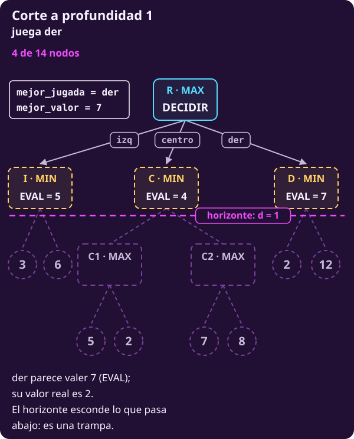
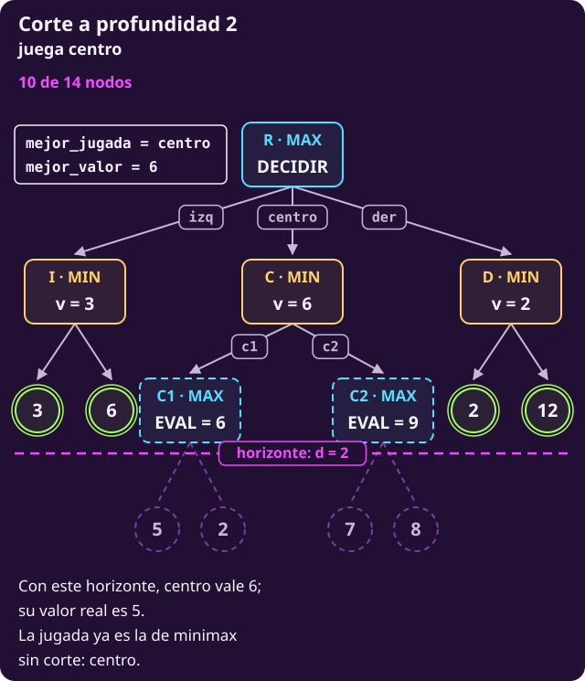

# Minimax con corte como algoritmo

**¿Cómo se escribe lo que hicimos a mano para cualquier juego, y qué se
puede confiar en lo que devuelve?**

Al terminar tendrás **el pseudocódigo de minimax con corte**, sabrás qué
recibe y qué genera, qué garantiza y qué no, y cuánto cuesta. También
sabrás leer qué preferencia expresa una función de evaluación.

> **Las reglas, en el tablero de 4×4.** Columnas a–d y filas 1–4; Blancas
> (B) empieza con cuatro peones en la fila 1 y Negras (N) con cuatro en la
> fila 4. Empiezan Blancas. Un peón avanza una casilla si está vacía o
> captura en diagonal hacia delante. Gana quien llega a la fila del rival,
> captura todo o deja al rival sin jugada. $U=+1$ si gana Blancas y $U=-1$
> si gana Negras.

> **Supuestos de esta página.** Los de
> [[cortar-y-evaluar|Cortar y evaluar a mano]]: dos jugadores por turnos,
> sin azar, todo a la vista, toda partida termina, suma cero, y no alcanza
> el tiempo para llegar a los finales.

## 1 · Qué recibe y qué genera

**Piensa: ¿qué tuviste que saber para calcular la tabla de profundidades a
mano?**

Las reglas, como en la clase 2, y dos cosas nuevas: cuánto mirar y cómo
juzgar una posición sin terminar.

> **El problema de minimax con corte.**
>
> **Dado (lo que recibe):**
>
> - un estado $s$ donde mueve MAX;
> - $d\ge1$, la profundidad: cuántas jugadas puede mirar desde $s$;
> - las reglas del juego: $S_F$ (@jue-c1-finales), $\mathrm{Pl}$
>   (@jue-c1-pl), $A$ (@jue-c1-acciones), $T$ (@jue-c1-transicion) y $U$
>   (@jue-c1-utilidad);
> - una función de evaluación, $\mathrm{EVAL}$ (@jue-c3-evaluacion).
>
> **Encontrar (lo que devuelve):** una jugada de $A(s)$ cuyo hijo tenga el
> mayor valor con corte (@jue-c3-valor-con-corte), en puntos de MAX.

**Qué genera:** como minimax, no recibe el grafo. Genera los estados con
$A$ y $T$ mientras recorre, pero **solo hasta $d$ jugadas**. Los nodos de
corte sí se generan, porque hay que evaluarlos, pero no se expanden: nadie
calcula sus hijos.

## 2 · El procedimiento

**Piensa: ¿qué línea hay que agregarle a MINIMAX para que se detenga?**

Una sola, la 9. Lo demás es DECIDIR-MINIMAX y MINIMAX de
[[minimax-como-algoritmo|la clase 2]], con $d$ como argumento y $d-1$ en
cada hijo:

```text
INPUT   un estado s donde mueve MAX; la
        profundidad d ≥ 1; las reglas S_F,
        Pl, A, T y U; y una función EVAL.
        No recibe el grafo.
OUTPUT  una jugada de A(s) con el mayor
        valor con corte.

 1 function DECIDIR-CON-CORTE(s, d)
 2   mejor_valor ← −∞ ; mejor_jugada ← ninguna
 3   for each a in A(s)
       # ya se gastó una jugada: d − 1
 4     w ← MINIMAX-CON-CORTE(T(s, a), d − 1)
       # estricto: un empate deja la primera
 5     if w > mejor_valor:
         mejor_valor ← w ; mejor_jugada ← a
 6   return mejor_jugada       # la jugada, no w

   # d: las jugadas que quedan por mirar
 7 function MINIMAX-CON-CORTE(s, d)
     # ×100: un final pesa más que EVAL
 8   if s ∈ S_F: return 100 · U(s)
 9   if d = 0: return EVAL(s)  # se estima
10   if Pl(s) = MAX
11     v ← −∞                  # menor que todo
12     for each a in A(s)
13       w ← MINIMAX-CON-CORTE(T(s, a), d − 1)
14       v ← max(v, w)         # el mayor
15     return v
16   else                      # Pl(s) = MIN
17     v ← +∞                  # mayor que todo
18     for each a in A(s)
19       w ← MINIMAX-CON-CORTE(T(s, a), d − 1)
20       v ← min(v, w)         # el menor
21     return v
```

El mismo procedimiento en Python, línea por línea; el número entre
paréntesis es la línea del pseudocódigo:

```python
from math import inf

# Las reglas: es_final(s), pl(s), acciones(s),
# transicion(s, a), utilidad(s) y evaluar(s),
# que es EVAL. pl(s) da "MAX" o "MIN".

def decidir_con_corte(s, d):    # (1)
    # (2) Aún no ha visto ninguna jugada.
    mejor_valor = -inf
    mejor_jugada = None
    for a in acciones(s):       # (3)
        # (4) Valora el hijo con una jugada
        # menos.
        w = minimax_con_corte(
            transicion(s, a), d - 1)
        # (5) Solo si mejora estrictamente.
        if w > mejor_valor:
            mejor_valor = w
            mejor_jugada = a
    return mejor_jugada         # (6) jugada

def minimax_con_corte(s, d):    # (7)
    # (8) Un final vale 100 veces su U.
    if es_final(s):
        return 100 * utilidad(s)
    # (9) Nodo de corte: se estima.
    if d == 0:
        return evaluar(s)
    if pl(s) == "MAX":          # (10)
        v = -inf                # (11)
        for a in acciones(s):   # (12)
            # (13) una jugada menos
            w = minimax_con_corte(
                transicion(s, a), d - 1)
            v = max(v, w)       # (14) mayor
        return v                # (15)
    else:                       # (16) MIN
        v = inf                 # (17)
        for a in acciones(s):   # (18)
            # (19) una jugada menos
            w = minimax_con_corte(
                transicion(s, a), d - 1)
            v = min(v, w)       # (20) menor
        return v                # (21)
```

Respecto de DECIDIR-MINIMAX y MINIMAX de
[[minimax-como-algoritmo|la clase 2]]:

- **La línea 9 es la nueva:** cuando ya no quedan jugadas por mirar, se
  estima.
- **La línea 8 solo cambia la escala** de $U$, para que un final pese más
  que cualquier estimación. Va **antes** que la 9: un final se reconoce
  aunque le quede $d=0$.
- **Las demás son las mismas**, con $d-1$ en cada llamada (líneas 4, 13
  y 19). Por eso las del MIN quedan en 16–21 y no en 15–20.

Con $d=1$, $d=2$ y $d=3$, los valores $w$ de la línea 4 son las tres
primeras columnas de la tabla de [[cortar-y-evaluar|la página anterior]].

::: exercise {#jue-c3-ej-hoja title="Decide qué devuelve cada línea"}
1. Con $d=2$ en la raíz, la llamada para $\text{d2}\textbf{x}\text{c3}$
   baja a la respuesta $\text{b4}\textbf{x}\text{c3}$, y ahí queda $d=0$.
   ¿Qué línea devuelve el valor de ese estado, y cuánto?
2. Con $d=3$ en la raíz, la llamada para $\text{d2}\textbf{-}\text{d3}$
   baja por $\text{a4}\textbf{-}\text{a3}$ y $\text{d3}\textbf{-}\text{d4}$.
   ¿Qué línea devuelve el valor de ese estado, y cuánto?
:::

::: hint {#jue-c3-pista-hoja of="jue-c3-ej-hoja" title="El orden de las líneas importa"}
La línea 8 se revisa antes que la 9. Pregúntate primero si el estado es
final; solo si no lo es, mira cuánto vale $d$.
:::

::: answer {#jue-c3-resp-hoja of="jue-c3-ej-hoja"}
1. El estado tras $\text{b4}\textbf{x}\text{c3}$ no es final, así que la
   línea 8 no lo toma. Como $d=0$, lo toma la **línea 9**: devuelve
   $\mathrm{EVAL}=0$.
2. Blancas llegó a la fila 4: es final. La **línea 8** devuelve
   $100\cdot(+1)=100$, sin importar cuánto valga $d$.
:::

## 3 · El corte en el árbol T

**Piensa: si cortas el árbol T a una jugada, ¿con qué valoras I, C y D?**

Volvemos al árbol T de [[minimax-como-algoritmo|la clase 2]], con R de MAX,
I, C y D de MIN, y C1 y C2 de MAX.

- **Sus hojas son finales, y ya están en la escala de la línea 8.** La
  hoja 3 es un final con $U=3/100$: la línea 8 devuelve $100\cdot U=3$.
  Así, el número de cada hoja es justo lo que devuelve la línea 8, en la
  misma escala que $\mathrm{EVAL}$.
- Le damos una $\mathrm{EVAL}$ a cada nodo interno:

::: table {#jue-c3-t-eval title="La evaluación de los nodos internos del árbol T"}
| Nodo | I | C | D | C1 | C2 |
|---|---:|---:|---:|---:|---:|
| $\mathrm{EVAL}$ | 5 | 4 | 7 | 6 | 9 |
| $V$ exacto | 3 | 5 | 2 | 5 | 8 |
:::

**Con $d=1$.** I, C y D llegan con $d=0$ y no son finales: los valora la
**línea 9**, con 5, 4 y 7. DECIDIR-CON-CORTE juega **der**. Es una trampa:
D vale 2, porque MIN responde con la hoja 2, que quedó detrás del corte.

::: figure {#jue-c3-t-fig-d1 title="El árbol T cortado con d = 1"}

:::

**Con $d=2$.** El horizonte baja un nivel. Las hojas de I y de D llegan con
$d=0$, pero **son finales**: las toma la **línea 8**, que va antes que la
9, y devuelve su número. C1 y C2 llegan con $d=0$ y no son finales: los
toma la **línea 9**, con 6 y 9.

La traza de DECIDIR-CON-CORTE(R, 2), con el formato de
[[minimax-como-algoritmo|la clase 2]]: una fila al entrar a un nodo y una
por cada hijo que regresa. En $w$, una hoja va sola y un nodo lleva su
nombre entre paréntesis; jugada es mejor_jugada, «—» si ninguna.

**Tramo 1 · izq y centro**

::: table {#jue-c3-t-traza-d2 title="Traza de DECIDIR-CON-CORTE en el árbol T con d = 2"}
| # | línea · pila | v | w | jugada |
|---:|---|---:|---|---|
| 1 | 2 · R | −∞ |  | — |
| 2 | 17 · R›I | +∞ |  | — |
| 3 | 19–20 · R›I | 3 | 3 | — |
| 4 | 19–20 · R›I | 3 | 6 | — |
| 5 | 4–5 · R | 3 | 3 (I) | izq |
| 6 | 17 · R›C | +∞ |  | izq |
| 7 | 19–20 · R›C | 6 | 6 (C1) | izq |
| 8 | 19–20 · R›C | 6 | 9 (C2) | izq |
| 9 | 4–5 · R | 6 | 6 (C) | centro |
:::

- **Filas 3 y 4:** las hojas llegan con $d=0$, pero son finales: las toma
  la línea 8.
- **Filas 7 y 8:** C1 y C2 llegan con $d=0$ y no son finales: los toma la
  línea 9, y su $w$ es su $\mathrm{EVAL}$, 6 y 9. Nadie genera sus hojas.
- **Fila 9:** $6>3$: mejor_jugada pasa de **izq** a **centro**.

**Tramo 2 · der**

| # | línea · pila | v | w | jugada |
|---:|---|---:|---|---|
| 10 | 17 · R›D | +∞ |  | centro |
| 11 | 19–20 · R›D | 2 | 2 | centro |
| 12 | 19–20 · R›D | 2 | 12 | centro |
| 13 | 4–5 · R | 6 | 2 (D) | centro |
| 14 | 6 · R | 6 |  | centro |

- **Fila 13:** $2>6$ es falso: mejor_jugada se queda en **centro**, y la
  línea 6 la devuelve.

::: figure {#jue-c3-t-fig-d2 title="El árbol T cortado con d = 2"}

:::

**Con $d=3$.** Ya no hay nodos de corte: toda hoja la toma la línea 8, y
DECIDIR-CON-CORTE hace el minimax exacto. C vale 5 y juega **centro**,
como en la clase 2.

::: table {#jue-c3-t-por-profundidad title="El árbol T con cada profundidad"}
| $d$ | I · C · D | Juega | Nodos |
|---|---|---|---:|
| 1 | 5 · 4 · 7 | der | 4 |
| 2 | 3 · 6 · 2 | centro | 10 |
| 3 | 3 · 5 · 2 | centro | 14 |
:::

Los nodos generados cuentan la raíz. Con $d=1$, der es la trampa. Con
$d=2$, centro vale 6 y no 5: el 6 es una estimación, pero aquí alcanza
para elegir bien.

::: exercise {#jue-c3-t-ej-corte title="Decide qué línea valora cada nodo"}
Con $d=2$ en la raíz. En la tabla, las hojas van por su número; $d$ es la
profundidad con que llega el nodo; **línea**, la que lo valora (8 o 9); y
$w$, lo que devuelve.

| Nodo | Final | $d$ | Línea | $w$ |
|---|---|---|---|---|
| 3 | sí | 0 | 8 | 3 |
| C1 | | | | |
| 12 | | | | |

1. Completa la tabla.
2. Si $\mathrm{EVAL}(\text{C1})$ fuera 2 en vez de 6, ¿qué jugaría
   DECIDIR-CON-CORTE(R, 2)? ¿Y DECIDIR-CON-CORTE(R, 3)?
:::

::: hint {#jue-c3-t-pista-corte of="jue-c3-t-ej-corte" title="Primero la línea 8"}
Para cada nodo, pregunta primero si es final; solo si no lo es, mira su
$d$. Para la parte 2, empieza por el $w$ de la fila 7 de la traza.
:::

::: answer {#jue-c3-t-resp-corte of="jue-c3-t-ej-corte"}
1. **C1:** no es final, llega con $d=0$: lo valora la **línea 9** y
   devuelve 6. **Hoja 12:** es final, llega con $d=0$: la **línea 8**, y
   devuelve 12.
2. Con $d=2$, C vale $\min(2,9)=2$, y R compara izq 3, centro 2 y der 2:
   juega **izq**, por una mala estimación de C1. Con $d=3$ no se evalúa
   ningún nodo interno, así que sigue jugando **centro**.
:::

## 4 · Por qué termina

**Piensa: si el juego fuera infinito, ¿terminaría MINIMAX-CON-CORTE?**

Sí. Cada llamada baja $d$ en uno, y la línea 9 no hace más llamadas cuando
$d=0$. El algoritmo **nunca baja más de $d$ niveles**, así que termina
aunque el árbol completo fuera enorme o infinito. A diferencia de minimax,
que termine no depende de que el juego termine.

## 5 · Qué se puede afirmar de lo que devuelve

**Piensa: el algoritmo hace un minimax exacto. ¿Por qué entonces no da el
valor del juego?**

Porque lo hace **sobre otro árbol**: el árbol cortado a $d$ jugadas, con las
hojas valoradas por las líneas 8 y 9. Con el mismo argumento de inducción
que minimax, el resultado es el minimax exacto de ese árbol. Si una hoja de
corte está mal estimada, el error sube por el árbol.

Hay una afirmación que sí vale en este juego. Como $|\mathrm{EVAL}|\le36$ en
las posiciones alcanzables que no son finales, **un 100 solo puede venir de
finales ganados**: si MINIMAX-CON-CORTE devuelve 100, Blancas tiene una victoria
asegurada dentro de las $d$ jugadas, responda lo que responda Negras. Lo
mismo vale para $-100$ y Negras. **Cualquier otro número es una
estimación.**

## 6 · Cuánto cuesta

**Piensa: si subes $d$ en uno, ¿cuánto más trabajo hay?**

Si cada estado tiene a lo más $b$ jugadas, el árbol cortado tiene a lo más
$b^d$ hojas, y cada hoja cuesta una llamada a $\mathrm{EVAL}$ o a $U$.

::: remark {#jue-c3-costo-corte title="Costo de minimax con corte"}
Con ramificación $b$ y $d$ jugadas por mirar en la raíz,

$$\text{tiempo}=O(b^d).$$

Con alfa-beta y las jugadas bien ordenadas, del orden de $O(b^{d/2})$: en el
mismo tiempo se mira cerca del doble de profundo. El valor en la raíz es el
mismo con o sin poda.
:::

En la posición de la clase, DECIDIR-CON-CORTE genera **4 nodos** con $d=1$,
**12** con $d=2$ y **33** con $d=3$, contando la raíz. Cada nivel multiplica
el trabajo, aunque aquí por menos de $b=5$, el máximo de jugadas en este
árbol: varios estados tienen pocas jugadas o son finales.

Por eso $d$ se elige según el **tiempo disponible**, no según el juego: es
el tema de [[jugar-contra-el-reloj|Jugar contra el reloj]].

## 7 · Leer qué preferencia expresa la evaluación

**Piensa: ¿qué dice la suma $10\cdot\text{material}+\text{avance}$ sobre
lo que importa?**

$\mathrm{EVAL}$ no viene del reglamento: **la escribimos nosotros**. Es una
decisión de modelado, igual que la medida de comodidad del
[[opt-objetivo-salones-practica|ejemplo de los salones]] en la unidad de
optimización: los pesos dicen cuánto importa cada rasgo. Ésta, leída con
cuidado:

- **Un peón vale lo mismo que diez filas de avance.** En las posiciones
  alcanzables del 4×4 que no son finales, la computadora comprobó que la
  diferencia de avance entre dos posiciones nunca compensa un peón, así que
  **el material decide primero** y el avance solo desempata.
- **Todos los peones valen igual**, estén donde estén, salvo por su avance.
- **No ve si un peón está bloqueado**, ni si está a punto de ser capturado.
- **No sabe a quién le toca.** La misma posición recibe el mismo número
  mueva quien mueva.

Ninguna de esas omisiones es un error de cuenta. Son **supuestos** del
modelo, y conviene escribirlos como tales.

En ajedrez, la evaluación más conocida es la del **material**: peón 1,
caballo 3, alfil 3, torre 5 y dama 9. Es la misma idea, una suma ponderada
de rasgos, con los mismos huecos.

::: exercise {#jue-c3-ej-rasgo title="Decide si un rasgo nuevo arregla el error"}
A profundidad 1, la evaluación prefirió $\text{d2}\textbf{x}\text{c3}$
(13) sobre $\text{a1}\textbf{-}\text{a2}$ y $\text{d2}\textbf{-}\text{d3}$
(2 cada una), sin ver que Negras recupera el peón.

1. ¿Cuál de los supuestos de la lista explica ese error?
2. Una compañera propone agregar un rasgo: restar 10 por cada captura que
   Negras tiene disponible y sumar 10 por cada captura que tiene Blancas.
   Calcula la nueva evaluación tras cada una de las tres jugadas. ¿Cambia la
   elección?
3. Otro compañero propone contar solo las capturas de **quien mueve**, que
   tras la jugada de Blancas es Negras: restar 10 por cada una. Calcula otra
   vez. ¿Cambia la elección?
:::

::: hint {#jue-c3-pista-rasgo of="jue-c3-ej-rasgo" title="Cuenta las diagonales"}
Tras cada jugada, revisa qué peones negros tienen un peón blanco en una
diagonal de enfrente (hacia abajo), y qué peones blancos tienen uno negro
(hacia arriba). Tras la captura, mira también lo que amenaza el peón que
llegó a c3.
:::

::: answer {#jue-c3-resp-rasgo of="jue-c3-ej-rasgo"}
1. **«No ve si un peón está a punto de ser capturado».**
2. Tras $\text{a1}\textbf{-}\text{a2}$, Negras puede capturar en d2 y
   Blancas en c3: $2-10+10=2$. Tras $\text{d2}\textbf{-}\text{d3}$, nadie
   puede capturar: 2. Tras $\text{d2}\textbf{x}\text{c3}$, Negras puede
   capturar en c3, pero el peón de c3 también amenaza a b4: $13-10+10=13$.
   **No cambia nada**: las dos amenazas se cancelan, porque el rasgo no
   sabe a quién le toca.
3. Contando solo las de Negras: $2-10=-8$, $2$ y $13-10=3$. **Sigue
   eligiendo la captura**, por poco: tras la recaptura también cambia el
   avance, y el rasgo no lo ve.

Adivinar las capturas con rasgos es frágil: cada arreglo deja otro hueco.
La [[jugar-contra-el-reloj|página siguiente]] hace otra cosa, **mirarlas**:
la búsqueda de quietud.
:::

::: table {#jue-c3-que-cambia title="Qué cambia cuando cambia la búsqueda"}
| Cambio | Efecto que se puede justificar |
|---|---|
| Subir $d$ en uno | Hasta $b$ veces más hojas. La decisión puede cambiar en cualquier sentido |
| Una $\mathrm{EVAL}$ con más rasgos | Las mismas hojas, cada una más cara. Ayuda si se acerca al valor exacto; nada lo asegura |
| Con alfa-beta, un peor orden de jugadas | El mismo valor en la raíz, con menos cortes |
:::

**Punto de control:** deberías poder escribir DECIDIR-CON-CORTE y
MINIMAX-CON-CORTE de memoria, decir qué recibe y qué genera, decir qué
línea valora cada hoja (la 8 o la 9), explicar por qué termina aunque el
juego no termine y decir qué número de su salida es seguro.

## Lo que hay que llevarse

- DECIDIR-CON-CORTE recibe las reglas, $d$ y $\mathrm{EVAL}$, y devuelve
  una jugada. Genera los estados solo hasta $d$ jugadas y evalúa los nodos
  de corte sin expandirlos.
- Es DECIDIR y MINIMAX con una línea más, la 9. Termina siempre, porque
  $d$ baja en cada llamada.
- Elige con el minimax exacto del árbol cortado, no con el del juego: solo
  los $\pm100$ son seguros. En el árbol T, $d=1$ cae en la trampa de der y
  $d=2$ ya juega centro. Cuesta $O(b^d)$.
- $\mathrm{EVAL}$ es un modelo: sus pesos expresan una preferencia y dejan
  cosas fuera.

Continúa con [[jugar-contra-el-reloj|jugar contra el reloj]].
