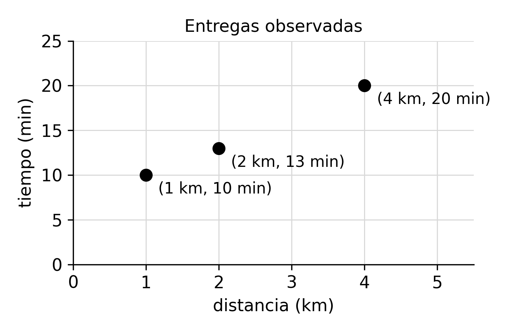

# Control · Optimización · Examen A

**[PDF del examen A, sin respuestas](../_assets/control-optimizacion-a.pdf)** · 45 minutos · 10 puntos · sin apuntes

Cada inciso tiene su respuesta debajo, **plegada**. Contesta primero en una hoja y luego ábrela para calificarte. **No se resuelve nada**: el examen pide plantear y justificar. Los óptimos que aparecen en las respuestas son solo de referencia, para que compruebes que tu modelo dice lo que crees.

Los incisos son los mismos en los dos problemas:

- **Modelo, justificado.** El modelo completo en forma canónica: objetivo arriba, una restricción por renglón (con nombre y contra cero) y dominio al final. Cada variable, el objetivo, el max o min, cada restricción y el dominio llevan un **porqué** breve.
- **Lagrangeano** (solo problema 2). Con el signo correcto de cada multiplicador y su dominio, justificando cada signo. Sin resolverlo.
- **Tipo y método, justificado.** ¿Lineal (LP), entera (IP), entera mixta (MILP), convexa no lineal o no convexa? ¿Con qué método se resuelve, y por qué sirve para ese tipo?

## Problema 1 · Ayudantes de laboratorio (5 puntos)

**La situación.** La coordinación tiene que decidir **qué ayudante cubre cada laboratorio** esta semana. Los ayudantes son **Ana, Beto y Caro**; los laboratorios, **Robótica, GPU y Redes**.

**Datos.**

| Horas de traslado por semana | Robótica | GPU | Redes | ¿Certificado para GPU? |
|---|---|---|---|---|
| Ana | 2 | 5 | 3 | sí |
| Beto | 4 | 1 | 2 | no |
| Caro | 3 | 4 | 6 | sí |

**Reglas.**

1. Cada laboratorio lo cubre **exactamente un** ayudante.
2. Ningún ayudante cubre **más de un** laboratorio.
3. El laboratorio de GPU solo lo puede cubrir un ayudante **certificado**.

**Qué se quiere.** A la coordinación **no le importa el total** de horas de traslado. Quiere que **el ayudante que más horas viaja, viaje lo menos posible**. Puedes agregar variables auxiliares; el modelo final debe ser lineal.

::: problem {#coa-1-mod title="1.1 · Modelo, justificado (3.5)"}
Escribe el modelo completo en forma canónica, con el porqué de cada parte: variables, función objetivo (y por qué max o min), restricciones y dominio.
:::

::: answer {of="coa-1-mod"}
Escribe $A=\{\text{Ana},\text{Beto},\text{Caro}\}$ para los ayudantes, $L=\{\text{Rob},\text{GPU},\text{Red}\}$ para los laboratorios y $t_{ij}$ para las horas de la tabla (son **datos**, no variables).

$$
\begin{aligned}
\min_{x,\,z}\quad & z \\
\text{s.a.}\quad
& \textstyle\sum_{i\in A} x_{ij} - 1 = 0 \quad \forall j\in L\\
& \textstyle\sum_{j\in L} x_{ij} - 1 \le 0 \quad \forall i\in A\\
& x_{\text{Beto},\text{GPU}} = 0\\
& \textstyle\sum_{j\in L} t_{ij}\,x_{ij} - z \le 0 \quad \forall i\in A\\
& x_{ij}\in\{0,1\},\quad z \ge 0
\end{aligned}
$$

**El mismo modelo, desarrollado.** Con iniciales ($x_{\text{AR}}$ = Ana cubre Robótica, $x_{\text{BG}}$ = Beto cubre GPU, …) y los datos de la tabla sustituidos:

$$
\begin{aligned}
\min\quad & z \\
\text{s.a.}\quad
& x_{\text{AR}} + x_{\text{BR}} + x_{\text{CR}} - 1 = 0\\
& x_{\text{AG}} + x_{\text{BG}} + x_{\text{CG}} - 1 = 0\\
& x_{\text{AN}} + x_{\text{BN}} + x_{\text{CN}} - 1 = 0\\
& x_{\text{AR}} + x_{\text{AG}} + x_{\text{AN}} - 1 \le 0\\
& x_{\text{BR}} + x_{\text{BG}} + x_{\text{BN}} - 1 \le 0\\
& x_{\text{CR}} + x_{\text{CG}} + x_{\text{CN}} - 1 \le 0\\
& x_{\text{BG}} = 0\\
& 2x_{\text{AR}} + 5x_{\text{AG}} + 3x_{\text{AN}} - z \le 0\\
& 4x_{\text{BR}} + 1x_{\text{BG}} + 2x_{\text{BN}} - z \le 0\\
& 3x_{\text{CR}} + 4x_{\text{CG}} + 6x_{\text{CN}} - z \le 0\\
& x \in \{0,1\}^{9},\quad z \ge 0
\end{aligned}
$$

Las tres primeras son «cubrir» (una por laboratorio: Robótica, GPU, Redes), las tres siguientes «uno por ayudante», luego «certificado» y al final «peor traslado» (una por ayudante). La forma genérica de arriba es esta misma con índices: $\forall j$ genera las tres de cubrir, $\forall i$ las de cada ayudante.

Por qué cada parte:

- **Variables.** $x_{ij}\in\{0,1\}$ vale 1 si el ayudante $i$ cubre el laboratorio $j$: es lo que la coordinación decide. $z$ (horas por semana) es una **auxiliar**: el traslado del ayudante que más viaja. Hace falta porque «el que más viaja» es un máximo, y un máximo no es lineal; con $z$ se escribe con restricciones lineales.
- **Objetivo.** $\min z$. Lo que se quiere es $\min \max_i \sum_j t_{ij}x_{ij}$ (el peor traslado, lo menor posible). Las restricciones de peor traslado obligan a $z$ a quedar **por encima** del traslado de cada ayudante; al minimizar, $z$ baja hasta tocar el mayor de ellos, así que $\min z$ es exactamente el min–máx. Se minimiza porque son horas de viaje: menos es mejor.
- **Cubrir** (regla 1). «Exactamente uno» es una igualdad: la suma por columna vale 1.
- **Uno por ayudante** (regla 2). «No más de uno» es $\le 1$, por renglón.
- **Certificado** (regla 3 y la última columna). Beto no está certificado, así que no puede tomar GPU.
- **Peor traslado.** Una por ayudante, por ejemplo para Ana $2x_{\text{A,Rob}} + 5x_{\text{A,GPU}} + 3x_{\text{A,Red}} - z \le 0$. Como cada ayudante cubre a lo más un laboratorio, $\sum_j t_{ij}x_{ij}$ son sus horas de traslado.
- **Dominio.** $x_{ij}$ binarias porque cubrir o no cubrir es sí o no; $z$ real y no negativa porque son horas.

**También valía:**

- La regla 2 con $=$ en vez de $\le$: hay tres ayudantes y tres laboratorios, así que en cualquier asignación válida cada uno cubre exactamente uno. Escribir $\le$ es lo literal; $=$ da el mismo conjunto factible.
- La regla 3 como $\sum_{i\,\text{certificado}} x_{i,\text{GPU}} = 1$, o simplemente **no crear** la variable $x_{\text{Beto},\text{GPU}}$, o la cota $x_{\text{Beto},\text{GPU}} \le 0$.
- Las nueve variables escritas una por una ($x_{\text{AR}}, x_{\text{AG}}, \dots$) en lugar de índices, y las restricciones desarrolladas.
- $\max\,(-z)$ en lugar de $\min z$.
- Restricciones en forma $z \ge \sum_j t_{ij}x_{ij}$ (están bien, pero el enunciado pedía «contra cero»: se descontaba poco si el sentido era correcto).

**Errores típicos:** minimizar el total $\sum_{ij} t_{ij}x_{ij}$ (el enunciado dice que **no** importa); escribir $\min \max(\dots)$ y dejarlo así (no es lineal); poner $\le 1$ en la regla 1 (un laboratorio podría quedar sin cubrir); declarar $z$ entera o binaria.

**Rúbrica (3.5).** Variables 0.75 (definición y unidades 0.4, porqué 0.35) · objetivo 0.75 (expresión 0.4, porqué y min 0.35) · restricciones 1.5 (regla 1 0.3, regla 2 0.3, regla 3 0.3, peor traslado 0.6; cada una con su porqué) · dominio 0.5 (0.25 y porqué 0.25).
:::

::: problem {#coa-1-tipo title="1.2 · Tipo y método, justificado (1.5)"}
¿Qué tipo de problema es? ¿Con qué método lo resolverías, y por qué sirve? ¿Sirven aquí el lagrangeano y las condiciones KKT?
:::

::: answer {of="coa-1-tipo"}
**Tipo: programación entera mixta (MILP).** El objetivo y todas las restricciones son lineales, pero las $x_{ij}$ son **binarias** y $z$ es continua: hay enteras y reales a la vez. No es LP porque el conjunto factible son puntos aislados (las asignaciones), no un poliedro continuo.

**Método.** Cualquiera de estos, con su porqué:

- **Enumerar.** Hay $3! = 6$ formas de asignar tres ayudantes a tres laboratorios, y 4 respetan el certificado. Revisar las 4 es legítimo y exacto porque el problema es diminuto.
- **Ramificar y acotar** (por ejemplo `scipy.optimize.milp`). Resuelve relajaciones LP (soltando $x\in\{0,1\}$ a $0\le x\le 1$) y ramifica sobre las variables fraccionarias; sirve para enteras de cualquier tamaño razonable.

**¿Lagrangeano y KKT? No.** KKT pide derivar e igualar a cero, y eso supone variables que se mueven de forma continua. Con $x_{ij}\in\{0,1\}$ no hay derivada que tomar: entre 0 y 1 no hay asignaciones intermedias.

**Referencia (no se pedía).** El peor traslado mínimo es $z^{∗} = 4$, con Caro en GPU. **Hay dos asignaciones óptimas:** Ana–Robótica, Beto–Redes, Caro–GPU (traslados 2, 2, 4) y Ana–Redes, Beto–Robótica, Caro–GPU (3, 4, 4). Las dos valen 4: un modelo puede tener más de un óptimo, y cualquiera de los dos es una respuesta correcta.

**Rúbrica (1.5).** Tipo 0.4 y porqué 0.35 · método 0.25 y porqué 0.25 · KKT no, y por qué, 0.25.
:::

**Repasa:** [[patrones-lineales|Patrones lineales]], [[opt-objetivo-salones-practica|Asignar salones]], [[enumerar|Enumerar]] y [[ramificar-y-acotar|Ramificar y acotar]].

## Problema 2 · Ajustar la recta (5 puntos)

**La situación.** Una app de reparto quiere predecir cuánto tarda una entrega a partir de su distancia, con la recta **tiempo = β₀ + β₁ · distancia** (tiempo en minutos, distancia en kilómetros). Hay que decidir los dos números **β₀ y β₁**.

**Datos.** Las tres entregas observadas. La figura las muestra en un plano; no hay ninguna recta dibujada.

| Entrega | Distancia (km) | Tiempo (min) |
|---|---|---|
| 1 | 1 | 10 |
| 2 | 2 | 13 |
| 3 | 4 | 20 |

**Reglas.**

1. Cada kilómetro extra debe sumar **al menos 2 minutos** al tiempo predicho.
2. Para una entrega de **5 km**, la recta **no puede predecir más de 22 minutos**.

**Qué se quiere.** La recta que menos se equivoque con las tres entregas: la **menor suma de residuos al cuadrado**, donde, para cada entrega, **residuo = tiempo observado − (β₀ + β₁ · distancia)**.

::: problem {#coa-2-mod title="2.1 · Modelo, justificado (2.5)"}
Escribe el modelo completo en forma canónica, con el porqué de cada parte.
:::

::: answer {of="coa-2-mod"}
$$
\begin{aligned}
\min_{\beta_0,\,\beta_1}\quad & f(\beta) = (10-\beta_0-\beta_1)^2 \\
& \qquad + (13-\beta_0-2\beta_1)^2 \\
& \qquad + (20-\beta_0-4\beta_1)^2 \\
\text{s.a.}\quad
& \beta_1 - 2 \ge 0\\
& \beta_0 + 5\beta_1 - 22 \le 0\\
& \beta_0,\ \beta_1 \in \mathbb{R}
\end{aligned}
$$

**El mismo modelo, en forma genérica.** Con $n$ observaciones $(d_k, y_k)$, $k = 1, \dots, n$ (distancia y tiempo de la entrega $k$), una pendiente mínima $m$ y un tope $T$ para una distancia $D$:

$$
\begin{aligned}
\min_{\beta_0,\,\beta_1}\quad & f(\beta) = \sum_{k=1}^{n} \big(y_k - (\beta_0 + \beta_1 d_k)\big)^2 \\
\text{s.a.}\quad
& \beta_1 - m \ge 0\\
& \beta_0 + D\,\beta_1 - T \le 0\\
& \beta_0,\ \beta_1 \in \mathbb{R}
\end{aligned}
$$

En este examen $n = 3$, $(d_k, y_k) = (1, 10), (2, 13), (4, 20)$, $m = 2$, $D = 5$ y $T = 22$. La forma explícita es la genérica con los datos sustituidos: cada término de la suma es el residuo de una entrega, al cuadrado.

Por qué cada parte:

- **Variables.** $\beta_0$ (minutos) es la ordenada al origen y $\beta_1$ (minutos por km) la pendiente. Son lo que se decide: fijarlas es fijar la recta. Las distancias y los tiempos son **datos**.
- **Objetivo.** Cada paréntesis es el residuo de una entrega: lo observado menos lo que predice la recta en esa distancia. Se elevan al cuadrado para que los errores hacia arriba y hacia abajo no se cancelen, y se suman porque se quiere el error de las tres. Se **minimiza** porque es un error.
- **Pendiente mínima** (regla 1). Lo que suma cada kilómetro extra es justo la pendiente $\beta_1$, así que «al menos 2 minutos» es $\beta_1 \ge 2$.
- **Tope en 5 km** (regla 2). Lo que predice la recta en 5 km es $\beta_0 + 5\beta_1$, y no puede pasar de 22.
- **Dominio.** $\beta$ **libres** (reales de cualquier signo): son coeficientes de una recta y nada en el enunciado les impone un signo. La regla 1 ya obliga a $\beta_1 \ge 2$, pero eso lo dice una restricción, no el dominio.

**También valía:**

- $\min \tfrac13 f(\beta)$ (el error cuadrático medio, MSE) o $\min \tfrac12 f(\beta)$: multiplicar el objetivo por una constante positiva no cambia el óptimo.
- Escribirlo solo en la forma genérica (con sumatoria), siempre que digas qué valen $d_k$, $y_k$, $m$, $D$ y $T$; o en forma de vectores, $\lVert y - X\beta \rVert^2$, con $X$ la matriz de renglones $(1, d_k)$.
- La pendiente mínima como $2 - \beta_1 \le 0$: es la misma restricción, todo con $\le$.
- Desarrollar el objetivo como cuadrática, si los coeficientes son correctos.

**Errores típicos:** usar valor absoluto o sumar residuos sin elevar (se cancelan); confundir la regla 1 con $\beta_0 \ge 2$; escribir la regla 2 sobre los datos y no sobre la recta; pedir $\beta \ge 0$ en el dominio.

**Rúbrica (2.5).** Variables 0.5 (0.25 y porqué 0.25) · objetivo 0.75 (expresión 0.4, porqué y min 0.35) · restricciones 0.75 (0.375 cada una, con su porqué) · dominio 0.5 (0.25 y porqué 0.25).
:::

::: problem {#coa-2-lag title="2.2 · Lagrangeano (1.5)"}
Escríbelo a partir de tu modelo, con el signo correcto de cada multiplicador y el dominio de los multiplicadores. Justifica cada signo. No lo resuelvas.
:::

::: answer {of="coa-2-lag"}
$$
\begin{aligned}
\mathcal{L}(\beta,\mu_1,\mu_2) = {} & f(\beta) \\
& + \mu_1\,(\beta_0 + 5\beta_1 - 22) \\
& - \mu_2\,(\beta_1 - 2), \\
& \mu_1,\ \mu_2 \ge 0.
\end{aligned}
$$

**El mismo lagrangeano, en forma genérica**, con los datos del modelo genérico ($n$ observaciones, pendiente mínima $m$, tope $T$ en la distancia $D$):

$$
\begin{aligned}
\mathcal{L}(\beta,\mu_1,\mu_2) = {} & \sum_{k=1}^{n} \big(y_k - (\beta_0 + \beta_1 d_k)\big)^2 \\
& + \mu_1\,(\beta_0 + D\,\beta_1 - T) \\
& - \mu_2\,(\beta_1 - m), \\
& \mu_1,\ \mu_2 \ge 0.
\end{aligned}
$$

Los signos no dependen de los números: dependen de que se minimiza, de que el tope es $\le 0$ y de que la pendiente mínima es $\ge 0$. Con $n = 3$, $m = 2$, $D = 5$ y $T = 22$ sale la forma explícita.

**Por qué cada signo.** Es un problema de **mínimo**, y la regla de [[los-signos-del-lagrangeano|los signos del lagrangeano]] es:

| Problema | Restricción contra cero | Término |
|---|---|---|
| Mín | $g - d \le 0$ | $+\mu\,(g-d)$ |
| Mín | $g - d \ge 0$ | $-\mu\,(g-d)$ |

- El tope en 5 km es $\le 0$, así que entra **sumando**: $+\mu_1(\beta_0 + 5\beta_1 - 22)$.
- La pendiente mínima es $\ge 0$, así que entra **restando**: $-\mu_2(\beta_1 - 2)$.

La idea detrás de la regla: al minimizar, el término debe **castigar** (subir $\mathcal{L}$) cuando la restricción se viola. Si $\beta_0 + 5\beta_1 > 22$, el término $+\mu_1(\cdot)$ es positivo; si $\beta_1 < 2$, el término $-\mu_2(\beta_1-2)$ también es positivo. Con $\mu \ge 0$, los dos castigan en la dirección correcta.

**También valía:** escribir la pendiente como $2 - \beta_1 \le 0$ y sumar, $+\mu_2(2 - \beta_1)$. Es exactamente el mismo término. Lo que **no** valía es dejar $\mu$ sin signo: con desigualdades, $\mu \ge 0$ es parte de la respuesta.

**Referencia (no se pedía).** Sin reglas, la recta de mínimos cuadrados es $\beta = (6.5,\ 3.36)$, que en 5 km predice 23.3 minutos y rompe la regla 2. Con las reglas, el óptimo es $\beta^{∗} = (187/26,\ 77/26) \approx (7.19,\ 2.96)$: el tope en 5 km queda **activo** ($\beta_0 + 5\beta_1 = 22$, con $\mu_1 = 18/13 \approx 1.38$) y la pendiente mínima queda **holgada** ($\beta_1 \approx 2.96 > 2$, con $\mu_2 = 0$).

**Rúbrica (1.5).** $f$ 0.25 · signo de $\mu_1$ 0.4 · signo de $\mu_2$ 0.4 · $\mu \ge 0$ 0.2 · porqué de los signos 0.25.
:::

::: problem {#coa-2-tipo title="2.3 · Tipo y método, justificado (1)"}
¿Qué tipo de problema es? ¿Con qué método lo resolverías, y por qué sirve para ese tipo?
:::

::: answer {of="coa-2-tipo"}
**Tipo: convexa no lineal** (más precisamente, una **cuadrática convexa**). El objetivo es una suma de cuadrados de funciones afines de $\beta$, y eso es convexo; las restricciones son lineales y se minimiza. No es LP porque el objetivo es cuadrático, y no es entera porque $\beta$ es real.

**Método.** Cualquiera de estos, con su porqué:

- **KKT por casos.** Con dos desigualdades hay $2^2 = 4$ casos (cada una activa o no). Sirve porque el problema es **convexo**: un punto que cumple KKT es el óptimo **global**, no solo uno local.
- **Un solver numérico**: `scipy.optimize.minimize` con restricciones, o un solver de programación cuadrática. Sirve por la misma razón: en un problema convexo, el mínimo local que encuentra es el global.
- **Descenso de gradiente proyectado**, también correcto por convexidad.

Valía mencionar que sin las reglas bastaría la fórmula cerrada de mínimos cuadrados; **con** las reglas, esa fórmula ya no basta (de hecho su recta viola la regla 2).

**Rúbrica (1).** Tipo 0.25 y porqué 0.25 · método 0.25 y porqué 0.25.
:::

**Repasa:** [[el-multiplicador|El multiplicador]], [[los-signos-del-lagrangeano|Los signos del lagrangeano]], [[resolver-paso-a-paso|Resolver, paso a paso]] y [[opt-objetivo-regresion-practica|Predecir un valor]].
