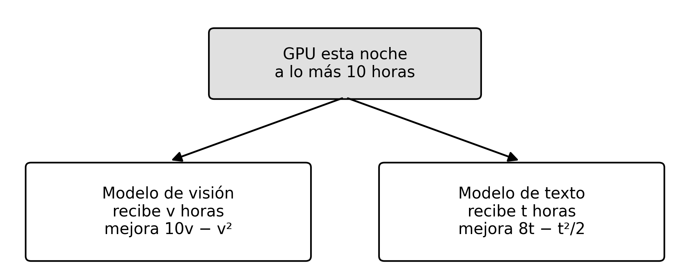

# Control · Optimización · Examen B

**[PDF del examen B, sin respuestas](../_assets/control-optimizacion-b.pdf)** · 45 minutos · 10 puntos · sin apuntes

Cada inciso tiene su respuesta debajo, **plegada**. Contesta primero en una hoja y luego ábrela para calificarte. **No se resuelve nada**: el examen pide plantear y justificar. Los óptimos que aparecen en las respuestas son solo de referencia, para que compruebes que tu modelo dice lo que crees.

Los incisos son los mismos en los dos problemas:

- **Modelo, justificado.** El modelo completo en forma canónica: objetivo arriba, una restricción por renglón (con nombre y contra cero) y dominio al final. Cada variable, el objetivo, el max o min, cada restricción y el dominio llevan un **porqué** breve.
- **Lagrangeano** (solo problema 2). Con el signo correcto de cada multiplicador y su dominio, justificando cada signo. Sin resolverlo.
- **Tipo y método, justificado.** ¿Lineal (LP), entera (IP), entera mixta (MILP), convexa no lineal o no convexa? ¿Con qué método se resuelve, y por qué sirve para ese tipo?

## Problema 1 · Sándwiches para mañana (5 puntos)

**La situación.** Un café prepara esta noche sándwiches para venderlos mañana. Hay que decidir **cuántos preparar**, sin saber todavía cuántos se van a pedir.

**Datos.**

| Un sándwich | Pesos |
|---|---|
| Costo de prepararlo | 15 |
| Precio de venta | 40 |

| Escenario | Día normal | Día de examen |
|---|---|---|
| Probabilidad | 0.7 | 0.3 |
| Demanda (sándwiches) | 30 | 50 |

**Reglas.**

1. Solo se preparan sándwiches **enteros**, y caben **a lo más 60**.
2. Se vende lo que se pueda: nunca **más de lo preparado** ni **más de la demanda** del día.
3. Lo que sobra se regala, sin costo extra.

**Qué se quiere.** La mayor **ganancia esperada = 0.7 × (ganancia si es día normal) + 0.3 × (ganancia si es día de examen)**, donde la ganancia de un día es lo que se cobra por lo vendido ese día menos lo que costó preparar. Puedes agregar variables auxiliares; el modelo final debe ser lineal.

::: problem {#cob-1-mod title="1.1 · Modelo, justificado (3.5)"}
Escribe el modelo completo en forma canónica, con el porqué de cada parte: variables, función objetivo (y por qué max o min), restricciones y dominio.
:::

::: answer {of="cob-1-mod"}
Escribe $N$ para el día normal y $E$ para el día de examen.

$$
\begin{aligned}
\max_{q,\,s_N,\,s_E}\quad & 0.7\,(40\,s_N - 15\,q) + 0.3\,(40\,s_E - 15\,q) \\
& \quad = 28\,s_N + 12\,s_E - 15\,q \\
\text{s.a.}\quad
& s_N - q \le 0\\
& s_E - q \le 0\\
& s_N - 30 \le 0\\
& s_E - 50 \le 0\\
& q - 60 \le 0\\
& q \in \mathbb{Z}_{\ge 0},\quad s_N,\ s_E \ge 0
\end{aligned}
$$

**El mismo modelo, en forma genérica.** Con un conjunto de escenarios $\mathcal{E}$, la probabilidad $p_e$ y la demanda $d_e$ de cada escenario $e$, el precio $r$, el costo $c$ y la capacidad $K$:

$$
\begin{aligned}
\max_{q,\,s}\quad & \sum_{e\in\mathcal{E}} p_e\,(r\,s_e - c\,q) \\
\text{s.a.}\quad
& s_e - q \le 0 \quad \forall e\in\mathcal{E}\\
& s_e - d_e \le 0 \quad \forall e\in\mathcal{E}\\
& q - K \le 0\\
& q \in \mathbb{Z}_{\ge 0},\quad s_e \ge 0 \quad \forall e\in\mathcal{E}
\end{aligned}
$$

En este examen $\mathcal{E} = \{N, E\}$, $p = (0.7,\ 0.3)$, $d = (30,\ 50)$, $r = 40$, $c = 15$ y $K = 60$. Es la misma notación de la panadería: $q$ no lleva índice $e$ porque se decide antes de saber el escenario, y cada $s_e$ sí lo lleva.

Por qué cada parte:

- **Variables.** $q$ (sándwiches) es lo que se prepara esta noche. Es **una sola** variable para los dos escenarios, porque se decide **antes** de saber qué día será: el café no puede preparar 30 si es normal y 50 si es examen. $s_N$ y $s_E$ (sándwiches) son **auxiliares**: lo vendido en cada escenario. Hacen falta porque lo vendido es $\min(q, \text{demanda})$, y un mínimo no es lineal.
- **Objetivo.** Es literalmente la fórmula del enunciado: en cada escenario se cobra $40$ por sándwich vendido y se pagan $15$ por sándwich preparado; luego se pondera con 0.7 y 0.3. Se **maximiza** porque es ganancia. El costo $15q$ aparece en los dos escenarios porque se paga sin importar qué día sea, y $0.7 + 0.3 = 1$ lo deja en $-15q$.
- **No más de lo preparado** y **demanda** (regla 2). Son las dos cotas de lo vendido, en cada escenario. ¿Por qué basta con «$\le$» y no hace falta forzar $s_e = \min(q, d_e)$? Porque cada $s_e$ tiene coeficiente **positivo** en un objetivo que se maximiza: el óptimo siempre empuja $s_e$ hasta la menor de sus dos cotas, que es justo $\min(q, d_e)$.
- **Capacidad** (regla 1). Caben a lo más 60.
- **Regla 3.** Lo que sobra se regala sin costo, así que **no aparece** en el modelo: no hay término por sobrante. Decir esto también cuenta como justificación.
- **Dominio.** $q$ entera no negativa porque solo se preparan sándwiches enteros (regla 1). $s_N, s_E \ge 0$: pueden declararse reales o enteras; si $q$ es entera, en el óptimo $s_e = \min(q, d_e)$ ya es entera.

**También valía:**

- Escribir el objetivo sin simplificar, como $0.7(40s_N - 15q) + 0.3(40s_E - 15q)$.
- Declarar $s_N, s_E$ enteras.
- Escribirlo solo en la forma genérica, siempre que digas qué valen $\mathcal{E}$, $p_e$, $d_e$, $r$, $c$ y $K$.
- Agregar variables de sobrante $r_e = q - s_e \ge 0$; son redundantes, pero no están mal si están bien escritas.

**Errores típicos:** usar dos variables de producción ($q_N$, $q_E$), que es decidir sabiendo el futuro; escribir $\min(q, 30)$ en el objetivo (no es lineal, y el enunciado pedía un modelo lineal); maximizar la demanda esperada $0.7\cdot30 + 0.3\cdot50 = 36$ como si fuera una venta segura; restar el costo solo de lo vendido.

**Rúbrica (3.5).** Variables 0.75 (definición y unidades 0.4, porqué 0.35; incluye que $q$ es única) · objetivo 0.75 (expresión 0.4, porqué y max 0.35) · restricciones 1.5 (lo vendido ≤ lo preparado, ambas, 0.5; lo vendido ≤ la demanda, ambas, 0.5; capacidad 0.25; porqués 0.25) · dominio 0.5 (0.25 y porqué 0.25).
:::

::: problem {#cob-1-tipo title="1.2 · Tipo y método, justificado (1.5)"}
¿Qué tipo de problema es? ¿Con qué método lo resolverías, y por qué sirve? ¿Sirven aquí el lagrangeano y las condiciones KKT?
:::

::: answer {of="cob-1-tipo"}
**Tipo: programación entera mixta (MILP).** El objetivo y las restricciones son lineales; $q$ es **entera** y $s_N, s_E$ son continuas. Si declaraste las $s$ enteras también, es **programación entera (IP)**, y también vale. Con $q$ real sería LP, pero la regla 1 pide sándwiches enteros.

**Método.** Cualquiera de estos, con su porqué:

- **Enumerar** $q = 0, 1, \dots, 60$: son 61 candidatos y, para cada uno, lo vendido sale directo ($s_e = \min(q, d_e)$). Sirve porque hay **una sola** variable entera y su rango es chico; es lo que se hizo con la panadería.
- **Ramificar y acotar** (por ejemplo `scipy.optimize.milp`), que resuelve relajaciones LP y ramifica sobre $q$ si sale fraccionaria. Sirve para cualquier MILP.

**¿Lagrangeano y KKT? No.** $q$ es entera: no se puede derivar respecto a ella e igualar a cero, porque entre dos enteros no hay valores intermedios. Además, la ganancia original con $\min(q, d)$ tiene picos donde no es derivable.

**Referencia (no se pedía).** Para $q \le 30$, la ganancia esperada es $25q$ (todo se vende siempre). Entre 30 y 50, cada sándwich extra solo se vende en día de examen: aporta $0.3 \cdot 40 - 15 = -3$, así que **conviene no prepararlo**. El óptimo es $q^{∗} = 30$, con ganancia esperada de 750 pesos.

**Rúbrica (1.5).** Tipo 0.4 y porqué 0.35 · método 0.25 y porqué 0.25 · KKT no, y por qué, 0.25.
:::

**Repasa:** [[opt-objetivo-panaderia-practica|Cuánto pan producir]], [[patrones-lineales|Patrones lineales]], [[enumerar|Enumerar]] y [[ramificar-y-acotar|Ramificar y acotar]].

## Problema 2 · Horas de GPU (5 puntos)

**La situación.** Un laboratorio tiene tiempo de GPU esta noche y lo reparte entre los dos modelos que está entrenando. Hay que decidir **cuántas horas recibe cada uno**: **v** para el de visión y **t** para el de texto. Se valen fracciones de hora.

**Datos.**

Cada hora rinde menos que la anterior, y las dos mejoras están en la misma escala, así que se pueden sumar.

**Reglas.**

1. En total hay **a lo más 10 horas** de GPU.
2. Por contrato, el modelo de texto recibe **al menos 7 horas**.

**Qué se quiere.** La **mayor mejora total** de los dos modelos.

::: problem {#cob-2-mod title="2.1 · Modelo, justificado (2.5)"}
Escribe el modelo completo en forma canónica, con el porqué de cada parte.
:::

::: answer {of="cob-2-mod"}
$$
\begin{aligned}
\max_{v,\,t}\quad & f(v,t) = 10v - v^2 + 8t - \tfrac{1}{2}t^2 \\
\text{s.a.}\quad
& v + t - 10 \le 0\\
& t - 7 \ge 0\\
& v,\ t \ge 0
\end{aligned}
$$

**El mismo modelo, en forma genérica.** Con un conjunto de modelos $M$, las horas $h_i$ que recibe el modelo $i$, su mejora $a_i h_i - b_i h_i^2$ (con $b_i > 0$, el rendimiento que decrece), el total de horas $H$ y el mínimo de horas $\ell_i$ que le toca a cada modelo:

$$
\begin{aligned}
\max_{h}\quad & \sum_{i\in M} \big(a_i\,h_i - b_i\,h_i^2\big) \\
\text{s.a.}\quad
& \textstyle\sum_{i\in M} h_i - H \le 0\\
& h_i - \ell_i \ge 0 \quad \forall i\in M\\
& h_i \in \mathbb{R} \quad \forall i\in M
\end{aligned}
$$

En este examen $M = \{v, t\}$, $(a_v, b_v) = (10,\ 1)$, $(a_t, b_t) = (8,\ \tfrac12)$, $H = 10$, $\ell_v = 0$ y $\ell_t = 7$. El mínimo de visión, $h_v - 0 \ge 0$, es solo «no hay horas negativas»: la forma explícita lo escribe en el dominio, y el de texto es el contrato.

Por qué cada parte:

- **Variables.** $v$ y $t$ (horas) son las horas de GPU para visión y para texto: es lo que se decide.
- **Objetivo.** Es la mejora de cada modelo, tomada de la figura, sumada; se puede sumar porque el enunciado dice que están en la misma escala. Se **maximiza** porque es una mejora. Los términos $-v^2$ y $-\tfrac12 t^2$ son el «cada hora rinde menos que la anterior».
- **Horas de GPU** (regla 1). «A lo más 10» es $\le$, no $=$: el modelo no debe obligar a usar todas las horas, aunque en el óptimo resulte que sí se usan.
- **Contrato** (regla 2). «Al menos 7» es $t \ge 7$.
- **Dominio.** $v, t$ reales (se valen fracciones de hora) y no negativas (no hay horas negativas). $t \ge 0$ ya lo implica el contrato, pero escribirlo no está mal.

**También valía:**

- $\min\,-f(v,t)$ en lugar de $\max f$.
- El contrato como $7 - t \le 0$: la misma restricción, todo con $\le$.
- Poner $v \ge 0$ como restricción con nombre en lugar de en el dominio.

**Errores típicos:** escribir $v + t = 10$ («a lo más» es una desigualdad); escribir $t \le 7$; olvidar que $v$ no puede ser negativa; sumar solo $10v + 8t$ (eso ignora que el rendimiento decrece y lo vuelve lineal).

**Rúbrica (2.5).** Variables 0.5 (0.25 y porqué 0.25) · objetivo 0.75 (expresión 0.4, porqué y max 0.35) · restricciones 0.75 (0.375 cada una, con su porqué) · dominio 0.5 (0.25 y porqué 0.25).
:::

::: problem {#cob-2-lag title="2.2 · Lagrangeano (1.5)"}
Escríbelo a partir de tu modelo, con el signo correcto de cada multiplicador y el dominio de los multiplicadores. Justifica cada signo. No lo resuelvas.
:::

::: answer {of="cob-2-lag"}
$$
\begin{aligned}
\mathcal{L}(v,t,\mu_1,\mu_2) = {} & 10v - v^2 + 8t - \tfrac12 t^2 \\
& - \mu_1\,(v + t - 10) \\
& + \mu_2\,(t - 7), \\
& \mu_1,\ \mu_2 \ge 0.
\end{aligned}
$$

**El mismo lagrangeano, en forma genérica**, a partir del modelo genérico:

$$
\begin{aligned}
\mathcal{L}(h,\lambda,\mu) = {} & \sum_{i\in M} \big(a_i\,h_i - b_i\,h_i^2\big) \\
& - \lambda \Big(\textstyle\sum_{i\in M} h_i - H\Big) \\
& + \textstyle\sum_{i\in M} \mu_i\,(h_i - \ell_i), \\
& \lambda \ge 0,\quad \mu_i \ge 0 \ \ \forall i\in M.
\end{aligned}
$$

$\lambda$ es el $\mu_1$ de la forma explícita y $\mu_t$ es su $\mu_2$. El término $\mu_v\,(h_v - 0)$ es el de $v \ge 0$: aparece aquí porque el modelo genérico lo escribió como restricción, y en la forma explícita no, porque se dejó en el dominio. Las dos maneras valen.

**Por qué cada signo.** Es un problema de **máximo**, y la regla de [[los-signos-del-lagrangeano|los signos del lagrangeano]] es:

| Problema | Restricción contra cero | Término |
|---|---|---|
| Máx | $g - d \le 0$ | $-\mu\,(g-d)$ |
| Máx | $g - d \ge 0$ | $+\mu\,(g-d)$ |

- Las horas de GPU son $\le 0$, así que entran **restando**: $-\mu_1(v + t - 10)$.
- El contrato es $\ge 0$, así que entra **sumando**: $+\mu_2(t - 7)$.

La idea detrás de la regla: al maximizar, el término debe **castigar** (bajar $\mathcal{L}$) cuando la restricción se viola. Si $v + t > 10$, el término $-\mu_1(\cdot)$ es negativo; si $t < 7$, el término $+\mu_2(t - 7)$ también es negativo. Con $\mu \ge 0$, los dos castigan en la dirección correcta.

Las cotas $v, t \ge 0$ se dejaron en el dominio y por eso no tienen multiplicador.

**También valía:**

- El contrato como $7 - t \le 0$ y restarlo: $-\mu_2(7 - t)$, que es el mismo término.
- Plantear $\min\,-f$ y escribir $\mathcal{L} = -f + \mu_1(v + t - 10) - \mu_2(t - 7)$: es el lagrangeano anterior multiplicado por $-1$, con los mismos multiplicadores.
- Agregar multiplicadores para $v \ge 0$ (y $t \ge 0$), si tienen el signo correcto: en el máximo, $+\mu_3\,v$.

**Referencia (no se pedía).** Sin reglas, cada modelo querría $v = 5$ y $t = 8$: 13 horas, que no caben. Con las reglas, el óptimo es $(v, t) = (3, 7)$, y las dos restricciones quedan **activas**: $\mu_1 = 4$ (lo que valdría una hora más de GPU) y $\mu_2 = 3$ (lo que cuesta, en mejora, el contrato).

**Rúbrica (1.5).** $f$ 0.25 · signo de $\mu_1$ 0.4 · signo de $\mu_2$ 0.4 · $\mu \ge 0$ 0.2 · porqué de los signos 0.25.
:::

::: problem {#cob-2-tipo title="2.3 · Tipo y método, justificado (1)"}
¿Qué tipo de problema es? ¿Con qué método lo resolverías, y por qué sirve para ese tipo?
:::

::: answer {of="cob-2-tipo"}
**Tipo: convexa no lineal** (más precisamente, una **cuadrática convexa**). Se **maximiza una función cóncava**: sus segundas derivadas son $-2$ y $-1$, ambas negativas, y no hay término cruzado. Es lo mismo que minimizar la convexa $-f$, y las restricciones son lineales. No es LP porque el objetivo es cuadrático, y no es entera porque se valen fracciones de hora.

**Método.** Cualquiera de estos, con su porqué:

- **KKT por casos.** Con dos desigualdades hay $2^2 = 4$ casos (cada una activa o no). Sirve porque el problema es **convexo**: un punto que cumple KKT es el óptimo **global**.
- **Un solver numérico**, como `scipy.optimize.minimize` sobre $-f$ con restricciones. Sirve porque, al ser convexo, el óptimo local que encuentra es el global.
- **Gradiente proyectado** (subir por el gradiente y regresar a la región factible), correcto por la misma razón.

**Rúbrica (1).** Tipo 0.25 y porqué 0.25 · método 0.25 y porqué 0.25.
:::

**Repasa:** [[el-rendimiento-que-decrece|El rendimiento que decrece]], [[el-multiplicador|El multiplicador]], [[los-signos-del-lagrangeano|Los signos del lagrangeano]] y [[resolver-paso-a-paso|Resolver, paso a paso]].
